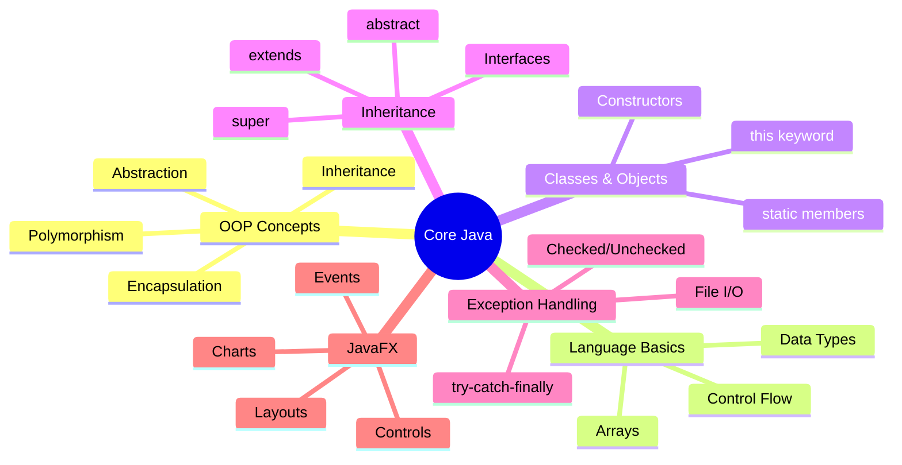

[[00-Dashboard/Home|Home]] | [[01-Semester-V/Semester-V-Dashboard|Semester V]] | [[Overview]] | [[Syllabus]] | [[Unit-1]] | [[Unit-2]] | [[Unit-3]] | [[Unit-4]] | [[Unit-5]] | [[Important-Questions|Imp. Qs]] | [[Revision]] | [[Interview-Prep]]

# CS-301-MJ-T - Core Java
> [!important] Subject Info
> **Subject Code:** CS-301-MJ-T | **Credits:** 2 | **IE:** 15 Marks | **EE:** 35 Marks | **Total:** 50 Marks

## Subject Description

==Core Java== is the foundational programming language subject that introduces students to **Object-Oriented Programming** using Java. The subject covers the complete lifecycle from basic syntax to GUI development using JavaFX. Java is a **platform-independent**, **strongly typed**, **object-oriented** language widely used in enterprise applications, Android development, and backend services.

> [!note] Why Java?
> Java follows the **"Write Once, Run Anywhere" (WORA)** principle via the JVM (Java Virtual Machine), making it one of the most portable and widely used programming languages in the world.

---

## Course Objectives

1. **CO-Obj-1:** Understand core **OOP concepts** (Encapsulation, Inheritance, Polymorphism, Abstraction) and apply them using Java.
2. **CO-Obj-2:** Learn to design and use **Classes, Objects, Interfaces**, and **Abstract Classes**.
3. **CO-Obj-3:** Implement robust programs using **Exception Handling** and **File I/O**.
4. **CO-Obj-4:** Develop desktop **GUI applications** using **JavaFX** with event-driven programming.
5. **CO-Obj-5:** Apply Java's built-in libraries: `java.lang`, `java.util`, `java.io` effectively.
6. **CO-Obj-6:** Write **clean, maintainable Java code** following best practices.

---

## Course Outcomes (COs)

| CO | Description | Bloom's Level |
|----|-------------|--------------|
| **CO1** | Explain OOP concepts and write basic Java programs | Remember / Understand |
| **CO2** | Design and implement classes with access control, constructors, and static members | Apply |
| **CO3** | Use inheritance, interfaces, and polymorphism to create reusable code | Apply / Analyze |
| **CO4** | Handle exceptions and perform file I/O operations efficiently | Apply |
| **CO5** | Build JavaFX GUI applications with layouts, controls, and charts | Create |
| **CO6** | Solve real-world problems using Java's standard libraries | Evaluate / Create |

---

## Unit-wise Content

| Unit | Topic | Hours | Notes |
|------|-------|-------|-------|
| 1 | [[Unit-1|Introduction to Java]] | 5 | OOP, History, Features, JVM, Data Types, Arrays |
| 2 | [[Unit-2|Objects and Classes]] | 6 | Classes, Constructors, String, Packages, Wrappers |
| 3 | [[Unit-3|Inheritance and Interface]] | 6 | extends, super, abstract, interface, lambda |
| 4 | [[Unit-4|Exception and File Handling]] | 5 | try-catch, User-defined exceptions, File I/O |
| 5 | [[Unit-5|User Interface with JavaFX]] | 8 | JavaFX, Layouts, Controls, Charts, Events |
| | **Total** | **30** | |

---

## Quick Navigation

- [[Syllabus| Complete Syllabus]]
- [[Unit-1| Unit 1: Introduction to Java]]
- [[Unit-2| Unit 2: Objects and Classes]]
- [[Unit-3| Unit 3: Inheritance and Interface]]
- [[Unit-4| Unit 4: Exception and File Handling]]
- [[Unit-5| Unit 5: User Interface with JavaFX]]
- [[Important-Questions| Important Questions]]
- [[Revision| Revision Notes]]
- [[Interview-Prep| Interview Preparation]]

---

## Reference Books

| # | Title | Author | Publisher |
|---|-------|--------|-----------|
| 1 | *Java: The Complete Reference* (11th Ed.) | Herbert Schildt | McGraw-Hill |
| 2 | *Programming with Java* | E. Balagurusamy | McGraw-Hill |
| 3 | *Core Java: Volume I – Fundamentals* | Cay S. Horstmann | Pearson |
| 4 | *Head First Java* | Kathy Sierra & Bert Bates | O'Reilly |
| 5 | *Thinking in Java* | Bruce Eckel | Pearson |

---

## Exam Pattern

> [!warning] Exam Weightage
> - **Internal Exam (IE):** 15 Marks - Unit tests, assignments, practicals
> - **External Exam (EE):** 35 Marks - Theory paper (Units 1-5)
> - **Practical:** Included in IE component

---

## Key Themes

---

## Backlinks
- [[00-Dashboard/Home|Main Dashboard]]
- [[01-Semester-V/CS-302-MJ-T-Operating-Systems/Overview|CS-302 Operating Systems]]
