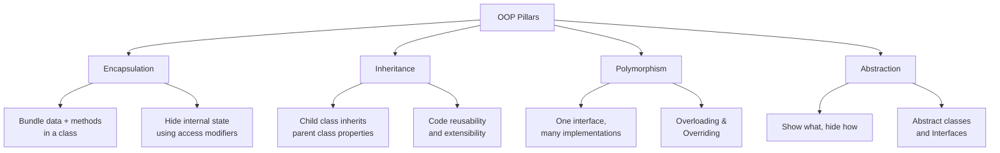
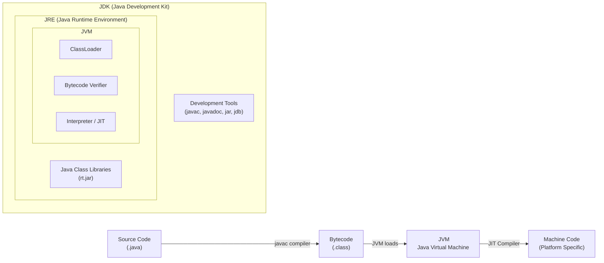
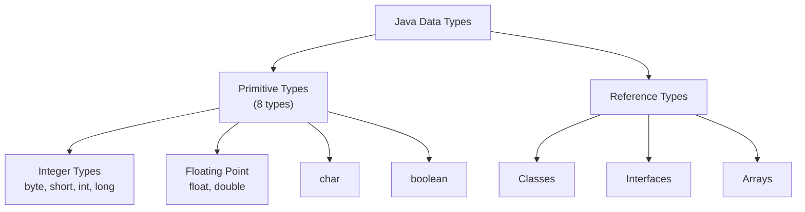

# Unit 1 - Introduction to Java
> [!important] **Hours:** 5 | **Subject:** CS-301-MJ-T Core Java | **Semester:** V
> **Previous:** [[Overview]] | **Next:** [[Unit-2|Unit 2: Objects and Classes]]

---

##  Learning Objectives

- Understand the principles of Object-Oriented Programming
- Trace the history and evolution of Java
- Identify key features of the Java language
- Set up and understand the Java development environment (JDK, JRE, JVM)
- Write, compile, and run basic Java programs
- Use Java data types, variables, operators, and control structures
- Declare and use 1D, 2D, and jagged arrays
- Accept input from various sources

---

## 1.1 Object-Oriented Programming (OOP) Concepts

==Object-Oriented Programming== (OOP) is a programming paradigm centered around **objects** and **classes** rather than functions and procedures.

### The Four Pillars of OOP



####  Encapsulation
> [!note] Definition
> Encapsulation is the mechanism of **bundling data (fields) and methods** that operate on that data within a single unit (class), and **restricting direct access** to some of the object's components.

- Implemented using **private fields** + **public getters/setters**
- Provides **data hiding** and **data integrity**
- Example: A `BankAccount` class with private `balance` field

```java
class BankAccount {
    private double balance; // private - encapsulated

    public double getBalance() { return balance; } // getter
    public void deposit(double amount) {
        if (amount > 0) balance += amount;          // controlled access
    }
}
```

####  Inheritance
> [!note] Definition
> Inheritance allows a **new class** (subclass/child) to **acquire properties and behaviors** of an existing class (superclass/parent), promoting code reuse.

- Implemented using the `extends` keyword
- Supports hierarchical classification

```java
class Animal {
    void breathe() { System.out.println("Breathing..."); }
}
class Dog extends Animal {  // Dog inherits Animal
    void bark() { System.out.println("Woof!"); }
}
```

####  Polymorphism
> [!note] Definition
> Polymorphism means **"many forms"** - the ability of a single interface/method to behave differently based on the object or context.

- **Compile-time polymorphism** → Method Overloading
- **Runtime polymorphism** → Method Overriding

```java
class Shape {
    void draw() { System.out.println("Drawing shape"); }
}
class Circle extends Shape {
    @Override
    void draw() { System.out.println("Drawing circle"); } // runtime polymorphism
}
```

####  Abstraction
> [!note] Definition
> Abstraction is the process of **hiding implementation details** and showing only the **essential features** of an object.

- Implemented using **abstract classes** and **interfaces**
- Focus on **"what"** rather than **"how"**

---

## 1.2 History of Java

| Year | Milestone |
|------|-----------|
| 1991 | **James Gosling**, Mike Sheridan & Patrick Naughton initiated the **Green Project** at Sun Microsystems |
| 1992 | Language initially named **Oak** (after an oak tree outside Gosling's office) |
| 1995 | Renamed to **Java** (after Java coffee); **Java 1.0** released |
| 1996 | JDK 1.0 officially released |
| 1997 | JDK 1.1 - Inner classes, JavaBeans, JDBC |
| 1998 | **Java 2** (J2SE 1.2) - Swing, Collections Framework |
| 2004 | **Java 5** - Generics, Autoboxing, Enhanced for, Enums, Annotations |
| 2014 | **Java 8** - Lambda Expressions, Stream API, Functional Interfaces, Default methods |
| 2017 | **Java 9** - Module system (Project Jigsaw) |
| 2018+ | Oracle releases new Java versions every 6 months (LTS: 11, 17, 21) |
| 2010 | Oracle acquires Sun Microsystems |

> [!tip] Remember for Exam
> Java was created by **James Gosling** at **Sun Microsystems** in **1995**. Originally called **Oak**.

---

## 1.3 Features of Java

==Java is popular because of its unique combination of features:==

| Feature | Description |
|---------|-------------|
| **Platform Independent** | Write Once, Run Anywhere (WORA) via JVM bytecode |
| **Simple** | Familiar syntax (C/C++ based), no pointers, no multiple inheritance |
| **Object-Oriented** | Everything is an object (except primitives); OOP-based |
| **Robust** | Strong type checking, exception handling, garbage collection |
| **Secure** | No explicit pointer arithmetic, Bytecode verifier, Security Manager |
| **Architecture Neutral** | `int` is always 32-bit regardless of platform |
| **Portable** | Same result on any platform due to JVM standardization |
| **High Performance** | JIT (Just-In-Time) compiler optimizes bytecode at runtime |
| **Multithreaded** | Built-in support for concurrent programming via `Thread` class |
| **Distributed** | Supports TCP/IP, RMI for distributed computing |
| **Dynamic** | Adapts to evolving environments; loads classes dynamically |
| **Interpreted** | Bytecode interpreted by JVM (also compiled by JIT) |

---

## 1.4 Java Environment



### Key Components

| Component | Full Form | Purpose |
|-----------|-----------|---------|
| **JDK** | Java Development Kit | Complete package: compiler + JRE + tools |
| **JRE** | Java Runtime Environment | JVM + class libraries (for running Java programs) |
| **JVM** | Java Virtual Machine | Executes bytecode; platform-specific |
| **Bytecode** | - | Platform-neutral intermediate code (.class files) |
| **JIT** | Just-In-Time Compiler | Compiles bytecode to native code at runtime for performance |
| **ClassLoader** | - | Loads .class files into memory |

> [!note] Compilation Process
> 1. **Write:** `HelloWorld.java`
> 2. **Compile:** `javac HelloWorld.java` → generates `HelloWorld.class`
> 3. **Run:** `java HelloWorld` → JVM executes the .class file

---

## 1.5 Structure of a Java Program

```java
// 1. Package declaration (optional)
package com.example;

// 2. Import statements
import java.util.Scanner;

// 3. Class definition (filename must match public class name)
public class HelloWorld {

    // 4. Main method - entry point of execution
    public static void main(String[] args) {
        
        // 5. Statements
        System.out.println("Hello, World!");
    }
}
```

### Types of Comments

```java
// Single-line comment

/* Multi-line
   comment */

/**
 * Javadoc comment - for documentation generation
 * @param args command-line arguments
 */
```

---

## 1.6 Data Types in Java

Java has **two categories** of data types:



### Primitive Data Types

| Data Type | Size | Default | Range | Example |
|-----------|------|---------|-------|---------|
| `byte` | 1 byte (8 bits) | 0 | -128 to 127 | `byte b = 100;` |
| `short` | 2 bytes (16 bits) | 0 | -32,768 to 32,767 | `short s = 1000;` |
| `int` | 4 bytes (32 bits) | 0 | -2³¹ to 2³¹-1 (~2 billion) | `int i = 42;` |
| `long` | 8 bytes (64 bits) | 0L | -2⁶³ to 2⁶³-1 | `long l = 123456789L;` |
| `float` | 4 bytes (32 bits) | 0.0f | ~±3.4×10³⁸ | `float f = 3.14f;` |
| `double` | 8 bytes (64 bits) | 0.0d | ~±1.8×10³⁰⁸ | `double d = 3.14159;` |
| `char` | 2 bytes (16 bits) | '\u0000' | 0 to 65,535 (Unicode) | `char c = 'A';` |
| `boolean` | 1 bit (JVM-specific) | false | true / false | `boolean flag = true;` |

> [!warning] Key Note
> In Java, `char` is **2 bytes** (unlike C where it's 1 byte) because Java uses **Unicode (UTF-16)**.

### Type Casting

```java
// Widening (Implicit) - no data loss
int i = 100;
long l = i;       // int → long (automatic)
double d = l;     // long → double (automatic)

// Narrowing (Explicit) - possible data loss
double pi = 3.14159;
int n = (int) pi; // explicit cast: n = 3 (truncated)
```

---

## 1.7 Tokens in Java

==A **token** is the smallest individual unit of a Java program.==

| Token Type | Description | Examples |
|------------|-------------|---------|
| **Keywords** | Reserved words with special meaning | `class`, `int`, `static`, `void`, `if`, `for` |
| **Identifiers** | Names for variables, methods, classes | `myVar`, `calculateSum`, `Student` |
| **Literals** | Fixed constant values | `42`, `3.14`, `'A'`, `"Hello"`, `true` |
| **Operators** | Symbols for operations | `+`, `-`, `*`, `/`, `%`, `==`, `&&` |
| **Separators** | Punctuation marks | `{ }`, `( )`, `[ ]`, `;`, `,`, `.` |
| **Comments** | Explanatory text (ignored by compiler) | `//`, `/* */`, `/** */` |

### Identifier Rules
- Must begin with a **letter**, `_`, or `$`
- Cannot use Java **keywords**
- **Case-sensitive** (`age` ≠ `Age`)
- No spaces allowed

---

## 1.8 Variables in Java

### Types of Variables

| Type | Declared In | Lifetime | Scope | Default Value |
|------|-------------|----------|-------|---------------|
| **Local Variable** | Inside method/block | Until method exits | Within that block | None (must initialize) |
| **Instance Variable** | Inside class, outside methods | Until object exists | Entire class | Type default (0, null, false) |
| **Static Variable** | With `static` keyword | Until program ends | Entire class | Type default |

```java
class Counter {
    static int count = 0;     // static variable (shared across all objects)
    int id;                   // instance variable (unique per object)
    
    void display() {
        int temp = 10;        // local variable
        System.out.println(temp + id + count);
    }
}
```

---

## 1.9 Operators in Java

| Category | Operators | Example |
|----------|-----------|---------|
| **Arithmetic** | `+`, `-`, `*`, `/`, `%` | `a + b`, `10 % 3` |
| **Relational** | `==`, `!=`, `<`, `>`, `<=`, `>=` | `a == b`, `x > 5` |
| **Logical** | `&&`, `\|\|`, `!` | `a && b`, `!flag` |
| **Bitwise** | `&`, `\|`, `^`, `~`, `<<`, `>>`, `>>>` | `a & b`, `x << 2` |
| **Assignment** | `=`, `+=`, `-=`, `*=`, `/=`, `%=` | `x += 5` |
| **Unary** | `++`, `--`, `+`, `-`, `!` | `i++`, `--j` |
| **Ternary** | `? :` | `max = (a>b) ? a : b` |
| **instanceof** | `instanceof` | `obj instanceof String` |

---

## 1.10 Control Flow Statements

### Conditional Statements

```java
// if-else
if (marks >= 90) {
    System.out.println("Grade A");
} else if (marks >= 75) {
    System.out.println("Grade B");
} else {
    System.out.println("Grade C");
}

// switch-case
switch (day) {
    case 1: System.out.println("Monday"); break;
    case 2: System.out.println("Tuesday"); break;
    default: System.out.println("Other day");
}
```

### Loops

```java
// for loop
for (int i = 0; i < 5; i++) {
    System.out.println(i);
}

// while loop
int i = 0;
while (i < 5) {
    System.out.println(i++);
}

// do-while (executes at least once)
int j = 0;
do {
    System.out.println(j++);
} while (j < 5);

// Enhanced for (for-each)
int[] arr = {1, 2, 3, 4, 5};
for (int num : arr) {
    System.out.println(num);
}
```

### Jump Statements

```java
// break - exits the loop
for (int i = 0; i < 10; i++) {
    if (i == 5) break; // stops at i=5
}

// continue - skips current iteration
for (int i = 0; i < 10; i++) {
    if (i % 2 == 0) continue; // skips even numbers
    System.out.println(i);
}

// Labeled break
outer:
for (int i = 0; i < 3; i++) {
    for (int j = 0; j < 3; j++) {
        if (i == 1 && j == 1) break outer; // breaks outer loop
    }
}
```

---

## 1.11 Arrays in Java

An ==array== is a collection of elements of the **same data type** stored in **contiguous memory** locations.

### 1D Arrays

```java
// Declaration and initialization
int[] arr = new int[5];          // default values: 0
int[] arr2 = {10, 20, 30, 40, 50}; // initializer list

// Accessing elements (0-indexed)
arr[0] = 100;
System.out.println(arr2[2]);    // 30

// Array length
System.out.println(arr2.length); // 5

// Traversal
for (int i = 0; i < arr2.length; i++) {
    System.out.print(arr2[i] + " ");
}
```

### 2D Arrays (Matrix)

```java
// Declaration
int[][] matrix = new int[3][4]; // 3 rows, 4 columns

// Initialization
int[][] m = {{1, 2, 3}, {4, 5, 6}, {7, 8, 9}};

// Accessing
System.out.println(m[1][2]); // 6

// Traversal
for (int i = 0; i < m.length; i++) {
    for (int j = 0; j < m[i].length; j++) {
        System.out.print(m[i][j] + " ");
    }
    System.out.println();
}
```

### Jagged Arrays

> [!note] Jagged Array
> A ==jagged array== (ragged array) is a 2D array where **each row can have a different number of columns**.

```java
int[][] jagged = new int[3][];
jagged[0] = new int[2];   // row 0: 2 elements
jagged[1] = new int[4];   // row 1: 4 elements
jagged[2] = new int[1];   // row 2: 1 element

// Initialization with values
int[][] j = {{1, 2}, {3, 4, 5, 6}, {7}};
```

---

## 1.12 Taking Input in Java

### Using Scanner (Most Common)

```java
import java.util.Scanner;

public class InputDemo {
    public static void main(String[] args) {
        Scanner sc = new Scanner(System.in);
        
        int n = sc.nextInt();           // read integer
        double d = sc.nextDouble();     // read double
        String s = sc.next();           // read word (whitespace-delimited)
        String line = sc.nextLine();    // read entire line
        
        sc.close(); // close scanner
    }
}
```

### Using BufferedReader

```java
import java.io.*;

BufferedReader br = new BufferedReader(new InputStreamReader(System.in));
String s = br.readLine();              // reads line as String
int n = Integer.parseInt(br.readLine()); // parse to int
```

### Command-Line Arguments

```java
public class CmdArgs {
    public static void main(String[] args) {
        // args[0], args[1], ... are command-line arguments (always String)
        System.out.println("First arg: " + args[0]);
        int num = Integer.parseInt(args[1]);
    }
}
// Run as: java CmdArgs hello 42
```

---

##  Key Definitions

| Term | Definition |
|------|------------|
| **JVM** | Java Virtual Machine - platform-specific software that executes Java bytecode |
| **Bytecode** | Platform-neutral intermediate code generated by `javac` compiler |
| **JIT** | Just-In-Time compiler - converts bytecode to native machine code at runtime |
| **Class** | Blueprint/template for creating objects |
| **Object** | An instance of a class with its own state (fields) and behavior (methods) |
| **Encapsulation** | Binding data and methods together; hiding internal state |
| **Polymorphism** | Ability of a method/object to take multiple forms |
| **WORA** | Write Once, Run Anywhere - Java's platform independence principle |
| **GC** | Garbage Collection - automatic memory management in Java |

---

##  Interview Questions

> [!tip] Commonly Asked Questions

1. **What is the difference between JDK, JRE, and JVM?**
   - JVM: Executes bytecode (platform-specific)
   - JRE: JVM + class libraries (to run Java programs)
   - JDK: JRE + development tools (to develop Java programs)

2. **Why is Java platform-independent?**
   - Java source code compiles to **bytecode** (.class), not native machine code. The JVM (available for each platform) executes this bytecode, making Java platform-independent.

3. **What are the 8 primitive data types in Java?**
   - `byte`, `short`, `int`, `long`, `float`, `double`, `char`, `boolean`

4. **What is the difference between `==` and `.equals()` in Java?**
   - `==` compares **references** (memory addresses) for objects
   - `.equals()` compares **content/values**

5. **What is a jagged array?**
   - A 2D array where each row can have a different number of columns.

6. **What is the difference between `break` and `continue`?**
   - `break`: exits the loop entirely
   - `continue`: skips the current iteration and continues the loop

7. **Can `main` method be overloaded in Java?**
   - Yes, but the JVM only calls `public static void main(String[] args)` as the entry point.

8. **What is autoboxing in Java?**
   - Automatic conversion between primitive types and their wrapper classes (e.g., `int` ↔ `Integer`).

9. **What are the features that make Java secure?**
   - No explicit pointers, bytecode verifier, security manager, sandbox execution model.

10. **What is the difference between `float` and `double`?**
    - `float`: 4 bytes, ~7 significant decimal digits, suffix `f`
    - `double`: 8 bytes, ~15 significant decimal digits, default for decimals

---

##  Revision Summary

> [!note] Quick Revision - Unit 1
> 
> **OOP Pillars:** Encapsulation (data hiding), Inheritance (reuse), Polymorphism (many forms), Abstraction (hide implementation)
> 
> **Java by:** James Gosling, Sun Microsystems, 1995 (originally Oak)
> 
> **JDK ⊃ JRE ⊃ JVM** - JVM executes bytecode
> 
> **8 Primitives:** byte(1B), short(2B), int(4B), long(8B), float(4B), double(8B), char(2B), boolean
> 
> **Variable Types:** Local (no default), Instance (class-level), Static (shared)
> 
> **Arrays:** Zero-indexed, fixed size, `length` property; Jagged = rows with different column counts
> 
> **Input:** `Scanner` (common), `BufferedReader` (fast), Command-line args (String[])

---

##  Navigation

| Previous | Current | Next |
|----------|---------|------|
| [[Overview\|Subject Overview]] | **Unit 1: Introduction to Java** | [[Unit-2\|Unit 2: Objects and Classes]] |
