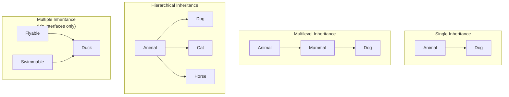
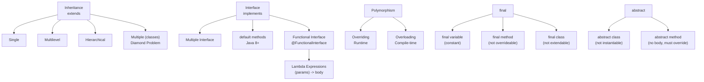

# Unit 3 - Inheritance and Interface
> [!important] **Hours:** 6 | **Subject:** CS-301-MJ-T Core Java | **Semester:** V
> **Previous:** [[Unit-2|Unit 2: Objects and Classes]] | **Next:** [[Unit-4|Unit 4: Exception and File Handling]]

---

##  Learning Objectives

- Implement single, multilevel, and hierarchical inheritance using `extends`
- Use `super` keyword for parent class access
- Distinguish method overriding from method overloading
- Apply `final`, `abstract` keywords appropriately
- Define and implement interfaces including Java 8+ features
- Use functional interfaces with lambda expressions
- Understand marker interfaces and anonymous inner classes

---

## 3.1 Inheritance

> [!note] Definition
> ==Inheritance== is a mechanism by which one class (subclass/child class) **acquires** the properties and behaviors of another class (superclass/parent class). It promotes **code reuse** and **hierarchical classification**.

**Keyword:** `extends`

```java
// Superclass
class Animal {
    String name;
    
    void eat() { System.out.println(name + " is eating"); }
    void breathe() { System.out.println("Breathing..."); }
}

// Subclass inherits Animal
class Dog extends Animal {
    String breed;
    
    void bark() { System.out.println("Woof! I am " + name); }
    // Dog inherits eat() and breathe() from Animal
}

// Usage
Dog d = new Dog();
d.name = "Rex";       // inherited field
d.breed = "Labrador"; // own field
d.eat();              // inherited method
d.bark();             // own method
```

### Types of Inheritance in Java



| Type | Description | Java Support |
|------|-------------|-------------|
| **Single** | One parent, one child |  via `extends` |
| **Multilevel** | Chain: A → B → C |  via `extends` |
| **Hierarchical** | One parent, multiple children |  via `extends` |
| **Multiple** | Multiple parents for one child |  (class),  via `implements` (interface) |
| **Hybrid** | Combination of above |  (class),  via interfaces |

> [!important] Why No Multiple Class Inheritance?
> Java avoids the **Diamond Problem** - ambiguity when two parent classes have the same method. Java allows multiple inheritance through **interfaces** instead.

---

## 3.2 `super` Keyword

The ==`super`== keyword is a reference to the **immediate parent class**. It is used to:

```java
class Vehicle {
    String brand = "Toyota";
    int speed;
    
    Vehicle(int speed) {
        this.speed = speed;
        System.out.println("Vehicle constructor called");
    }
    
    void display() {
        System.out.println("Brand: " + brand + ", Speed: " + speed);
    }
}

class Car extends Vehicle {
    int numDoors;
    String brand = "Honda"; // shadows parent field
    
    Car(int speed, int doors) {
        super(speed);     // 1. super() - calls parent constructor (must be FIRST statement)
        this.numDoors = doors;
    }
    
    void display() {
        super.display();  // 2. super.method() - calls parent method
        System.out.println("Doors: " + numDoors);
    }
    
    void showBrands() {
        System.out.println("Child brand: " + brand);
        System.out.println("Parent brand: " + super.brand); // 3. super.field - access parent field
    }
}
```

| Usage | Syntax | Purpose |
|-------|--------|---------|
| Call parent constructor | `super()` or `super(args)` | Must be first statement in child constructor |
| Call parent method | `super.methodName()` | When method is overridden in child |
| Access parent field | `super.fieldName` | When field is shadowed in child |

---

## 3.3 Method Overriding vs Method Overloading

### Method Overriding (Runtime Polymorphism)

> [!note] Method Overriding
> ==Method Overriding== occurs when a **subclass provides a specific implementation** of a method already defined in its superclass. The method signature must be **identical**.

```java
class Shape {
    double area() { return 0; }
    void draw() { System.out.println("Drawing a shape"); }
}

class Circle extends Shape {
    double radius;
    
    Circle(double r) { this.radius = r; }
    
    @Override           // annotation - tells compiler to verify override
    double area() {     // overrides Shape's area()
        return Math.PI * radius * radius;
    }
    
    @Override
    void draw() { System.out.println("Drawing a circle"); }
}

class Rectangle extends Shape {
    double length, width;
    
    @Override
    double area() { return length * width; }
}

// Runtime polymorphism - type determined at runtime
Shape s1 = new Circle(5);     // reference type = Shape, object type = Circle
Shape s2 = new Rectangle();
s1.area();  // calls Circle's area() - decided at RUNTIME via vtable
```

**Rules for Method Overriding:**
1. Same method name, same parameters, same return type (or covariant)
2. Access modifier can be **same or more visible** (not more restrictive)
3. Cannot override `final`, `static`, or `private` methods
4. `@Override` annotation is good practice (catches errors at compile time)

### Method Overloading (Compile-time Polymorphism)

> [!note] Method Overloading
> ==Method Overloading== means having **multiple methods with the same name** but **different parameter lists** in the same class.

```java
class Calculator {
    int add(int a, int b) { return a + b; }                    // 2 ints
    int add(int a, int b, int c) { return a + b + c; }        // 3 ints
    double add(double a, double b) { return a + b; }          // 2 doubles
    String add(String a, String b) { return a + b; }          // 2 Strings
}
```

### Overriding vs Overloading

| Feature | Overriding | Overloading |
|---------|------------|-------------|
| Class | Different classes (parent-child) | Same class |
| Method name | Same | Same |
| Parameters | Same | Different |
| Return type | Same (or covariant) | Can be different |
| Polymorphism | **Runtime** (dynamic dispatch) | **Compile-time** (static binding) |
| Access modifier | Same or more visible | No restriction |
| `static` methods | Not possible (hiding instead) | Possible |

---

## 3.4 `final` Keyword

The ==`final`== keyword can be applied to **variables**, **methods**, and **classes**:

```java
// 1. final variable - constant (must be initialized, cannot be reassigned)
final double PI = 3.14159;
// PI = 3.0;  // ERROR: cannot assign to final variable

// 2. final method - cannot be overridden in subclasses
class Parent {
    final void show() {
        System.out.println("Parent's show - cannot be overridden");
    }
}
class Child extends Parent {
    // void show() { }  // COMPILE ERROR: cannot override final method
}

// 3. final class - cannot be subclassed (extended)
final class ImmutableClass { ... }
// class Sub extends ImmutableClass { }  // COMPILE ERROR

// Java's built-in final classes: String, Integer, Double, Math, System
```

| Usage | Effect |
|-------|--------|
| `final variable` | Creates a constant - value cannot be changed after assignment |
| `final method` | Method cannot be overridden in any subclass |
| `final class` | Class cannot be extended (no subclasses) |
| `final parameter` | Parameter value cannot be changed inside the method |

---

## 3.5 Abstract Classes and Methods

> [!note] Abstract Class
> An ==abstract class== is a class that **cannot be instantiated** (cannot create objects of it). It may contain abstract methods that **must be implemented** by concrete subclasses.

```java
abstract class Shape {
    String color;
    
    // Abstract method - no body, MUST be overridden by subclass
    abstract double area();
    abstract void draw();
    
    // Concrete method - has body, inherited as-is
    void setColor(String color) { this.color = color; }
    void displayColor() { System.out.println("Color: " + color); }
}

// Concrete subclass MUST implement all abstract methods
class Triangle extends Shape {
    double base, height;
    
    Triangle(double b, double h) { base = b; height = h; }
    
    @Override
    double area() { return 0.5 * base * height; } // must implement
    
    @Override
    void draw() { System.out.println("Drawing triangle"); } // must implement
}

// abstract class can have constructors (called via super() from subclass)
// abstract class can have fields, static methods, etc.
```

| Feature | Abstract Class | Concrete Class |
|---------|---------------|---------------|
| Instantiation |  Cannot create objects |  Can create objects |
| Abstract methods | Can have (0 or more) |  Cannot have |
| Constructors |  Can have |  Can have |
| Static methods |  Can have |  Can have |
| Fields |  Can have (any type) |  Can have |
| Inheritance | `extends` (single) | `extends` (single) |

> [!warning] Abstract vs Interface
> Use **abstract class** when you want to share code/state between related classes.
> Use **interface** when you want to define a contract that unrelated classes can implement.

---

## 3.6 Interfaces

> [!note] Definition
> An ==interface== defines a **contract** - a set of method signatures that implementing classes must provide. It specifies **what** to do, not **how** to do it.

```java
// Defining an interface
interface Drawable {
    // All methods are public abstract by default
    void draw();
    void resize(double factor);
    
    // Constant - public static final by default
    int DEFAULT_COLOR = 0xFF0000; // equivalent to: public static final int...
}

// Implementing an interface
class Circle implements Drawable {
    double radius;
    
    @Override
    public void draw() { System.out.println("Drawing circle with r=" + radius); }
    
    @Override
    public void resize(double factor) { radius *= factor; }
}

// Multiple interface implementation (Java's way of multiple inheritance)
interface Printable {
    void print();
}

class Document implements Drawable, Printable {
    @Override public void draw() { System.out.println("Drawing document"); }
    @Override public void resize(double f) { }
    @Override public void print() { System.out.println("Printing document"); }
}
```

### Java 8+ Interface Features

```java
interface Vehicle {
    void accelerate();  // abstract method (traditional)
    
    // Default method - has body; subclass can override or use as-is (Java 8+)
    default void fuelUp() {
        System.out.println("Filling up fuel at gas station");
    }
    
    // Static method - belongs to interface, NOT inherited (Java 8+)
    static void showInfo() {
        System.out.println("Vehicle interface v1.0");
    }
    
    // Private method - helper for default methods (Java 9+)
    private void logAction(String action) {
        System.out.println("Action: " + action);
    }
}
```

### Interface vs Abstract Class

| Feature | Interface | Abstract Class |
|---------|-----------|---------------|
| Instantiation |  No |  No |
| Multiple inheritance |  Yes (implements multiple) |  No (extends one) |
| Fields | `public static final` only | Any (instance, static) |
| Methods (pre-Java 8) | `public abstract` only | Any (abstract + concrete) |
| Methods (Java 8+) | default, static, private | Any |
| Constructors |  No |  Yes |
| Access modifiers (methods) | Always public | Any |
| Purpose | Define contract/capability | Share code + enforce contract |

---

## 3.7 Functional Interface and Lambda Expressions

> [!note] Functional Interface
> A ==functional interface== is an interface with **exactly one abstract method** (SAM - Single Abstract Method). It can be annotated with `@FunctionalInterface`.

```java
@FunctionalInterface
interface MathOperation {
    int operate(int a, int b);  // Single Abstract Method
    
    // Can have default and static methods, still functional
    default void description() { System.out.println("Math operation"); }
}

// Traditional (anonymous inner class)
MathOperation add = new MathOperation() {
    @Override
    public int operate(int a, int b) { return a + b; }
};

// Lambda Expression - concise syntax for implementing SAM
MathOperation add = (a, b) -> a + b;           // with return
MathOperation square = (a, b) -> {              // multi-line
    int result = a * a;
    return result;
};

System.out.println(add.operate(5, 3));   // 8
```

### Lambda Syntax

```java
// Syntax: (parameters) -> expression/block

// No parameters
Runnable r = () -> System.out.println("Running!");

// One parameter (parentheses optional)
Consumer<String> printer = s -> System.out.println(s);
// OR
Consumer<String> printer = (s) -> System.out.println(s);

// Multiple parameters
BiFunction<Integer, Integer, Integer> multiply = (a, b) -> a * b;

// With block body
Comparator<String> byLength = (s1, s2) -> {
    if (s1.length() < s2.length()) return -1;
    else if (s1.length() > s2.length()) return 1;
    else return 0;
};
```

### Built-in Functional Interfaces (java.util.function)

| Interface | Method | Description |
|-----------|--------|-------------|
| `Runnable` | `run()` | No input, no output |
| `Supplier<T>` | `get()` | No input, returns T |
| `Consumer<T>` | `accept(T)` | Takes T, no return |
| `Function<T,R>` | `apply(T)` | Takes T, returns R |
| `Predicate<T>` | `test(T)` | Takes T, returns boolean |
| `BiFunction<T,U,R>` | `apply(T,U)` | Takes T,U, returns R |
| `Comparator<T>` | `compare(T,T)` | Takes two T, returns int |

---

## 3.8 Marker Interface

> [!note] Marker Interface
> A ==marker interface== is an **empty interface** (no methods, no fields). It serves as a **tag** to indicate that a class has a special property/capability. The JVM or frameworks check for this tag at runtime.

```java
// Built-in marker interfaces
class MyData implements Serializable {  // java.io.Serializable - marks class as serializable
    int id;
    String name;
    // All fields will be serialized automatically
}

class MyClass implements Cloneable {    // java.lang.Cloneable - allows Object.clone()
    @Override
    protected Object clone() throws CloneNotSupportedException {
        return super.clone();
    }
}
// Other examples: java.util.RandomAccess, java.rmi.Remote

// Custom marker interface
interface Persistent {}  // mark classes that should be saved to DB

class User implements Persistent {
    String username;
}
```

---

## 3.9 Anonymous Inner Class

> [!note] Anonymous Inner Class
> An ==anonymous inner class== is a **class without a name** defined and instantiated **at the point of use**. It is typically used to provide one-time implementations of abstract classes or interfaces.

```java
// Without anonymous inner class:
class GreetEnglish implements Greeter {
    public void greet() { System.out.println("Hello!"); }
}
Greeter g = new GreetEnglish();

// With anonymous inner class:
Greeter g = new Greeter() {         // extends/implements class/interface
    @Override
    public void greet() {           // provide implementation inline
        System.out.println("Hello!");
    }
};
g.greet();

// Common uses:
// 1. Event listeners (before lambdas)
button.addActionListener(new ActionListener() {
    @Override
    public void actionPerformed(ActionEvent e) {
        System.out.println("Button clicked!");
    }
});

// 2. Now replaced by lambda (for functional interfaces)
button.addActionListener(e -> System.out.println("Button clicked!"));

// 3. Abstract class instantiation
abstract class Animal {
    abstract void sound();
}

Animal cat = new Animal() {      // anonymous subclass of abstract Animal
    @Override
    void sound() { System.out.println("Meow!"); }
};
cat.sound();
```

---

## 3.10 Adapter Classes

> [!note] Adapter
> An ==adapter class== is an **abstract class** that provides **default (empty) implementations** of all methods of an interface. Subclasses can **selectively override** only the methods they need.

```java
// Interface with many methods
interface WindowListener {
    void windowOpened(WindowEvent e);
    void windowClosing(WindowEvent e);
    void windowClosed(WindowEvent e);
    void windowIconified(WindowEvent e);
    void windowDeiconified(WindowEvent e);
    void windowActivated(WindowEvent e);
    void windowDeactivated(WindowEvent e);
}

// Adapter - empty implementations for all
abstract class WindowAdapter implements WindowListener {
    public void windowOpened(WindowEvent e) {}
    public void windowClosing(WindowEvent e) {}
    public void windowClosed(WindowEvent e) {}
    // ... all methods with empty bodies
}

// User only overrides what they need
class MyWindow extends WindowAdapter {
    @Override
    public void windowClosing(WindowEvent e) { // only this one
        System.exit(0);
    }
}
```

---

##  Key Concepts Diagram



---

##  Interview Questions

1. **What is the difference between method overloading and method overriding?**
   - Overloading: same name, different params, same class, compile-time polymorphism
   - Overriding: same name+params, parent-child, runtime polymorphism

2. **Can we override a `static` method in Java?**
   - No. Static methods undergo **method hiding** (not overriding). They're resolved at compile-time based on reference type, not object type.

3. **What is the Diamond Problem? How does Java solve it?**
   - Diamond Problem: A class inherits from two classes that have the same method. Java solves it by not allowing multiple class inheritance. Interfaces solve it with `default` methods (must override if ambiguous).

4. **What is the difference between `abstract class` and `interface`?**
   - Abstract class: can have state (fields), constructors, concrete methods, single inheritance
   - Interface: no state (only constants), no constructors, multiple implementation

5. **Can an abstract class have a constructor?**
   - Yes! Abstract class can have constructors (called via `super()` from concrete subclass).

6. **What is a functional interface? Give examples.**
   - Interface with exactly one abstract method. Examples: Runnable, Callable, Comparator, Predicate, Function, Consumer, Supplier.

7. **What is a lambda expression?**
   - A concise way to represent an anonymous function (implementation of a functional interface). Syntax: `(params) -> body`

8. **What is `super()` used for? When must it be called?**
   - `super()` calls the parent class constructor. If called, it must be the **first statement** in the subclass constructor. Implicitly called with no-args if not explicitly written.

9. **What is an anonymous inner class?**
   - A class without a name, defined and instantiated at the point of use. Used for one-time implementations of interfaces/abstract classes.

10. **What is the use of `final` keyword with methods and classes?**
    - `final method`: Cannot be overridden - ensures behavior consistency (e.g., template methods)
    - `final class`: Cannot be subclassed - for immutability/security (e.g., `String`, `Integer`)

---

##  Revision Summary

> [!note] Quick Revision - Unit 3
> 
> **Inheritance:** `extends` keyword; Single/Multilevel/Hierarchical OK; Multiple via classes  (Diamond Problem)
> 
> **super:** `super()` = parent constructor (first stmt); `super.method()` = parent method; `super.field` = parent field
> 
> **Overriding:** Same signature, parent-child, runtime; @Override annotation; can't override final/private/static
> 
> **Overloading:** Same name, different params, same class, compile-time
> 
> **final:** variable=constant, method=not overrideable, class=not extendable
> 
> **abstract:** class=not instantiable; method=no body, must override; abstract class can have concrete methods
> 
> **Interface:** Contract; `implements`; all abstract(default), static final fields; Java 8: default/static methods
> 
> **Functional Interface:** 1 abstract method; `@FunctionalInterface`; enables lambda `(params) -> body`
> 
> **Marker Interface:** Empty interface used as tag (Serializable, Cloneable)
> 
> **Anonymous Inner Class:** Nameless class defined inline; replaced by lambda for functional interfaces

---

##  Navigation

| Previous | Current | Next |
|----------|---------|------|
| [[Unit-2\|Unit 2: Objects and Classes]] | **Unit 3: Inheritance and Interface** | [[Unit-4\|Unit 4: Exception and File Handling]] |
