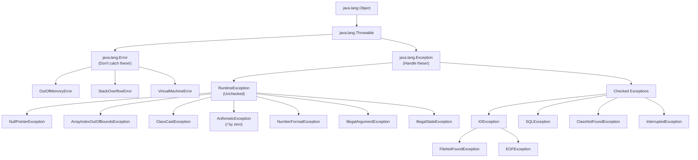
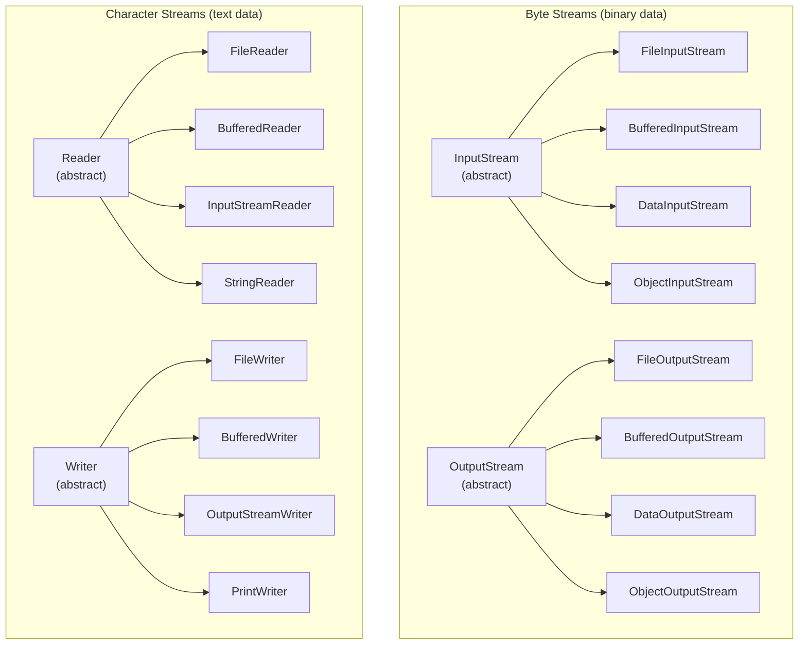

# Unit 4 - Exception and File Handling
> [!important] **Hours:** 5 | **Subject:** CS-301-MJ-T Core Java | **Semester:** V
> **Previous:** [[Unit-3|Unit 3: Inheritance and Interface]] | **Next:** [[Unit-5|Unit 5: User Interface with JavaFX]]

---

##  Learning Objectives

- Distinguish between errors and exceptions
- Understand the exception class hierarchy
- Differentiate between checked and unchecked exceptions
- Use try, catch, finally, throw, throws effectively
- Handle multiple exceptions and nested try blocks
- Create user-defined exceptions
- Use Logger class for application logging
- Perform byte-stream and character-stream file I/O

---

## 4.1 Errors vs Exceptions

| Feature | Error | Exception |
|---------|-------|-----------|
| Hierarchy | `Throwable → Error` | `Throwable → Exception` |
| Cause | JVM/system-level problems | Application-level problems |
| Handling | Cannot/should not be caught | Should be handled |
| Examples | `OutOfMemoryError`, `StackOverflowError` | `IOException`, `NullPointerException` |
| Recovery | Not possible | Possible |

> [!warning]
> Never catch `Error` in your code. These are serious JVM-level failures that programs cannot recover from.

---

## 4.2 Exception Class Hierarchy



### Checked vs Unchecked Exceptions

| Feature | Checked Exception | Unchecked Exception (RuntimeException) |
|---------|------------------|--------------------------------------|
| Check time | **Compile-time** | Runtime |
| Must handle? | **YES** (try-catch or throws) | No (optional) |
| Examples | `IOException`, `SQLException` | `NullPointerException`, `ArrayIndexOutOfBoundsException` |
| Cause | External resources (files, DB) | Programming errors (bugs) |

---

## 4.3 Exception Keywords

### try-catch-finally

```java
try {
    // Code that might throw exception
    int result = 10 / 0;         // ArithmeticException
    System.out.println(result);   // NOT executed if exception thrown above
} catch (ArithmeticException e) {
    // Handle specific exception
    System.out.println("Math error: " + e.getMessage());
} catch (Exception e) {
    // Handle any other exception (general catch - must come AFTER specific)
    System.out.println("Error: " + e.toString());
} finally {
    // ALWAYS executes: whether exception occurred or not
    // Used for cleanup: close files, connections, etc.
    System.out.println("Finally block always runs!");
}
```

> [!important] finally block
> The `finally` block **always executes** - whether an exception occurred or not, and even if a `return` statement is in the try or catch block. Exception: `System.exit()` prevents finally from running.

### throw vs throws

```java
// throw - manually throw an exception
public void setAge(int age) {
    if (age < 0 || age > 150) {
        throw new IllegalArgumentException("Invalid age: " + age);
    }
    this.age = age;
}

// throws - declare that method may throw checked exception
// Callers must handle it
public void readFile(String path) throws IOException, FileNotFoundException {
    FileReader fr = new FileReader(path);  // might throw FileNotFoundException
    // ...
}
```

| Keyword | Purpose | Usage |
|---------|---------|-------|
| `try` | Wrap risky code | Block that may throw exception |
| `catch` | Handle exception | Specifies exception type + handler code |
| `finally` | Cleanup code | Always executes; used for releasing resources |
| `throw` | Manually throw exception | `throw new ExceptionType("message")` |
| `throws` | Declare exception | Method signature: `void method() throws IOException` |

### Multiple catch Blocks

```java
try {
    int[] arr = new int[5];
    arr[10] = 100 / 0;            // Which exception first?
} catch (ArithmeticException e) {  // Specific first!
    System.out.println("Arithmetic: " + e.getMessage());
} catch (ArrayIndexOutOfBoundsException e) {
    System.out.println("Array index: " + e.getMessage());
} catch (Exception e) {            // General LAST
    System.out.println("General: " + e.getMessage());
}

// Multi-catch (Java 7+) - catch multiple in one block
try {
    // code
} catch (IOException | SQLException e) {
    System.out.println("IO or SQL error: " + e.getMessage());
}
```

> [!warning] catch block order matters!
> Always catch **more specific** exceptions **before** more general ones. Compiler error if unreachable catch block.

### Nested try Blocks

```java
try {
    System.out.println("Outer try");
    try {
        System.out.println("Inner try");
        int x = 5 / 0;                    // throws ArithmeticException
    } catch (ArithmeticException e) {
        System.out.println("Inner catch: " + e.getMessage());
    }
    // After inner try-catch, execution continues here
    String s = null;
    s.length();                           // throws NullPointerException
} catch (NullPointerException e) {
    System.out.println("Outer catch: " + e.getMessage());
}
```

---

## 4.4 User-Defined Exceptions

```java
// Create custom checked exception (extends Exception)
class InsufficientFundsException extends Exception {
    private double amount;
    
    public InsufficientFundsException(double amount) {
        super("Insufficient funds! Need: " + amount);
        this.amount = amount;
    }
    
    public double getAmount() { return amount; }
}

// Create custom unchecked exception (extends RuntimeException)
class InvalidAgeException extends RuntimeException {
    public InvalidAgeException(String message) {
        super(message);
    }
}

// Using custom exceptions
class BankAccount {
    private double balance;
    
    BankAccount(double balance) { this.balance = balance; }
    
    void withdraw(double amount) throws InsufficientFundsException {
        if (amount > balance) {
            throw new InsufficientFundsException(amount - balance);
        }
        balance -= amount;
    }
}

// Main
public class Main {
    public static void main(String[] args) {
        BankAccount account = new BankAccount(1000);
        try {
            account.withdraw(1500);    // throws InsufficientFundsException
        } catch (InsufficientFundsException e) {
            System.out.println("Error: " + e.getMessage());
            System.out.println("Short by: " + e.getAmount());
        }
    }
}
```

---

## 4.5 Logger Class

> [!note] Logger
> `java.util.logging.Logger` provides a **flexible logging framework** for recording messages of varying severity levels.

```java
import java.util.logging.*;

public class LogDemo {
    private static final Logger logger = Logger.getLogger(LogDemo.class.getName());
    
    public static void main(String[] args) {
        // Log levels (High → Low severity)
        logger.severe("SEVERE: Application crash!");    // Level 1000
        logger.warning("WARNING: Disk space low");      // Level 900
        logger.info("INFO: Application started");       // Level 800
        logger.config("CONFIG: Debug mode = true");     // Level 700
        logger.fine("FINE: Entering method");           // Level 500
        logger.finer("FINER: More detail");             // Level 400
        logger.finest("FINEST: Most detailed trace");   // Level 300
        
        // Log with exception
        try {
            int x = 1 / 0;
        } catch (ArithmeticException e) {
            logger.log(Level.SEVERE, "Division error occurred", e);
        }
    }
}
```

| Log Level | Severity | Use Case |
|-----------|----------|---------|
| `SEVERE` | Highest | Critical failures, application crashes |
| `WARNING` | High | Potential problems, recoverable errors |
| `INFO` | Medium | General operational messages |
| `CONFIG` | Medium-low | Configuration information |
| `FINE` | Low | Debugging information |
| `FINER` / `FINEST` | Lowest | Very detailed trace information |

---

## 4.6 Java I/O Stream Hierarchy



---

## 4.7 File Byte Streams

### FileInputStream / FileOutputStream

```java
import java.io.*;

public class FileCopy {
    public static void main(String[] args) throws IOException {
        // FileInputStream - read bytes from file
        FileInputStream fis = new FileInputStream("input.txt");
        
        // FileOutputStream - write bytes to file
        // true = append mode; false (default) = overwrite
        FileOutputStream fos = new FileOutputStream("output.txt", false);
        
        int byteData;
        while ((byteData = fis.read()) != -1) {  // read() returns -1 at EOF
            fos.write(byteData);                   // write byte to output
        }
        
        fis.close();
        fos.close();
        System.out.println("File copied successfully!");
    }
}
```

### BufferedInputStream / BufferedOutputStream

> [!tip] Buffered Streams
> Buffered streams add an **internal buffer** (default 8KB), reducing the number of actual I/O operations and significantly improving performance.

```java
// Without buffering: 1 disk access per byte (slow!)
FileInputStream fis = new FileInputStream("file.txt");

// With buffering: 1 disk access per 8192 bytes (fast!)
BufferedInputStream bis = new BufferedInputStream(new FileInputStream("file.txt"));
BufferedOutputStream bos = new BufferedOutputStream(new FileOutputStream("out.txt"));

byte[] buffer = new byte[1024];
int bytesRead;
while ((bytesRead = bis.read(buffer)) != -1) {
    bos.write(buffer, 0, bytesRead);
}
bos.flush();  // flush remaining data in buffer to file
bis.close();
bos.close();
```

### DataInputStream / DataOutputStream

> [!note]
> Data streams allow reading and writing **Java primitive data types** in a machine-independent way.

```java
DataOutputStream dos = new DataOutputStream(new FileOutputStream("data.bin"));
dos.writeInt(42);           // write int (4 bytes)
dos.writeDouble(3.14);      // write double (8 bytes)
dos.writeBoolean(true);     // write boolean (1 byte)
dos.writeUTF("Hello");      // write String in UTF-8
dos.close();

DataInputStream dis = new DataInputStream(new FileInputStream("data.bin"));
int i = dis.readInt();
double d = dis.readDouble();
boolean b = dis.readBoolean();
String s = dis.readUTF();
// Must read in SAME ORDER as written!
dis.close();
```

---

## 4.8 Character Streams

### FileReader / FileWriter

```java
// FileWriter - write characters/text to file
FileWriter fw = new FileWriter("output.txt");   // overwrite
// FileWriter fw = new FileWriter("output.txt", true); // append
fw.write("Hello, World!\n");
fw.write("Second line.\n");
fw.write(65);   // writes 'A' (int → char)
fw.close();

// FileReader - read characters from file
FileReader fr = new FileReader("output.txt");
int ch;
while ((ch = fr.read()) != -1) {    // read one char at a time
    System.out.print((char) ch);
}
fr.close();
```

### BufferedReader / BufferedWriter

```java
// BufferedWriter - write lines efficiently
BufferedWriter bw = new BufferedWriter(new FileWriter("notes.txt"));
bw.write("First line");
bw.newLine();        // platform-independent newline
bw.write("Second line");
bw.flush();
bw.close();

// BufferedReader - read lines efficiently (most common for text files)
BufferedReader br = new BufferedReader(new FileReader("notes.txt"));
String line;
while ((line = br.readLine()) != null) {  // readLine() returns null at EOF
    System.out.println(line);
}
br.close();

// Try-with-resources (Java 7+) - auto-closes streams
try (BufferedReader br2 = new BufferedReader(new FileReader("notes.txt"))) {
    String l;
    while ((l = br2.readLine()) != null) System.out.println(l);
}  // br2 automatically closed here
```

### InputStreamReader / OutputStreamWriter (Bridge Streams)

> [!note] Bridge Streams
> ==InputStreamReader== converts byte streams to character streams (byte → char). ==OutputStreamWriter== converts character streams to byte streams (char → byte). They allow specifying character encoding.

```java
// InputStreamReader with encoding
InputStreamReader isr = new InputStreamReader(new FileInputStream("file.txt"), "UTF-8");
BufferedReader br = new BufferedReader(isr);

// OutputStreamWriter with encoding
OutputStreamWriter osw = new OutputStreamWriter(new FileOutputStream("file.txt"), "UTF-8");
BufferedWriter bw = new BufferedWriter(osw);

// System.in is a byte stream; wrap in InputStreamReader for text
BufferedReader userInput = new BufferedReader(new InputStreamReader(System.in));
String line = userInput.readLine();
```

---

## 4.9 Stream Summary Table

| Stream Class | Type | Direction | Purpose |
|-------------|------|-----------|---------|
| `FileInputStream` | Byte | Read | Read raw bytes from file |
| `FileOutputStream` | Byte | Write | Write raw bytes to file |
| `BufferedInputStream` | Byte | Read | Buffered byte reading (performance) |
| `BufferedOutputStream` | Byte | Write | Buffered byte writing (performance) |
| `DataInputStream` | Byte | Read | Read primitive types from binary |
| `DataOutputStream` | Byte | Write | Write primitive types to binary |
| `ObjectInputStream` | Byte | Read | Read serialized objects |
| `ObjectOutputStream` | Byte | Write | Write serialized objects |
| `FileReader` | Char | Read | Read text characters from file |
| `FileWriter` | Char | Write | Write text characters to file |
| `BufferedReader` | Char | Read | Buffered text reading; `readLine()` |
| `BufferedWriter` | Char | Write | Buffered text writing; `newLine()` |
| `InputStreamReader` | Bridge | Read | Byte→Character conversion with encoding |
| `OutputStreamWriter` | Bridge | Write | Character→Byte conversion with encoding |
| `PrintWriter` | Char | Write | `print()`, `println()`, `printf()` for text |

---

##  Interview Questions

1. **What is the difference between checked and unchecked exceptions?**
   - Checked: compiler forces handling (IOException, SQLException). Unchecked: RuntimeException subclasses, optional handling (NPE, ArrayIndexOutOfBounds).

2. **What is the difference between `throw` and `throws`?**
   - `throw`: Actually throws an exception object inside method body
   - `throws`: Declares that a method might throw a checked exception (in signature)

3. **Does `finally` always execute?**
   - Yes, except when `System.exit()` is called, JVM crashes, or thread is killed. Even if try/catch has a `return`.

4. **Can we have try without catch?**
   - Yes! `try-finally` is valid (no catch). Also, `try-with-resources` can have no catch.

5. **What is try-with-resources?**
   - `try (Resource r = new Resource()) { ... }` - resource implements `AutoCloseable`; automatically closed at end of try block.

6. **What is the difference between FileReader and FileInputStream?**
   - `FileReader`: Character stream for text files (reads chars, handles encoding)
   - `FileInputStream`: Byte stream for binary files (reads raw bytes)

7. **What is the purpose of BufferedReader/Writer?**
   - Adds internal buffer (8KB default) to reduce disk I/O operations. Much faster for reading/writing many small pieces.

8. **How to create a user-defined exception?**
   - Extend `Exception` (checked) or `RuntimeException` (unchecked). Call `super(message)` in constructor.

9. **What is the exception class hierarchy in Java?**
   - Object → Throwable → Error (don't catch) / Exception → RuntimeException (unchecked)

10. **What is the use of `e.getMessage()`, `e.toString()`, `e.printStackTrace()`?**
    - `getMessage()`: Returns only the message string
    - `toString()`: Returns class name + message
    - `printStackTrace()`: Prints full stack trace to stderr (most useful for debugging)

---

##  Revision Summary

> [!note] Quick Revision - Unit 4
> 
> **Hierarchy:** Object → Throwable → Error (don't catch) | Exception → RuntimeException (unchecked)
> 
> **Checked:** Must handle (IOException, SQLException) | **Unchecked:** Optional (NPE, AIOOB)
> 
> **Keywords:** try (risky code), catch (handle), finally (cleanup, always runs), throw (throw manually), throws (declare in signature)
> 
> **Multiple catch:** Specific before General | **Multi-catch:** `catch (A | B e)`
> 
> **User-defined:** `extends Exception` (checked) or `extends RuntimeException` (unchecked)
> 
> **Logger levels:** SEVERE > WARNING > INFO > CONFIG > FINE > FINER > FINEST
> 
> **Byte streams:** FileInput/OutputStream → Buffered → Data (for primitives)
> 
> **Char streams:** FileReader/Writer → BufferedReader/Writer (has readLine/newLine)
> 
> **Bridge:** InputStreamReader/OutputStreamWriter (byte ↔ char with encoding)
> 
> **try-with-resources:** Auto-close - class must implement AutoCloseable

---

##  Navigation

| Previous | Current | Next |
|----------|---------|------|
| [[Unit-3\|Unit 3: Inheritance and Interface]] | **Unit 4: Exception and File Handling** | [[Unit-5\|Unit 5: User Interface with JavaFX]] |
