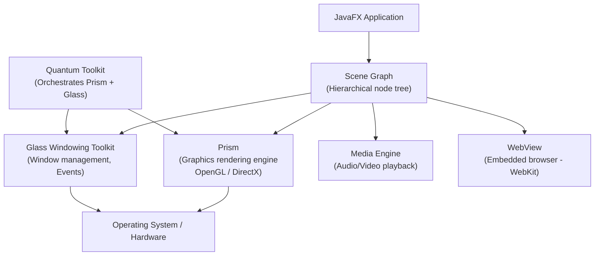
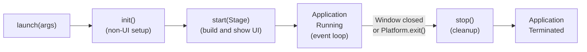
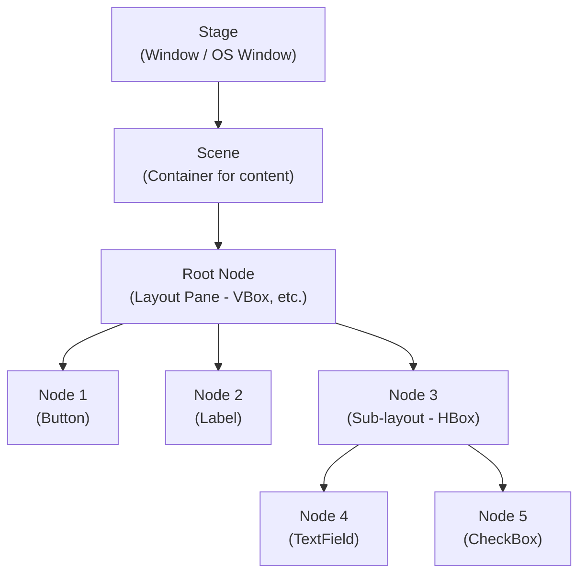

[[00-Dashboard/Home|Home]] | [[01-Semester-V/Semester-V-Dashboard|Semester V]] | [[Overview]] | [[Syllabus]] | [[Unit-1]] | [[Unit-2]] | [[Unit-3]] | [[Unit-4]] | [[Unit-5]] | [[Important-Questions|Imp. Qs]] | [[Revision]] | [[Interview-Prep]]


# Unit 5 - User Interface with JavaFX
> [!important] **Hours:** 8 | **Subject:** CS-301-MJ-T Core Java | **Semester:** V
> **Previous:** [[Unit-4|Unit 4: Exception and File Handling]] | **Next:** [[Important-Questions]]

---

## Learning Objectives

- Compare JavaFX and Swing for GUI development
- Understand JavaFX architecture and the scene graph model
- Use the Application lifecycle methods: init(), start(), stop()
- Build layouts using HBox, VBox, BorderPane, GridPane, FlowPane, StackPane
- Add and configure UI controls (Button, Label, TextField, etc.)
- Create data visualizations using JavaFX Charts
- Implement event handling with EventHandler and lambda expressions

---

## 5.1 JavaFX vs Swing

| Feature | JavaFX | Swing |
|---------|--------|-------|
| Introduction | Java 8 (replacement for Swing) | Java 1.2 |
| Styling | CSS-based styling | Programmatic styling only |
| Declarative UI | FXML support | Not available |
| Charts | Built-in chart components | Not built-in |
| Media | Built-in video/audio support | Not built-in |
| 3D | Basic 3D support | Not supported |
| Animation | Built-in animation API | Limited |
| Architecture | Scene Graph | Component tree |
| Status | Actively developed (OpenJFX) | Maintenance mode |

> [!tip] JavaFX is the preferred choice for modern Java GUI applications.

---

## 5.2 JavaFX Architecture



### Architecture Components

| Component | Description |
|-----------|-------------|
| **Scene Graph** | Hierarchical tree of all visual elements (nodes) in the scene |
| **Prism** | Graphics rendering pipeline; uses hardware acceleration (OpenGL, DirectX) |
| **Glass** | Windowing toolkit; manages windows, events, timers |
| **Media Engine** | Provides audio and video playback capabilities |
| **WebView** | Embeds a web browser (WebKit engine) in JavaFX |
| **Quantum Toolkit** | Orchestrates Prism + Glass thread management |

---

## 5.3 Application Lifecycle

> [!note] JavaFX Application Class
> Every JavaFX application **extends `javafx.application.Application`** and overrides the `start()` method.

```java
import javafx.application.Application;
import javafx.stage.Stage;
import javafx.scene.Scene;
import javafx.scene.layout.VBox;
import javafx.scene.control.Label;

public class MyApp extends Application {

    // 1. init() - called before start(); used for initialization (no GUI here!)
    @Override
    public void init() throws Exception {
        System.out.println("1. init() - app initializing...");
        // Initialize non-UI resources: database connections, config loading
    }

    // 2. start(Stage) - MAIN METHOD of JavaFX; create and show UI here
    @Override
    public void start(Stage primaryStage) throws Exception {
        System.out.println("2. start() - building UI...");
        
        // Create scene graph
        Label label = new Label("Hello, JavaFX!");
        VBox root = new VBox(label);
        Scene scene = new Scene(root, 400, 300);
        
        // Configure stage (window)
        primaryStage.setTitle("My First JavaFX App");
        primaryStage.setScene(scene);
        primaryStage.show();
    }

    // 3. stop() - called when application is about to close
    @Override
    public void stop() throws Exception {
        System.out.println("3. stop() - cleaning up...");
        // Close connections, save data, cleanup
    }

    public static void main(String[] args) {
        launch(args);  // launches the JavaFX application
    }
}
```

### Lifecycle Sequence



| Method | Thread | Purpose |
|--------|--------|---------|
| `init()` | JavaFX-Launcher thread | Initialization (not GUI) |
| `start(Stage)` | JavaFX Application Thread | Build and show UI - MAIN method |
| `stop()` | JavaFX Application Thread | Cleanup before exit |

---

## 5.4 Stage, Scene, and Node Hierarchy



| Concept | Description |
|---------|-------------|
| **Stage** | Top-level container; represents a window. Multiple stages possible. `primaryStage` = main window |
| **Scene** | Content of a stage. Has a root node. `new Scene(rootNode, width, height)` |
| **Node** | Any element in the scene graph (Button, Label, Layout, Shape, etc.) |
| **Root Node** | Top-level node of the scene (usually a layout pane) |

---

## 5.5 JavaFX Layout Panes

### 1. HBox - Horizontal Box

```java
import javafx.scene.layout.HBox;
import javafx.geometry.Insets;

HBox hbox = new HBox(10);  // 10px spacing between children
hbox.setPadding(new Insets(15));  // padding: top, right, bottom, left
hbox.setAlignment(Pos.CENTER);    // align children

Button btn1 = new Button("OK");
Button btn2 = new Button("Cancel");
hbox.getChildren().addAll(btn1, btn2);  // children arranged HORIZONTALLY
```

### 2. VBox - Vertical Box

```java
VBox vbox = new VBox(10);   // 10px vertical spacing
vbox.setPadding(new Insets(20));
vbox.setAlignment(Pos.CENTER_LEFT);

Label title = new Label("Login Form");
TextField username = new TextField();
PasswordField password = new PasswordField();
Button loginBtn = new Button("Login");

vbox.getChildren().addAll(title, username, password, loginBtn); // VERTICAL arrangement
```

### 3. BorderPane - 5-Region Layout

```java
BorderPane bp = new BorderPane();
// 5 regions: TOP, BOTTOM, LEFT, RIGHT, CENTER
bp.setTop(new Label("Header"));           // Navigation bar
bp.setBottom(new Label("Status Bar"));    // Status bar
bp.setLeft(new VBox(new Label("Menu")));  // Side menu
bp.setRight(new VBox(new Label("Info"))); // Info panel
bp.setCenter(new Label("Main Content"));  // Main area (stretches to fill)
```

```
┌─────────────────────────────┐
│           TOP               │
├──────┬──────────────┬───────┤
│      │              │       │
│ LEFT │    CENTER    │ RIGHT │
│      │              │       │
├──────┴──────────────┴───────┤
│          BOTTOM             │
└─────────────────────────────┘
```

### 4. GridPane - Table-like Grid

```java
GridPane grid = new GridPane();
grid.setHgap(10);    // horizontal gap between columns
grid.setVgap(10);    // vertical gap between rows
grid.setPadding(new Insets(20));

// add(node, columnIndex, rowIndex)
grid.add(new Label("Username:"), 0, 0);
grid.add(new TextField(), 1, 0);
grid.add(new Label("Password:"), 0, 1);
grid.add(new PasswordField(), 1, 1);

// add(node, col, row, colSpan, rowSpan)
Button submit = new Button("Submit");
grid.add(submit, 1, 2);  // column 1, row 2
```

### 5. FlowPane - Wrapping Flow Layout

```java
FlowPane fp = new FlowPane();
fp.setHgap(8);
fp.setVgap(8);
// Elements arranged in rows; wraps to next row when space runs out
for (int i = 1; i <= 10; i++) {
    fp.getChildren().add(new Button("Item " + i));
}
```

### 6. StackPane - Stacked/Overlapping

```java
StackPane sp = new StackPane();
// All children are stacked on top of each other (centered)
Rectangle background = new Rectangle(200, 100, Color.LIGHTBLUE);
Label text = new Label("Overlay Text");
sp.getChildren().addAll(background, text); // text appears ON TOP of background
```

### Layout Comparison

| Layout | Arrangement | Best For |
|--------|-------------|---------|
| HBox | Horizontal row | Toolbars, button rows |
| VBox | Vertical column | Form fields, lists |
| BorderPane | 5 regions | Main application layout |
| GridPane | Rows and columns | Forms, data grids |
| FlowPane | Wrapping flow | Tag clouds, image galleries |
| StackPane | Overlapping layers | Card views, overlays |
| TilePane | Fixed-size tiles | Icon grids |
| AnchorPane | Anchor to edges | Precise positioning |

---

## 5.6 JavaFX Controls

```java
// Label - non-editable text
Label lbl = new Label("Hello World");
lbl.setFont(Font.font("Arial", FontWeight.BOLD, 16));
lbl.setTextFill(Color.DARKBLUE);

// TextField - single-line text input
TextField tf = new TextField();
tf.setPromptText("Enter your name");
tf.setPrefWidth(200);
String text = tf.getText();

// TextArea - multi-line text input
TextArea ta = new TextArea();
ta.setPrefRowCount(5);
ta.setPrefColumnCount(30);
ta.setWrapText(true);

// Button
Button btn = new Button("Click Me");
btn.setOnAction(e -> System.out.println("Button clicked!"));

// CheckBox
CheckBox cb = new CheckBox("I agree to Terms");
cb.setSelected(true);
boolean isChecked = cb.isSelected();

// RadioButton (must be in ToggleGroup)
ToggleGroup group = new ToggleGroup();
RadioButton rb1 = new RadioButton("Male");
RadioButton rb2 = new RadioButton("Female");
rb1.setToggleGroup(group);
rb2.setToggleGroup(group);
rb1.setSelected(true);

// ComboBox (dropdown)
ComboBox<String> combo = new ComboBox<>();
combo.getItems().addAll("Option 1", "Option 2", "Option 3");
combo.setValue("Option 1");       // set default
String selected = combo.getValue(); // get selected

// ListView
ListView<String> lv = new ListView<>();
lv.getItems().addAll("Java", "Python", "C++", "JavaScript");
lv.getSelectionModel().setSelectionMode(SelectionMode.MULTIPLE);
String item = lv.getSelectionModel().getSelectedItem();

// Slider
Slider slider = new Slider(0, 100, 50); // min, max, initial
slider.setShowTickMarks(true);
slider.setShowTickLabels(true);
double value = slider.getValue();

// ProgressBar
ProgressBar pb = new ProgressBar(0.7);  // 70% progress
pb.setProgress(0.5);                     // set to 50%

// MenuBar
MenuBar menuBar = new MenuBar();
Menu fileMenu = new Menu("File");
MenuItem openItem = new MenuItem("Open");
MenuItem saveItem = new MenuItem("Save");
MenuItem exitItem = new MenuItem("Exit");
exitItem.setOnAction(e -> Platform.exit());
fileMenu.getItems().addAll(openItem, saveItem, new SeparatorMenuItem(), exitItem);
menuBar.getMenus().add(fileMenu);
```

---

## 5.7 JavaFX Charts

> [!note] Charts
> JavaFX includes built-in chart components in `javafx.scene.chart` package.

### PieChart

```java
import javafx.scene.chart.PieChart;
import javafx.collections.FXCollections;
import javafx.collections.ObservableList;

ObservableList<PieChart.Data> pieData = FXCollections.observableArrayList(
    new PieChart.Data("Java", 35),
    new PieChart.Data("Python", 30),
    new PieChart.Data("JavaScript", 20),
    new PieChart.Data("Others", 15)
);

PieChart pieChart = new PieChart(pieData);
pieChart.setTitle("Programming Languages 2024");
pieChart.setClockwise(true);
pieChart.setStartAngle(90);
pieChart.setLabelsVisible(true);
```

### LineChart / AreaChart / BarChart

```java
// Common setup - axes
NumberAxis xAxis = new NumberAxis(1, 12, 1);  // 1 to 12, tick every 1
xAxis.setLabel("Month");
NumberAxis yAxis = new NumberAxis();
yAxis.setLabel("Sales (₹ Lakhs)");

// LineChart
LineChart<Number, Number> lineChart = new LineChart<>(xAxis, yAxis);
lineChart.setTitle("Monthly Sales 2024");

// Add data series
XYChart.Series<Number, Number> series1 = new XYChart.Series<>();
series1.setName("Product A");
series1.getData().add(new XYChart.Data<>(1, 23));
series1.getData().add(new XYChart.Data<>(2, 45));
series1.getData().add(new XYChart.Data<>(3, 38));
// ... add more data points

lineChart.getData().add(series1);

// AreaChart (filled area below line)
AreaChart<Number, Number> areaChart = new AreaChart<>(xAxis, yAxis);
areaChart.getData().add(series1);

// BarChart (CategoryAxis for X when using string categories)
CategoryAxis catAxis = new CategoryAxis();
catAxis.setLabel("Quarter");
NumberAxis salesAxis = new NumberAxis();

BarChart<String, Number> barChart = new BarChart<>(catAxis, salesAxis);
XYChart.Series<String, Number> series = new XYChart.Series<>();
series.setName("Revenue");
series.getData().add(new XYChart.Data<>("Q1", 150));
series.getData().add(new XYChart.Data<>("Q2", 210));
series.getData().add(new XYChart.Data<>("Q3", 185));
series.getData().add(new XYChart.Data<>("Q4", 250));
barChart.getData().add(series);
```

---

## 5.8 Event Handling

> [!note] Event Handling
> JavaFX uses the **event-driven programming model**. Controls fire events when user interacts; you register **event handlers** to respond.

### Using EventHandler (Anonymous Inner Class)

```java
import javafx.event.ActionEvent;
import javafx.event.EventHandler;

Button btn = new Button("Submit");

// Method 1: Anonymous inner class
btn.setOnAction(new EventHandler<ActionEvent>() {
    @Override
    public void handle(ActionEvent event) {
        System.out.println("Button clicked!");
        System.out.println("Source: " + event.getSource());
    }
});
```

### Using Lambda (Preferred)

```java
// Method 2: Lambda (most concise)
btn.setOnAction(e -> System.out.println("Clicked!"));

// Method 3: Lambda with block body (for multiple statements)
btn.setOnAction(e -> {
    String name = nameField.getText();
    greetLabel.setText("Hello, " + name + "!");
    System.out.println("Event type: " + e.getEventType());
});

// Method 4: Method reference
btn.setOnAction(this::handleButtonClick);

private void handleButtonClick(ActionEvent e) {
    System.out.println("Handled!");
}
```

### addEventHandler / removeEventHandler

```java
// addEventHandler - can add multiple handlers for same event type
EventHandler<ActionEvent> handler1 = e -> System.out.println("Handler 1");
EventHandler<ActionEvent> handler2 = e -> System.out.println("Handler 2");

btn.addEventHandler(ActionEvent.ACTION, handler1);
btn.addEventHandler(ActionEvent.ACTION, handler2);

// removeEventHandler - remove a specific handler
btn.removeEventHandler(ActionEvent.ACTION, handler1);
```

### Common Events

| Event Type | Controls | Event Class |
|------------|---------|-------------|
| Button click | Button | `ActionEvent` |
| Text change | TextField | `KeyEvent` |
| Mouse click | Any node | `MouseEvent` |
| Key press/release | Any node | `KeyEvent` |
| Window close | Stage | `WindowEvent` |
| Value change | ComboBox, Slider | `ActionEvent` / `ChangeListener` |
| Selection change | ListView | `ChangeListener` |

### Change Listener (for value-based changes)

```java
// For Slider value changes
slider.valueProperty().addListener((observable, oldValue, newValue) -> {
    System.out.println("Slider: " + newValue.intValue());
    progressBar.setProgress(newValue.doubleValue() / 100.0);
});

// For ComboBox selection changes
comboBox.valueProperty().addListener((obs, oldVal, newVal) -> {
    System.out.println("Selected: " + newVal);
});
```

---

## 5.9 Complete JavaFX Example - Login Form

```java
import javafx.application.Application;
import javafx.geometry.*;
import javafx.scene.*;
import javafx.scene.control.*;
import javafx.scene.layout.*;
import javafx.stage.Stage;

public class LoginApp extends Application {
    
    @Override
    public void start(Stage stage) {
        // Create controls
        Label titleLabel = new Label(" User Login");
        Label userLabel = new Label("Username:");
        Label passLabel = new Label("Password:");
        TextField userField = new TextField();
        userField.setPromptText("Enter username");
        PasswordField passField = new PasswordField();
        passField.setPromptText("Enter password");
        Button loginBtn = new Button("Login");
        Button clearBtn = new Button("Clear");
        Label statusLabel = new Label("");
        
        // Layout - GridPane for form
        GridPane grid = new GridPane();
        grid.setHgap(10);
        grid.setVgap(15);
        grid.setPadding(new Insets(20));
        grid.add(userLabel, 0, 0);
        grid.add(userField, 1, 0);
        grid.add(passLabel, 0, 1);
        grid.add(passField, 1, 1);
        
        // Button row
        HBox buttons = new HBox(10, loginBtn, clearBtn);
        buttons.setAlignment(Pos.CENTER_RIGHT);
        
        // Main layout
        VBox vbox = new VBox(15, titleLabel, grid, buttons, statusLabel);
        vbox.setPadding(new Insets(30));
        vbox.setAlignment(Pos.CENTER);
        
        // Event handling
        loginBtn.setOnAction(e -> {
            String user = userField.getText();
            String pass = passField.getText();
            if (user.equals("admin") && pass.equals("1234")) {
                statusLabel.setText(" Login Successful! Welcome " + user);
            } else {
                statusLabel.setText(" Invalid credentials!");
            }
        });
        
        clearBtn.setOnAction(e -> {
            userField.clear();
            passField.clear();
            statusLabel.setText("");
        });
        
        // Stage setup
        Scene scene = new Scene(vbox, 350, 250);
        stage.setTitle("Login Application");
        stage.setScene(scene);
        stage.show();
    }
    
    public static void main(String[] args) {
        launch(args);
    }
}
```

---

## Interview Questions

1. **What is the difference between Swing and JavaFX?**
   - JavaFX: CSS styling, FXML, built-in charts/media, modern API, scene graph; Swing: older, no FXML, heavyweight components, maintenance mode.

2. **Explain the JavaFX Application lifecycle.**
   - `launch()` calls `init()` (non-GUI setup), then `start(Stage)` (build UI), then `stop()` (cleanup) when exiting.

3. **What is the Scene Graph?**
   - Hierarchical tree of all visual nodes in a JavaFX application. Stage → Scene → Root Node → Child nodes.

4. **What is the difference between Stage and Scene?**
   - Stage = window (OS level); Scene = content of the window; one Stage has one Scene at a time.

5. **Explain different JavaFX layout panes.**
   - HBox (horizontal), VBox (vertical), BorderPane (5 regions), GridPane (rows+cols), FlowPane (wrapping), StackPane (overlapping).

6. **How to handle events in JavaFX? Mention three ways.**
   - (1) Anonymous inner class with `EventHandler<ActionEvent>`
   - (2) Lambda expression: `btn.setOnAction(e -> ...)`
   - (3) Method reference: `btn.setOnAction(this::method)`

7. **What is the difference between `setOnAction()` and `addEventHandler()`?**
   - `setOnAction()`: Sets a single handler (replaces any previous one)
   - `addEventHandler()`: Adds an additional handler (multiple handlers can co-exist)

8. **What charts are available in JavaFX?**
   - PieChart, LineChart, AreaChart, BarChart, ScatterChart, BubbleChart, StackedBarChart, StackedAreaChart.

9. **What is ObservableList?**
   - A list that notifies observers when its content changes. Used for charts and ListView to auto-update UI.

10. **How do you close a JavaFX application programmatically?**
    - `Platform.exit()` - graceful shutdown (calls stop() method)
    - `System.exit(0)` - abrupt shutdown (bypasses stop())

---

## Revision Summary

> [!note] Quick Revision - Unit 5
> 
> **JavaFX > Swing:** CSS, FXML, Charts, Media, modern API
> 
> **Architecture:** Scene Graph → Prism (render) + Glass (windows) + Media + WebView
> 
> **Lifecycle:** `init()` → `start(Stage)` → [running] → `stop()`
> 
> **Hierarchy:** Stage (window) → Scene → Root Node (Layout) → Nodes
> 
> **Layouts:** HBox (horizontal), VBox (vertical), BorderPane (5 zones), GridPane (table), FlowPane (wrap), StackPane (overlap)
> 
> **Charts:** PieChart, LineChart, AreaChart, BarChart - use ObservableList + XYChart.Series
> 
> **Events:** `setOnAction(e -> ...)` or `addEventHandler(type, handler)` - prefer lambda

---

## Navigation

| Previous | Current | Next |
|----------|---------|------|
| [[Unit-4|Unit 4: Exception and File Handling]] | **Unit 5: User Interface with JavaFX** | [[Important-Questions|Important Questions]] |
