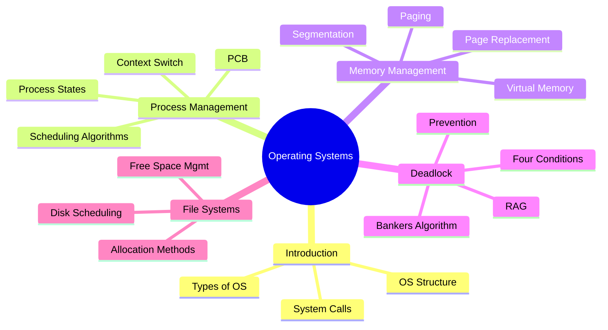

# CS-302-MJ-T - Operating Systems
> [!important] Subject Info
> **Subject Code:** CS-302-MJ-T | **Credits:** 2 | **IE:** 15 Marks | **EE:** 35 Marks | **Total:** 50 Marks

##  Subject Description

An ==Operating System== (OS) is system software that manages computer hardware and software resources, providing common services for computer programs. This subject covers the **core concepts** of OS design including **process management**, **memory management**, **deadlock handling**, and **file systems**. Understanding OS is fundamental to computer science as it bridges hardware and user applications.

> [!note] Why Study OS?
> Every application runs on top of an OS. Knowledge of OS concepts is essential for **systems programming**, **performance tuning**, **cloud computing**, and **embedded systems** development.

---

##  Course Objectives

1. **CO-Obj-1:** Understand the fundamental concepts, structure, and types of operating systems.
2. **CO-Obj-2:** Analyze CPU **scheduling algorithms** and understand process management and context switching.
3. **CO-Obj-3:** Apply **memory management** techniques including paging, segmentation, and virtual memory.
4. **CO-Obj-4:** Understand **deadlock** conditions, prevention, avoidance (Banker's Algorithm), and recovery strategies.
5. **CO-Obj-5:** Implement **file system** structures, allocation methods, and disk scheduling algorithms.
6. **CO-Obj-6:** Evaluate trade-offs between various OS algorithms and strategies.

---

##  Course Outcomes (COs)

| CO | Description | Bloom's Level |
|----|-------------|--------------|
| **CO1** | Describe the structure, types, and functions of an operating system | Remember / Understand |
| **CO2** | Compare CPU scheduling algorithms and calculate turnaround/waiting time | Analyze / Evaluate |
| **CO3** | Apply memory management techniques (paging, segmentation, virtual memory) | Apply / Analyze |
| **CO4** | Identify deadlock conditions and apply Banker's Algorithm | Apply / Evaluate |
| **CO5** | Evaluate file allocation methods and disk scheduling algorithms | Evaluate |
| **CO6** | Design solutions to OS problems using appropriate strategies | Create |

---

##  Unit-wise Content

| Unit | Topic | Hours | Notes |
|------|-------|-------|-------|
| 1 | [[Unit-1\|Introduction to Operating Systems]] | 3 | Definition, Types, Structure, Booting |
| 2 | [[Unit-2\|Process and CPU Scheduling]] | 7 | PCB, States, FCFS, SJF, RR, Priority |
| 3 | [[Unit-3\|Memory Management]] | 8 | Paging, Segmentation, Virtual Memory, Page Replacement |
| 4 | [[Unit-4\|Deadlock]] | 7 | RAG, Conditions, Banker's Algorithm, Recovery |
| 5 | [[Unit-5\|File System and Disk Scheduling]] | 5 | Allocation, Free Space, FCFS, SSTF, SCAN, LOOK |
| | **Total** | **30** | |

---

## ️ Quick Navigation

- [[Syllabus| Complete Syllabus]]
- [[Unit-1| Unit 1: Introduction to OS]]
- [[Unit-2| Unit 2: Process and CPU Scheduling]]
- [[Unit-3| Unit 3: Memory Management]]
- [[Unit-4| Unit 4: Deadlock]]
- [[Unit-5| Unit 5: File System and Disk Scheduling]]
- [[Important-Questions| Important Questions]]
- [[Revision| Revision Notes]]
- [[Interview-Prep| Interview Preparation]]

---

##  Reference Books

| # | Title | Author | Publisher |
|---|-------|--------|-----------|
| 1 | *Operating System Concepts* (Dinosaur Book, 10th Ed.) | Silberschatz, Galvin & Gagne | Wiley |
| 2 | *Modern Operating Systems* (4th Ed.) | Andrew S. Tanenbaum | Pearson |
| 3 | *Operating Systems: Internals and Design Principles* | William Stallings | Pearson |
| 4 | *Operating Systems: Three Easy Pieces* | Arpaci-Dusseau | Available free online |

---

## ️ Exam Pattern

> [!warning] Exam Weightage
> - **Internal Exam (IE):** 15 Marks - Unit tests, assignments
> - **External Exam (EE):** 35 Marks - Theory + Numericals (Units 1-5)
> - **Numericals are high-scoring:** Gantt charts, page replacement traces, Banker's algorithm

---

##  Key Themes

---

##  Backlinks
- [[../Semester-V-Overview|Semester V Overview]]
- [[../CS-301-MJ-T-Core-Java/Overview|CS-301 Core Java]]
