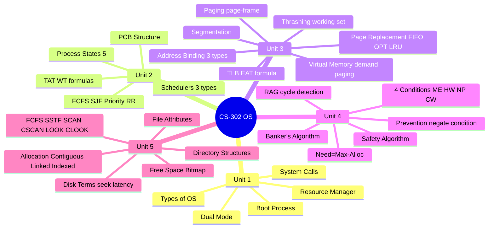

# CS-302 Operating Systems - Revision Notes

> [!important] Last-minute revision guide. Focus on numericals - they give full marks in OS!

---

##  Unit 1 - Introduction to OS

> [!note] Unit 1 Summary (3 Hours)

```
OS = Resource Manager + Abstract Machine
Goals: Convenience (easy to use) + Efficiency (use hardware well)
```

### OS Functions (Mnemonics: PMIISNA)
```
Process management
Memory management
I/O management
Information maintenance (accounting)
Security & protection
Networking
A - (File management sometimes separate)
```

### OS Types
```
Batch → Sequential jobs, no interaction (IBM mainframes)
Multiprogramming → Multiple in memory, CPU switches on I/O
Time-sharing → Rapid switching, users feel dedicated (UNIX, Linux)
Real-time → Hard RTOS (miss deadline=failure: aircraft) | Soft (degraded: streaming)
Distributed → Multiple computers as one
Embedded → Specialized hardware (Android, FreeRTOS)
```

### OS Structure
```
Monolithic: All in one kernel (Linux) - fast
Layered: Layer N calls N-1 - organized
Microkernel: Minimal kernel, rest in user space (Mach) - safe
Modular: Core + loadable modules (Linux LKM)
Hybrid: Mix (Windows, macOS)
```

### Dual Mode + Boot
```
User Mode (restricted) ↔ Kernel Mode (full access)
System call triggers mode switch
Boot: POST → BIOS/UEFI → MBR/GPT → Bootloader (GRUB) → Kernel → Init/Systemd → Login
```

---

##  Unit 2 - Process and CPU Scheduling

> [!note] Unit 2 Summary (7 Hours)

### Process States
```
New → Ready → Running → Waiting → Terminated
         ↑        |         |
         └── preempt     I/O done
```

### PCB Contains
```
PID | State | Program Counter | CPU Registers | Memory limits | I/O info | Accounting
```

### Schedulers
```
Long-term (Job): selects processes from pool to memory (infrequent)
Short-term (CPU): selects from ready queue (very frequent, ms)
Medium-term (Swapper): swaps processes in/out of memory
```

### Key Formulas
```
TAT = CT - AT      (Turnaround Time = Completion - Arrival)
WT  = TAT - BT     (Waiting Time = TAT - Burst Time)
Avg TAT/WT = Sum / n
```

### Algorithm Cheat Sheet

| Algorithm | Type | Special Note |
|-----------|------|-------------|
| FCFS | Non-preemptive | Convoy effect |
| SJF | Non-preemptive | Optimal avg WT; starvation → aging |
| SRTF | Preemptive SJF | Best for avg WT among preemptive |
| Priority | Both | Starvation → aging |
| Round Robin | Preemptive | Time quantum; fair; time-sharing |

### FCFS Example
```
P1(AT=0,BT=6) P2(AT=1,BT=4) P3(AT=2,BT=2)
Gantt: |P1(0-6)|P2(6-10)|P3(10-12)|
TAT: P1=6, P2=9, P3=10 | WT: P1=0, P2=5, P3=8
Avg TAT=8.33 | Avg WT=4.33
```

---

##  Unit 3 - Memory Management

> [!note] Unit 3 Summary (8 Hours) - Heaviest Unit!

### Address Binding
```
Compile-time → addresses fixed at compile time (can only run at fixed location)
Load-time → addresses fixed when program loaded
Execution-time → addresses translated dynamically by MMU (modern OS)
```

### Paging Address Translation
```
Logical Address = [Page Number (p) | Offset (d)]
Physical Address = [Frame Number from page_table[p]] + d
Physical = page_table[p] × page_size + d
```

### TLB EAT Formula
```
EAT = α(t_TLB + t_mem) + (1-α)(t_TLB + 2t_mem)
where α = TLB hit ratio
Example: α=0.9, t_TLB=20ns, t_mem=100ns
EAT = 0.9×120 + 0.1×220 = 108+22 = 130ns
```

### Page Replacement Quick Reference
```
FIFO: Replace OLDEST page (Belady's Anomaly: more frames → more faults!)
OPT:  Replace page NOT used for LONGEST TIME in future (theoretical best)
LRU:  Replace LEAST RECENTLY USED page (good, no Belady's)
MFU:  Replace MOST FREQUENTLY USED page
```

### Segmentation vs Paging
```
Paging: Fixed size | No external frag | Internal frag | User invisible
Segmentation: Variable size | External frag | No internal frag | User visible (code,data,stack)
```

### Thrashing
```
Cause: Too few frames → too many page faults → CPU spends time on I/O not computing
Solution: Working Set Model | Page Fault Frequency | Reduce multiprogramming
```

---

##  Unit 4 - Deadlock

> [!note] Unit 4 Summary (7 Hours)

### 4 Necessary Conditions (ALL must hold)
```
1. Mutual Exclusion - resource used by only one process at a time
2. Hold & Wait - holding one, waiting for another
3. No Preemption - resource can't be forcibly taken
4. Circular Wait - P1 waits for P2, P2 waits for P3, ..., Pn waits for P1
```

### RAG Rules
```
Cycle in RAG + single instance per resource = DEFINITE DEADLOCK
Cycle in RAG + multiple instances = POSSIBLE DEADLOCK (check further)
No cycle = NO DEADLOCK
```

### Prevention (Negate one condition)
```
Mutual Exclusion: Make resources sharable (not always possible)
Hold & Wait: Request all resources upfront OR release before new request
No Preemption: Allow OS to take resources (only for CPU/memory)
Circular Wait: Impose resource ordering (always request in increasing order)
```

### Banker's Algorithm Data
```
n processes, m resource types:
Available[m] = current available
Max[n×m] = maximum demand
Allocation[n×m] = currently allocated  
Need[n×m] = Max - Allocation  ← KEY FORMULA
```

### Safety Algorithm Steps
```
1. Work = Available; Finish[i] = false for all i
2. Find i: Finish[i]=false AND Need[i] ≤ Work
3. Work += Allocation[i]; Finish[i] = true; go to 2
4. If all Finish[i]=true → SAFE; else UNSAFE
```

### Resource Request Steps
```
1. Request_i ≤ Need[i]? (else error)
2. Request_i ≤ Available? (else wait)
3. Tentatively: Available -= Request; Allocation[i] += Request; Need[i] -= Request
4. Run safety check → if safe: grant; else: rollback + wait
```

---

##  Unit 5 - File System and Disk Scheduling

> [!note] Unit 5 Summary (5 Hours)

### File Allocation Methods
```
Contiguous: start+length | Fast random access | External fragmentation | No growth
Linked: pointers in blocks | No frag | No random access | FAT keeps pointers in table
Indexed: index block | Fast + no frag | inode (Unix) has direct+indirect pointers
```

### Free Space Management
```
Bitmap: 1 bit per block (0=free, 1=used) - simple, needs memory
Linked list: free blocks linked - no overhead
Grouping: n addresses per free block
Counting: (start, count) pairs
```

### Disk Scheduling - Summary Table

| Algorithm | Total Movement (std ex.) | Starvation? | Notes |
|-----------|--------------------------|-------------|-------|
| FCFS | 640 | No | Fair, inefficient |
| SSTF | 236 | YES ️ | Greedy, closest first |
| SCAN | 236 | No | Elevator - reverses at end |
| C-SCAN | 183 | No | One direction, jump back |
| LOOK | 208 | No | Like SCAN, stops at last req |
| C-LOOK | ~153 | No | Best - one direction, jump |

### Disk Access Time
```
Total = Seek Time (dominant!) + Rotational Latency + Transfer Time
Goal: Minimize total head movement = minimize seek time
```

---

##  Key Terms Glossary

| Term | Definition |
|------|------------|
| PCB | Data structure with all process info (PID, state, PC, registers, memory) |
| Context Switch | Save current process state, restore next process state |
| Convoy Effect | Short processes waiting behind long process in FCFS |
| Starvation | Process indefinitely denied CPU/resources |
| Aging | Gradually increase priority of waiting processes |
| Page Fault | Access to page not in physical memory - load from disk |
| Belady's Anomaly | FIFO: more frames → more page faults |
| Thrashing | Excessive paging - CPU spends more time on I/O |
| Working Set | Pages used by process in recent Δ references |
| Deadlock | Circular waiting - each holds one, needs another |
| Safe State | Safe sequence exists - all processes can finish |
| RAG | Resource Allocation Graph - visual deadlock detection |
| Banker's | Deadlock avoidance - grants request only if safe state maintained |
| inode | UNIX file metadata + pointer structure |
| FAT | File Allocation Table - table-based linked allocation |
| Seek Time | Time for disk head to move to correct track |

---

## ️ Common Mistakes to Avoid

> [!warning] Don't make these errors in exams!

**Unit 2 (Scheduling):**
1. **TAT ≠ WT** - TAT = CT - AT; WT = TAT - BT (BT is burst, not a sum)
2. **FCFS starts at AT not 0** - if P1 AT=2, CPU idles from 0 to 2
3. **SJF non-preemptive** - once started, process completes (even if shorter arrives)
4. **RR: Add to rear of queue** - when process preempted AND when new process arrives at same time, order matters

**Unit 3 (Memory):**
5. **Offset is NOT translated** - only the page/frame number changes
6. **EAT formula** - miss ratio = (1-hit ratio); two memory accesses on miss
7. **Belady's anomaly = FIFO only** - LRU, OPT are stack algorithms; immune
8. **Page fault ≠ error** - it's a hardware interrupt, not a program bug

**Unit 4 (Deadlock):**
9. **Unsafe ≠ Deadlock** - unsafe state might not lead to deadlock
10. **Need = Max - Allocation** - very commonly tested formula

**Unit 5 (Disk Scheduling):**
11. **SCAN vs C-SCAN direction** - SCAN reverses; C-SCAN jumps to start
12. **Total head movement includes all moves** - going to 0 or 199 counts!

---

##  Last-Minute Tips

> [!tip] 30 Minutes Before OS Exam

1. **Practice Gantt charts** - FCFS and SJF are straightforward; RR is tricky (track queue carefully)
2. **Page replacement** - draw a table, mark page in memory, count page faults
3. **Banker's algorithm** - compute Need matrix first; then run safety algorithm step by step
4. **Disk scheduling** - draw number line 0-199, mark all requests, trace head movement
5. **State the 4 deadlock conditions** - examiner always asks; one line each is enough
6. **RAG rules:** Cycle in single-instance RAG = definite deadlock
7. **Formulas:** TAT=CT-AT, WT=TAT-BT, EAT=α(t_TLB+t_m)+(1-α)(t_TLB+2t_m), Need=Max-Alloc
8. **File allocation pros/cons** - table format is clearest
9. **Disk head movement totals** in standard example: FCFS=640 > LOOK > SCAN > SSTF > C-SCAN > C-LOOK
10. **OS types** - prepare 2-3 lines for each with real-world example

---

##  One-Page Summary



---

##  Navigation

- [[Overview| Subject Overview]]
- [[Syllabus| Syllabus]]
- [[Important-Questions| Important Questions]]
- [[Interview-Prep| Interview Preparation]]
