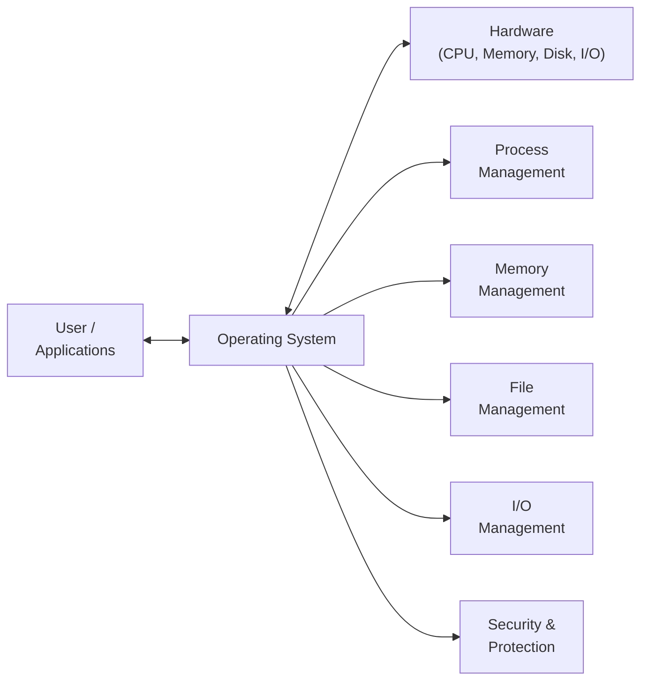
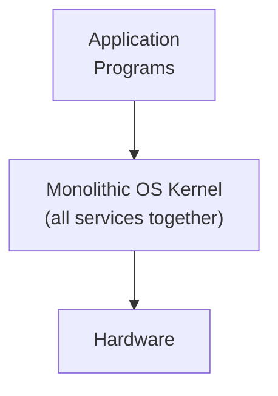
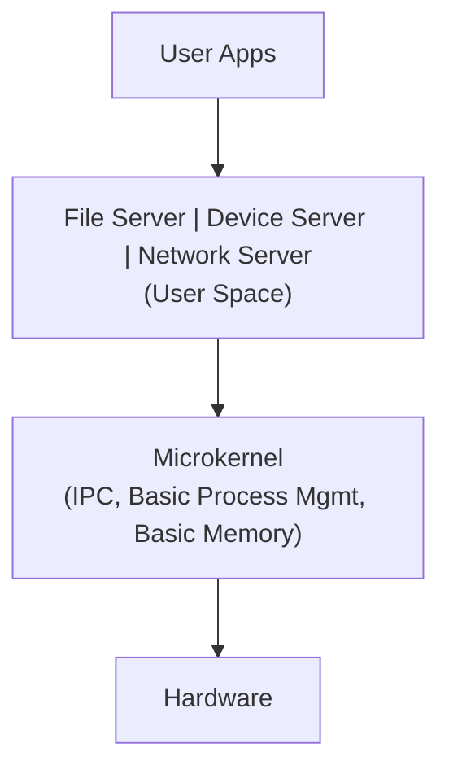
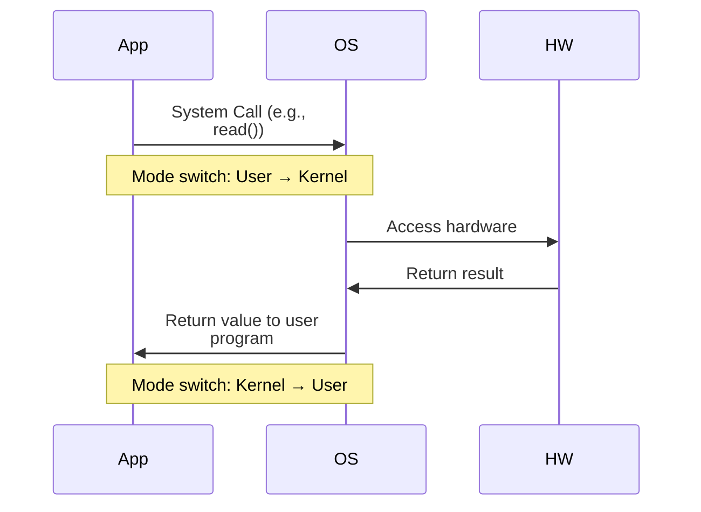
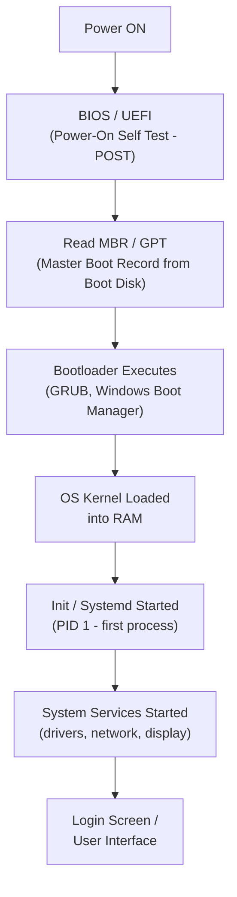

[[00-Dashboard/Home|Home]] | [[01-Semester-V/Semester-V-Dashboard|Semester V]] | [[Overview]] | [[Syllabus]] | [[Unit-1]] | [[Unit-2]] | [[Unit-3]] | [[Unit-4]] | [[Unit-5]] | [[Important-Questions|Imp. Qs]] | [[Revision]] | [[Interview-Prep]]

# Unit 1 - Introduction to Operating Systems
> [!important] **Hours:** 3 | **Subject:** CS-302-MJ-T Operating Systems | **Semester:** V
> **Previous:** [[Overview]] | **Next:** [[Unit-2|Unit 2: Process and CPU Scheduling]]

---

## Learning Objectives

- Define an operating system and state its goals
- Describe the functions and services provided by an OS
- Explain the internal structure of an OS
- Distinguish between different types of operating systems
- Understand system calls, dual-mode operation, and the boot process

---

## 1.1 What is an Operating System?

> [!note] Definition
> An ==Operating System== (OS) is **system software** that acts as an **intermediary** between the **user** and the **computer hardware**. It manages hardware resources and provides a platform for application programs to run.

### Two Views of an OS

| View | Description |
|------|-------------|
| **Resource Manager** | Manages CPU, memory, I/O devices, and files efficiently and fairly |
| **Extended Machine / Abstract Machine** | Hides hardware complexity, provides easy-to-use interface |

### Goals of an OS
1. **Convenience:** Make computer easier to use
2. **Efficiency:** Use hardware resources efficiently
3. **Ability to evolve:** Allow new features/hardware without disrupting existing services

---

## 1.2 Functions of an Operating System

==The OS is responsible for the following major functions:==

| Function | Description |
|----------|-------------|
| **Process Management** | Creating, scheduling, suspending, and terminating processes |
| **Memory Management** | Allocating/deallocating memory, virtual memory management |
| **File Management** | Creating, organizing, reading/writing, and deleting files |
| **I/O Management** | Managing I/O devices, buffering, spooling, caching |
| **Secondary Storage Management** | Free space management, disk scheduling |
| **Networking** | Managing network protocols and inter-process communication |
| **Security & Protection** | User authentication, access control, resource protection |
| **Accounting** | Tracking resource usage per user/process |

---

## 1.3 OS Services

The OS provides **services** for programs and users:

### Services for the User
1. **Program Execution** - Load program into memory and execute it
2. **I/O Operations** - Read from keyboard, write to screen, access files
3. **File System Manipulation** - Create, delete, read, write, search files/directories
4. **Communications** - Message passing (shared memory or message queue) between processes
5. **Error Detection** - Detect and correct errors in hardware, software

### Services for Efficient System Operation
6. **Resource Allocation** - Allocate CPU, memory, I/O to multiple users/processes
7. **Accounting** - Keep track of resource usage
8. **Protection & Security** - Prevent unauthorized access; authentication, authorization

---

## 1.4 OS Structure (Architecture)

Different OS designs have evolved over time:

### 1. Simple / Monolithic Structure
- **MS-DOS, early UNIX** - all OS services in a single layer
- No clear separation between components
- Fast but difficult to maintain and debug

### 2. Layered Structure
- OS divided into layers; each layer uses services of the layer below
- **Layer 0:** Hardware | **Layer N:** User Interface
- Easy to debug; each layer only interacts with adjacent layers
- Overhead due to multiple layer transitions

### 3. Microkernel Architecture
- ==Microkernel== keeps only **essential services** in kernel mode (process management, basic IPC)
- All other services run as **user-space processes** (servers)
- More reliable, more secure, but slower due to message passing
- Example: **Mach**, **Minix**, **QNX**

### 4. Modular / Loadable Kernel Modules (LKM)
- Core kernel + loadable modules (device drivers, file systems)
- Best of monolithic (performance) + microkernel (flexibility)
- Example: **Linux** (most widely used)

### 5. Hybrid Structure
- Combines multiple approaches
- Example: **Windows NT** (mostly monolithic with some microkernel-like design), **macOS** (Mach microkernel + BSD UNIX monolithic)

---

## 1.5 System Calls

> [!note] Definition
> A ==system call== is the **programming interface** between a **running program** and the **OS**. It allows user-space programs to request OS services (kernel-mode operations).

### Categories of System Calls

| Category | Examples |
|----------|---------|
| **Process Control** | `fork()`, `exec()`, `exit()`, `wait()`, `kill()` |
| **File Management** | `open()`, `read()`, `write()`, `close()`, `unlink()` |
| **Device Management** | `ioctl()`, `read()`, `write()` (on device) |
| **Information Maintenance** | `getpid()`, `alarm()`, `sleep()`, `time()` |
| **Communication** | `pipe()`, `socket()`, `send()`, `recv()` |
| **Protection** | `chmod()`, `chown()`, `umask()` |

> [!tip] API vs System Call
> Programs typically use **APIs** (like POSIX API, Windows API) rather than calling system calls directly. The API internally triggers system calls.

### User Mode vs Kernel Mode

> [!important] Dual-Mode Operation
> - **User Mode:** Limited privileges; cannot directly access hardware
> - **Kernel Mode (Supervisor Mode):** Full access to hardware and all instructions
> - Mode bit: 0 = Kernel mode, 1 = User mode
> - Switching occurs on **system calls**, **interrupts**, or **exceptions**

---

## 1.6 Types of Operating Systems

### 1. Batch Operating System

> [!note] Batch OS
> Jobs are grouped into **batches** and processed one by one **without user interaction**. The operator submits jobs; OS processes them sequentially.

- **Examples:** IBM OS/360 (early mainframes)
- **Advantages:** Efficient for large, repetitive jobs
- **Disadvantages:** No interactivity; if one job fails, the rest in batch may be affected
- **Problems:** Starvation if a job takes too long; CPU idle while doing I/O

### 2. Multiprogramming OS

> [!note] Multiprogramming
> Multiple programs kept in memory simultaneously. When one process waits for I/O, the CPU switches to another, keeping CPU busy.

- **Goal:** Maximize CPU utilization
- **Requires:** Memory management, CPU scheduling
- **Key concept:** CPU is never idle as long as there is a ready process

### 3. Time-Sharing (Multitasking) OS

> [!note] Time-Sharing
> Extension of multiprogramming where the CPU switches between processes so rapidly that **each user feels they have exclusive use** of the computer.

- **Time quantum:** Small fixed time slice per user
- **Examples:** UNIX, Linux, Windows
- **Advantages:** Interactive, good response time
- **Disadvantages:** Complex scheduling, security issues

### 4. Real-Time Operating System (RTOS)

> [!note] RTOS
> An OS with **strict timing constraints**. Tasks must complete within a guaranteed time (deadline).

| Type | Description | Example |
|------|-------------|---------|
| **Hard RTOS** | Missing deadline = system failure | Aircraft control, Medical devices, Airbags |
| **Soft RTOS** | Missing deadline = degraded performance | Video streaming, Online gaming |

- **Examples:** VxWorks, FreeRTOS, QNX

### 5. Distributed Operating System

> [!note] Distributed OS
> Manages a **collection of independent computers** networked together, making them appear as a **single coherent system** to the user.

- **Key features:** Resource sharing, fault tolerance, scalability, transparency
- **Examples:** Amoeba, Plan 9, Google's Borg system

### 6. Embedded Operating System

> [!note] Embedded OS
> Designed for **specific hardware** with limited resources (memory, CPU). Highly optimized for particular tasks.

- **Examples:** Android (phones), RTOS in microcontrollers, Embedded Linux (IoT)
- **Characteristics:** Small footprint, real-time capability, dedicated purpose

### Comparison Table

| Type | Interactivity | Users | Speed | Example |
|------|--------------|-------|-------|---------|
| Batch | None | Single | Slow response | IBM OS/360 |
| Multiprogramming | Low | Single | Better CPU use | Early UNIX |
| Time-sharing | High | Multiple | Good response | UNIX, Linux |
| Real-time | N/A | Special | Guaranteed timing | VxWorks, FreeRTOS |
| Distributed | High | Multiple | Varies | Google Borg |
| Embedded | Varies | Single app | Optimized | Android, FreeRTOS |

---

## 1.7 OS Operation

### Interrupts
- Hardware devices signal the CPU via **interrupts** when they need attention
- **Interrupt Service Routine (ISR):** Code executed in response to an interrupt
- **Types:** Hardware interrupts (I/O completion), Software interrupts (system calls), Timer interrupts

### Timer
- A timer interrupt periodically occurs to **prevent any one process from monopolizing** the CPU
- If a process runs longer than its time quantum, the OS preempts it

---

## 1.8 The Booting Process

==Booting== is the process of **loading the OS into memory** and starting it when the computer is powered on.

| Step | Component | Description |
|------|-----------|-------------|
| 1 | **POST** | Hardware self-test (RAM, CPU, keyboard) |
| 2 | **BIOS/UEFI** | Firmware, finds boot device |
| 3 | **MBR/GPT** | First sector of disk, points to bootloader |
| 4 | **Bootloader** | GRUB (Linux) or BOOTMGR (Windows) loads kernel |
| 5 | **Kernel** | OS core initializes hardware, mounts filesystem |
| 6 | **Init/Systemd** | First process (PID 1); starts all other services |
| 7 | **Shell / GUI** | User interface ready for use |

> [!tip] BIOS vs UEFI
> - **BIOS:** Legacy firmware, 16-bit, slow, supports drives ≤ 2TB, uses MBR
> - **UEFI:** Modern firmware, 64-bit, fast boot, supports drives > 2TB, uses GPT, Secure Boot

---

## Key Definitions

| Term | Definition |
|------|------------|
| **OS** | System software that manages hardware resources and provides services to programs |
| **Kernel** | The core part of the OS that runs in privileged mode |
| **System Call** | Interface between user program and OS kernel |
| **Interrupt** | Signal to CPU to pause current activity and handle an event |
| **Dual Mode** | User mode (restricted) and Kernel mode (privileged) operation |
| **Booting** | Process of loading OS from disk into memory and starting it |
| **BIOS** | Basic Input/Output System - firmware that initializes hardware on boot |
| **GRUB** | GRand Unified Bootloader - common Linux bootloader |
| **Multiprogramming** | Multiple programs in memory simultaneously, CPU switches on I/O wait |
| **Time-sharing** | Rapid CPU switching to give illusion of dedicated resources to each user |
| **RTOS** | Real-Time OS with guaranteed timing constraints for task execution |

---

## Interview Questions

> [!tip] Commonly Asked Questions

1. **What is an operating system? What are its main functions?**
   - OS is system software that manages hardware resources (CPU, memory, I/O) and provides services to user programs. Functions: process management, memory management, file management, I/O management, security.

2. **What is the difference between a process and a program?**
   - A **program** is a passive entity (executable file on disk). A **process** is an active entity (program in execution with resources allocated).

3. **Explain dual-mode operation in an OS.**
   - OS operates in two modes: **User mode** (limited privileges, no direct hardware access) and **Kernel mode** (full hardware access). Mode switches on system calls, interrupts, and exceptions.

4. **What is a system call? Give examples.**
   - A system call is the API between user programs and OS. Examples: `fork()` (create process), `read()` (read file), `write()` (write file), `exit()` (terminate process).

5. **What are the types of OS? Explain each briefly.**
   - Batch (sequential job processing), Multiprogramming (multiple jobs in memory), Time-sharing (rapid CPU switching), Real-time (strict timing), Distributed (networked computers), Embedded (specialized hardware).

6. **What is a microkernel?**
   - OS design where only essential services (IPC, basic memory, process management) are in the kernel. All other services run in user space as servers. More secure but slower.

7. **What is the difference between BIOS and UEFI?**
   - BIOS: 16-bit legacy firmware, ≤2TB disk support, uses MBR.
   - UEFI: 64-bit modern firmware, >2TB disk support, uses GPT, supports Secure Boot and faster boot times.

8. **What is thrashing? (Preview for Unit 3)**
   - When a process spends more time swapping pages in/out than executing due to insufficient memory frames.

9. **What is a hard real-time vs soft real-time OS?**
   - Hard: Missing deadline = catastrophic failure (medical devices, aircraft)
   - Soft: Missing deadline = degraded quality (streaming, gaming)

10. **What is spooling? How does it help OS efficiency?**
    - Simultaneous Peripheral Operations OnLine - OS stores I/O jobs in a buffer (spool) on disk. CPU can continue other work while printer/device processes the spool. Improves efficiency.

---

## Revision Summary

> [!note] Quick Revision - Unit 1
> 
> **OS = Resource Manager + Abstract Machine**
> 
> **Functions:** Process Mgmt, Memory Mgmt, File Mgmt, I/O Mgmt, Security
> 
> **OS Structure:** Monolithic (fast), Layered (organized), Microkernel (safe), Modular (flexible), Hybrid
> 
> **Types:** Batch → Multiprogramming → Time-sharing → Real-time / Distributed / Embedded
> 
> **Dual Mode:** User mode (restricted) ↔ Kernel mode (privileged) - switches via interrupts/syscalls
> 
> **Boot Process:** POST → BIOS/UEFI → MBR → Bootloader → Kernel → Init → Login

---

## Navigation

| Previous | Current | Next |
|----------|---------|------|
| [[Overview|Subject Overview]] | **Unit 1: Introduction to OS** | [[Unit-2|Unit 2: Process and CPU Scheduling]] |
