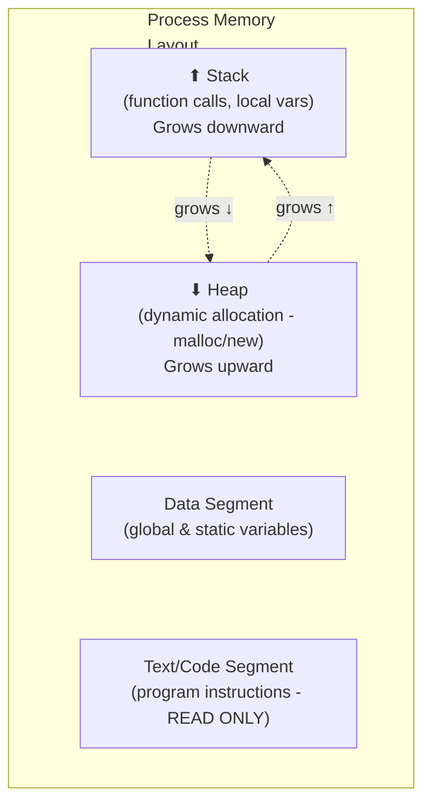
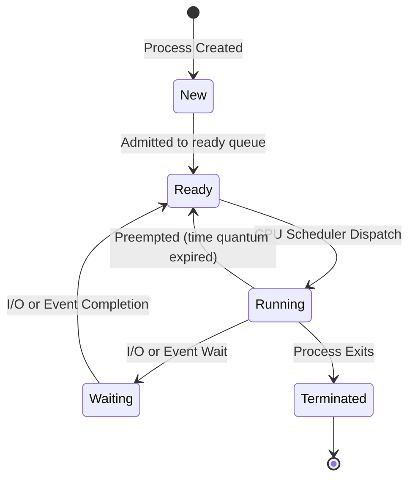
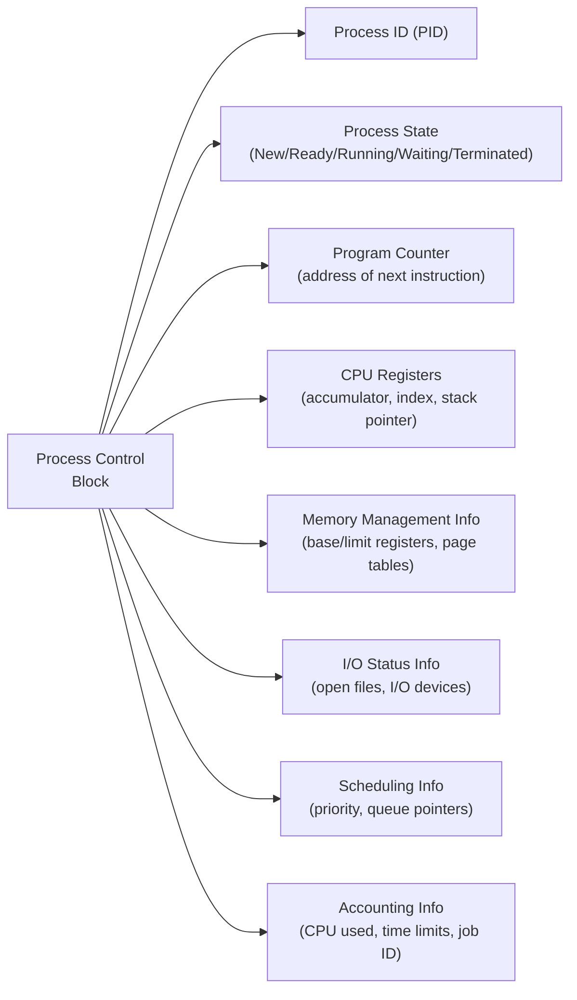
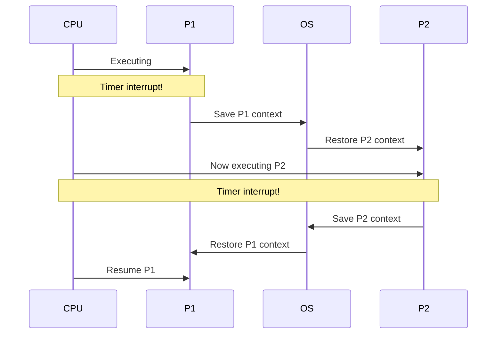

[[00-Dashboard/Home|Home]] | [[01-Semester-V/Semester-V-Dashboard|Semester V]] | [[Overview]] | [[Syllabus]] | [[Unit-1]] | [[Unit-2]] | [[Unit-3]] | [[Unit-4]] | [[Unit-5]] | [[Important-Questions|Imp. Qs]] | [[Revision]] | [[Interview-Prep]]


# Unit 2 - Process and CPU Scheduling
> [!important] **Hours:** 7 | **Subject:** CS-302-MJ-T Operating Systems | **Semester:** V
> **Previous:** [[Unit-1|Unit 1: Introduction to OS]] | **Next:** [[Unit-3|Unit 3: Memory Management]]

---

## Learning Objectives

- Define a process and describe its components
- Draw and explain the process state diagram
- Understand the Process Control Block (PCB) structure
- Explain the role of schedulers and context switching
- Apply CPU scheduling algorithms (FCFS, SJF, Priority, Round Robin)
- Calculate Arrival Time, Burst Time, Completion Time, Turnaround Time, Waiting Time

---

## 2.1 Process Concept

> [!note] Definition
> A ==process== is a **program in execution**. It includes the program code, current activity (program counter), stack, data section, and heap.

### Program vs Process

| Feature | Program | Process |
|---------|---------|---------|
| Nature | Passive entity (file on disk) | Active entity (executing in memory) |
| Memory | Stored on disk | Loaded in RAM |
| Lifecycle | Persistent | Temporary (created → terminated) |
| Resources | None allocated | CPU, memory, files allocated |
| Example | `hello.exe` on disk | Running `hello.exe` |

### Components of a Process in Memory



---

## 2.2 Process States

> [!note] Process State Diagram
> A process passes through the following states during its lifetime:



| State | Description |
|-------|-------------|
| **New** | Process is being created (PCB allocated, program being loaded) |
| **Ready** | Process is in memory, waiting for CPU to be assigned |
| **Running** | Instructions are being executed on CPU |
| **Waiting (Blocked)** | Process waiting for I/O, event, or resource |
| **Terminated** | Process has finished execution; resources being released |

> [!tip] Key Transitions
> - **Ready → Running:** Scheduler **dispatches** the process (gives CPU)
> - **Running → Ready:** Scheduler **preempts** the process (quantum expired)
> - **Running → Waiting:** Process requests I/O (voluntarily gives up CPU)
> - **Waiting → Ready:** I/O completes (process is ready for CPU again)

### Extended States (Suspended)

| State | Description |
|-------|-------------|
| **Suspend-Ready** | Swapped out to disk while in Ready state (medium-term scheduling) |
| **Suspend-Wait** | Swapped out to disk while in Wait state |

---

## 2.3 Process Control Block (PCB)

> [!note] Definition
> A ==PCB (Process Control Block)== is a **data structure** maintained by the OS for every process. It contains **all information** needed to manage the process.



| PCB Field | Description |
|-----------|-------------|
| **Process ID (PID)** | Unique identifier for the process |
| **Process State** | Current state (New, Ready, Running, Waiting, Terminated) |
| **Program Counter** | Address of the next instruction to execute |
| **CPU Registers** | Contents of all CPU registers (saved during context switch) |
| **Memory Limits** | Base and limit registers, page table pointers |
| **I/O Status** | List of open files and I/O devices in use |
| **Scheduling Info** | Priority value, scheduling queue pointers |
| **Accounting Info** | CPU time used, real time elapsed, job number |

---

## 2.4 Process Scheduling

### Scheduling Queues

| Queue | Contains |
|-------|---------|
| **Job Queue** | All processes in the system (new to terminated) |
| **Ready Queue** | Processes in memory, ready and waiting for CPU |
| **Device Queues** | Processes waiting for a specific I/O device |

### Types of Schedulers

| Scheduler | Also Called | Frequency | Function |
|-----------|-------------|-----------|---------|
| **Long-term** | Job Scheduler | Infrequent (minutes) | Selects which processes from job pool enter memory |
| **Short-term** | CPU Scheduler | Frequent (ms) | Selects which ready process gets CPU next |
| **Medium-term** | Swapper | Occasional | Swaps processes in/out of memory (memory mgmt) |

> [!important]
> - **Long-term** scheduler controls **degree of multiprogramming** (how many processes in memory)
> - **Short-term** scheduler must be **very fast** (runs every few ms)
> - **I/O-bound** vs **CPU-bound** process mix affects system performance

---

## 2.5 Context Switching

> [!note] Definition
> ==Context switching== is the process of **saving the state** (context) of a currently running process and **restoring the state** of the next process to be run.



> [!warning] Context Switch Overhead
> Context switching is **pure overhead** - no useful work is done during a switch. The system must be fast enough to make this overhead acceptable.

---

## 2.6 CPU Burst vs I/O Burst

- A process alternates between **CPU burst** (computing) and **I/O burst** (waiting for I/O)
- **CPU-bound process:** Long CPU bursts, infrequent I/O (e.g., scientific computing)
- **I/O-bound process:** Short CPU bursts, frequent I/O (e.g., database queries, file operations)

---

## 2.7 Scheduling Criteria

| Criterion | Goal | Description |
|-----------|------|-------------|
| **CPU Utilization** | Maximize | Keep CPU as busy as possible (40-90%) |
| **Throughput** | Maximize | Number of processes completed per unit time |
| **Turnaround Time (TAT)** | Minimize | Time from submission to completion |
| **Waiting Time (WT)** | Minimize | Total time spent in ready queue |
| **Response Time** | Minimize | Time from request submission to first response |

### Key Formulas

> [!important] Scheduling Formulas
> 
> **Completion Time (CT):** Time when process finishes execution
> 
> **Turnaround Time (TAT) = CT - AT** (AT = Arrival Time)
> 
> **Waiting Time (WT) = TAT - BT** (BT = Burst Time = actual CPU time needed)
> 
> **Response Time = Time of first execution - AT**
> 
> **Average TAT = Σ TAT / n**
> 
> **Average WT = Σ WT / n**

---

## 2.8 CPU Scheduling Algorithms

### Algorithm 1: FCFS (First-Come, First-Served)

> [!note] FCFS
> ==FCFS== is the simplest scheduling algorithm. Processes are executed **in the order they arrive**. It is **non-preemptive**.

**Algorithm:** Processes served in order of arrival (FIFO queue).

**Problem:** ==Convoy Effect== - short processes wait behind a long process.

#### FCFS Example

| Process | AT (Arrival) | BT (Burst) |
|---------|-------------|-----------|
| P1 | 0 | 10 |
| P2 | 1 | 3 |
| P3 | 2 | 4 |

**Gantt Chart:**
```
| P1 (0-10) | P2 (10-13) | P3 (13-17) |
0           10           13           17
```

| Process | AT | BT | CT | TAT = CT-AT | WT = TAT-BT |
|---------|----|----|----|------------|------------|
| P1 | 0 | 10 | 10 | 10 | 0 |
| P2 | 1 | 3 | 13 | 12 | 9 |
| P3 | 2 | 4 | 17 | 15 | 11 |

**Average TAT = (10+12+15)/3 = 12.33** | **Average WT = (0+9+11)/3 = 6.67**

---

### Algorithm 2: SJF (Shortest Job First)

> [!note] SJF
> ==SJF== gives CPU to the process with the **shortest burst time** next. Minimizes average waiting time (**optimal** for average WT).

- **Non-preemptive SJF:** Once process starts, runs to completion
- **Preemptive SJF (SRTF):** If new process arrives with shorter remaining time, preempt current

**Problem:** **Starvation** - long processes may never get CPU if short ones keep arriving.
**Solution:** **Aging** - gradually increase priority of waiting processes over time.

#### SJF (Non-preemptive) Example

| Process | AT | BT |
|---------|----|----|
| P1 | 0 | 8 |
| P2 | 1 | 4 |
| P3 | 2 | 2 |
| P4 | 3 | 1 |

At t=0: Only P1 available → run P1 (BT=8)
At t=8: P2(4), P3(2), P4(1) all arrived → shortest = P4(1)

```
| P1 (0-8) | P4 (8-9) | P3 (9-11) | P2 (11-15) |
0           8          9            11            15
```

| Process | AT | BT | CT | TAT | WT |
|---------|----|----|----|-----|----|
| P1 | 0 | 8 | 8 | 8 | 0 |
| P4 | 3 | 1 | 9 | 6 | 5 |
| P3 | 2 | 2 | 11 | 9 | 7 |
| P2 | 1 | 4 | 15 | 14 | 10 |

**Average TAT = (8+6+9+14)/4 = 9.25** | **Average WT = (0+5+7+10)/4 = 5.5**

---

### Algorithm 3: Priority Scheduling

> [!note] Priority Scheduling
> Each process is assigned a **priority number**. CPU is given to the **highest priority** process (convention: lower number = higher priority).

- **Preemptive:** Preempt running process if higher-priority process arrives
- **Non-preemptive:** Current process runs to completion
- **Problem:** Starvation of low-priority processes
- **Solution:** Aging (increase priority with wait time)

#### Priority Scheduling Example (Non-preemptive)

| Process | AT | BT | Priority |
|---------|----|----|---------|
| P1 | 0 | 10 | 3 |
| P2 | 1 | 1 | 1 (highest) |
| P3 | 2 | 2 | 4 (lowest) |
| P4 | 3 | 1 | 2 |

At t=0: Only P1 → run P1
At t=10: P2(priority 1), P4(priority 2), P3(priority 4) → P2 first

```
| P1 (0-10) | P2 (10-11) | P4 (11-12) | P3 (12-14) |
0            10           11            12            14
```

---

### Algorithm 4: Round Robin (RR)

> [!note] Round Robin
> ==Round Robin== is designed for **time-sharing systems**. Each process gets a fixed **time quantum (q)**. After quantum expires, process is **preempted** and added to the end of the ready queue.

- If process finishes before quantum: releases CPU voluntarily
- Best algorithm for **interactive/time-sharing** systems
- **Too small q:** High context switch overhead
- **Too large q:** Degenerates to FCFS

#### Round Robin Example (q = 2)

| Process | AT | BT |
|---------|----|----|
| P1 | 0 | 5 |
| P2 | 1 | 3 |
| P3 | 2 | 1 |

```
Ready Queue progress:
t=0: P1 starts, queue: [P1]
t=1: P2 arrives, queue: [P1, P2]
t=2: P1 done 2ms (remaining=3), P3 arrives, P1 added back: [P2, P3, P1]
Gantt Chart:
| P1 (0-2) | P2 (2-4) | P3 (4-5) | P1 (5-7) | P2 (7-8) | P1 (8-10) |
0           2          4          5           7          8           10
```

| Process | AT | BT | CT | TAT | WT |
|---------|----|----|----|-----|----|
| P1 | 0 | 5 | 10 | 10 | 5 |
| P2 | 1 | 3 | 8 | 7 | 4 |
| P3 | 2 | 1 | 5 | 3 | 2 |

---

### Scheduling Algorithm Comparison

| Algorithm | Preemptive? | Starvation? | Overhead | Best For |
|-----------|------------|-------------|----------|---------|
| FCFS | No | No | Low | Batch jobs |
| SJF | Optional | Yes (long jobs) | Medium | Minimizing avg WT |
| Priority | Optional | Yes (low priority) | Medium | Priority-based systems |
| Round Robin | Yes | No | High (context switch) | Time-sharing, interactive |

---

## Key Definitions

| Term | Definition |
|------|------------|
| **Process** | A program in execution with its own memory, CPU state, and resources |
| **PCB** | Data structure storing all process information |
| **Context Switch** | Saving current process state and restoring next process state |
| **Dispatcher** | The module that actually transfers control to the selected process |
| **Dispatch Latency** | Time taken to stop one process and start another |
| **CPU Burst** | Period of CPU computation before next I/O request |
| **Starvation** | Indefinite blocking of a low-priority process |
| **Aging** | Technique to prevent starvation by gradually increasing priority |
| **Convoy Effect** | Short processes waiting for a long process (FCFS problem) |
| **TAT** | Turnaround Time = CT - AT |
| **WT** | Waiting Time = TAT - BT |

---

## Interview Questions

1. **What is a process? How is it different from a program?**
   - Program = passive executable; Process = active execution with resources and state.

2. **Explain all process states and their transitions.**
   - New → Ready (admitted) → Running (dispatched) → Waiting (I/O) → Ready (I/O done) → Terminated

3. **What is the PCB? What information does it store?**
   - Process Control Block: PID, state, PC, registers, memory limits, I/O info, scheduling info, accounting.

4. **What is context switching? Is it overhead?**
   - Saving/restoring process state. Yes, pure overhead - no useful work done during switch.

5. **What is the convoy effect in FCFS?**
   - Short processes wait behind a long process, increasing average waiting time.

6. **Why is SJF optimal?**
   - SJF gives minimum average waiting time for a given set of processes (proven mathematically).

7. **What is starvation? How is aging a solution?**
   - Starvation: process never gets CPU due to always being preempted by higher-priority/shorter processes. Aging: gradually increase priority of waiting process to prevent indefinite wait.

8. **Compare FCFS and Round Robin.**
   - FCFS: Non-preemptive, simple, convoy effect, good for batch. RR: Preemptive, fair, time-sharing, good response time.

9. **What is the ideal time quantum for Round Robin?**
   - Large enough to avoid too many context switches, small enough for good response time. Typically 10-100ms in practice.

10. **What is the difference between preemptive and non-preemptive scheduling?**
    - Preemptive: OS can forcibly take CPU from running process. Non-preemptive: Process voluntarily gives up CPU (runs until done or blocks).

---

## Numerical Solved Example - All Algorithms

> [!tip] Practice Problem
> Given processes: P1(AT=0,BT=6), P2(AT=1,BT=4), P3(AT=2,BT=2), P4(AT=3,BT=3)

| Process | AT | BT |
|---------|----|----|
| P1 | 0 | 6 |
| P2 | 1 | 4 |
| P3 | 2 | 2 |
| P4 | 3 | 3 |

**FCFS:**
```
|P1(0-6)|P2(6-10)|P3(10-12)|P4(12-15)|
WT: P1=0, P2=5, P3=8, P4=9 → Avg WT = 5.5
TAT: P1=6, P2=9, P3=10, P4=12 → Avg TAT = 9.25
```

**SJF (Non-preemptive):**
```
At t=6: P2(4), P3(2), P4(3) available → P3 first
|P1(0-6)|P3(6-8)|P4(8-11)|P2(11-15)|
WT: P1=0, P3=4, P4=5, P2=10 → Avg WT = 4.75
```

---

## Revision Summary

> [!note] Quick Revision - Unit 2
> 
> **Process States:** New → Ready → Running → Waiting → Terminated
> 
> **PCB:** All process info (PID, state, PC, registers, memory, I/O, accounting)
> 
> **Context Switch = overhead** (save PCB of current, restore PCB of next)
> 
> **Schedulers:** Long-term (job), Short-term (CPU), Medium-term (swapper)
> 
> **FCFS:** Simple, non-preemptive, convoy effect
> 
> **SJF:** Optimal avg WT, starvation possible, aging fixes it
> 
> **Priority:** Preemptive/non-preemptive, starvation possible, aging fixes it
> 
> **RR:** Preemptive, time quantum, fair, good for time-sharing, no starvation
> 
> **Key Formulas:** TAT = CT - AT | WT = TAT - BT | Avg = Sum/n

---

## Navigation

| Previous | Current | Next |
|----------|---------|------|
| [[Unit-1|Unit 1: Introduction to OS]] | **Unit 2: Process and CPU Scheduling** | [[Unit-3|Unit 3: Memory Management]] |
