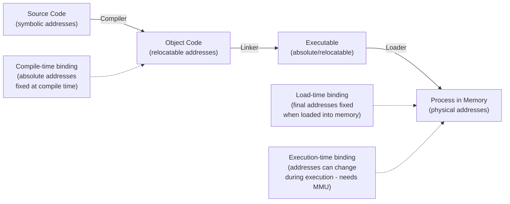
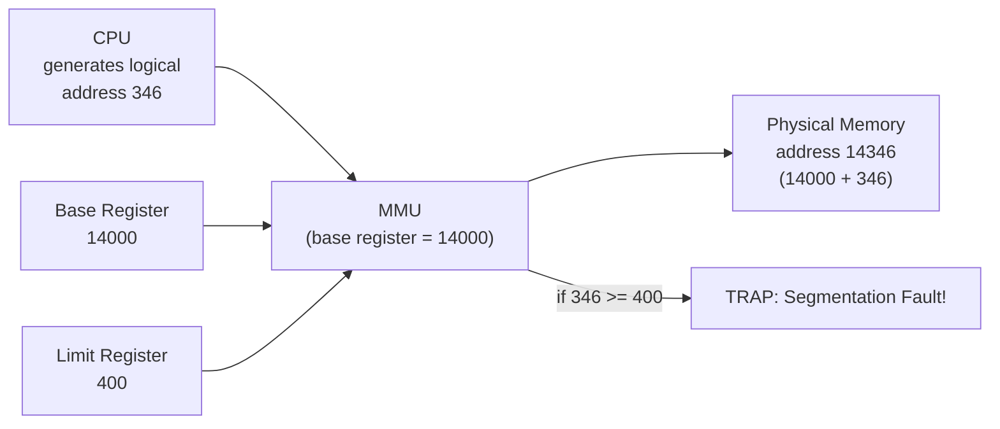
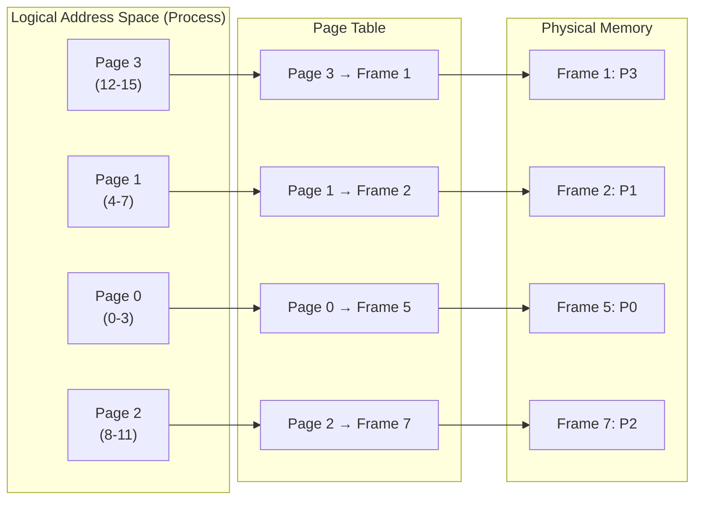
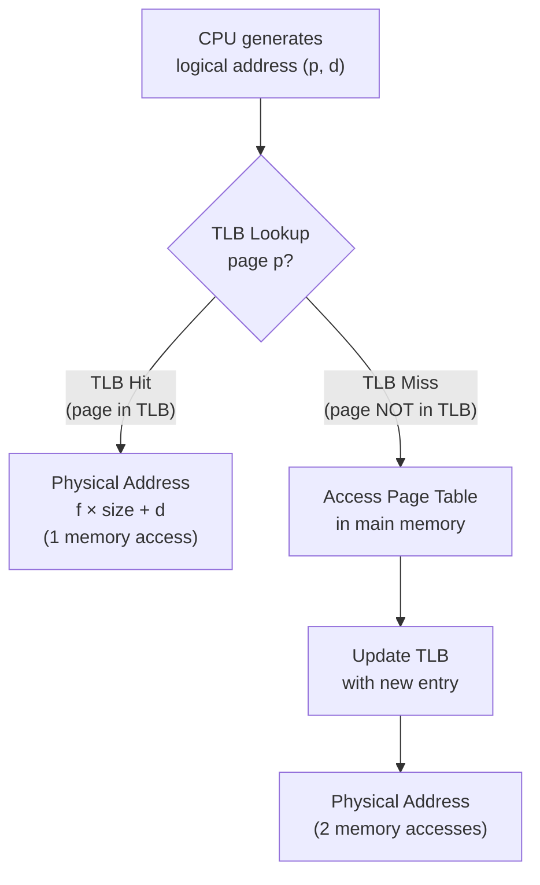
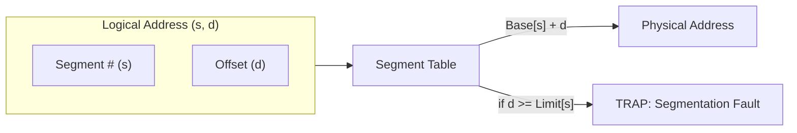
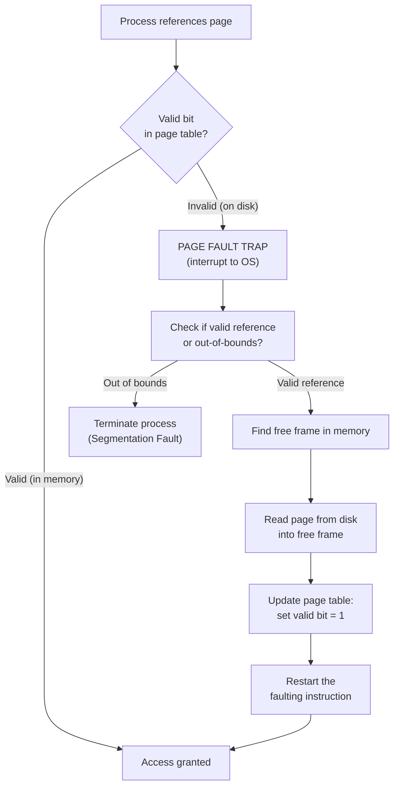
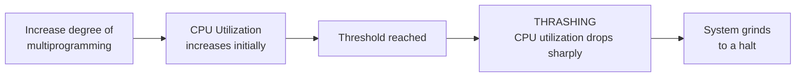

[[00-Dashboard/Home|Home]] | [[01-Semester-V/Semester-V-Dashboard|Semester V]] | [[Overview]] | [[Syllabus]] | [[Unit-1]] | [[Unit-2]] | [[Unit-3]] | [[Unit-4]] | [[Unit-5]] | [[Important-Questions|Imp. Qs]] | [[Revision]] | [[Interview-Prep]]


# Unit 3 - Memory Management
> [!important] **Hours:** 8 | **Subject:** CS-302-MJ-T Operating Systems | **Semester:** V
> **Previous:** [[Unit-2|Unit 2: Process and CPU Scheduling]] | **Next:** [[Unit-4|Unit 4: Deadlock]]

---

## Learning Objectives

- Explain address binding and the role of the MMU
- Distinguish logical and physical addresses
- Describe contiguous memory allocation and fragmentation
- Explain paging with page tables and TLB
- Describe segmentation and its advantages
- Explain virtual memory with demand paging
- Apply and compare page replacement algorithms (FIFO, OPT, LRU, MFU)
- Understand thrashing and working set model

---

## 3.1 Address Binding

> [!note] Definition
> ==Address binding== is the process of **mapping program instructions and data to physical memory addresses**. It can occur at different stages:



| Binding Time | When | Description | Example |
|-------------|------|-------------|---------|
| **Compile-time** | During compilation | Absolute addresses fixed at compile time. Can only run at that specific address | `.com` files |
| **Load-time** | When loaded into memory | Relative addresses resolved at load time. Address fixed until unloaded | Early C programs |
| **Execution-time** | During runtime | Addresses translated dynamically by hardware (MMU). Process can be moved in memory | Modern OS |

---

## 3.2 Memory Management Unit (MMU)

> [!note] MMU
> The ==Memory Management Unit== (MMU) is a **hardware device** that translates ==logical addresses== (generated by CPU) to ==physical addresses== (actual RAM addresses) at runtime.



- **Relocation Register (Base):** Added to every logical address → physical address
- **Limit Register:** Ensures process doesn't access memory outside its bounds
- **Logical address:** Generated by CPU (also called virtual address)
- **Physical address:** Actual location in RAM

---

## 3.3 Logical vs Physical Address Space

| Feature | Logical Address | Physical Address |
|---------|----------------|-----------------|
| Also called | Virtual address | Real address |
| Generated by | CPU during instruction execution | MMU translates logical to physical |
| Range | 0 to max (process's virtual space) | 0 to RAM size |
| Visible to | Programs / users | Hardware only |
| Compile-time binding | Logical = Physical | Same |
| Run-time binding | Logical ≠ Physical | Different |

---

## 3.4 Contiguous Memory Allocation

### Partitioning

**Fixed (Static) Partitioning:**
- Memory divided into fixed-size partitions
- Simple, but causes **internal fragmentation** (unused space within partition)

**Dynamic (Variable) Partitioning:**
- Partitions created dynamically based on process size
- Causes **external fragmentation** (free space scattered in small pieces)

### Fragmentation

| Type | Description | Solution |
|------|-------------|---------|
| **Internal Fragmentation** | Allocated memory > process needs (unused space inside block) | Use smaller partitions |
| **External Fragmentation** | Enough total free memory but not contiguous | Compaction, paging |

**Compaction:** Move all processes to one end, free space to other end.
- Requires **dynamic relocation** support
- Time-consuming, not always possible

### Fit Algorithms

| Algorithm | Description | Advantage | Disadvantage |
|-----------|-------------|-----------|-------------|
| **First Fit** | Allocate first hole big enough | Fast | External fragmentation at start |
| **Best Fit** | Allocate smallest hole that fits | Less wasted space | Slow, creates tiny holes |
| **Worst Fit** | Allocate largest hole | Leftover large enough for others | Slow, wastes large holes |

---

## 3.5 Paging

> [!note] Paging
> ==Paging== is a memory management scheme that **eliminates external fragmentation** by dividing both **logical memory** into fixed-size **pages** and **physical memory** into same-size **frames**.



### Address Translation in Paging

Given:
- **Logical address** = `p` (page number) + `d` (page offset)
- **Page size** = 2ⁿ bytes → offset takes n bits; page number takes remaining bits

```
Logical Address = [Page Number (p) | Page Offset (d)]
Physical Address = [Frame Number (f) | Page Offset (d)]

f = page_table[p]
Physical Address = f × page_size + d
```

#### Paging Example

**Given:** Page size = 4 bytes, Physical memory = 32 bytes (8 frames)
**Logical address:** 12 (binary: 1100)
- Page number p = 12 / 4 = 3, Offset d = 12 % 4 = 0
- Frame number from page table: page_table[3] = Frame 1
- Physical address = 1 × 4 + 0 = **4**

### Page Table Structure

| Field | Description |
|-------|-------------|
| **Frame Number** | Which physical frame this page maps to |
| **Valid bit (V)** | 1=page in memory, 0=page not in memory (triggers page fault) |
| **Dirty bit (M)** | 1=page modified, needs to be written back before replacement |
| **Reference bit (R)** | 1=recently accessed (used by LRU approximation) |
| **Protection bits** | Read/Write/Execute permissions |

### Advantages and Disadvantages of Paging

| Advantages | Disadvantages |
|------------|--------------|
| No external fragmentation | Internal fragmentation (last page may be partial) |
| Pages can be anywhere in physical memory | Extra memory for page tables |
| Enables virtual memory | Two memory accesses (page table + actual data) |
| Simple allocation (any free frame) | TLB needed for performance |

---

## 3.6 Translation Lookaside Buffer (TLB)

> [!note] TLB
> The ==TLB== (Translation Lookaside Buffer) is a **high-speed cache** for recent page table entries. It avoids going to main memory for every address translation.



### Effective Memory Access Time (EAT)

```
EAT = hit_ratio × (TLB_time + memory_time) + (1 - hit_ratio) × (TLB_time + 2 × memory_time)
```

**Example:**
- TLB access time = 20ns, Memory access time = 100ns, Hit ratio = 80% (0.8)
- EAT = 0.8 × (20 + 100) + 0.2 × (20 + 100 + 100)
- EAT = 0.8 × 120 + 0.2 × 220 = 96 + 44 = **140ns**

---

## 3.7 Segmentation

> [!note] Segmentation
> ==Segmentation== divides a program into **variable-sized segments** based on **logical units** (code segment, data segment, stack, heap). Each segment has a **base** and **limit**.



**Segment Table Entry:**
- **Base:** Starting physical address of the segment
- **Limit:** Length of the segment (size)

| Feature | Paging | Segmentation |
|---------|--------|-------------|
| Division unit | Fixed size pages | Variable size segments |
| Fragmentation | Internal | External |
| User visibility | Hidden from user | User-visible (code, data, stack) |
| Protection | Per-page | Per-segment |
| Sharing | Page sharing | Segment sharing |

---

## 3.8 Virtual Memory

> [!note] Virtual Memory
> ==Virtual memory== is a technique that allows execution of processes that may **not be completely in physical memory**. It gives the illusion of a very large address space to each process.

**Key idea:** Load only the **parts of program currently needed** into memory; rest stays on disk (swap space).

### Demand Paging

> [!note] Demand Paging
> ==Demand Paging== loads pages into memory **only when they are needed** (on demand), rather than loading the entire process at once.

- **Valid-Invalid bit:** Valid (V) = page in memory; Invalid (I) = page on disk
- When process accesses a page with Invalid bit → **Page Fault** occurs

### Page Fault Handling



> [!warning] Page Fault Cost
> A page fault is very expensive! Typical times:
> - Memory access: ~100ns
> - Disk access: ~10ms (100,000× slower!)
> 
> Must minimize page fault rate for good performance.

---

## 3.9 Page Replacement Algorithms

When a page fault occurs and **no free frames** are available, the OS must **replace** an existing page. Which one?

### Algorithm 1: FIFO (First-In, First-Out)

> Replace the **oldest** page in memory (the one that has been there longest).

**Problem:** ==Belady's Anomaly== - increasing number of frames can **increase** page faults (counter-intuitive!).

#### FIFO Example

**Reference String:** 1, 2, 3, 4, 1, 2, 5, 1, 2, 3, 4, 5
**Number of Frames:** 3

| Ref | Frame 1 | Frame 2 | Frame 3 | Page Fault? |
|-----|---------|---------|---------|------------|
| 1 | **1** | - | - |  Miss |
| 2 | 1 | **2** | - |  Miss |
| 3 | 1 | 2 | **3** |  Miss |
| 4 | **4** | 2 | 3 |  Miss (replace 1, oldest) |
| 1 | 4 | **1** | 3 |  Miss (replace 2, oldest) |
| 2 | 4 | 1 | **2** |  Miss (replace 3, oldest) |
| 5 | **5** | 1 | 2 |  Miss (replace 4, oldest) |
| 1 | 5 | 1 | 2 |  Hit |
| 2 | 5 | 1 | 2 |  Hit |
| 3 | 5 | **3** | 2 |  Miss (replace 1, oldest) |
| 4 | 5 | 3 | **4** |  Miss (replace 2, oldest) |
| 5 | 5 | 3 | 4 |  Hit |

**Total Page Faults: 9**

---

### Algorithm 2: Optimal (OPT / MIN)

> Replace the page that **will not be used for the longest time** in the future.

- **Theoretically optimal** - lowest possible page faults
- **Not implementable** in practice (requires future knowledge)
- Used as a **benchmark** to compare other algorithms

#### OPT Example

**Reference String:** 1, 2, 3, 4, 1, 2, 5, 1, 2, 3, 4, 5 | **Frames:** 3

| Ref | Frames | Replacement | Page Fault? |
|-----|--------|-------------|------------|
| 1 | {1} | - |  Miss |
| 2 | {1,2} | - |  Miss |
| 3 | {1,2,3} | - |  Miss |
| 4 | {1,2,4} | Replace 3 (used farthest: 3→pos10) |  Miss |
| 1 | {1,2,4} | - |  Hit |
| 2 | {1,2,4} | - |  Hit |
| 5 | {1,2,5} | Replace 4 (used farthest: 4→pos10) |  Miss |
| 1 | {1,2,5} | - |  Hit |
| 2 | {1,2,5} | - |  Hit |
| 3 | {1,2,3} | Replace 5 (used farthest: 5→pos11) |  Miss |
| 4 | {4,2,3} | Replace 1 (not used again!) |  Miss |
| 5 | {4,5,3} | Replace 2 (not used again!) |  Miss |

**Total Page Faults: 8** (optimal for this reference string)

---

### Algorithm 3: LRU (Least Recently Used)

> Replace the page that **has not been used for the longest time** (looks into the past).

- Good approximation of OPT (uses past as predictor of future)
- No Belady's anomaly
- Implementation: **Stack** or **Counter** method

#### LRU Example

**Reference String:** 7, 0, 1, 2, 0, 3, 0, 4, 2, 3, 0, 3, 2 | **Frames:** 3

| Ref | LRU Stack (MRU→LRU) | Fault? |
|-----|---------------------|--------|
| 7 | [7] |  |
| 0 | [0, 7] |  |
| 1 | [1, 0, 7] |  |
| 2 | [2, 1, 0] |  (replace 7 - LRU) |
| 0 | [0, 2, 1] |  Hit (0 moved to top) |
| 3 | [3, 0, 2] |  (replace 1 - LRU) |
| 0 | [0, 3, 2] |  Hit |
| 4 | [4, 0, 3] |  (replace 2 - LRU) |
| 2 | [2, 4, 0] |  (replace 3 - LRU) |
| 3 | [3, 2, 4] |  (replace 0 - LRU) |
| 0 | [0, 3, 2] |  (replace 4 - LRU) |
| 3 | [3, 0, 2] |  Hit |
| 2 | [2, 3, 0] |  Hit |

**Total Page Faults: 8**

---

### Algorithm 4: MFU (Most Frequently Used)

> Replace the page with the **highest use count** (the assumption: it's already been used enough, others need to be used).

- Rarely used in practice; somewhat counterintuitive
- **LFU (Least Frequently Used)** is the opposite and more common - replace page used least often

---

### Algorithm Comparison

| Algorithm | Optimal? | Belady's Anomaly | Implementable? | Performance |
|-----------|----------|-----------------|---------------|-------------|
| FIFO | No | YES  | Yes (easy) | Poor |
| OPT | YES  | No | No (needs future) | Best (theoretical) |
| LRU | No | No | Complex | Good |
| MFU/LFU | No | No | Yes | Moderate |

---

## 3.10 Thrashing

> [!note] Thrashing
> ==Thrashing== occurs when a process spends **more time paging** (swapping pages in and out of disk) than doing **actual computation**. Severely degrades system performance.

**Cause:** Process has too few frames; every few instructions cause a page fault.



### Solutions to Thrashing

| Solution | Description |
|----------|-------------|
| **Working Set Model** | Give each process enough frames for its **working set** (pages used in last Δ references) |
| **Page Fault Frequency** | If fault rate too high → add frames; if too low → remove frames |
| **Swapping** | Swap out some processes entirely to reduce multiprogramming degree |

---

## Key Definitions

| Term | Definition |
|------|------------|
| **Logical Address** | Virtual address generated by CPU |
| **Physical Address** | Actual RAM address after MMU translation |
| **Page** | Fixed-size block of logical memory |
| **Frame** | Fixed-size block of physical memory |
| **Page Fault** | Access to a page not currently in physical memory |
| **TLB** | Cache for recent page table entries to speed up address translation |
| **Demand Paging** | Load pages only when accessed |
| **Thrashing** | Excessive paging, CPU spends most time on I/O instead of execution |
| **Belady's Anomaly** | FIFO anomaly: more frames → more page faults |
| **Working Set** | Set of pages a process uses in a recent window of time |
| **Internal Fragmentation** | Wasted space inside an allocated memory block |
| **External Fragmentation** | Enough total free memory but not contiguous |

---

## Interview Questions

1. **What is the difference between logical and physical address?**
   - Logical: generated by CPU (virtual); Physical: actual RAM address after MMU translation.

2. **What is the need for virtual memory?**
   - Run programs larger than physical RAM; improve multiprogramming; give each process illusion of large private address space; allow sharing, lazy loading.

3. **What is a page fault? How is it handled?**
   - Access to a page not in physical memory. OS finds free frame, loads page from disk, updates page table, restarts instruction.

4. **What is Belady's Anomaly?**
   - In FIFO page replacement, adding more frames can sometimes **increase** page faults. Does not occur in OPT or LRU (stack algorithms).

5. **Compare paging and segmentation.**
   - Paging: fixed size, no external fragmentation, transparent to user; Segmentation: variable size, logical units, user-visible, external fragmentation.

6. **What is the TLB? Why is it needed?**
   - Translation Lookaside Buffer - cache for page table entries. Without it, every memory access requires 2 memory accesses (page table + data). TLB reduces to ~1 access on hit.

7. **What is thrashing? How can it be prevented?**
   - Excessive page faults, CPU spends most time doing I/O. Solutions: Working set model, page fault frequency, reduce multiprogramming degree.

8. **Which page replacement algorithm is optimal and why can't it be implemented?**
   - OPT (Optimal) - requires knowledge of future page accesses, which is not available in practice.

9. **What is the working set model?**
   - Keep in memory all pages a process uses in the most recent Δ (window) references. This is the process's working set. Prevents thrashing by ensuring processes have enough frames.

10. **What is internal vs external fragmentation?**
    - Internal: wasted space inside allocated block (paging). External: wasted space between blocks (segmentation, variable partitioning).

---

## Revision Summary

> [!note] Quick Revision - Unit 3
> 
> **Address Binding:** Compile-time, Load-time, Execution-time (MMU needed for last)
> 
> **MMU:** Hardware translates logical → physical; base+limit registers protect processes
> 
> **Paging:** Fixed-size pages/frames; eliminates external fragmentation; page table maps page→frame; TLB caches recent translations
> 
> **EAT = α(t_TLB + t_mem) + (1-α)(t_TLB + 2×t_mem)** where α = TLB hit ratio
> 
> **Segmentation:** Variable-size logical segments; base+limit per segment; external fragmentation
> 
> **Virtual Memory:** Only needed pages in RAM; demand paging on page fault
> 
> **Page Replacement:** FIFO (Belady's anomaly ), OPT (best, not practical), LRU (good, complex), MFU
> 
> **Thrashing:** Too many page faults; solution: working set model, page fault frequency

---

## Navigation

| Previous | Current | Next |
|----------|---------|------|
| [[Unit-2|Unit 2: Process and CPU Scheduling]] | **Unit 3: Memory Management** | [[Unit-4|Unit 4: Deadlock]] |
