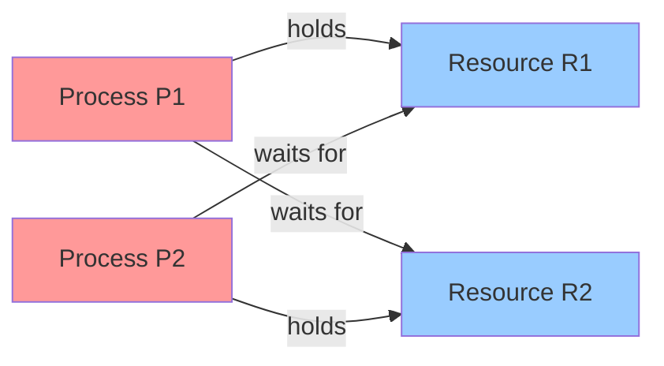
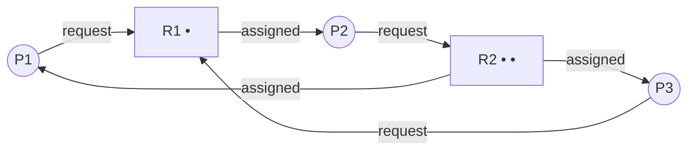
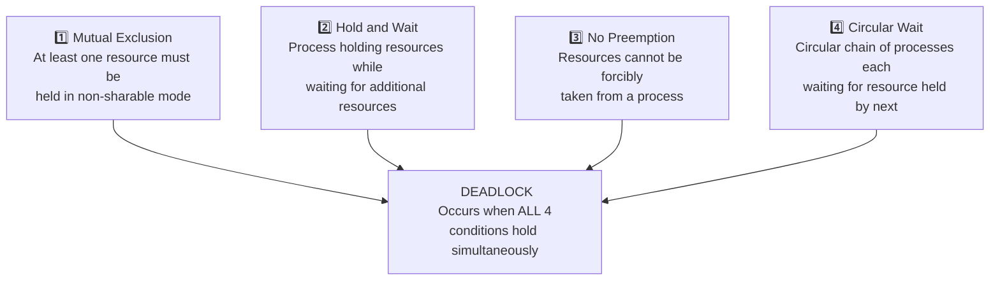
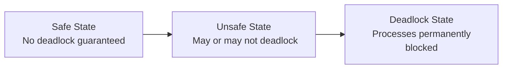

# Unit 4 - Deadlock
> [!important] **Hours:** 7 | **Subject:** CS-302-MJ-T Operating Systems | **Semester:** V
> **Previous:** [[Unit-3|Unit 3: Memory Management]] | **Next:** [[Unit-5|Unit 5: File System and Disk Scheduling]]

---

##  Learning Objectives

- Define deadlock and understand the system model
- Draw and analyze Resource Allocation Graphs (RAG)
- State and explain the four necessary conditions for deadlock
- Apply deadlock prevention strategies
- Use the Banker's Algorithm for deadlock avoidance
- Implement deadlock detection and recovery mechanisms

---

## 4.1 Deadlock - Definition

> [!note] Definition
> ==Deadlock== is a situation where a **set of processes** are **blocked** because each process is **holding a resource** and **waiting for another resource** held by another process in the set.



**Example:** P1 holds Printer, wants Scanner. P2 holds Scanner, wants Printer. Both wait forever → **Deadlock!**

### System Model

- System has resources: R₁, R₂, ..., Rₘ (CPU, memory, I/O devices, files)
- Each resource Rᵢ has Wᵢ instances
- Process lifecycle for a resource: **Request → Use → Release**

| Resource Type | Description |
|-------------|-------------|
| **Preemptable** | Can be taken away without harm (CPU, memory) |
| **Non-preemptable** | Cannot be taken without causing failure (printer, tape) |

> [!important]
> Deadlocks arise only with **non-preemptable resources**! If a resource can be preempted, the OS can forcibly take it back.

---

## 4.2 Resource Allocation Graph (RAG)

> [!note] RAG
> A ==Resource Allocation Graph== (RAG) is a directed graph used to **visualize deadlock situations**.

### RAG Elements

| Symbol | Meaning |
|--------|---------|
| Circle ○ | Process (Pi) |
| Rectangle □ | Resource type (Ri) |
| Dot • inside rectangle | Instance of resource |
| Arrow → from P to R | **Request edge** (P wants R) |
| Arrow → from R to P | **Assignment edge** (R is held by P) |



### RAG Rules for Deadlock Detection

| Condition | Deadlock? |
|-----------|----------|
| No cycle in RAG | Definitely **NO deadlock** |
| Cycle in RAG, single instance per resource | Definitely **YES deadlock** |
| Cycle in RAG, multiple instances per resource | **MAYBE deadlock** (need further analysis) |

---

## 4.3 Necessary Conditions for Deadlock

> [!important] All FOUR conditions must hold simultaneously for deadlock to occur



| Condition | Description | Example |
|-----------|-------------|---------|
| **Mutual Exclusion** | Resource used by only one process at a time | Printer used by only P1 |
| **Hold and Wait** | Process holds at least one resource AND waits for more | P1 holds Printer, waits for Scanner |
| **No Preemption** | Resources only released voluntarily | OS can't force P1 to release Printer |
| **Circular Wait** | P1 → P2 → P3 → P1 (cyclic chain of waiting) | P1 waits for P2's resource, P2 waits for P3's, P3 waits for P1's |

> [!tip] Memory Trick
> **"MH-NP-CW"** or **"My Host Never Pays Credit-card Woes"** - Mutual exclusion, Hold & Wait, No Preemption, Circular Wait

---

## 4.4 Deadlock Prevention

> [!note] Prevention
> ==Deadlock prevention== ensures that **at least one** of the four necessary conditions **never holds**. This is done at system design time.

| Condition to Negate | Method | Limitation |
|---------------------|--------|------------|
| **Negate Mutual Exclusion** | Make resources sharable (read-only files) | Not possible for all resources (printers) |
| **Negate Hold and Wait** | Process requests ALL resources before starting; or release all before requesting new | Low resource utilization; starvation |
| **Allow Preemption** | If process requests unavailable resource, release all its current resources | Only for resources whose state can be saved (CPU, memory). Not for printers! |
| **Negate Circular Wait** | Impose total ordering on resource types; always request in increasing order | May be unnecessary locks, inconvenient to program |

### Negating Hold and Wait - Methods

**Method 1:** Process requests all needed resources at once before execution
- **Problem:** May hold resources it won't need for a long time → waste

**Method 2:** Process may request resources only when it holds none. Must release all, then re-request.
- **Problem:** Starvation if a process needs many popular resources

### Negating Circular Wait - Resource Ordering

```
Assign unique number to each resource type:
R1 = 1 (Tape Drive)
R2 = 2 (Disk Drive)  
R3 = 3 (Printer)

Rule: Process can only request resource Rj if it currently holds resources Ri where i < j.
If process needs Ri after Rj (i < j), it must release Rj first.

Result: Circular wait is impossible!
(Can't have Pi waiting for Pj while Pj waits for Pi if ordering is strict)
```

---

## 4.5 Deadlock Avoidance

> [!note] Avoidance
> ==Deadlock avoidance== allows processes to request resources dynamically, but the OS **decides at runtime** whether to grant a request based on whether it leads to a **safe state**.

### Safe State

> [!important] Safe State Definition
> A state is ==safe== if there exists a **safe sequence** of processes P₁, P₂, ..., Pₙ such that for each Pᵢ, the resources that Pᵢ still needs can be satisfied by the currently available resources + resources held by Pⱼ (j < i).

```
Safe State → Process can get its remaining resources eventually
Unsafe State → Does NOT mean deadlock, but MIGHT lead to deadlock
```



---

## 4.6 Banker's Algorithm

> [!note] Banker's Algorithm
> The ==Banker's Algorithm== (by Dijkstra) is a deadlock avoidance algorithm for systems with **multiple resource types** and **multiple instances**. It mimics a banker who only grants loans (resources) if a safe state is maintained.

### Data Structures

Given: **n** processes, **m** resource types

| Matrix/Vector | Size | Description |
|---------------|------|-------------|
| **Available** [m] | m | Available[j] = number of available instances of Rj |
| **Max** [n×m] | n×m | Max[i][j] = max demand of process Pi for Rj |
| **Allocation** [n×m] | n×m | Allocation[i][j] = currently allocated to Pi |
| **Need** [n×m] | n×m | Need[i][j] = Max[i][j] - Allocation[i][j] (remaining need) |

> [!important] Key Relation
> **Need[i][j] = Max[i][j] - Allocation[i][j]**

### Safety Algorithm (Is current state safe?)

```
1. Initialize:
   Work[m] = Available[]  (copy of available resources)
   Finish[n] = {false, false, ..., false}  (all processes unfinished)

2. Find an i such that:
   - Finish[i] = false  (process not finished)
   - Need[i] ≤ Work     (process's need can be satisfied)
   (i.e., Need[i][j] ≤ Work[j] for all j)

3. If such i found:
   Work = Work + Allocation[i]  (Pi finishes, releases resources)
   Finish[i] = true
   Go to Step 2

4. If all Finish[i] = true → SAFE STATE (found safe sequence)
   If no such i in Step 2 → UNSAFE STATE
```

### Resource-Request Algorithm (Grant or Deny?)

```
When Process Pi makes request Request_i[m]:

1. If Request_i ≤ Need[i]:
   Continue (valid request)
   Else: ERROR (requested more than declared max)

2. If Request_i ≤ Available:
   Continue (resources available)
   Else: Pi must WAIT (resources not available)

3. Tentatively allocate:
   Available = Available - Request_i
   Allocation[i] = Allocation[i] + Request_i
   Need[i] = Need[i] - Request_i

4. Run Safety Algorithm:
   If SAFE → Grant the request (keep changes)
   If UNSAFE → Deny request, restore previous state, Pi waits
```

###  Banker's Algorithm Example

**System: 5 Processes (P0-P4), 3 Resource Types (A, B, C)**
**Total Resources: A=10, B=5, C=7**

**Current State:**

| Process | Allocation (A,B,C) | Max (A,B,C) | Need (A,B,C) |
|---------|-------------------|-------------|--------------|
| P0 | 0, 1, 0 | 7, 5, 3 | **7, 4, 3** |
| P1 | 2, 0, 0 | 3, 2, 2 | **1, 2, 2** |
| P2 | 3, 0, 2 | 9, 0, 2 | **6, 0, 0** |
| P3 | 2, 1, 1 | 2, 2, 2 | **0, 1, 1** |
| P4 | 0, 0, 2 | 4, 3, 3 | **4, 3, 1** |

**Total Allocated:** A = 0+2+3+2+0 = 7, B = 1+0+0+1+0 = 2, C = 0+0+2+1+2 = 5
**Available:** A = 10-7 = **3**, B = 5-2 = **3**, C = 7-5 = **2** → Available = [3, 3, 2]

**Safety Algorithm Trace:**

| Step | Work (A,B,C) | Check Process | Need ≤ Work? | Finish |
|------|-------------|---------------|--------------|--------|
| 0 | [3,3,2] | P1: Need=[1,2,2] | 1≤3, 2≤3, 2≤2  | P1 done; Work=[3+2,3+0,2+0]=[5,3,2] |
| 1 | [5,3,2] | P3: Need=[0,1,1] | 0≤5, 1≤3, 1≤2  | P3 done; Work=[5+2,3+1,2+1]=[7,4,3] |
| 2 | [7,4,3] | P4: Need=[4,3,1] | 4≤7, 3≤4, 1≤3  | P4 done; Work=[7+0,4+0,3+2]=[7,4,5] |
| 3 | [7,4,5] | P0: Need=[7,4,3] | 7≤7, 4≤4, 3≤5  | P0 done; Work=[7+0,4+1,5+0]=[7,5,5] |
| 4 | [7,5,5] | P2: Need=[6,0,0] | 6≤7, 0≤5, 0≤5  | P2 done |

**Safe Sequence: P1 → P3 → P4 → P0 → P2**  SAFE STATE!

---

**Resource Request Example:** P1 requests [1,0,2]

1. Request[1,0,2] ≤ Need[1]=[1,2,2]? → Yes 
2. Request[1,0,2] ≤ Available=[3,3,2]? → Yes 
3. Tentatively allocate:
   - Available = [3-1, 3-0, 2-2] = [2, 3, 0]
   - Allocation[P1] = [2+1, 0+0, 0+2] = [3, 0, 2]
   - Need[P1] = [1-1, 2-0, 2-2] = [0, 2, 0]
4. Run safety check → if safe, grant!

---

## 4.7 Deadlock Detection

> [!note] Detection
> Instead of preventing or avoiding deadlock, the OS **allows deadlock to occur**, then **detects** it using an algorithm, and **recovers** from it.

### Single Instance Resources - RAG Reduction

For single instance: Check for **cycles in the RAG**. Cycle = Deadlock.

### Multiple Instance Resources - Detection Algorithm

Similar to Banker's Safety Algorithm, but uses **Allocation** instead of Max/Need:

```
Available_work = Available
For each process Pi not requesting resources: Finish[i] = true; else false

Find i with Finish[i]=false and Request_i ≤ Available_work
  → Available_work += Allocation[i]; Finish[i] = true; repeat

If any Finish[i] = false → those processes are DEADLOCKED
```

---

## 4.8 Deadlock Recovery

Once deadlock detected, recovery options:

### Option 1: Process Termination

| Method | Description |
|--------|-------------|
| **Abort all** deadlocked processes | Simple but costly (all work lost) |
| **Abort one process at a time** until deadlock broken | Less costly; must re-run detection after each termination |

**Selection criteria for victim:** Lowest priority, shortest execution, fewest resources held, most resources needed.

### Option 2: Resource Preemption

| Step | Action |
|------|--------|
| **Select victim** | Choose process to preempt (minimize cost) |
| **Rollback** | Return preempted process to safe state (requires checkpointing) |
| **Starvation prevention** | Ensure same process not always victim (include rollback count in cost factor) |

---

##  Key Definitions

| Term | Definition |
|------|------------|
| **Deadlock** | Circular waiting where each process holds a resource and waits for another |
| **RAG** | Resource Allocation Graph - directed graph showing resource-process relationships |
| **Safe State** | State where there exists a sequence in which all processes can complete |
| **Unsafe State** | No guarantee; may or may not lead to deadlock |
| **Banker's Algorithm** | Deadlock avoidance algorithm; grants resources only if safe state maintained |
| **Need Matrix** | Max - Allocation; what process still needs |
| **Safe Sequence** | Order of process completion that allows all to finish without deadlock |
| **Preemption** | Forcibly taking a resource from a process |
| **Starvation** | Process waits indefinitely; worse than deadlock (process still alive but never runs) |

---

##  Interview Questions

1. **What are the four necessary conditions for deadlock?**
   - Mutual Exclusion, Hold and Wait, No Preemption, Circular Wait - ALL must hold.

2. **What is the difference between deadlock prevention and avoidance?**
   - Prevention: Negates one condition permanently (design-time). Avoidance: Dynamically decides at runtime using algorithms like Banker's.

3. **What is a safe state? Why is it important?**
   - A state where a safe sequence exists - all processes can eventually finish. Banker's algorithm ensures system stays in safe state.

4. **Explain Banker's Algorithm.**
   - Uses Available, Max, Allocation, Need matrices. Before granting a request, tentatively allocates and runs safety algorithm. Grants only if safe state maintained.

5. **What is the formula for the Need matrix?**
   - **Need[i][j] = Max[i][j] - Allocation[i][j]**

6. **How does deadlock differ from starvation?**
   - Deadlock: Processes permanently blocked (waiting for each other). Starvation: Process indefinitely denied resources (others always get priority). In deadlock, processes hold resources. In starvation, process may never hold the needed resource.

7. **Why is deadlock detection + recovery sometimes preferred over prevention?**
   - Prevention may be too restrictive (poor resource utilization). Detection+recovery allows more flexibility; used when deadlocks are rare.

8. **What is Belady's Anomaly? (Different context from Unit 3)**
   - Not directly related to deadlock; it's a page replacement anomaly. For deadlock: Note that unsafe state ≠ deadlock.

9. **Give a real-world example of deadlock.**
   - Traffic deadlock: 4 cars at a 4-way intersection, each waiting for the car to their right to move.
   - Database: Two transactions each locking a row and waiting for the other's locked row.

10. **What is the role of the RAG in deadlock analysis?**
    - Visual tool: cycles in single-instance RAG = definite deadlock; cycles in multi-instance = possible deadlock (need further analysis).

---

##  Summary - Deadlock Handling Strategies

| Strategy | When Applied | Method | Cost |
|----------|-------------|--------|------|
| **Prevention** | Design time | Negate one condition | Over-restrictive |
| **Avoidance** | Runtime (per request) | Banker's Algorithm | Need advance info (max claim) |
| **Detection** | After deadlock occurs | RAG / Detection algorithm | Recovery overhead |
| **Ignore** | - | "Ostrich Algorithm" | Reboot when stuck |

---

##  Revision Summary

> [!note] Quick Revision - Unit 4
> 
> **Deadlock:** Circular waiting; each holds one, wants another
> 
> **4 Conditions (ALL needed):** Mutual Exclusion + Hold & Wait + No Preemption + Circular Wait
> 
> **RAG:** Circle=Process, Rectangle=Resource; Request→, ←Assignment; Cycle in single-instance RAG = Deadlock
> 
> **Prevention:** Negate any one condition (design-time)
> 
> **Avoidance:** Banker's Algorithm - grant request only if SAFE STATE maintained
> 
> **Banker's Matrices:** Available, Max, Allocation, **Need = Max - Allocation**
> 
> **Safety Algorithm:** Find process whose Need ≤ Work; run it; add allocation to Work; repeat
> 
> **Detection:** Allow deadlock, detect with algorithm, recover by terminating process or preempting resources

---

##  Navigation

| Previous | Current | Next |
|----------|---------|------|
| [[Unit-3\|Unit 3: Memory Management]] | **Unit 4: Deadlock** | [[Unit-5\|Unit 5: File System and Disk Scheduling]] |
