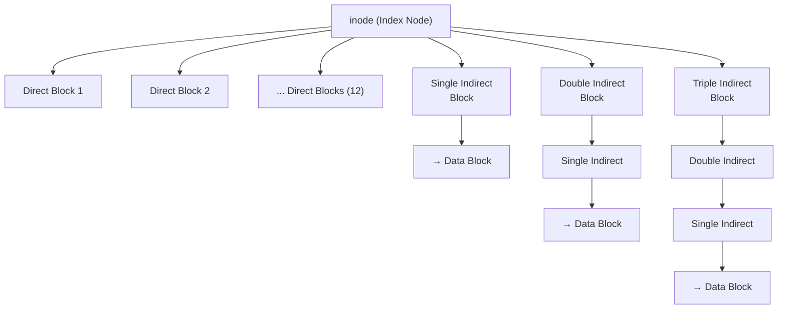
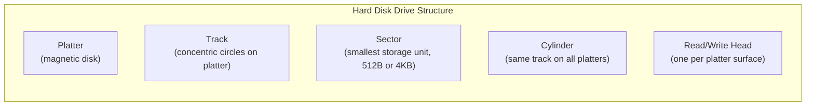

[[00-Dashboard/Home|Home]] | [[01-Semester-V/Semester-V-Dashboard|Semester V]] | [[Overview]] | [[Syllabus]] | [[Unit-1]] | [[Unit-2]] | [[Unit-3]] | [[Unit-4]] | [[Unit-5]] | [[Important-Questions|Imp. Qs]] | [[Revision]] | [[Interview-Prep]]


# Unit 5 - File System and Disk Scheduling
> [!important] **Hours:** 5 | **Subject:** CS-302-MJ-T Operating Systems | **Semester:** V
> **Previous:** [[Unit-4|Unit 4: Deadlock]] | **Next:** [[Important-Questions]]

---

## Learning Objectives

- Define files and describe their attributes and operations
- Understand directory structures
- Compare file allocation methods (Contiguous, Linked, Indexed)
- Explain free space management techniques
- Understand disk structure and terminology
- Apply disk scheduling algorithms and calculate total head movement
- Compare disk scheduling algorithms (FCFS, SSTF, SCAN, C-SCAN, LOOK, C-LOOK)

---

## 5.1 File Concept

> [!note] Definition
> A ==file== is a **named collection of related information** stored on secondary storage (disk). It is the smallest allotment of logical secondary storage.

### File Attributes (Metadata)

| Attribute | Description |
|-----------|-------------|
| **Name** | Human-readable name (e.g., `report.pdf`) |
| **Type** | Extension indicates type (.txt, .exe, .jpg) |
| **Identifier** | Unique tag in file system (inode number) |
| **Location** | Pointer to device and disk location |
| **Size** | Current file size (bytes, words, blocks) |
| **Protection** | Read/Write/Execute permissions for owner, group, others |
| **Time & Date** | Creation, last modified, last accessed timestamps |
| **User ID** | Owner of the file |

### File Types

| File Type | Extension | Description |
|-----------|-----------|-------------|
| **Executable** | `.exe`, `.out` | Machine code, can be run |
| **Source Code** | `.c`, `.java`, `.py` | Human-readable programs |
| **Text** | `.txt`, `.csv` | Plain text |
| **Document** | `.pdf`, `.docx` | Formatted documents |
| **Archive** | `.zip`, `.tar` | Compressed/bundled files |
| **Special** | - | Device files (Unix: `/dev/sda`) |

---

## 5.2 File Operations

The OS provides system calls for file operations:

| Operation | Description |
|-----------|-------------|
| **Create** | Allocate space, add directory entry |
| **Open** | Load file info into open-file table (returns file descriptor/handle) |
| **Read** | Read data from file at current position |
| **Write** | Write data to file at current position |
| **Seek (Reposition)** | Move file pointer to given offset |
| **Delete** | Remove directory entry, release disk space |
| **Truncate** | Keep file attributes but erase content (length→0) |
| **Append** | Add data to end of file |
| **Close** | Remove from open-file table, flush buffers |

### Open-File Table

| Per-System Table | Per-Process Table |
|-----------------|------------------|
| File-open count | File pointer position |
| Disk location | Access rights (read/write) |
| Access dates | |

---

## 5.3 Directory Structure

A ==directory== is a symbol table that maps file names to file control blocks (FCBs / inodes).

### 1. Single-Level Directory

```
 Root Directory
├── file1.txt
├── file2.txt
├── program.exe
└── photo.jpg
```

- All files in one directory
- Simple, but **naming conflicts** for multiple users
- No organization for many files

### 2. Two-Level Directory

```
 Root
├──  User1
│   ├── file1.txt
│   └── program.c
└──  User2
    ├── file1.txt    ← same name OK (different directory)
    └── data.txt
```

- Each user has their own directory
- No naming conflicts between users
- No grouping within a user's files

### 3. Tree-Structured Directory (Most Common)

```
 Root (/)
├──  home/
│   ├──  alice/
│   │   ├──  documents/
│   │   │   └── report.pdf
│   │   └── hello.java
│   └──  bob/
├──  usr/
│   ├──  bin/
│   └──  lib/
└──  etc/
```

- Hierarchical structure
- **Absolute path:** `/home/alice/documents/report.pdf`
- **Relative path:** `documents/report.pdf` (from `/home/alice/`)
- Used in UNIX/Linux, Windows

### 4. Acyclic Graph Directory

- Allows **shared files/directories** via links (shortcuts)
- Files can be in multiple directories
- **Hard link:** Both names point to same inode
- **Soft link (symlink):** Pointer to path name
- Problem: Dangling links if original deleted

### 5. General Graph Directory

- Allows **cycles** (directory can point to ancestor)
- Most flexible but requires garbage collection
- Traversal needs cycle detection

---

## 5.4 File Allocation Methods

> [!important] Key Question: How to allocate disk blocks to files?

### Method 1: Contiguous Allocation

> [!note] Contiguous Allocation
> Each file occupies a **set of contiguous (adjacent) blocks** on disk.

```
Disk: | ... | [A0][A1][A2][A3] | ... | [B0][B1][B2] | ... |
```

**Directory Entry:** `(file name, start block, length)`

| Advantages | Disadvantages |
|------------|--------------|
| Simple - just need start + length | **External fragmentation** |
| Fast sequential access | File size must be known at creation |
| Fast direct access (random) | **Growing files** difficult |
| Good for read-only files (CDs, DVDs) | |

> [!warning] External fragmentation over time makes it difficult to find contiguous space for new files.

---

### Method 2: Linked Allocation

> [!note] Linked Allocation
> Each file is a **linked list of disk blocks**. Each block contains a pointer to the next block.

```
File A:  Block 4 → Block 7 → Block 15 → Block 22 → NULL
         (data + next ptr) 
```

**Directory Entry:** `(file name, start block, end block)`

| Advantages | Disadvantages |
|------------|--------------|
| No external fragmentation | No random access (must follow chain) |
| Files can grow dynamically | **Pointer overhead** (4 bytes per block) |
| Simple to allocate (any free block) | **Reliability:** Corrupt pointer breaks chain |

#### FAT (File Allocation Table)

> [!note] FAT
> A variation of linked allocation where all pointers are stored in a **File Allocation Table** at the beginning of the disk (not in each block).

- Fast random access (scan FAT in memory)
- Used in **FAT12, FAT16, FAT32** (Windows, USB drives)
- FAT must be in memory for performance

---

### Method 3: Indexed Allocation

> [!note] Indexed Allocation
> Each file has its own **index block** containing pointers to all the file's disk blocks.

```
Index Block for File A:
┌──────────────┐
│ pointer 0 →  │ → Block 5 (data)
│ pointer 1 →  │ → Block 23 (data)
│ pointer 2 →  │ → Block 12 (data)
│ pointer 3 →  │ → Block 40 (data)
│ ...          │
└──────────────┘
```

**Directory Entry:** `(file name, index block number)`

| Advantages | Disadvantages |
|------------|--------------|
| Supports direct access (random) | Index block overhead |
| No external fragmentation | Small files waste index block space |
| Files can grow easily | Large files need multiple index blocks |

#### UNIX inode (Multi-level Index)



- 12 direct blocks, 1 single indirect, 1 double indirect, 1 triple indirect
- Can address very large files without external fragmentation

### Comparison

| Method | External Frag | Random Access | Growing Files | Sequential Access |
|--------|--------------|---------------|---------------|------------------|
| Contiguous | YES  | Fast  | Difficult  | Fast  |
| Linked | No  | Slow  | Easy  | OK |
| Indexed | No  | Fast  | Easy  | OK |

---

## 5.5 Free Space Management

> [!note] Free Space Management
> The OS must track which **disk blocks are free** (unallocated) for new file creation.

### Method 1: Bit Vector (Bitmap)

- One bit per block: **0 = free, 1 = allocated** (or vice versa)
- **Example:** 8 blocks: `01101001` → blocks 1,2,4,7 are free; 0,3,5,6 allocated

```
Block:  0  1  2  3  4  5  6  7
Bitmap: 1  0  0  1  0  1  1  0   (1=allocated, 0=free)
Free blocks: 1, 2, 4, 7
```

| Advantages | Disadvantages |
|------------|--------------|
| Simple to find contiguous free blocks | Entire bitmap must be in memory |
| Easy to find first free block | Overhead for large disks |

### Method 2: Linked List (Free List)

- All free blocks linked together using pointers
- Keep pointer to first free block
- No wasted space (pointers inside free blocks)

| Advantages | Disadvantages |
|------------|--------------|
| No wasted space for free list | Must traverse list to find contiguous blocks |
| Simple implementation | Not efficient for large allocations |

### Method 3: Grouping

- First free block stores addresses of n free blocks
- Last of those n blocks stores addresses of next n free blocks, etc.
- Quickly locate many free blocks

### Method 4: Counting

- Store **(start block, count)** - address of first free block + n consecutive free blocks following it
- More compact than linked list for sequential free space

---

## 5.6 Disk Structure



| Term | Description |
|------|-------------|
| **Platter** | Circular disk coated with magnetic material |
| **Track** | Concentric circles on a platter surface; numbered from outside (0) |
| **Sector** | Smallest unit of storage (512 bytes or 4KB per sector) |
| **Cylinder** | Set of all tracks at the same position across all platters |
| **Read/Write Head** | Reads/writes data; moves along disk surface |
| **Seek Time** | Time to move head to desired track (dominant cost) |
| **Rotational Latency** | Time for desired sector to rotate under head |
| **Transfer Time** | Time to actually transfer data |

> [!important] Total Access Time = Seek Time + Rotational Latency + Transfer Time
> 
> **Seek time is the most significant cost** - disk scheduling algorithms try to minimize it.

---

## 5.7 Disk Scheduling Algorithms

> [!note] Goal
> Minimize **total head movement** (total seek distance) to improve disk I/O performance.

### Example Setup

**Initial head position:** 53
**Request queue:** 98, 183, 37, 122, 14, 124, 65, 67
**Disk range:** 0 to 199

---

### Algorithm 1: FCFS (First-Come, First-Served)

> Service requests in the **order they arrive**.

```
Head moves: 53 → 98 → 183 → 37 → 122 → 14 → 124 → 65 → 67

Movement: |98-53|+|183-98|+|37-183|+|122-37|+|14-122|+|124-14|+|65-124|+|67-65|
= 45 + 85 + 146 + 85 + 108 + 110 + 59 + 2
= 640 cylinders total movement
```

**Advantage:** Simple, fair | **Disadvantage:** High total movement, no optimization

---

### Algorithm 2: SSTF (Shortest Seek Time First)

> Service the **closest request** to current head position next.

```
Initial: 53

From 53: Closest is 65 (diff=12)  → move to 65
From 65: Closest is 67 (diff=2)   → move to 67
From 67: Closest is 37 (diff=30)  → move to 37
From 37: Closest is 14 (diff=23)  → move to 14
From 14: Closest is 98 (diff=84)  → move to 98
From 98: Closest is 122 (diff=24) → move to 122
From 122: Closest is 124 (diff=2) → move to 124
From 124: Closest is 183 (diff=59)→ move to 183

Sequence: 53 → 65 → 67 → 37 → 14 → 98 → 122 → 124 → 183
Movement: 12+2+30+23+84+24+2+59 = 236 cylinders
```

**Advantage:** Much less movement than FCFS
**Disadvantage:** **Starvation** of requests far from current position

---

### Algorithm 3: SCAN (Elevator Algorithm)

> Head moves in one direction, services all requests, **reverses** at end.

```
Moving toward 0 first, then reverse:

From 53, moving toward 0:
53 → 37 → 14 → 0 (end, reverse direction) → 65 → 67 → 98 → 122 → 124 → 183

Movement: (53-0) + (183-0) = 53 + 183 = 236 cylinders
OR:
|53-37| + |37-14| + |14-0| + |0-65| + |65-67| + |67-98| + |98-122| + |122-124| + |124-183|
= 16+23+14+65+2+31+24+2+59 = 236
```

**Advantage:** No starvation | **Disadvantage:** Requests just passed must wait for full sweep

---

### Algorithm 4: C-SCAN (Circular SCAN)

> Like SCAN, but head moves in **one direction only**. After reaching end, **jumps back to beginning** and continues.

```
From 53, moving toward 199:
53 → 65 → 67 → 98 → 122 → 124 → 183 → 199 (end) → [jump to 0] → 14 → 37

Movement: |53 to 199| + |0 to 37| = 146 + 37 = 183 + jump
Total: (199-53) + (37-0) = 146 + 37 = 183 cylinders (not counting jump)
```

**Advantage:** More **uniform wait time** than SCAN | **Disadvantage:** Jump time (though usually negligible)

---

### Algorithm 5: LOOK

> Like SCAN, but head only goes **as far as last request** in each direction (doesn't go to disk end).

```
From 53, moving toward smaller:
53 → 37 → 14 (stop here, no more below) → reverse
→ 65 → 67 → 98 → 122 → 124 → 183

Movement: (53-14) + (183-14) = 39 + 169 = 208 cylinders
OR: 53→37→14 then 14→183
= 16+23+51+32+2+26+2+59 = wait... let me recalc:
= |53-37|+|37-14|+|14-65|+|65-67|+|67-98|+|98-122|+|122-124|+|124-183|
= 16+23+51+2+31+24+2+59 = 208 cylinders
```

**Advantage:** Better than SCAN (doesn't waste seeking to empty edges)

---

### Algorithm 6: C-LOOK (Circular LOOK)

> Like C-SCAN but goes only to last request, then **jumps to smallest request**:

```
From 53, moving outward: 53→65→67→98→122→124→183 (stop, jump to 14) →14→37
Movement: (183-53) + (37-14) = 130 + 23 = 153 cylinders (not counting jump)
```

---

### Comparison Table

| Algorithm | Total Movement | Fairness | Starvation | Complexity |
|-----------|---------------|---------|------------|-----------|
| FCFS | 640 | High | No | Very Low |
| SSTF | 236 | Low | **YES** | Low |
| SCAN | 236 | Medium | No | Medium |
| C-SCAN | 183 | High | No | Medium |
| LOOK | 208 | Medium | No | Medium |
| C-LOOK | 153 | High | No | Medium |

> [!tip] Best Choice: C-SCAN or C-LOOK
> For most systems, C-SCAN or C-LOOK provides the best balance of performance and fairness. SSTF can starve requests far from the current head position.

---

## Key Definitions

| Term | Definition |
|------|------------|
| **File** | Named collection of related information on secondary storage |
| **Directory** | Symbol table mapping file names to file control blocks |
| **Contiguous Allocation** | File occupies consecutive disk blocks |
| **Linked Allocation** | File stored as linked list of blocks |
| **Indexed Allocation** | Index block contains pointers to all file blocks |
| **inode** | Unix index node; stores file metadata + block pointers |
| **FAT** | File Allocation Table - table-based linked allocation |
| **Free Space Map/Bitmap** | Bit per block indicating free (0) or allocated (1) |
| **Seek Time** | Time for disk head to move to desired track |
| **Rotational Latency** | Time for sector to rotate under read/write head |
| **SSTF** | Shortest Seek Time First - services closest request next |
| **SCAN** | Elevator algorithm - sweeps in one direction, reverses |
| **C-SCAN** | Circular SCAN - one-way sweep, jumps to start |

---

## Interview Questions

1. **What are the different file allocation methods? Compare them.**
   - Contiguous: consecutive blocks, fast access, external fragmentation; Linked: linked list, no frag, no random access; Indexed: index block, fast + no frag, overhead.

2. **What is an inode?**
   - Index Node in UNIX: stores file metadata (permissions, size, timestamps) and pointers to data blocks (12 direct + single/double/triple indirect).

3. **What is FAT? How does it differ from standard linked allocation?**
   - FAT: All next-block pointers stored in a table at disk start. Allows O(1) random access (scan FAT in memory) vs standard linked allocation (must follow chain on disk).

4. **What is a bitmap in free space management?**
   - One bit per block; 0=free, 1=allocated. Easy to find free blocks with bit operations.

5. **Why does SSTF cause starvation?**
   - Requests far from current head position are always postponed as new closer requests keep arriving.

6. **Explain SCAN algorithm with an example.**
   - Head moves in one direction, services all requests, reverses at boundary (or last request for LOOK). Like an elevator - hence "Elevator Algorithm."

7. **What is the difference between SCAN and C-SCAN?**
   - SCAN: Reverses direction at end; requests near just-passed position wait for full sweep. C-SCAN: One direction only; jumps to beginning after reaching end; uniform wait time.

8. **What is the difference between SCAN and LOOK?**
   - SCAN goes to the physical end of disk (0 or 199) even if no requests there. LOOK goes only to the last request in each direction (more efficient).

9. **What are the components of disk access time?**
   - **Total = Seek Time + Rotational Latency + Transfer Time**. Seek time is usually dominant.

10. **What are file attributes?**
    - Name, Type, Location, Size, Protection (permissions), Time/Date stamps, User ID (owner).

---

## Revision Summary

> [!note] Quick Revision - Unit 5
> 
> **File Attributes:** Name, Type, Location, Size, Protection, Time, User ID
> 
> **Directory Types:** Single-level → Two-level → Tree (most used) → Acyclic Graph → General Graph
> 
> **File Allocation:**
> - Contiguous: start+length, fast but external fragmentation
> - Linked: pointers in blocks, no frag, no random access, FAT improves this
> - Indexed: index block of pointers, fast+no frag, UNIX inode
> 
> **Free Space:** Bitmap (simple), Linked list (no waste), Grouping, Counting
> 
> **Disk Terms:** Platter→Track→Sector, Seek+Rotational+Transfer = Total Access Time
> 
> **Disk Scheduling (by efficiency):**
> FCFS (fair, slow) < SSTF (fast, starvation) < SCAN < LOOK < C-SCAN < C-LOOK (best for uniform wait)

---

## Navigation

| Previous | Current | Next |
|----------|---------|------|
| [[Unit-4|Unit 4: Deadlock]] | **Unit 5: File System and Disk Scheduling** | [[Important-Questions|Important Questions]] |
