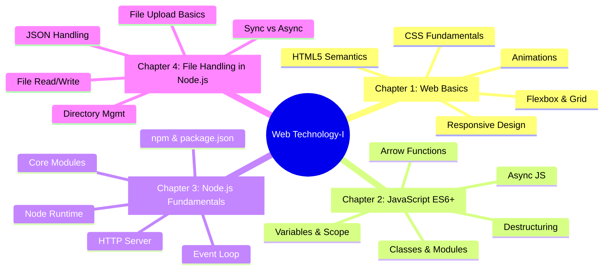
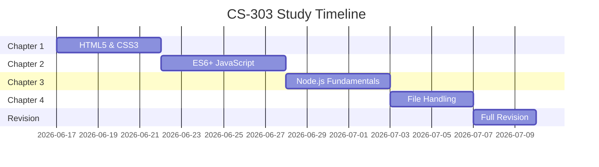

#  CS-303-MJ-T - Web Technology-I

> [!important] Subject at a Glance
> This subject bridges frontend web development with server-side JavaScript, covering HTML5/CSS3, ES6+ JavaScript, and Node.js fundamentals - skills required for full-stack web development.

---

##  Subject Information

| Field            | Details                          |
|------------------|----------------------------------|
| Subject Code     | CS-303-MJ-T                      |
| Subject Name     | Web Technology-I                 |
| Semester         | V (Third Year)                   |
| Type             | Major Theory                     |
| Total Chapters   | 4                                |
| Reference Books  | See [[Syllabus|CS-303 Syllabus]]          |

---

## ️ Chapter Overview

---

##  Unit Notes

| Unit | Topic | Notes | Status |
|------|-------|-------|--------|
| 1 | Web Basics - HTML5 & CSS3 | [[Unit-1]] |  |
| 2 | Advanced JavaScript ES6+ | [[Unit-2]] |  |
| 3 | Node.js Fundamentals | [[Unit-3]] |  |
| 4 | File Handling with Node.js | [[Unit-4]] |  |

---

##  Learning Objectives

By the end of this course, students will be able to:

- [ ] Build semantic, accessible HTML5 pages with modern CSS3
- [ ] Apply responsive design using Flexbox, Grid, and media queries
- [ ] Write modern JavaScript using ES6+ features
- [ ] Understand asynchronous JavaScript (callbacks, Promises, async/await)
- [ ] Set up and use Node.js with npm
- [ ] Understand the event loop and non-blocking I/O model
- [ ] Use core Node.js modules: `fs`, `path`, `http`
- [ ] Perform file operations (read, write, append, delete) synchronously and asynchronously
- [ ] Handle JSON data and manage directories with Node.js

---

##  Key Themes

> [!tip] The Full Stack Journey
> This subject takes you from **static HTML pages** → **dynamic client-side JS** → **server-side Node.js**, forming the foundation for full-stack development.

1. **Web Standards** - HTML5 semantic elements, CSS3 features, W3C specs
2. **Modern JavaScript** - ES6+ is the industry standard; arrow functions, destructuring, classes
3. **Asynchronous Programming** - Core to Node.js; callbacks → Promises → async/await
4. **Server-Side JavaScript** - Node.js runtime, non-blocking I/O, npm ecosystem
5. **File System Operations** - Reading, writing, managing files on the server

---

##  Study Plan

---

##  Quick Links

- [[Syllabus|CS-303 Syllabus]] - Full syllabus with reference books
- [[Unit-1]] - Web Basics: HTML5 & CSS3
- [[Unit-2]] - Advanced JavaScript ES6+
- [[Unit-3]] - Node.js Fundamentals
- [[Unit-4]] - File Handling with Node.js
- [[Important-Questions|CS-303 Important-Questions]] - Exam-focused Q&A
- [[Revision|CS-303 Revision]] - Quick revision notes
- [[Interview-Prep|CS-303 Interview-Prep]] - Interview preparation

---

##  Reference Books

| # | Book | Author |
|---|------|--------|
| 1 | HTML and CSS: Design and Build Websites | Jon Duckett |
| 2 | JavaScript and jQuery: Interactive Front-End Web Development | Jon Duckett |
| 3 | Eloquent JavaScript | Marijn Haverbeke |
| 4 | You Don't Know JS (Series) | Kyle Simpson |
| 5 | CSS: The Definitive Guide | Eric Meyer |
| 6 | Web Development with Node and Express | Ethan Brown |
| 7 | Practical Node.js | Azat Mardan |
| 8 | Learning Node.js Development | Andrew Mead |

---

*Last Updated: 2026-06-16 | Semester V | CS-303-MJ-T*
