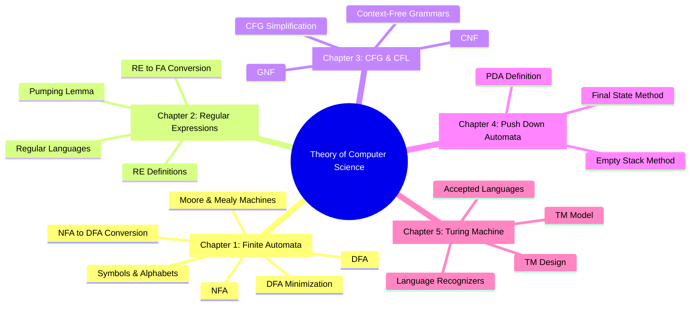
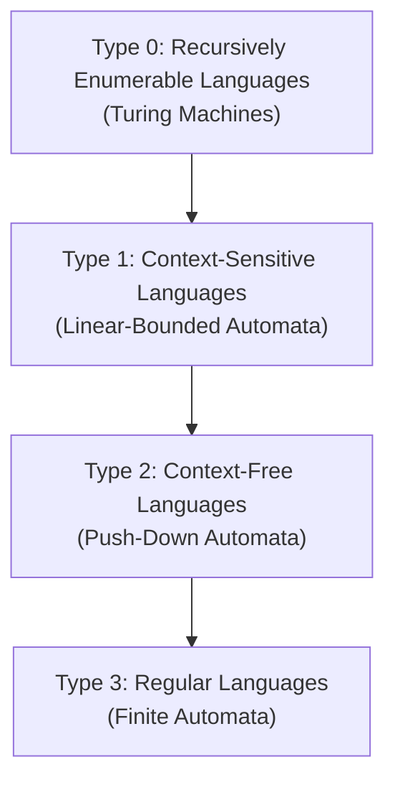
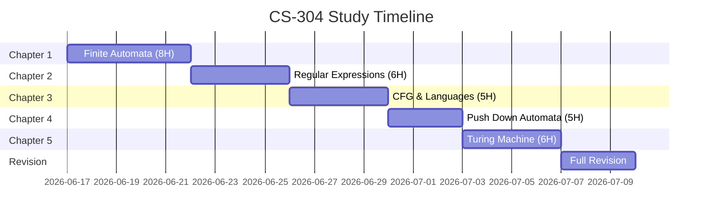

#  CS-304-MJ-T - Theory of Computer Science

> [!important] Subject at a Glance
> Theory of Computer Science (TOC / TCS) is the mathematical foundation of computing - studying what problems computers **can** and **cannot** solve, and how efficiently. It covers automata, formal languages, grammars, and Turing machines.

---

##  Subject Information

| Field           | Details                                  |
|-----------------|------------------------------------------|
| Subject Code    | CS-304-MJ-T                              |
| Subject Name    | Theory of Computer Science               |
| Semester        | V (Third Year)                           |
| Type            | Major Theory                             |
| Total Chapters  | 5                                        |
| Reference Books | See [[Syllabus|CS-304 Syllabus]]                  |

---

## ️ Chapter Overview

---

##  Unit Notes

| Unit | Topic | Hours | Notes | Status |
|------|-------|-------|-------|--------|
| 1 | Finite Automata | 8H | [[Unit-1]] |  |
| 2 | Regular Expressions & Languages | 6H | [[Unit-2]] |  |
| 3 | Context-Free Grammars & Languages | 5H | [[Unit-3]] |  |
| 4 | Push Down Automata | 5H | [[Unit-4]] |  |
| 5 | Turing Machine | 6H | [[Unit-5]] |  |

---

##  Learning Objectives

By the end of this course, students will be able to:

- [ ] Define and differentiate symbols, alphabets, strings, and languages
- [ ] Construct DFAs and NFAs for given languages
- [ ] Convert NFA to equivalent DFA
- [ ] Design and convert Moore and Mealy machines
- [ ] Minimize a DFA using the Table (Myhill-Nerode) method
- [ ] Write and interpret regular expressions
- [ ] Prove languages are non-regular using the Pumping Lemma
- [ ] Define context-free grammars and simplify them
- [ ] Convert CFGs to CNF and GNF
- [ ] Construct push-down automata using empty stack and final state methods
- [ ] Design Turing machines for language recognition

---

##  Chomsky Hierarchy - Big Picture

> [!note] The Chomsky Hierarchy
> All formal languages are classified in a hierarchy of expressive power:

| Type | Grammar | Automaton | Example |
|------|---------|-----------|---------|
| Type 3 | Regular | DFA / NFA | `aⁿbⁿ` - NO; `(ab)*` - YES |
| Type 2 | Context-Free | PDA | `aⁿbⁿ` - YES |
| Type 1 | Context-Sensitive | LBA | `aⁿbⁿcⁿ` - YES |
| Type 0 | Unrestricted | Turing Machine | Halting Problem - NO |

---

##  Quick Links

- [[Syllabus|CS-304 Syllabus]] - Full syllabus with reference books
- [[Unit-1]] - Finite Automata (DFA, NFA, Moore, Mealy)
- [[Unit-2]] - Regular Expressions & Pumping Lemma
- [[Unit-3]] - Context-Free Grammars & Languages
- [[Unit-4]] - Push Down Automata
- [[Unit-5]] - Turing Machine
- [[Important-Questions|CS-304 Important-Questions]] - Exam-focused Q&A
- [[Revision|CS-304 Revision]] - Quick revision notes
- [[Interview-Prep|CS-304 Interview-Prep]] - Interview preparation

---

##  Reference Books

| # | Book | Author |
|---|------|--------|
| 1 | Introduction to the Theory of Computation | Michael Sipser |
| 2 | Introduction to Automata Theory, Languages, and Computation | Hopcroft, Motwani, Ullman |
| 3 | Theory of Computer Science: Automata, Languages and Computation | K.L.P. Mishra & N. Chandrasekaran |
| 4 | Introduction to Languages and the Theory of Computation | John C. Martin |

---

##  Study Plan

---

*Last Updated: 2026-06-16 | Semester V | CS-304-MJ-T*
