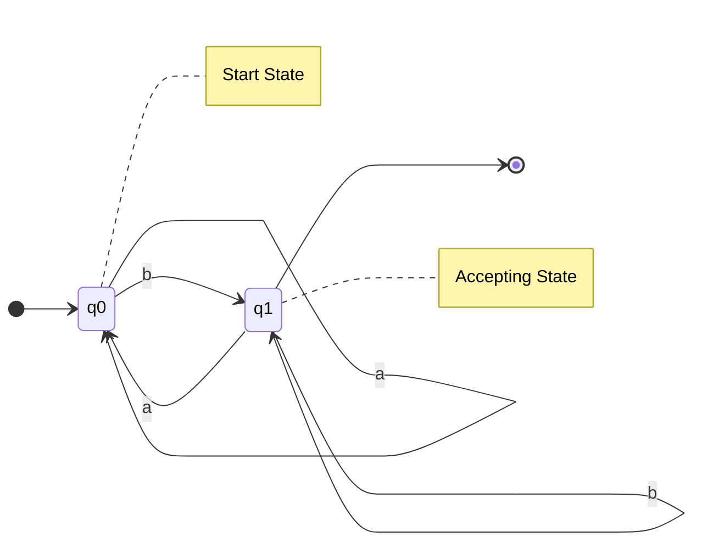
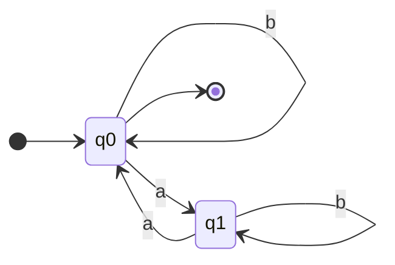
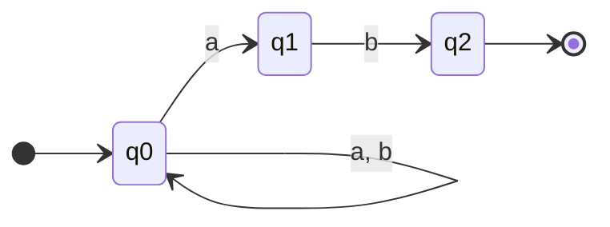

[[00-Dashboard/Home|Home]] | [[01-Semester-V/Semester-V-Dashboard|Semester V]] | [[Overview]] | [[Syllabus]] | [[Unit-1]] | [[Unit-2]] | [[Unit-3]] | [[Unit-4]] | [[Unit-5]] | [[Important-Questions|Imp. Qs]] | [[Revision]] | [[Interview-Prep]]


# Unit 1 - Finite Automata

> [!note] Navigation
> [[Overview|CS-304 Overview]] | [[Syllabus|CS-304 Syllabus]] | **Unit 1** → [[Unit-2]] → [[Unit-3]] → [[Unit-4]] → [[Unit-5]]

---

## Learning Objectives

- Define and use basic terminology: symbol, alphabet, string, language
- Construct DFAs from problem descriptions
- Read and draw transition diagrams and tables
- Understand NFA and its differences from DFA
- Convert NFA to equivalent DFA using subset construction
- Design and convert Moore and Mealy machines
- Minimize a DFA using the table-filling method

---

## 1.1 Basic Definitions

> [!important] Foundational Vocabulary - Must Know for Exams!

### Symbol, Alphabet, String

| Term | Definition | Example |
|------|-----------|---------|
| ==Symbol== | An atomic element; basic unit | `a`, `b`, `0`, `1` |
| ==Alphabet== (Σ) | Finite, non-empty set of symbols | Σ = {a, b}, Σ = {0, 1} |
| ==String (Word)== | Finite sequence of symbols from Σ | `ab`, `aab`, `bba` |
| ==Empty String== (ε) | String with zero symbols; length = 0 | ε |
| ==Length of String== |w| | Number of symbols in string w | |aba| = 3, |ε| = 0 |
| ==Kleene Star== (Σ\*) | Set of ALL strings over Σ including ε | Σ={a,b}: {ε, a, b, aa, ab, ...} |
| ==Σ⁺== | Σ\* minus ε (all non-empty strings) | Σ\* \ {ε} |
| ==Language== (L) | Any subset of Σ\* | L = {aⁿbⁿ | n ≥ 1} |

### String Operations

```
Let w = "abc", v = "xy"

Concatenation:  wv = "abcxy"
Reversal:       w^R = "cba"
Power:          w² = "abcabc"
                w⁰ = ε
Length:         |w| = 3
Prefix of w:    ε, a, ab, abc
Suffix of w:    ε, c, bc, abc
Substring of w: any contiguous part
```

^basic-definitions

---

## 1.2 Deterministic Finite Automaton (DFA)

> [!important] DFA Definition
> A ==Deterministic Finite Automaton (DFA)== is a 5-tuple:
> **M = (Q, Σ, δ, q₀, F)** where:
> - **Q** = Finite, non-empty set of states
> - **Σ** = Input alphabet (finite set of symbols)
> - **δ** = Transition function: **Q × Σ → Q** (deterministic: exactly one next state)
> - **q₀** = Start state (q₀ ∈ Q)
> - **F** = Set of accepting/final states (F ⊆ Q)

### DFA Properties

- **Deterministic**: For each (state, symbol) pair, exactly ONE next state
- **Complete**: δ must be defined for every (q, a) pair
- **Accepts** a string w if: starting from q₀, processing w symbol by symbol ends in a state ∈ F

### Example 1: DFA for strings ending in 'b' over Σ={a,b}

**Language:** L = {w ∈ {a,b}\* | w ends with b}

**States:**
- q₀ = start state (last symbol seen: none / last was 'a')
- q₁ = last symbol was 'b' (accepting state)

**Transition Diagram:**



**Transition Table:**

| State | a | b |
|-------|---|---|
| →q₀ | q₀ | q₁ |
| *q₁ | q₀ | q₁ |

> Legend: → = start state, * = accepting state

**Verification:**
- `"ab"` → q₀ →(a)→ q₀ →(b)→ q₁  (accepted)
- `"ba"` → q₀ →(b)→ q₁ →(a)→ q₀  (rejected)
- `"bb"` → q₀ →(b)→ q₁ →(b)→ q₁  (accepted)

^dfa-example1

---

### Example 2: DFA for strings with even number of a's over Σ={a,b}

**Language:** L = {w ∈ {a,b}\* | w has even count of 'a' (0 counts as even)}

**States:**
- q₀ = Even number of a's seen (start + accept)
- q₁ = Odd number of a's seen

**Transition Table:**

| State | a | b |
|-------|---|---|
| →*q₀ | q₁ | q₀ |
| q₁ | q₀ | q₁ |



**Verification:**
- `"aa"` → q₀→q₁→q₀ 
- `"aba"` → q₀→q₁→q₁→q₀ 
- `"a"` → q₀→q₁ 

---

### Example 3: DFA for binary strings divisible by 3

**Language:** L = {w ∈ {0,1}* | decimal(w) mod 3 = 0}

**Insight:** States represent remainder when divided by 3 (0, 1, 2)

| State | Meaning | 0 | 1 |
|-------|---------|---|---|
| →*q₀ | remainder = 0 | q₀ | q₁ |
| q₁ | remainder = 1 | q₂ | q₀ |
| q₂ | remainder = 2 | q₁ | q₂ |

> **Why?** If current value is n with remainder r:
> - Appending 0 → new value = 2n → remainder = (2r) mod 3
> - Appending 1 → new value = 2n+1 → remainder = (2r+1) mod 3

**Verification:**
- `"110"` = 6 → q₀→q₁→q₀→q₀  (6 mod 3 = 0)
- `"101"` = 5 → q₀→q₁→q₂→q₂  (5 mod 3 = 2)

^dfa-binary-divisible-3

---

## 1.3 Non-deterministic Finite Automaton (NFA)

> [!important] NFA Definition
> A ==Non-deterministic Finite Automaton (NFA)== is a 5-tuple:
> **M = (Q, Σ, δ, q₀, F)** where:
> - **Q**, **Σ**, **q₀**, **F** - same as DFA
> - **δ** = Transition function: **Q × Σ → 2^Q** (powerset; can go to multiple or zero states)

### DFA vs NFA Key Differences

| Property | DFA | NFA |
|----------|-----|-----|
| Transitions | Exactly 1 next state | 0, 1, or many next states |
| ε-transitions | Not allowed | Allowed (moves without reading input) |
| Transition function | Q × Σ → Q | Q × (Σ ∪ {ε}) → 2^Q |
| Dead state | Must be explicitly added | Implicit (empty set) |
| Power | Equal to NFA | Equal to DFA |
| Ease of design | Harder (must be complete) | Easier (more intuitive) |

> [!tip] Key Theorem
> For every NFA, there exists an **equivalent DFA** that accepts the same language. (The subset construction theorem.)

### Example: NFA for strings ending in "ab"

**Language:** L = {w ∈ {a,b}\* | w ends with "ab"}



**Transition Table (NFA):**

| State | a | b |
|-------|---|---|
| →q₀ | {q₀, q₁} | {q₀} |
| q₁ | ∅ | {q₂} |
| *q₂ | ∅ | ∅ |

**Key:** NFA accepts if **ANY** path through the automaton ends in an accepting state.

---

## 1.4 NFA to DFA Conversion (Subset Construction)

> [!important] Subset Construction Algorithm
> Each **state of the DFA** corresponds to a **set (subset) of NFA states**.
> The start state of the DFA = {q₀ (NFA)}.

### Algorithm Steps

```
1. DFA start state = {q₀_NFA}
2. For each DFA state S (set of NFA states):
   For each symbol a ∈ Σ:
     DFA_δ(S, a) = ∪{NFA_δ(q, a) | q ∈ S}
3. Mark as DFA accepting state if it contains any NFA accepting state
4. Repeat until no new states are created
```

### Worked Example: Convert NFA (strings ending in "ab") to DFA

**NFA Transition Table:**

| NFA State | a | b |
|-----------|---|---|
| q₀ | {q₀, q₁} | {q₀} |
| q₁ | ∅ | {q₂} |
| *q₂ | ∅ | ∅ |

**Step 1:** DFA start state = {q₀}

| DFA State | a | b | Accepting? |
|-----------|---|---|------------|
| →{q₀} | {q₀,q₁} | {q₀} | No |

**Step 2:** Process {q₀,q₁}:
- δ({q₀,q₁}, a) = δ(q₀,a) ∪ δ(q₁,a) = {q₀,q₁} ∪ ∅ = {q₀,q₁}
- δ({q₀,q₁}, b) = δ(q₀,b) ∪ δ(q₁,b) = {q₀} ∪ {q₂} = {q₀,q₂}

| DFA State | a | b | Accepting? |
|-----------|---|---|------------|
| →{q₀} | {q₀,q₁} | {q₀} | No |
| {q₀,q₁} | {q₀,q₁} | {q₀,q₂} | No |

**Step 3:** Process {q₀,q₂}:
- δ({q₀,q₂}, a) = {q₀,q₁} ∪ ∅ = {q₀,q₁}
- δ({q₀,q₂}, b) = {q₀} ∪ ∅ = {q₀}

| DFA State | a | b | Accepting? |
|-----------|---|---|------------|
| →{q₀} | {q₀,q₁} | {q₀} | No |
| {q₀,q₁} | {q₀,q₁} | {q₀,q₂} | No |
| *{q₀,q₂} | {q₀,q₁} | {q₀} | **Yes** (contains q₂) |

**Process {q₀}: already done. No new states!**

**Final DFA (renaming):** A={q₀}, B={q₀,q₁}, C={q₀,q₂}

| DFA State | a | b |
|-----------|---|---|
| →A | B | A |
| B | B | C |
| \*C | B | A |

^nfa-to-dfa-conversion

---

## 1.5 Moore and Mealy Machines (Finite State Transducers)

> [!important] Finite State Transducers
> Unlike DFA/NFA which **accept or reject** input, ==transducers produce output== for each transition or state.

### Moore Machine

> **Definition:** Output depends on the **current state** (not on input).
> **6-tuple:** M = (Q, Σ, Δ, δ, λ, q₀)
> - Q, Σ, δ, q₀ - same as DFA
> - **Δ** = Output alphabet
> - **λ: Q → Δ** = Output function (state → output)

### Mealy Machine

> **Definition:** Output depends on the **current state AND current input**.
> **6-tuple:** M = (Q, Σ, Δ, δ, λ, q₀)
> - **λ: Q × Σ → Δ** = Output function (state, input → output)

### Comparison Table

| Feature | Moore Machine | Mealy Machine |
|---------|--------------|---------------|
| Output depends on | State only | State + Input |
| Output function | λ: Q → Δ | λ: Q × Σ → Δ |
| Output timing | On entering state | On taking transition |
| Output sequence length | |w| + 1 | |w| |
| States needed | More (generally) | Fewer (generally) |

### Moore Machine Example: Detect 'a' in input over Σ={a,b}, output 1 if last input was 'a'

| State | Meaning | Output (λ) | a | b |
|-------|---------|-----------|---|---|
| →q₀ | Start / last='b'/none | 0 | q₁ | q₀ |
| q₁ | Last was 'a' | 1 | q₁ | q₀ |

**Input:** "bab"
- q₀(output:0) →b→ q₀(output:0) →a→ q₁(output:1) →b→ q₀(output:0)
- **Output sequence:** 0, 0, 1, 0 (length = |w|+1 = 4)

### Mealy Machine Example: Same problem

| State | a (next state, output) | b (next state, output) |
|-------|----------------------|----------------------|
| →q₀ | (q₁, 1) | (q₀, 0) |
| q₁ | (q₁, 1) | (q₀, 0) |

**Input:** "bab"
- q₀ →b(output 0)→ q₀ →a(output 1)→ q₁ →b(output 0)→ q₀
- **Output sequence:** 0, 1, 0 (length = |w| = 3)

^moore-mealy-machines

### Moore to Mealy Conversion

```
For each transition δ(q, a) = p in Moore machine:
  In Mealy, transition δ(q, a) = p with output λ_Moore(p)
  (take the output of the DESTINATION state)
```

### Mealy to Moore Conversion

```
For each state q in Mealy, split into multiple Moore states:
  For each distinct output value that could arrive at q,
  create a new state q_x with output x.
  
  If q₀ is start state: create q₀_init with any output
```

---

## 1.6 DFA Minimization (Table-Filling / Myhill-Nerode Method)

> [!important] DFA Minimization
> ==DFA Minimization== finds the smallest DFA (fewest states) that accepts the same language. Two states are **equivalent (indistinguishable)** if they cannot be distinguished by any string.

### Algorithm: Table-Filling Method

```
Steps:
1. Remove unreachable states (optional but good practice)
2. Create a triangular table for all pairs (p, q) where p ≠ q
3. Mark (p, q) as DISTINGUISHABLE if one is accepting and other is not
4. Repeat:
   For each unmarked pair (p, q) and each symbol a:
     If (δ(p,a), δ(q,a)) is marked as distinguishable:
       Mark (p, q) as distinguishable
5. All unmarked pairs are EQUIVALENT → merge them
```

### Worked Example: Minimize the following DFA

**Given DFA** over Σ = {0, 1}:

| State | 0 | 1 |
|-------|---|---|
| →q₀ | q₁ | q₃ |
| q₁ | q₀ | q₃ |
| *q₂ | q₁ | q₄ |
| *q₃ | q₀ | q₄ |
| *q₄ | q₁ | q₄ |
| q₅ | q₂ | q₄ |

**Step 1 - Initial marking** (one accepting, one non-accepting):

Mark pairs: (q₀,q₂), (q₀,q₃), (q₀,q₄), (q₁,q₂), (q₁,q₃), (q₁,q₄), (q₅,q₂), (q₅,q₃), (q₅,q₄) as **×**

```
Triangular Table:
q₁  -
q₂  ×  ×
q₃  ×  ×  -
q₄  ×  ×  -  -
q₅  -  -  ×  ×  ×
     q₀ q₁ q₂ q₃ q₄
```

**Step 2 - Propagation:**
Check unmarked pairs:
- (q₀, q₁): δ(q₀,0)=q₁, δ(q₁,0)=q₀ → check (q₁,q₀)=same as (q₀,q₁): not marked. δ(q₀,1)=q₃, δ(q₁,1)=q₃ → (q₃,q₃) trivially same. So **(q₀,q₁) EQUIVALENT**
- (q₂, q₃): δ(q₂,0)=q₁, δ(q₃,0)=q₀ → (q₁,q₀)=(q₀,q₁): not marked. δ(q₂,1)=q₄, δ(q₃,1)=q₄ → (q₄,q₄): trivially same. So **(q₂,q₃) EQUIVALENT**
- (q₂, q₄): δ(q₂,0)=q₁, δ(q₄,0)=q₁ → same. δ(q₂,1)=q₄, δ(q₄,1)=q₄ → same. So **(q₂,q₄) EQUIVALENT**
- (q₃, q₄): δ(q₃,0)=q₀, δ(q₄,0)=q₁ → (q₀,q₁) not marked. δ(q₃,1)=q₄, δ(q₄,1)=q₄ → same. So **(q₃,q₄) EQUIVALENT**
- (q₀, q₅): δ(q₀,0)=q₁, δ(q₅,0)=q₂ → (q₁,q₂) is marked **×**. So **(q₀,q₅) DISTINGUISHABLE** → mark ×
- (q₁, q₅): δ(q₁,0)=q₀, δ(q₅,0)=q₂ → (q₀,q₂) marked ×. So **(q₁,q₅) DISTINGUISHABLE** → mark ×

**Step 3 - Equivalence classes:**
- {q₀, q₁} - merge → A
- {q₂, q₃, q₄} - merge → B
- {q₅} - singleton → C

**Minimized DFA:**

| State | 0 | 1 |
|-------|---|---|
| →A | A | B |
| \*B | A | B |
| C | B | B |

> Note: State C is unreachable from A, so it can be removed → **Minimal DFA has 2 states: A and B!**

^dfa-minimization-example

---

## Numerical Problem Types for Exams

> [!tip] Common Exam Problem Patterns

### Type 1: Design a DFA
*"Construct a DFA over Σ={a,b} that accepts all strings with at least two consecutive b's"*

**Approach:**
1. Identify what information you need to track
2. Create states for each "memory"
3. Build transitions for each symbol from each state

**States:** q₀ (start), q₁ (one b seen), q₂ (two b's seen / accepting trap)

| State | a | b |
|-------|---|---|
| →q₀ | q₀ | q₁ |
| q₁ | q₀ | q₂ |
| *q₂ | q₂ | q₂ |

### Type 2: NFA to DFA Conversion
*"Convert the given NFA to equivalent DFA"* - Use subset construction (see §1.4)

### Type 3: DFA Minimization
*"Minimize the given DFA"* - Use table-filling method (see §1.6)

### Type 4: Moore/Mealy Design
*"Design a Moore machine that outputs 1 whenever the input contains 'ab' as substring"*

---

## Interview Questions - Unit 1

> [!question] Key Interview/Exam Questions

1. **Define DFA. What is the significance of the transition function δ?**
   - DFA = 5-tuple (Q, Σ, δ, q₀, F); δ: Q × Σ → Q maps each (state, symbol) to exactly one next state - ensuring determinism.

2. **What is the difference between DFA and NFA?**
   - DFA: exactly one transition per (state, symbol); NFA: zero or more. Both accept the same class of languages (regular). NFA easier to design; DFA easier to implement.

3. **Explain NFA to DFA conversion with an example.**
   - Use subset construction: DFA states = subsets of NFA states. Start = {q₀_NFA}. Process each symbol for each subset. Mark accepting if any NFA accepting state is in subset.

4. **What is the maximum number of states in a DFA converted from an NFA with n states?**
   - 2ⁿ states (one for each subset of the n NFA states).

5. **Differentiate Moore and Mealy machines.**
   - Moore: output per state; Mealy: output per transition. Mealy output length = |w|; Moore = |w|+1.

6. **Why is DFA minimization important?**
   - Reduces implementation complexity, memory usage; minimal DFA is unique (up to renaming).

7. **What is the table-filling method for DFA minimization?**
   - Iteratively mark distinguishable state pairs (one accepting, one not); propagate marking; merge all unmarked (equivalent) pairs.

8. **Can an NFA have zero transitions from a state?**
   - Yes! An NFA can have δ(q, a) = ∅ (empty set), meaning the computation dies (rejects on this path).

---

## Revision Summary

> [!summary] Unit 1 Key Takeaways
>
> **Basic Terms:**
> - Σ = alphabet, Σ\* = all strings (incl. ε), Language ⊆ Σ\*
>
> **DFA = (Q, Σ, δ, q₀, F):**
> - δ: Q × Σ → Q (one next state)
> - Accepts if final state ∈ F
>
> **NFA = (Q, Σ, δ, q₀, F):**
> - δ: Q × Σ → 2^Q (set of next states)
> - Accepts if any path ends in F
>
> **NFA → DFA:**
> - Subset construction; DFA states = sets of NFA states
> - Max 2ⁿ states; often much fewer
>
> **Moore Machine:**
> - Output λ(q) on current state; length |w|+1
>
> **Mealy Machine:**
> - Output λ(q,a) on transition; length |w|
>
> **DFA Minimization:**
> - Table-filling: mark distinguishable pairs, merge equivalent pairs
> - Minimal DFA is unique

^unit1-tcs-revision

---

*[[Overview|CS-304 Overview]] | Next: [[Unit-2]] →*
