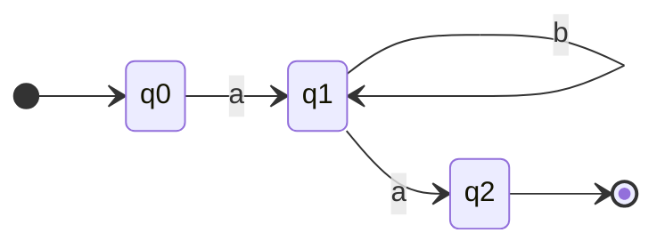
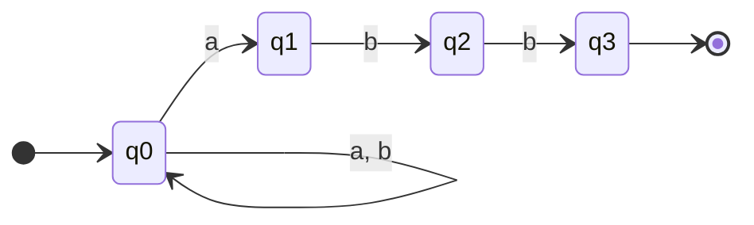

#  Unit 2 - Regular Expressions and Languages

> [!note] Navigation
> [[Overview|CS-304 Overview]] | ← [[Unit-1]] | **Unit 2** → [[Unit-3]] → [[Unit-4]] → [[Unit-5]]

---

##  Learning Objectives

- Define regular expressions formally and informally
- Understand what constitutes a regular language
- Convert regular expressions to finite automata
- Apply Arden's theorem or state elimination to convert FA to RE
- State and apply the Pumping Lemma to prove languages are non-regular

---

## 2.1 Regular Expressions - Definition

> [!important] Formal Definition
> Let Σ be an alphabet. A ==Regular Expression (RE)== over Σ is defined recursively:

### Base Cases
| RE | Language Described | Notes |
|----|-------------------|-------|
| `∅` | Empty set {} | No strings |
| `ε` | {ε} | Only empty string |
| `a` (for a ∈ Σ) | {a} | Only single symbol a |

### Recursive Cases
If `r` and `s` are regular expressions:

| Operation | RE Notation | Language | Example |
|-----------|------------|---------|---------|
| Union | `r + s` or `r \| s` | L(r) ∪ L(s) | `a + b` = {a, b} |
| Concatenation | `rs` | L(r) · L(s) | `ab` = {ab} |
| Kleene Star | `r*` | L(r)* = {ε} ∪ L(r) ∪ L(r)² ∪ ... | `a*` = {ε, a, aa, ...} |
| Kleene Plus | `r+` | L(r)⁺ = L(r) · L(r)* | `a+` = {a, aa, aaa, ...} |
| Optional | `r?` | {ε} ∪ L(r) | `a?b` = {b, ab} |

### Operator Precedence (High to Low)
1. **Parentheses** ()
2. **Kleene Star / Plus** *, +, ?
3. **Concatenation** (juxtaposition)
4. **Union** + or |

```
ab* = a(b*)   NOT (ab)*
a+b = (a+)b   - a-plus concatenated with b
a+b|c = (a+b)|c - union has lowest precedence
```

^re-definition

---

## 2.2 Regular Language

> [!important] Regular Language
> A language L is ==regular== if and only if there exists a regular expression r such that L = L(r).
>
> **Equivalently:** L is regular iff there exists a DFA/NFA that accepts it.

### Regular Language Examples

| Language Description | Regular Expression | Notes |
|---------------------|-------------------|-------|
| All strings over {a,b} | `(a+b)*` | Σ* |
| Strings ending in 'b' | `(a+b)*b` | |
| Strings starting with 'a' | `a(a+b)*` | |
| Strings with exactly one 'a' | `b*ab*` | |
| Strings with at least one 'a' | `(a+b)*a(a+b)*` | |
| Strings with even length | `((a+b)(a+b))*` | |
| Strings with even number of a's | `(b*(ab*a)*)b*` | Wait - this is complex |
| Binary strings divisible by 3 | (need DFA-based RE) | See §1.2 example |
| Empty string only | `ε` | |
| No string | `∅` | |

### Properties of Regular Languages (Closure Properties)

> [!tip] If L₁ and L₂ are regular, then so are:
> - L₁ ∪ L₂ (Union)
> - L₁ ∩ L₂ (Intersection)
> - L₁ · L₂ (Concatenation)
> - L₁* (Kleene Star)
> - L̄₁ (Complement)
> - L₁ \ L₂ (Difference)
> - L₁^R (Reversal)
> - Homomorphic image of L₁

^regular-language

---

## 2.3 Important RE Identities (Algebraic Laws)

| Law | Identity |
|-----|---------|
| Commutative (Union) | r + s = s + r |
| Associative (Union) | (r+s)+t = r+(s+t) |
| Associative (Concat) | (rs)t = r(st) |
| Distributive | r(s+t) = rs + rt |
| Identity (Union) | r + ∅ = ∅ + r = r |
| Identity (Concat) | rε = εr = r |
| Annihilator | r∅ = ∅r = ∅ |
| Idempotent | r + r = r |
| Star properties | ∅* = ε |
| | ε* = ε |
| | (r*)* = r* |
| | r*r* = r* |
| | r+ = rr* = r*r |
| | r? = ε + r |
| Arden's Theorem | If X = Q + XP then X = QP* (unique solution when ε ∉ L(P)) |

---

## 2.4 Regular Expression to Finite Automaton (RE → FA)

### Method: Thompson's Construction (NFA Construction)

> [!important] Thompson's Construction
> Build NFA from RE inductively using ε-NFA building blocks.

**Base cases:**

```
RE: ε                    RE: a
  →(q₀)──ε──→((q₁))       →(q₀)──a──→((q₁))
```

**Recursive cases:**

```
RE: r + s (Union)          RE: rs (Concatenation)
  ε→[NFA_r]→ε              [NFA_r] ──ε──→ [NFA_s]
→(q) ↗    ↘ ((qf))         start of r → end of r → start of s → end of s
    ↘ε    ε↗
      [NFA_s]

RE: r* (Kleene Star)
         ε
       ↗───↘
→(qi)──ε──→[NFA_r]──ε──→((qf))
       ↘_________________↗
               ε
```

### Method: Direct NFA Construction

More practical - build NFA directly from RE structure.

**Example: RE = `ab*a` → NFA**



| State | a | b |
|-------|---|---|
| →q₀ | {q₁} | ∅ |
| q₁ | {q₂} | {q₁} |
| *q₂ | ∅ | ∅ |

**Example: RE = `(a+b)*abb` → NFA**



| State | a | b |
|-------|---|---|
| →q₀ | {q₀, q₁} | {q₀} |
| q₁ | ∅ | {q₂} |
| q₂ | ∅ | {q₃} |
| *q₃ | ∅ | ∅ |

^re-to-nfa

---

## 2.5 Finite Automaton to Regular Expression (FA → RE)

### Method 1: Arden's Theorem

> **Theorem:** If P and Q are REs over Σ, and ε ∉ L(P), then **X = QP\*** is the unique solution to the equation **X = Q + XP**.

**Steps:**
1. Write equations for each state: what strings lead from that state to accepting
2. Solve the system of equations using Arden's theorem

**Example:** Convert DFA to RE:

| State | a | b |
|-------|---|---|
| →q₀ | q₀ | q₁ |
| *q₁ | q₀ | q₁ |

**Step 1 - Write equations:**
- q₀ = ε + q₀·a + q₁·b  (q₀ is start; paths leading to it)
- q₁ = q₀·b + q₁·b      (paths leading to q₁)

Wait - we write equations for what leads TO each state:

Actually, we write equations as: state = expressions that START from that state and eventually reach accepting state.

**Alternative approach:**
- R(q₀) = q₀'s RE = ?
- q₁ = (q₀·b)(b*) - from q₀ via b, stay in q₁ via b*
- q₀ = (q₀·a) + q₁·? - hmm, need to be careful

**Cleaner approach using state elimination:**

For a simple 2-state DFA where q₀ is start, q₁ is accept:
- From q₀: 'a' loops on q₀, 'b' goes to q₁
- From q₁: 'b' loops on q₁, 'a' goes back to q₀

Setting up: X = RE accepted from q₀
- q₀ → q₁ directly: `b`
- q₀ → q₀(loop) → q₁: `a*b`
- q₀ → q₁ → q₁(loop): `b·b*`
- Combined: `(a*b)(b)* = a*b·b* = a*bb*`

Actually using Arden's:
- Let X = RE from q₀: **X = Xaa + Xba\*b** (complex when states go back)

**Simpler Example:** FA with no back edges:

DFA: q₀ →a→ q₁ →b→ q₂* (accepting)
RE = `ab`

DFA: q₀ →a→ q₁, q₀ →b→ q₂*, q₁ →b→ q₂*
RE = `b + ab` (b directly, or a then b)

^arden-theorem

---

## 2.6 Pumping Lemma for Regular Languages

> [!important] Pumping Lemma - The Key Tool for Proving Non-Regularity
> If L is a **regular** language, then there exists a constant **p** (the pumping length) such that for **every** string w ∈ L with |w| ≥ p, we can write **w = xyz** where:
> 1. **|xy| ≤ p**
> 2. **|y| ≥ 1** (y is non-empty)
> 3. **xy^i z ∈ L for all i ≥ 0** (can pump y any number of times)

### Proof Structure (Pigeonhole Principle)

```
If DFA has p states and w has ≥ p symbols:
Processing w visits at least p+1 states → by pigeonhole, 
some state q is visited twice.

The path between the two visits to q forms the "pump" y.
Since looping back to q, we can repeat y any number of times
and still be in the same state!
```

### Using Pumping Lemma to Prove Non-Regularity

> [!warning] Proof by Contradiction Strategy
> **Assume** L is regular → pumping lemma holds with pumping length p.
> Choose a specific string w ∈ L with |w| ≥ p.
> Show that for ALL ways to split w = xyz (satisfying conditions 1,2),
> ∃i such that xy^iz ∉ L.
> **Contradiction!** → L is NOT regular.

### Example 1: Prove L = {aⁿbⁿ | n ≥ 1} is NOT regular

**Proof:**
1. Assume L is regular. Let p be the pumping length.
2. Choose w = **aᵖbᵖ** ∈ L (|w| = 2p ≥ p) 
3. By PL, w = xyz where |xy| ≤ p and |y| ≥ 1.
   - Since |xy| ≤ p, and w starts with p a's, **x and y consist entirely of a's**.
   - So x = aʲ, y = aᵏ where k ≥ 1, z = aᵖ⁻ʲ⁻ᵏbᵖ
4. By PL, xy²z ∈ L:
   - xy²z = aʲ · (aᵏ)² · aᵖ⁻ʲ⁻ᵏbᵖ = aᵖ⁺ᵏbᵖ
   - This has more a's than b's (since k ≥ 1)
   - So xy²z ∉ L  **CONTRADICTION!**
5. Therefore, **L is NOT regular**. □

^pumping-lemma-proof

### Example 2: Prove L = {ww | w ∈ {a,b}*} is NOT regular

**Proof:**
1. Assume L is regular. Let p be pumping length.
2. Choose w = **aᵖbaᵖb** ∈ L (with w_str = aᵖb) 
3. w = xyz, |xy| ≤ p, |y| ≥ 1.
   - Since |xy| ≤ p and the first p characters are all a's: y = aᵏ (k ≥ 1)
4. xy²z = aᵖ⁺ᵏbaᵖb. For this to be in L, it must be of the form uu for some u.
   - |aᵖ⁺ᵏbaᵖb| = 2p+k+2, so |u| = p + k/2 + 1, requiring k even.
   - But even if k is even, u = aᵖ⁺ᵏ/²b, then uu = aᵖ⁺ᵏ/²baᵖ⁺ᵏ/²b ≠ aᵖ⁺ᵏbaᵖb (since aᵖ⁺ᵏ ≠ aᵖ) - more careful analysis needed.
   - For i=0: xy⁰z = aᵖ⁻ᵏbaᵖb → first half would be aᵖ⁻ᵏ...b, second half would need to match, but they have different a-counts.
5. **Contradiction!** L is NOT regular. □

### Example 3: Prove L = {aᵖ | p is prime} is NOT regular

**Proof:**
1. Assume L is regular. Let p be pumping length.
2. Choose w = **aˢ** where s is prime and s ≥ p+2.
3. w = xyz, |xy| ≤ p, |y| ≥ 1. Say |y| = m (1 ≤ m ≤ p), |xz| = s - m.
4. Pump: xyⁱz = aˢ⁺⁽ⁱ⁻¹⁾ᵐ (length = s + (i-1)m)
5. Choose i = s + 1: length = s + sm = s(1+m) - **composite!** (since s ≥ 2 and m ≥ 1)
6. So xy^(s+1)z ∉ L  **Contradiction!** L is NOT regular. □

---

##  Numerical Problem Types for Exams

> [!tip] Common Exam Problem Patterns

### Type 1: Write RE for a given language
- "All binary strings with at least two 1s": `0*(10*)*1(0+1)*`
- "Strings over {a,b} with no two consecutive b's": `(a+ba)*(b+ε)`
- "Strings of even length over {a,b}": `((a+b)(a+b))*`

### Type 2: Convert RE to NFA/DFA
- Draw NFA using Thompson's construction or direct method
- Then apply subset construction if DFA needed

### Type 3: Apply Pumping Lemma
- Choose w carefully (usually w = aᵖbᵖ or similar)
- Show the "pump" must lie entirely in one type of character
- Show pumping produces string not in L

---

##  Interview Questions - Unit 2

> [!question] Key Interview/Exam Questions

1. **What is a regular expression? Define it formally.**
   - Recursively defined: base cases (∅, ε, a); recursive cases (union, concatenation, Kleene star)

2. **What is a regular language?**
   - Language described by a regular expression; equivalently accepted by some DFA/NFA

3. **State the Pumping Lemma for regular languages.**
   - If L is regular with pumping length p, any w ∈ L with |w| ≥ p can be split w=xyz with |xy|≤p, |y|≥1, xyⁱz ∈ L for all i≥0

4. **Prove L = {aⁿbⁿ | n ≥ 1} is not regular using Pumping Lemma.**
   - See proof in §2.6

5. **What are the closure properties of regular languages?**
   - Closed under: union, intersection, complementation, concatenation, Kleene star, reversal, homomorphism

6. **Is {aⁿ | n ≥ 0} regular? What RE describes it?**
   - Yes, RE = `a*`

7. **What is Arden's Theorem? How is it used?**
   - X = Q + XP → X = QP* (unique if ε ∉ L(P)); used to derive RE from state equations of a FA

8. **What does the Pumping Lemma actually prove?**
   - It provides a NECESSARY condition for regularity. If a language fails PL, it's NOT regular. (But passing PL doesn't guarantee regularity!)

---

##  Revision Summary

> [!summary] Unit 2 Key Takeaways
>
> **Regular Expression:**
> - Defined recursively from base cases (∅, ε, a) using union (+), concatenation, Kleene star (*)
> - Operator precedence: ()  >  * > concat > +
>
> **Regular Language:**
> - Described by RE = accepted by DFA/NFA
> - Closed under union, intersection, complement, concat, star, reversal
>
> **RE → FA:**
> - Thompson's construction for ε-NFA
> - Direct NFA construction is often more intuitive
>
> **FA → RE:**
> - Arden's Theorem: X = Q + XP → X = QP*
> - State elimination method
>
> **Pumping Lemma:**
> - Only used to PROVE non-regularity (by contradiction)
> - Choose w wisely (usually uses repetition that can be "pumped")
> - Show that ANY valid split can be pumped to leave L
> - Key examples: aⁿbⁿ, ww, primes

^unit2-tcs-revision

---

*← [[Unit-1]] | [[Overview|CS-304 Overview]] | Next: [[Unit-3]] →*
