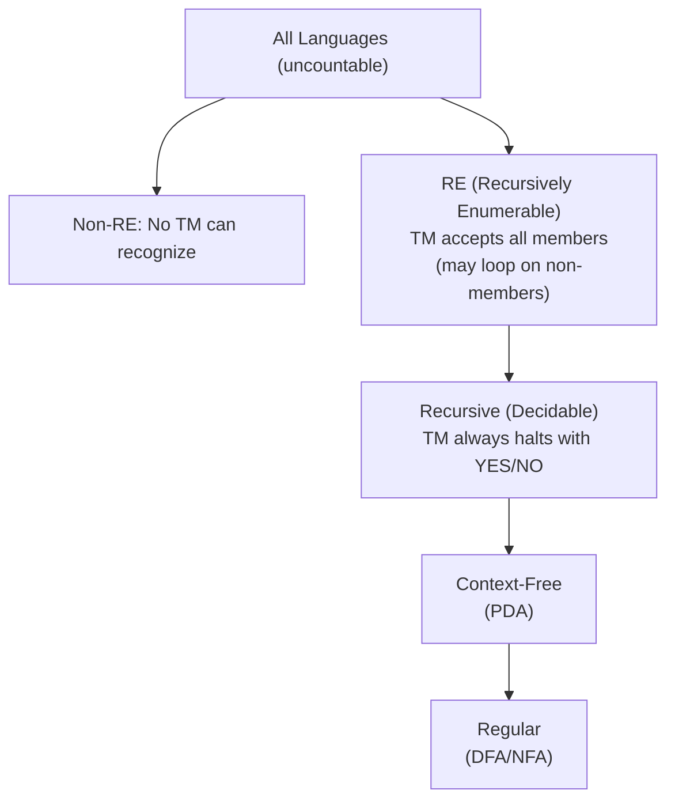

# ️ Unit 5 - Turing Machine

> [!note] Navigation
> [[Overview|CS-304 Overview]] | ← [[Unit-4]] | **Unit 5** (Final Unit) → [[Important-Questions|CS-304 Important-Questions]]

---

##  Learning Objectives

- Describe the Turing Machine model formally
- Design TMs for specific computations
- Understand what languages Turing machines recognize
- Differentiate between decidable and recognizable languages
- Understand the concept of computability and the halting problem

---

## 5.1 Why Turing Machines?

> [!important] The Hierarchy So Far
>
> ```
> Finite Automata → recognizes Regular Languages
> Push Down Automata → recognizes Context-Free Languages
> Turing Machine → recognizes Recursively Enumerable Languages
> ```
>
> A ==Turing Machine== is the most powerful computational model. It captures everything a real computer can compute - and also the limits of what ANY computer can compute.

### PDA vs Turing Machine

| Feature | PDA | Turing Machine |
|---------|-----|----------------|
| Memory | Stack (LIFO, unbounded) | Infinite tape (random access) |
| Head movement | Input: left to right; Stack: top only | Both directions (L, R) |
| Write to tape | No | Yes |
| Power | CFL (Type 2) | Recursively Enumerable (Type 0) |

---

## 5.2 The Turing Machine Model

> [!important] Turing Machine - Formal Definition
> A ==Turing Machine (TM)== is a 7-tuple:
> **M = (Q, Σ, Γ, δ, q₀, B, F)** where:
> - **Q** = Finite set of states
> - **Σ** = Input alphabet (Σ ⊆ Γ, B ∉ Σ)
> - **Γ** = Tape alphabet (includes Σ and blank B)
> - **δ** = Transition function: **Q × Γ → Q × Γ × {L, R}** (partial function)
> - **q₀** = Start state
> - **B** = Blank symbol (∈ Γ \ Σ) - represents empty tape cell
> - **F** = Set of halting/accepting states

### Transition Function: δ(q, a) = (p, b, D)

| Component | Meaning |
|-----------|---------|
| q | Current state |
| a | Symbol currently under read/write head |
| p | Next state |
| b | Symbol to write on tape (can be same) |
| D | Direction to move head: L (left) or R (right) |

^tm-definition

### The Turing Machine Structure

```
Tape (infinite in both directions):
...[ ][ B ][ a ][ a ][ b ][ b ][ B ][ ]...
              ↑
         Read/Write Head
         
Control Unit: Q, δ
Current State: q₀ → ... → q_accept or q_reject
```

---

## 5.3 Instantaneous Description (Configuration)

> [!note] TM Configuration
> A TM configuration is written as: **αqβ**
> - α = tape content to the LEFT of head
> - q = current state
> - β = tape content from head position rightward

**Example:** Configuration `aaq₁bb` means:
- "aa" to the left of head
- In state q₁
- "bb" starts at head position (first 'b' is under head)

### Moves

- **⊢** : One move
- **⊢\*** : Zero or more moves

**δ(q, a) = (p, b, R):** Move right
- Config: `αqaγ` ⊢ `αbpγ`

**δ(q, a) = (p, b, L):** Move left
- Config: `αcqaγ` ⊢ `αpcbγ` (c is leftmost symbol of α)

---

## 5.4 TM Design - Worked Examples

> [!tip] Design Strategy
> 1. Understand what the TM needs to **track** and **decide**
> 2. Use states to encode "memory"
> 3. Use tape marks (special symbols) to track progress
> 4. Design transitions step by step

### Example 1: TM for L = {aⁿbⁿ | n ≥ 1}

**Strategy:**
- Mark one 'a' → X, scan right to find matching 'b' → Y
- Go back to find next unmarked 'a', repeat
- If all a's and b's matched → accept

**Tape alphabet:** Γ = {a, b, X, Y, B}

**States and transitions:**

| State | Symbol Read | Write | Move | Next State | Purpose |
|-------|------------|-------|------|-----------|---------|
| q₀ | a | X | R | q₁ | Mark 'a' with X, start scan right |
| q₀ | Y | Y | R | q₃ | Skip Y's to check end |
| q₀ | B | B | R | q_reject | No input left without matching |
| q₁ | a | a | R | q₁ | Scan right over a's |
| q₁ | Y | Y | R | q₁ | Scan right over Y's |
| q₁ | b | Y | L | q₂ | Found b! Mark as Y, scan left |
| q₁ | B | B | L | q_reject | No b found |
| q₂ | a | a | L | q₂ | Scan left over a's |
| q₂ | Y | Y | L | q₂ | Scan left over Y's |
| q₂ | X | X | R | q₀ | Found leftmost X, return to start |
| q₃ | Y | Y | R | q₃ | Verify remaining are Y's |
| q₃ | B | B | R | q_accept | All Y's → accept! |

**Trace for "aabb":**
```
→ q₀ aabb      Read a, mark X, go right → q₁
→ aXq₁abb      Scan right over a → q₁
→ aXaq₁bb      Read b, mark Y, go left → q₂
→ aXaq₂Yb      (Hmm let me redo)

Start: q₀ aabb
Step 1: δ(q₀,a)=(q₁,X,R) → Xq₁ abb
Step 2: δ(q₁,a)=(q₁,a,R) → Xa q₁ bb
Step 3: δ(q₁,b)=(q₂,Y,L) → Xa q₂ Yb
Step 4: δ(q₂,a)=(q₂,a,L) → X q₂ aYb
Step 5: δ(q₂,X)=(q₀,X,R) → Xq₀ aYb
Step 6: δ(q₀,a)=(q₁,X,R) → XX q₁ Yb
Step 7: δ(q₁,Y)=(q₁,Y,R) → XXY q₁ b
Step 8: δ(q₁,b)=(q₂,Y,L) → XX q₂ YY
Step 9: δ(q₂,Y)=(q₂,Y,L) → X q₂ XYY
Step 10: δ(q₂,X)=(q₀,X,R) → XXq₀ YY
Step 11: δ(q₀,Y)=(q₃,Y,R) → XXY q₃ Y
Step 12: δ(q₃,Y)=(q₃,Y,R) → XXYY q₃ B
Step 13: δ(q₃,B)=(q_accept,B,R) → ACCEPT 
```

^tm-anbn-example

### Example 2: TM for L = {w#w | w ∈ {0,1}*}

**Strategy:**
- Repeatedly: mark leftmost unmarked symbol in first half, scan past #, find corresponding position in second half, verify match, mark it
- Accept when all symbols are matched

### Example 3: TM that computes f(n) = n+1 (unary)

**Input:** n ones (representing number n in unary)
**Output:** n+1 ones

```
Σ = {1}, Γ = {1, B}

δ(q₀, 1) = (q₀, 1, R)    Move right over all 1's
δ(q₀, B) = (q_accept, 1, R)  Write one more '1' at end → DONE
```

### Example 4: TM for Palindromes over {a, b}

**Strategy:**
- Read and remember leftmost symbol (state encodes it)
- Move to rightmost unread symbol, check match
- Repeat from both ends

**States:** q₀ (start), q_a (remembered 'a'), q_b (remembered 'b'), q_find_right, q_verify_a, q_verify_b, q_back, q_accept

---

## 5.5 Language Classes Accepted by TM

> [!important] Key Definitions

| Term | Definition | Notes |
|------|-----------|-------|
| ==Recursively Enumerable (RE)== | L accepted by some TM | TM may loop on non-members |
| ==Recursive (Decidable)== | L decided by some TM that always halts | TM answers YES or NO for every input |
| ==Non-RE== | No TM accepts L | Even more restricted |

### Three Possible TM Behaviors on Input w

```
Input w
  ↓
TM M
  ↓
┌───────────────────────────────────┐
│  1. ACCEPT: M halts in q_accept  │ → w ∈ L(M)
│  2. REJECT: M halts in q_reject  │ → w ∉ L(M)  
│  3. LOOP: M runs forever         │ → No answer!
└───────────────────────────────────┘
```

- If M **always halts** (accepts or rejects): L is **Recursive/Decidable**
- If M may **loop**: L is **Recursively Enumerable**

^language-classes

### The Language Classes



### Relationship Diagram

```
┌──────────────────────────────────────────────────────────┐
│                    All Languages                         │
│  ┌─────────────────────────────────────────────────┐    │
│  │         Recursively Enumerable (RE)              │    │
│  │  ┌──────────────────────────────────────────┐   │    │
│  │  │         Recursive (Decidable)            │   │    │
│  │  │  ┌───────────────────────────────────┐   │   │    │
│  │  │  │     Context-Free Languages        │   │   │    │
│  │  │  │  ┌────────────────────────────┐   │   │   │    │
│  │  │  │  │    Regular Languages       │   │   │   │    │
│  │  │  │  └────────────────────────────┘   │   │   │    │
│  │  │  └───────────────────────────────────┘   │   │    │
│  │  └──────────────────────────────────────────┘   │    │
│  └─────────────────────────────────────────────────┘    │
└──────────────────────────────────────────────────────────┘
```

---

## 5.6 Examples: Recursive vs RE Languages

### Recursive (Decidable) Languages
- L = {w | w is a valid Java program} - Yes, a compiler can check
- L = {aⁿbⁿ | n ≥ 0} - TM can check and always halt
- L = {w ∈ {a,b}* | w is a palindrome}
- Any regular language, any CFL

### Recursively Enumerable (but not Recursive)
- L = {⟨M, w⟩ | TM M accepts input w} - This is the **Halting Problem**!

### Not Recursively Enumerable
- L̄(halting) = {⟨M, w⟩ | TM M does NOT accept input w}

---

## 5.7 The Halting Problem

> [!important] The Halting Problem
> **HALT_TM = {⟨M, w⟩ | M is a TM and M accepts w}**
>
> ==The Halting Problem is UNDECIDABLE== - there is no Turing Machine that, given any TM M and input w, correctly determines whether M halts on w.

### Proof by Contradiction (Diagonalization)

```
Assume TM H decides HALT_TM:
  H(⟨M, w⟩) = ACCEPT if M halts on w
  H(⟨M, w⟩) = REJECT if M doesn't halt on w

Build TM D:
  On input ⟨M⟩:
    Run H on ⟨M, ⟨M⟩⟩
    If H accepts → D LOOPS
    If H rejects → D ACCEPTS

Now run D on ⟨D⟩:
  If D accepts ⟨D⟩ → H accepts ⟨D, ⟨D⟩⟩ → D loops → CONTRADICTION!
  If D loops on ⟨D⟩ → H rejects ⟨D, ⟨D⟩⟩ → D accepts → CONTRADICTION!

→ H cannot exist! Halting Problem is undecidable.
```

> [!warning] Implication
> The Halting Problem shows there are fundamental limits to computation - some problems CANNOT be solved by any algorithm, no matter how powerful the computer.

---

## 5.8 Variants of Turing Machines

> [!note] TM Variants (all equivalent in power)

| Variant | Description | Notes |
|---------|-------------|-------|
| Standard TM | One tape, one head | Our model |
| Multi-tape TM | Multiple tapes and heads | More convenient, not more powerful |
| Non-deterministic TM | Multiple transitions possible | No more powerful (but faster sometimes) |
| TM with stay | Head can stay put | Equivalent |
| Semi-infinite tape | Tape bounded on left | Equivalent |
| 2D TM | 2-dimensional tape | Equivalent |

---

##  Interview Questions - Unit 5

> [!question] Key Interview/Exam Questions

1. **What is a Turing Machine? Define it as a 7-tuple.**
   - (Q, Σ, Γ, δ, q₀, B, F); δ: Q × Γ → Q × Γ × {L,R}; infinite tape; can read and write

2. **What is the difference between a PDA and a TM?**
   - TM: infinite tape (read/write, both directions); PDA: stack (LIFO, write/pop); TM more powerful

3. **What are the three possible behaviors of a TM on an input?**
   - Accept (reach q_accept), Reject (reach q_reject), or Loop (run forever)

4. **Distinguish between recursive and recursively enumerable languages.**
   - Recursive: TM always halts and decides (yes/no); RE: TM accepts all members but may loop on non-members

5. **What is the Halting Problem? Why is it undecidable?**
   - HALT = {⟨M,w⟩ | M halts on w}; undecidable because assuming otherwise leads to self-contradictory TM D (diagonalization)

6. **Design a TM for L = {aⁿbⁿ | n ≥ 1}.**
   - Mark a's with X, corresponding b's with Y; scan left/right; accept when all a's matched with b's (see §5.4)

7. **Is every CFL decidable?**
   - Yes! Every CFL is a recursive language. There exist TMs that decide all CFLs (and always halt).

8. **What language class does a TM accept?**
   - Recursively Enumerable (Type 0) languages - the most general class in Chomsky hierarchy

---

##  Revision Summary

> [!summary] Unit 5 Key Takeaways
>
> **TM = (Q, Σ, Γ, δ, q₀, B, F):**
> - Infinite tape; read/write head; moves L or R
> - δ: Q × Γ → Q × Γ × {L,R} (partial)
>
> **Acceptance:**
> - ACCEPT: halt in final state
> - REJECT: halt in non-final state (or implicit reject state)
> - LOOP: run forever (no answer!)
>
> **Language Classes:**
> - Recursive (Decidable): TM always halts; closed under complement
> - Recursively Enumerable: TM may loop; NOT closed under complement
> - Non-RE: no TM can even accept
>
> **Key TM Designs:**
> - {aⁿbⁿ}: mark a↔X, b↔Y; shuttle left-right
> - n+1 (unary): move to end, write extra 1
>
> **Halting Problem:**
> - HALT_TM is RE but NOT Recursive (Undecidable)
> - Proof by diagonalization (self-reference paradox)
>
> **Chomsky Hierarchy:**
> - Type 3 (Regular) ⊂ Type 2 (CFL) ⊂ Type 1 (CSL) ⊂ Type 0 (RE)

^unit5-tcs-revision

---

*← [[Unit-4]] | [[Overview|CS-304 Overview]] | [[Important-Questions|CS-304 Important-Questions]] | [[Revision|CS-304 Revision]]*
