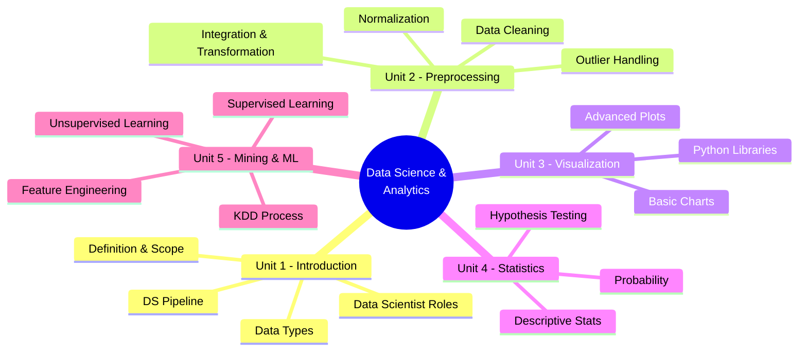
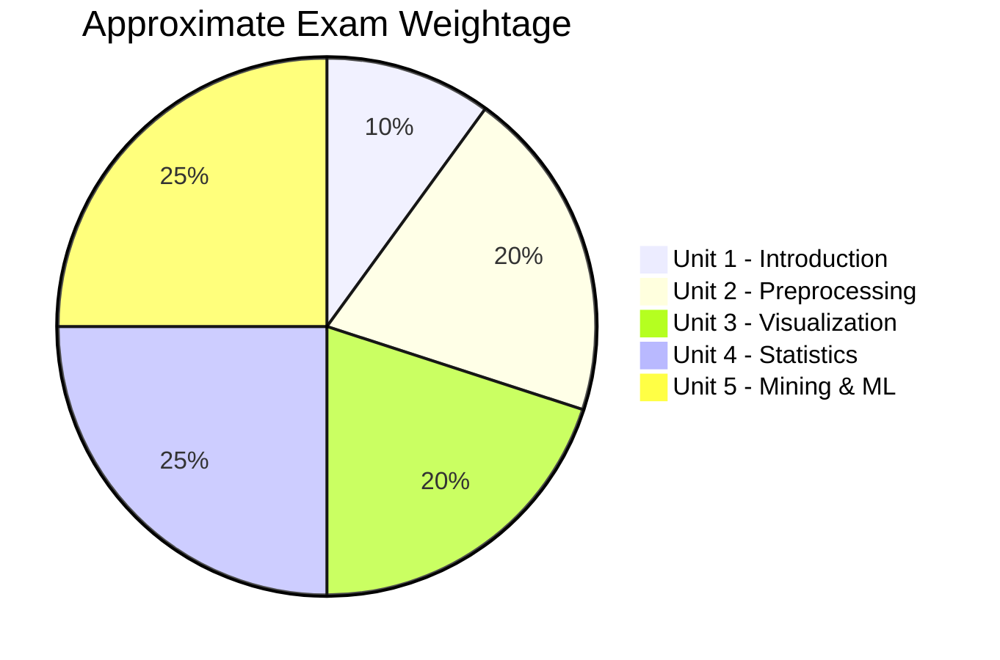

[[00-Dashboard/Home|Home]] | [[01-Semester-V/Semester-V-Dashboard|Semester V]] | [[Overview]] | [[Syllabus]] | [[Unit-1]] | [[Unit-2]] | [[Unit-3]] | [[Unit-4]] | [[Unit-5]] | [[Important-Questions|Imp. Qs]] | [[Revision]] | [[Interview-Prep]]

# CS-307-MJ-T: Data Science and Analytics

> [!important] Subject Information
> **Subject Code:** CS-307-MJ-T  
> **Type:** Major Theory  
> **Semester:** V (Third Year)  
> **University:** Savitribai Phule Pune University (SPPU)  
> **Credits:** 3

---

## Subject Map

---

## Units at a Glance

| Unit | Title | Key Topics | Weight |
|------|-------|------------|--------|
| [[Unit-1|Unit 1]] | Introduction to Data Science | DS definition, roles, data types, pipeline |  |
| [[Unit-2|Unit 2]] | Data Preprocessing | Cleaning, normalization, outliers, missing values |  |
| [[Unit-3|Unit 3]] | Data Visualization | Charts, plots, Matplotlib, Seaborn, Plotly |  |
| [[Unit-4|Unit 4]] | Statistics for Data Science | Descriptive stats, probability, hypothesis testing |  |
| [[Unit-5|Unit 5]] | Data Mining & Machine Learning | KDD, regression, classification, clustering |  |

---

## Learning Objectives

By the end of this course, students will be able to:

- [ ] Define data science and explain its scope, applications, and the role of a data scientist
- [ ] Apply data preprocessing techniques including cleaning, normalization, and outlier detection
- [ ] Create meaningful visualizations using Python libraries (Matplotlib, Seaborn, Plotly)
- [ ] Apply statistical concepts including descriptive statistics and hypothesis testing
- [ ] Implement basic machine learning algorithms (regression, classification, clustering)
- [ ] Understand the KDD process and data mining concepts
- [ ] Perform feature engineering and model evaluation

---

## Quick Navigation

| Document | Purpose |
|----------|---------|
| [[Syllabus]] | Detailed syllabus with topics |
| [[Unit-1]] | Introduction to Data Science |
| [[Unit-2]] | Data Preprocessing |
| [[Unit-3]] | Data Visualization |
| [[Unit-4]] | Statistics for Data Science |
| [[Unit-5]] | Data Mining & Machine Learning |
| [[Important-Questions]] | Exam-focused questions |
| [[Revision]] | Quick revision notes |
| [[Interview-Prep]] | Interview Q&A |

---

## Exam Blueprint

> [!tip] Exam Strategy
> Focus heavily on **Unit 4 (Statistics)** and **Unit 5 (ML)** - these typically carry 40–50% of exam marks. Units 2 and 3 are highly practical and coding-based.

---

## Tools & Technologies

| Tool | Purpose |
|------|---------|
| **Python 3.x** | Primary programming language |
| **NumPy** | Numerical computing |
| **Pandas** | Data manipulation |
| **Matplotlib** | Basic visualization |
| **Seaborn** | Statistical visualization |
| **Plotly** | Interactive visualization |
| **Scikit-learn** | Machine learning |
| **Jupyter Notebook** | Development environment |

---

## Reference Books

1. *Data Science from Scratch* - Joel Grus
2. *Python for Data Analysis* - Wes McKinney
3. *Hands-On Machine Learning with Scikit-Learn, Keras, and TensorFlow* - Aurélien Géron
4. *Introduction to Statistical Learning* - James, Witten, Hastie, Tibshirani
5. *Data Science and Big Data Analytics* - EMC Education Services

---

## Related Subjects

- [[01-Semester-V/CS-321-VSC-P-AI-ML/Overview|CS-321 AI/ML]] - Closely related; ML concepts overlap
- [[01-Semester-V/CS-302-MJ-T-Operating-Systems/Overview|CS-302 Database]] - Data storage foundation

---

*Last updated: 2026-06-16 | Semester V | SPPU*
