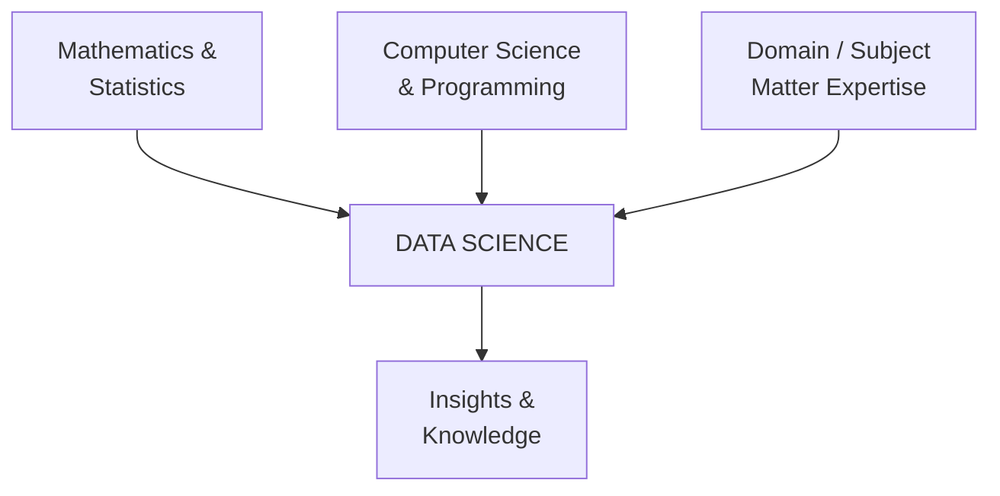
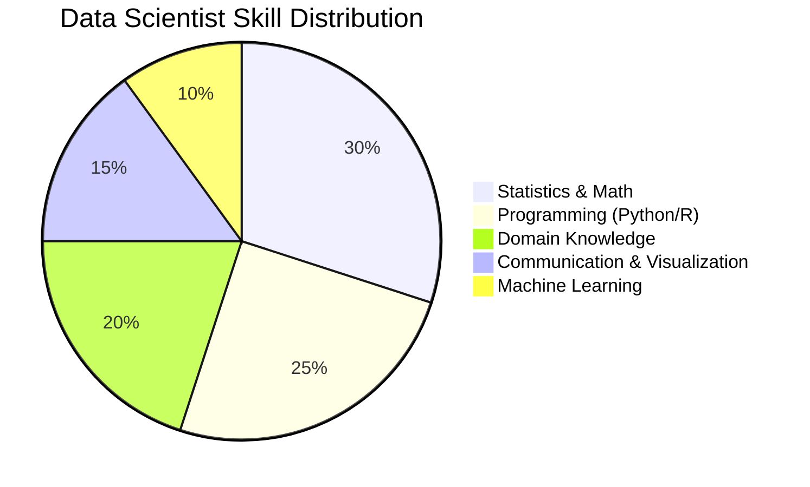
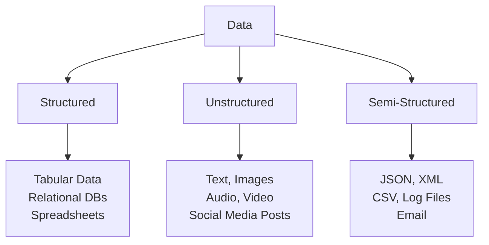
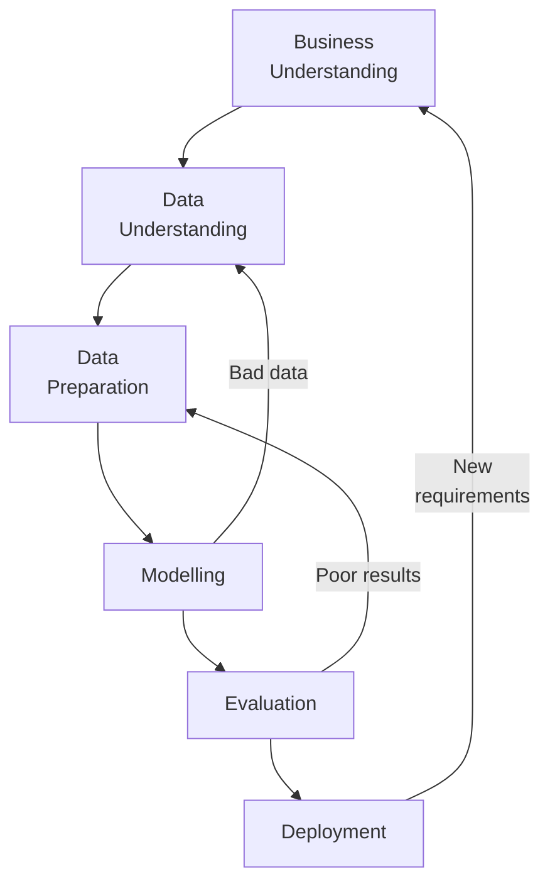

[[00-Dashboard/Home|Home]] | [[01-Semester-V/Semester-V-Dashboard|Semester V]] | [[Overview]] | [[Syllabus]] | [[Unit-1]] | [[Unit-2]] | [[Unit-3]] | [[Unit-4]] | [[Unit-5]] | [[Important-Questions|Imp. Qs]] | [[Revision]] | [[Interview-Prep]]


# Unit 1: Introduction to Data Science

> [!note] Navigation
> ← [[Syllabus]] | [[Overview]] | [[Unit-2]] →

---

## Learning Objectives

- [ ] Define data science and differentiate it from related fields
- [ ] Identify the roles within a data science team
- [ ] Classify data types: structured, unstructured, semi-structured
- [ ] Explain the data science process/pipeline (CRISP-DM)
- [ ] List real-world applications of data science

---

## 1.1 What is Data Science?

> [!important] Definition
> ==Data Science== is an interdisciplinary field that uses scientific methods, processes, algorithms, and systems to extract **knowledge and insights** from structured and unstructured data.

Data Science sits at the intersection of three domains:



### Data Science vs. Related Fields

| Field | Focus | Output |
|-------|-------|--------|
| **Statistics** | Mathematical analysis of data | Statistical conclusions |
| **Data Science** | Extracting insights + building models | Predictions, patterns |
| **Business Intelligence (BI)** | Reporting, dashboards, historical data | Business reports |
| **Machine Learning** | Learning patterns from data | Predictive models |
| **Data Engineering** | Building data pipelines | Clean, accessible data |

---

## 1.2 Scope and Applications

### Real-World Applications

| Domain | Application | Example |
|--------|-------------|---------|
| **Healthcare** | Disease prediction, drug discovery | Cancer detection from MRI scans |
| **Finance** | Fraud detection, credit scoring | Credit card anomaly detection |
| **E-commerce** | Recommendation systems | "Customers who bought X also bought Y" |
| **Social Media** | Sentiment analysis, trend detection | Twitter emotion analysis |
| **Transportation** | Route optimization, demand prediction | Uber surge pricing |
| **Agriculture** | Crop yield prediction | Soil quality analysis using satellite data |
| **Sports** | Player performance analysis | Moneyball (MLB analytics) |

> [!tip] Real-World Example
> **Netflix Recommendation System**: Netflix uses collaborative filtering and content-based filtering to recommend shows. This saves them **$1 billion per year** in customer retention.

---

## 1.3 The Data Scientist

### Skills Required (The "Unicorn" Data Scientist)



### Data Science Team Roles

| Role | Responsibilities |
|------|----------------|
| **Data Engineer** | Build pipelines, ETL, databases, infrastructure |
| **Data Analyst** | Query data, create reports, dashboards, SQL |
| **Data Scientist** | Build ML models, statistical analysis, feature engineering |
| **ML Engineer** | Deploy models, MLOps, scaling, productionization |
| **Business Analyst** | Translate business problems into data questions |

> [!note] Key Insight
> In small companies, one person may perform all roles. Large companies like Google/Amazon have dedicated teams for each role.

---

## 1.4 Data Types

### Primary Classification



### Structured Data
- ==Organized in rows and columns== (tabular format)
- Stored in relational databases (SQL)
- Easy to search and analyze
- **Example**: Customer table in MySQL database

### Unstructured Data
- ==No predefined format or schema==
- Represents ~80% of all data generated
- Requires NLP, Computer Vision to process
- **Example**: WhatsApp messages, Instagram photos, YouTube videos

### Semi-Structured Data
- ==Has some organization== but not strictly tabular
- Self-describing structure (tags, markers)
- **Example**:
```json
{
  "name": "Amit",
  "age": 21,
  "courses": ["Data Science", "AI/ML"],
  "address": {
    "city": "Pune",
    "state": "Maharashtra"
  }
}
```

### Statistical Data Types

| Level | Description | Operations | Example |
|-------|-------------|------------|---------|
| **Nominal** | Categories without order | =, ≠ | Colors: Red, Blue, Green |
| **Ordinal** | Ordered categories | =, ≠, <, > | Ratings: Poor, Good, Excellent |
| **Interval** | Ordered with equal intervals, no true zero | +, - | Temperature (°C) |
| **Ratio** | Interval with true zero | +, -, ×, ÷ | Height, Weight, Age |

> [!tip] Mnemonic: **NOIR** - Nominal, Ordinal, Interval, Ratio (increasing level of measurement)

---

## 1.5 Data Science Process / Pipeline

### CRISP-DM Model (Cross Industry Standard Process for Data Mining)



### Step-by-Step Pipeline

| Step | Description | Key Activities |
|------|-------------|----------------|
| **1. Business Understanding** | Define the problem | Objectives, success criteria, project plan |
| **2. Data Acquisition** | Collect relevant data | Web scraping, APIs, databases, surveys |
| **3. Data Preprocessing** | Clean and prepare data | Missing values, outliers, normalization |
| **4. EDA** | Explore data visually | Plots, correlations, distributions |
| **5. Modelling** | Build predictive models | Algorithm selection, training |
| **6. Evaluation** | Assess model performance | Accuracy, F1-score, AUC-ROC |
| **7. Deployment** | Put model into production | REST APIs, Docker, cloud deployment |

> [!important] Key Point
> Data preprocessing (steps 2–3) typically takes **60–70%** of a data scientist's time!

---

## 1.6 Python Code Examples

### Loading and Exploring Data

```python
import pandas as pd
import numpy as np
import matplotlib.pyplot as plt
import seaborn as sns

# Load dataset
df = pd.read_csv('data.csv')

# Basic exploration
print(df.shape)          # (rows, columns)
print(df.info())         # Data types and non-null counts
print(df.describe())     # Statistical summary
print(df.head())         # First 5 rows
print(df.dtypes)         # Data type of each column

# Check for missing values
print(df.isnull().sum())

# Value counts for categorical columns
print(df['category_col'].value_counts())
```

### Data Types in Python

```python
# Structured: DataFrame
import pandas as pd
df = pd.DataFrame({
    'Name': ['Alice', 'Bob'],
    'Age': [25, 30],
    'Score': [85.5, 92.0]
})

# Semi-Structured: JSON/Dict
import json
data = json.loads('{"name": "Alice", "age": 25}')

# Unstructured: Reading text
with open('text.txt', 'r') as f:
    text = f.read()
```

---

## Key Terms Summary

| Term | Definition |
|------|-----------|
| ==Data Science== | Interdisciplinary field combining stats, programming, and domain knowledge to extract insights |
| ==Structured Data== | Data in tabular (row-column) format |
| ==Unstructured Data== | Data with no predefined format (text, images) |
| ==CRISP-DM== | Standard methodology for data science projects |
| ==EDA== | Exploratory Data Analysis - visual and statistical exploration |
| ==Feature== | Individual measurable property/column of the data |
| ==Target Variable== | The variable we want to predict |

---

## Interview Questions - Unit 1

> [!question] Q1: What is the difference between data science and machine learning?
> **Answer**: Data Science is a broader field that encompasses data collection, cleaning, visualization, statistical analysis, and ML. Machine Learning is a *subset* of data science that focuses specifically on building predictive models that learn from data.

> [!question] Q2: What are the three types of data? Give examples.
> **Answer**: 
> - **Structured**: MySQL tables, Excel sheets
> - **Unstructured**: Images, audio, social media text
> - **Semi-Structured**: JSON, XML, CSV files

> [!question] Q3: What is CRISP-DM?
> **Answer**: CRISP-DM (Cross Industry Standard Process for Data Mining) is a standardized data science methodology with 6 phases: Business Understanding → Data Understanding → Data Preparation → Modelling → Evaluation → Deployment.

> [!question] Q4: What skills are required to be a data scientist?
> **Answer**: Mathematics/Statistics, Programming (Python/R), Machine Learning, Domain Knowledge, Data Visualization, and Communication skills.

> [!question] Q5: What is the difference between nominal and ordinal data?
> **Answer**: Nominal data has categories with no natural order (e.g., colors, gender), while Ordinal data has categories with a meaningful order (e.g., rankings, education level) but the intervals between categories may not be equal.

---

## Revision Summary

> [!summary] Unit 1 Key Points
> 1. Data Science = Statistics + Programming + Domain Knowledge
> 2. **3 data types**: Structured (tabular), Unstructured (text/image), Semi-structured (JSON/XML)
> 3. **4 measurement scales**: Nominal < Ordinal < Interval < Ratio
> 4. **CRISP-DM**: 6-phase iterative process (Business → Data → Prepare → Model → Evaluate → Deploy)
> 5. Data preprocessing takes 60-70% of a data scientist's time
> 6. Key roles: Data Engineer, Data Analyst, Data Scientist, ML Engineer

---

← [[Syllabus]] | [[Unit-2]] →

#data-science #unit-1 #SPPU #semester-5
