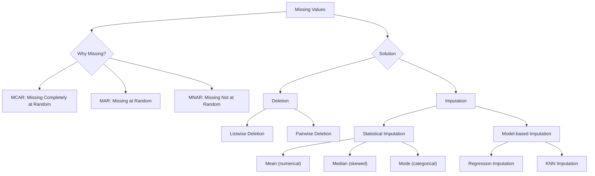

[[00-Dashboard/Home|Home]] | [[01-Semester-V/Semester-V-Dashboard|Semester V]] | [[Overview]] | [[Syllabus]] | [[Unit-1]] | [[Unit-2]] | [[Unit-3]] | [[Unit-4]] | [[Unit-5]] | [[Important-Questions|Imp. Qs]] | [[Revision]] | [[Interview-Prep]]


# Unit 2: Data Preprocessing

> [!note] Navigation
> ← [[Unit-1]] | [[Overview]] | [[Unit-3]] →

---

## Learning Objectives

- [ ] Identify and handle missing values using appropriate techniques
- [ ] Detect and treat outliers using Z-score and IQR methods
- [ ] Apply normalization and standardization techniques
- [ ] Perform data integration and transformation
- [ ] Implement data reduction and discretization

---

## 2.1 Why Preprocessing?

> [!important] Key Concept
> ==Data Preprocessing== is the process of transforming raw data into a clean, understandable format. Real-world data is often **dirty** - incomplete, inconsistent, noisy, and duplicate.

> [!warning] GIGO Principle
> **Garbage In, Garbage Out** - The quality of your model is directly determined by the quality of your data. Preprocessing is the most important step!

### Types of Data Quality Issues

| Issue | Description | Example |
|-------|-------------|---------|
| **Incomplete** | Missing values or attributes | Age column has `NaN` |
| **Noisy** | Errors or outliers in data | Salary = -5000 |
| **Inconsistent** | Contradictory data | DOB says 2010 but Age says 45 |
| **Duplicate** | Same record appears multiple times | Same customer twice |
| **Outdated** | Stale or irrelevant data | Old contact numbers |

---

## 2.2 Data Cleaning

### 2.2.1 Handling Missing Values



**Mathematical Formulas:**

$$\text{Mean} = \bar{x} = \frac{\sum_{i=1}^{n} x_i}{n}$$

$$\text{Median} = \begin{cases} x_{(n+1)/2} & \text{if } n \text{ is odd} \\ \frac{x_{n/2} + x_{n/2+1}}{2} & \text{if } n \text{ is even} \end{cases}$$

**When to use which:**
- **Mean**: When data is normally distributed, no outliers
- **Median**: When data is skewed or has outliers
- **Mode**: For categorical data

```python
import pandas as pd
import numpy as np
from sklearn.impute import SimpleImputer, KNNImputer

df = pd.read_csv('data.csv')

# Check missing values
print(df.isnull().sum())
print(f"Missing %: {df.isnull().mean() * 100}")

# 1. Drop rows with missing values
df_dropped = df.dropna()

# 2. Drop columns with >50% missing
df.dropna(axis=1, thresh=len(df)*0.5, inplace=True)

# 3. Fill with mean
df['age'].fillna(df['age'].mean(), inplace=True)

# 4. Fill with median
df['salary'].fillna(df['salary'].median(), inplace=True)

# 5. Fill with mode (categorical)
df['city'].fillna(df['city'].mode()[0], inplace=True)

# 6. KNN Imputer (advanced)
imputer = KNNImputer(n_neighbors=5)
df_imputed = imputer.fit_transform(df[['age', 'salary']])
```

### 2.2.2 Handling Outliers

> [!important] Definition
> ==Outliers== are data points that deviate significantly from other observations. They can distort statistical analysis and model performance.

**Method 1: Z-Score Method**

$$z = \frac{x - \mu}{\sigma}$$

If $|z| > 3$, the point is considered an outlier (3-sigma rule).

```python
from scipy import stats

# Z-score method
z_scores = np.abs(stats.zscore(df['salary']))
df_clean = df[(z_scores < 3)]

# Visualize
plt.figure(figsize=(10, 4))
plt.subplot(1, 2, 1)
plt.boxplot(df['salary'])
plt.title('Before Outlier Removal')
plt.subplot(1, 2, 2)
plt.boxplot(df_clean['salary'])
plt.title('After Outlier Removal')
plt.show()
```

**Method 2: IQR (Interquartile Range) Method**

$$IQR = Q_3 - Q_1$$
$$\text{Lower Bound} = Q_1 - 1.5 \times IQR$$
$$\text{Upper Bound} = Q_3 + 1.5 \times IQR$$

Any value outside [Lower Bound, Upper Bound] is an outlier.

```python
# IQR Method
Q1 = df['salary'].quantile(0.25)
Q3 = df['salary'].quantile(0.75)
IQR = Q3 - Q1

lower_bound = Q1 - 1.5 * IQR
upper_bound = Q3 + 1.5 * IQR

# Remove outliers
df_clean = df[(df['salary'] >= lower_bound) & (df['salary'] <= upper_bound)]

# Or cap/clip outliers (Winsorizing)
df['salary'] = df['salary'].clip(lower=lower_bound, upper=upper_bound)

print(f"Q1: {Q1}, Q3: {Q3}, IQR: {IQR}")
print(f"Bounds: [{lower_bound:.2f}, {upper_bound:.2f}]")
print(f"Outliers removed: {len(df) - len(df_clean)}")
```

### 2.2.3 Handling Duplicates

```python
# Check duplicates
print(f"Duplicate rows: {df.duplicated().sum()}")

# Remove duplicates
df.drop_duplicates(inplace=True)

# Remove duplicates based on specific columns
df.drop_duplicates(subset=['email', 'phone'], keep='first', inplace=True)
```

---

## 2.3 Data Integration

> [!note] Definition
> ==Data Integration== combines data from multiple sources into a coherent data store.

**Challenges:**
- **Schema Integration**: Different databases may use different names for same attribute
  - e.g., `cust_id` vs `customer_id` vs `clientID`
- **Entity Identification**: Same real-world object represented differently
- **Redundancy**: Same information stored multiple times → Use correlation analysis

```python
# Merging DataFrames (SQL-like JOIN)
df_merged = pd.merge(df_customers, df_orders, 
                     on='customer_id', 
                     how='left')   # left, right, inner, outer

# Concatenating DataFrames
df_combined = pd.concat([df_2023, df_2024], 
                        axis=0,     # 0=rows, 1=columns
                        ignore_index=True)
```

---

## 2.4 Data Transformation

### 2.4.1 Normalization

> [!important] Key Distinction
> - ==Normalization==: Scales features to a **fixed range** [0, 1] → Min-Max scaling
> - ==Standardization==: Transforms features to have **mean=0, std=1** → Z-score scaling

**Min-Max Normalization:**

$$x_{norm} = \frac{x - x_{min}}{x_{max} - x_{min}}$$

Result: $x_{norm} \in [0, 1]$

**Z-Score Standardization:**

$$x_{std} = \frac{x - \mu}{\sigma}$$

Result: Mean=0, StdDev=1

**Decimal Scaling:**

$$x_{scaled} = \frac{x}{10^j}$$

where $j$ is the smallest integer such that $\max(|x_{scaled}|) < 1$

```python
from sklearn.preprocessing import MinMaxScaler, StandardScaler, RobustScaler

# 1. Min-Max Normalization
scaler = MinMaxScaler()
df[['age', 'salary']] = scaler.fit_transform(df[['age', 'salary']])

# 2. Z-Score Standardization
scaler = StandardScaler()
df_std = scaler.fit_transform(df[['age', 'salary']])

# 3. Robust Scaler (good for outliers, uses IQR)
robust_scaler = RobustScaler()
df_robust = robust_scaler.fit_transform(df[['age', 'salary']])

# Manual Min-Max
df['age_norm'] = (df['age'] - df['age'].min()) / (df['age'].max() - df['age'].min())

# Manual Z-score
df['age_std'] = (df['age'] - df['age'].mean()) / df['age'].std()
```

| Method | Formula | Range | Use When |
|--------|---------|-------|----------|
| Min-Max | (x-min)/(max-min) | [0, 1] | Known range, no extreme outliers |
| Z-Score | (x-μ)/σ | (-∞, +∞) | Normal distribution, unknown range |
| Robust | (x-Q2)/(Q3-Q1) | Unbounded | Many outliers in data |

### 2.4.2 Encoding Categorical Variables

```python
# 1. Label Encoding (for ordinal data)
from sklearn.preprocessing import LabelEncoder
le = LabelEncoder()
df['education'] = le.fit_transform(df['education'])
# 'High School'=0, 'Bachelor'=1, 'Master'=2, 'PhD'=3

# 2. One-Hot Encoding (for nominal data)
df_encoded = pd.get_dummies(df, columns=['city', 'gender'], drop_first=True)

# sklearn version
from sklearn.preprocessing import OneHotEncoder
ohe = OneHotEncoder(sparse=False, drop='first')
```

---

## 2.5 Data Reduction

> [!note] Purpose
> Reduce the size of data while maintaining the analytical integrity.

### Strategies:

1. **Dimensionality Reduction**: Reduce number of features
   - PCA (Principal Component Analysis)
   - Feature Selection (Remove irrelevant/redundant features)

2. **Numerosity Reduction**: Reduce number of data points
   - Sampling (random, stratified)
   - Clustering (replace with cluster centroids)
   - Histograms (aggregation)

3. **Data Compression**: Lossless/Lossy compression

```python
# Feature Selection using correlation
correlation_matrix = df.corr()
# Remove features with correlation > 0.95 (highly redundant)
upper_tri = correlation_matrix.where(
    np.triu(np.ones(correlation_matrix.shape), k=1).astype(bool)
)
to_drop = [col for col in upper_tri.columns if any(upper_tri[col] > 0.95)]
df.drop(columns=to_drop, inplace=True)

# PCA for dimensionality reduction
from sklearn.decomposition import PCA
pca = PCA(n_components=2)    # Keep top 2 components
df_reduced = pca.fit_transform(df_scaled)
print(f"Explained variance: {pca.explained_variance_ratio_}")
```

---

## 2.6 Data Discretization

> [!note] Definition
> ==Discretization== converts continuous data into discrete/categorical intervals (bins).

### Methods:

**Equal-Width Binning:**

$$\text{Width} = \frac{max - min}{k}$$

where $k$ = number of bins

**Equal-Frequency Binning (Quantile-based):**

Each bin contains the same number of data points.

```python
# Equal-width binning
df['age_bin'] = pd.cut(df['age'], 
                        bins=5, 
                        labels=['Child', 'Teen', 'Young', 'Middle', 'Senior'])

# Equal-frequency binning
df['salary_quantile'] = pd.qcut(df['salary'], 
                                  q=4, 
                                  labels=['Low', 'Medium', 'High', 'Very High'])

# Custom bins
df['age_group'] = pd.cut(df['age'], 
                          bins=[0, 18, 35, 60, 100], 
                          labels=['Youth', 'Young Adult', 'Adult', 'Senior'])
```

---

## 2.7 Complete Preprocessing Pipeline

```python
import pandas as pd
import numpy as np
from sklearn.pipeline import Pipeline
from sklearn.preprocessing import StandardScaler, OneHotEncoder
from sklearn.impute import SimpleImputer
from sklearn.compose import ColumnTransformer

# Identify column types
numeric_features = ['age', 'salary', 'experience']
categorical_features = ['city', 'department', 'gender']

# Numeric pipeline
numeric_transformer = Pipeline(steps=[
    ('imputer', SimpleImputer(strategy='median')),
    ('scaler', StandardScaler())
])

# Categorical pipeline
categorical_transformer = Pipeline(steps=[
    ('imputer', SimpleImputer(strategy='most_frequent')),
    ('encoder', OneHotEncoder(handle_unknown='ignore', drop='first'))
])

# Combine with ColumnTransformer
preprocessor = ColumnTransformer(
    transformers=[
        ('num', numeric_transformer, numeric_features),
        ('cat', categorical_transformer, categorical_features)
    ]
)

# Fit and transform
X_processed = preprocessor.fit_transform(X_train)
X_test_processed = preprocessor.transform(X_test)  # Only transform!
```

> [!warning] Important: `fit_transform()` on training data, `transform()` only on test data to prevent data leakage!

---

## Key Formulas Quick Reference

| Technique | Formula |
|-----------|---------|
| Z-Score | $z = \frac{x - \mu}{\sigma}$ |
| Outlier (Z) | $|z| > 3$ |
| IQR | $IQR = Q_3 - Q_1$ |
| Outlier (IQR) | $x < Q_1 - 1.5\cdot IQR$ or $x > Q_3 + 1.5\cdot IQR$ |
| Min-Max | $\frac{x - x_{min}}{x_{max} - x_{min}}$ |
| Z-Score Norm | $\frac{x - \mu}{\sigma}$ |
| Equal-Width Bin | $width = \frac{max - min}{k}$ |

---

## Interview Questions - Unit 2

> [!question] Q1: What is the difference between normalization and standardization?
> **Answer**: 
> - **Normalization (Min-Max)**: Scales data to [0,1] using $(x-min)/(max-min)$. Sensitive to outliers. Used when you need bounded output.
> - **Standardization (Z-score)**: Scales to mean=0, std=1 using $(x-μ)/σ$. Robust to outliers. Used for algorithms assuming normal distribution (SVM, Linear Regression).

> [!question] Q2: What are the different methods to handle missing values?
> **Answer**:
> 1. **Deletion**: Remove rows/columns (risky if much data lost)
> 2. **Mean imputation**: Replace with mean (normal distribution)
> 3. **Median imputation**: Replace with median (skewed data)
> 4. **Mode imputation**: For categorical data
> 5. **KNN imputation**: Use K nearest similar records
> 6. **Regression imputation**: Predict missing value using other features

> [!question] Q3: How do you detect outliers?
> **Answer**:
> 1. **Z-Score**: Values with |z| > 3 are outliers
> 2. **IQR Method**: Values below Q1-1.5×IQR or above Q3+1.5×IQR
> 3. **Visual**: Boxplots, scatter plots

> [!question] Q4: What is data discretization and when is it used?
> **Answer**: Discretization converts continuous values into categorical bins. Used when algorithms require categorical input, to reduce noise, and to improve interpretability. Methods: Equal-width binning, Equal-frequency binning, Entropy-based.

> [!question] Q5: What is the difference between data cleaning and data transformation?
> **Answer**: 
> - **Cleaning**: Fixing or removing incorrect, corrupted, or duplicate records
> - **Transformation**: Converting data into a suitable format/scale for analysis (normalization, encoding, binning)

---

## Revision Summary

> [!summary] Unit 2 Key Points
> 1. **Missing values**: Delete (small %) or Impute (Mean/Median/Mode/KNN)
> 2. **Outliers**: Z-score ($|z|>3$) or IQR ($Q_1-1.5\cdot IQR$ to $Q_3+1.5\cdot IQR$)
> 3. **Normalization**: Min-Max → [0,1] | Standardization: Z-score → mean=0, std=1
> 4. **Encoding**: Label Encoding (ordinal) | One-Hot Encoding (nominal)
> 5. **Binning**: Equal-width or Equal-frequency
> 6. **ALWAYS**: fit_transform on train, only transform on test data!

---

← [[Unit-1]] | [[Unit-3]] →

#data-science #unit-2 #preprocessing #SPPU #semester-5
