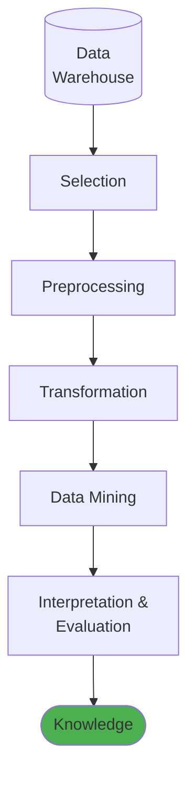
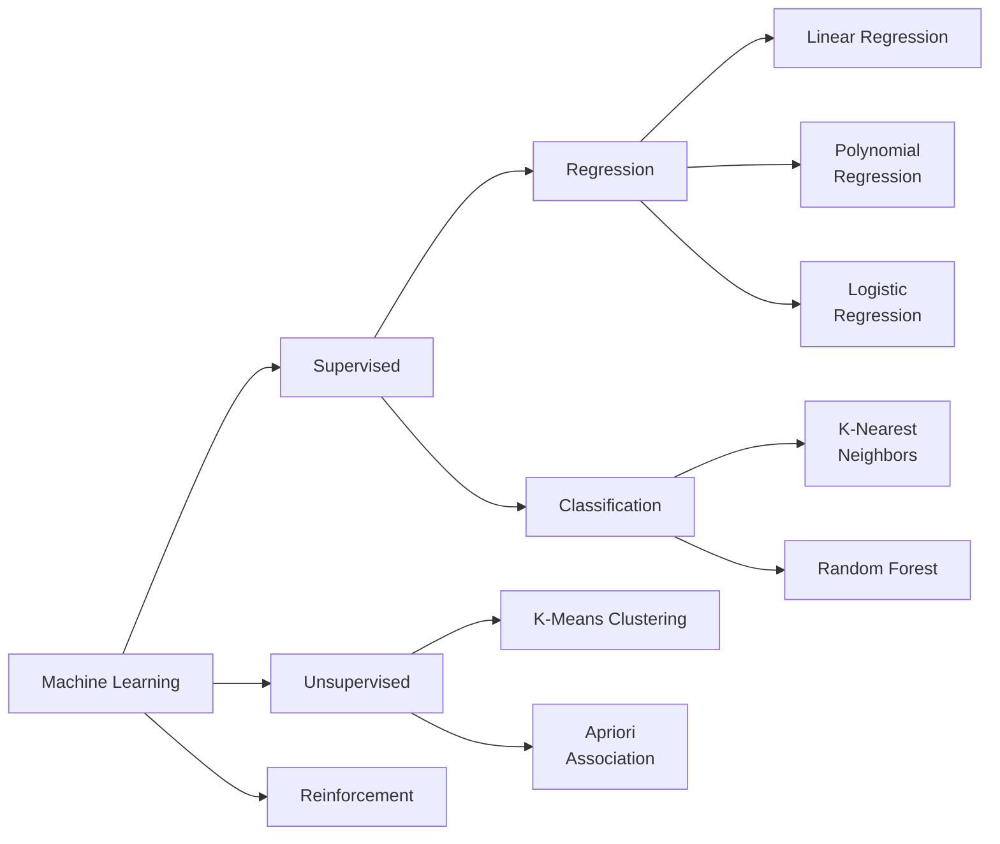
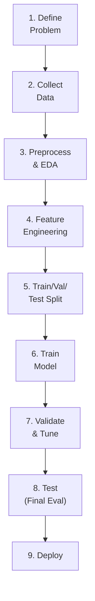

[[00-Dashboard/Home|Home]] | [[01-Semester-V/Semester-V-Dashboard|Semester V]] | [[Overview]] | [[Syllabus]] | [[Unit-1]] | [[Unit-2]] | [[Unit-3]] | [[Unit-4]] | [[Unit-5]] | [[Important-Questions|Imp. Qs]] | [[Revision]] | [[Interview-Prep]]


# Unit 5: Introduction to Data Mining & Machine Learning

> [!note] Navigation
> ← [[Unit-4]] | [[Overview]] | [[Important-Questions]] →

---

## Learning Objectives

- [ ] Explain the KDD process and distinguish data mining from ML
- [ ] Implement the ML modelling process end-to-end
- [ ] Apply Linear, Polynomial, and Logistic Regression
- [ ] Implement KNN and Random Forest classification
- [ ] Perform K-Means clustering and interpret results
- [ ] Apply Apriori algorithm and interpret Association Rules

---

## 5.1 Data Mining Concepts

> [!important] Definition
> ==Data Mining== is the process of discovering hidden patterns, correlations, anomalies, and useful knowledge from large amounts of data stored in databases, data warehouses, or other repositories.

### Data Mining vs. Machine Learning

| Aspect | Data Mining | Machine Learning |
|--------|-------------|-----------------|
| **Focus** | Discovery of patterns | Building predictive models |
| **Data** | Large historical databases | Training datasets |
| **Goal** | Extract knowledge | Generalize to new data |
| **Output** | Rules, patterns, insights | Trained model |
| **Human involvement** | High (exploration) | Moderate (training) |
| **Relation** | Broader discipline | Technique used in DM |

### Applications of Data Mining

| Domain | Application |
|--------|-------------|
| **Market basket analysis** | What products are bought together? |
| **Customer segmentation** | Group customers by behavior |
| **Fraud detection** | Unusual transaction patterns |
| **Medical diagnosis** | Disease pattern recognition |
| **Web mining** | User click-stream analysis |
| **Text mining** | Document classification, sentiment |

---

## 5.2 KDD Process (Knowledge Discovery in Databases)



**Steps:**

| Step | Description | Activities |
|------|-------------|------------|
| **1. Selection** | Select relevant data | Identify target data, variables |
| **2. Preprocessing** | Clean & handle missing data | Remove noise, handle missing values |
| **3. Transformation** | Convert to mining format | Normalization, discretization |
| **4. Data Mining** | Apply algorithms | Classification, clustering, association |
| **5. Interpretation** | Evaluate & visualize results | Validate patterns, make decisions |

> [!note] KDD vs. CRISP-DM
> KDD is older (database-focused), while CRISP-DM is more comprehensive and industry-oriented. Both describe the data science workflow but at different abstraction levels.

---

## 5.3 Machine Learning Fundamentals

### 5.3.1 Types of ML (Review)



### 5.3.2 Feature Engineering

> [!important] Feature Engineering
> ==Feature Engineering== is the process of using domain knowledge to create, transform, or select features (input variables) that make ML algorithms work better.

**Types:**
1. **Feature Creation**: Derive new features from existing ones
   - `BMI = weight / height²`
   - `Age from birthdate`
   - `Day of week from timestamp`
2. **Feature Transformation**: Change feature representation
   - Log transform for skewed features
   - Polynomial features
3. **Feature Selection**: Remove irrelevant/redundant features
   - Filter methods (correlation, chi-square)
   - Wrapper methods (RFE)
   - Embedded methods (Lasso L1)

```python
import pandas as pd
import numpy as np
from sklearn.feature_selection import SelectKBest, f_classif, RFE
from sklearn.linear_model import LogisticRegression

# Feature Creation
df['bmi'] = df['weight'] / (df['height'] ** 2)
df['age_squared'] = df['age'] ** 2
df['log_income'] = np.log1p(df['income'])  # log(1+x) handles zeros

# Polynomial Features
from sklearn.preprocessing import PolynomialFeatures
poly = PolynomialFeatures(degree=2, include_bias=False)
X_poly = poly.fit_transform(X)
print(f"Original: {X.shape[1]} features → Polynomial: {X_poly.shape[1]} features")

# Feature Selection: Filter (Statistical)
selector = SelectKBest(score_func=f_classif, k=5)  # Top 5 features
X_selected = selector.fit_transform(X, y)

# Feature Selection: Wrapper (RFE)
rfe = RFE(estimator=LogisticRegression(), n_features_to_select=5)
X_rfe = rfe.fit_transform(X, y)
print("Selected features:", rfe.support_)
```

### 5.3.3 ML Modelling Process



---

## 5.4 Regression Algorithms

### 5.4.1 Linear Regression (Recap)

$$\hat{y} = \beta_0 + \beta_1 x_1 + \beta_2 x_2 + \cdots + \beta_n x_n$$

```python
from sklearn.linear_model import LinearRegression
from sklearn.metrics import mean_squared_error, r2_score

# Simple Linear Regression
lr = LinearRegression()
lr.fit(X_train, y_train)
y_pred = lr.predict(X_test)

print(f"R²: {r2_score(y_test, y_pred):.4f}")
print(f"RMSE: {mean_squared_error(y_test, y_pred, squared=False):.4f}")
```

### 5.4.2 Polynomial Regression

> [!note] Polynomial Regression
> Extends linear regression to model **non-linear relationships** by adding polynomial terms.

$$\hat{y} = \beta_0 + \beta_1 x + \beta_2 x^2 + \cdots + \beta_d x^d$$

```python
from sklearn.preprocessing import PolynomialFeatures
from sklearn.pipeline import Pipeline
from sklearn.linear_model import LinearRegression
import numpy as np
import matplotlib.pyplot as plt

# Generate non-linear data
np.random.seed(42)
X_data = np.sort(np.random.rand(50) * 6 - 3).reshape(-1, 1)
y_data = 0.5 * X_data.ravel()**3 - X_data.ravel()**2 + 2 + np.random.randn(50)

fig, axes = plt.subplots(1, 3, figsize=(15, 4))

for i, degree in enumerate([1, 3, 10]):
    model = Pipeline([
        ('poly', PolynomialFeatures(degree=degree)),
        ('linear', LinearRegression())
    ])
    model.fit(X_data, y_data)
    
    X_plot = np.linspace(-3, 3, 300).reshape(-1, 1)
    y_plot = model.predict(X_plot)
    
    axes[i].scatter(X_data, y_data, color='blue', label='Data', s=30)
    axes[i].plot(X_plot, y_plot, 'r-', label=f'Degree {degree}')
    axes[i].set_title(f'Polynomial Degree {degree}')
    axes[i].legend()

plt.suptitle('Polynomial Regression - Degree Comparison')
plt.tight_layout()
plt.show()
```

### 5.4.3 Logistic Regression (for Classification)

$$P(y=1|x) = \sigma(\mathbf{w}^T\mathbf{x}) = \frac{1}{1 + e^{-(\beta_0 + \beta_1x_1 + \cdots)}}$$

```python
from sklearn.linear_model import LogisticRegression
from sklearn.datasets import load_breast_cancer

X, y = load_breast_cancer(return_X_y=True)
X_train, X_test, y_train, y_test = train_test_split(X, y, test_size=0.2, random_state=42)

scaler = StandardScaler()
X_train_sc = scaler.fit_transform(X_train)
X_test_sc = scaler.transform(X_test)

log_reg = LogisticRegression(C=1.0, max_iter=1000)
log_reg.fit(X_train_sc, y_train)
print(f"Logistic Regression Accuracy: {log_reg.score(X_test_sc, y_test):.4f}")
```

---

## 5.5 Classification Algorithms

### 5.5.1 K-Nearest Neighbors (KNN)

$$d(p, q) = \sqrt{\sum_{i=1}^{n}(p_i - q_i)^2}$$

```python
from sklearn.neighbors import KNeighborsClassifier

# Find best K
from sklearn.model_selection import cross_val_score
k_scores = []
for k in range(1, 21):
    knn = KNeighborsClassifier(n_neighbors=k)
    scores = cross_val_score(knn, X_train_sc, y_train, cv=5, scoring='accuracy')
    k_scores.append(scores.mean())

best_k = k_scores.index(max(k_scores)) + 1
print(f"Best K: {best_k}, Accuracy: {max(k_scores):.4f}")

knn = KNeighborsClassifier(n_neighbors=best_k)
knn.fit(X_train_sc, y_train)
print(f"KNN Test Accuracy: {knn.score(X_test_sc, y_test):.4f}")
```

### 5.5.2 Random Forest

```python
from sklearn.ensemble import RandomForestClassifier
from sklearn.model_selection import GridSearchCV

# Hyperparameter tuning with Grid Search
param_grid = {
    'n_estimators': [50, 100, 200],
    'max_depth': [None, 5, 10],
    'min_samples_split': [2, 5]
}

rf = RandomForestClassifier(random_state=42)
grid_search = GridSearchCV(rf, param_grid, cv=5, scoring='accuracy', n_jobs=-1)
grid_search.fit(X_train, y_train)

best_rf = grid_search.best_estimator_
print(f"Best Params: {grid_search.best_params_}")
print(f"Random Forest Test Accuracy: {best_rf.score(X_test, y_test):.4f}")
```

---

## 5.6 Unsupervised Learning

### 5.6.1 K-Means Clustering

> [!important] K-Means Algorithm
> 1. **Initialize**: Place K centroids randomly
> 2. **Assign**: Each point → nearest centroid (by Euclidean distance)
> 3. **Update**: Recompute centroids as mean of cluster points
> 4. **Repeat**: Steps 2–3 until convergence (no change)

**Objective (minimize inertia/WCSS):**
$$J = \sum_{j=1}^{K}\sum_{x_i \in C_j} |x_i - \mu_j|^2$$

**Elbow Method to choose K:**

```python
from sklearn.cluster import KMeans
from sklearn.preprocessing import StandardScaler
import matplotlib.pyplot as plt

# Load and scale data
from sklearn.datasets import make_blobs
X_cluster, y_true = make_blobs(n_samples=300, centers=4, random_state=42)

scaler = StandardScaler()
X_scaled = scaler.fit_transform(X_cluster)

# Elbow Method
inertias = []
silhouettes = []
K_range = range(2, 11)

from sklearn.metrics import silhouette_score

for k in K_range:
    km = KMeans(n_clusters=k, random_state=42, n_init=10)
    km.fit(X_scaled)
    inertias.append(km.inertia_)
    silhouettes.append(silhouette_score(X_scaled, km.labels_))

fig, axes = plt.subplots(1, 2, figsize=(12, 4))

axes[0].plot(K_range, inertias, 'b-o')
axes[0].set_xlabel('K')
axes[0].set_ylabel('Inertia (WCSS)')
axes[0].set_title('Elbow Method')
axes[0].axvline(x=4, color='red', linestyle='--', label='Optimal K=4')
axes[0].legend()

axes[1].plot(K_range, silhouettes, 'g-o')
axes[1].set_xlabel('K')
axes[1].set_ylabel('Silhouette Score')
axes[1].set_title('Silhouette Score (higher=better)')

plt.tight_layout()
plt.show()

# Final K-Means with optimal K
km = KMeans(n_clusters=4, random_state=42, n_init=10)
labels = km.fit_predict(X_scaled)

plt.figure(figsize=(8, 6))
scatter = plt.scatter(X_scaled[:, 0], X_scaled[:, 1], c=labels, cmap='Set1', s=50)
plt.scatter(km.cluster_centers_[:, 0], km.cluster_centers_[:, 1], 
            c='black', s=200, marker='X', label='Centroids')
plt.title(f'K-Means Clustering (K=4)\nSilhouette: {silhouette_score(X_scaled, labels):.3f}')
plt.legend()
plt.show()
```

### 5.6.2 Apriori Algorithm (Association Rule Mining)

> [!important] Key Concepts
> - **Itemset**: Set of items appearing together in a transaction
> - **Support**: How frequently an itemset appears
> - **Confidence**: How often the rule is correct
> - **Lift**: How much better the rule is than random chance

$$\text{Support}(A \rightarrow B) = \frac{\text{Transactions containing A and B}}{N}$$

$$\text{Confidence}(A \rightarrow B) = \frac{\text{Support}(A \cup B)}{\text{Support}(A)}$$

$$\text{Lift}(A \rightarrow B) = \frac{\text{Confidence}(A \rightarrow B)}{\text{Support}(B)}$$

**Interpretation of Lift:**
- Lift > 1: A and B are positively correlated (appear together more than chance)
- Lift = 1: A and B are independent
- Lift < 1: A and B are negatively correlated

**Apriori Principle**: If an itemset is frequent, all its subsets must also be frequent. (Anti-monotone property - prunes search space!)

**Example:**

| Transaction | Items |
|------------|-------|
| T1 | Bread, Milk, Butter |
| T2 | Bread, Milk |
| T3 | Bread, Butter |
| T4 | Milk, Butter |
| T5 | Bread, Milk, Butter |

With min_support = 0.6 (3/5), min_confidence = 0.7:

- Support({Bread}) = 4/5 = 0.8 
- Support({Milk}) = 4/5 = 0.8   
- Support({Bread, Milk}) = 3/5 = 0.6 
- Confidence(Bread→Milk) = 0.6/0.8 = 0.75 
- Lift(Bread→Milk) = 0.75/0.8 = 0.9375

```python
# Install: pip install mlxtend
from mlxtend.frequent_patterns import apriori, association_rules
from mlxtend.preprocessing import TransactionEncoder
import pandas as pd

# Sample transaction database
transactions = [
    ['Bread', 'Milk', 'Butter'],
    ['Bread', 'Milk'],
    ['Bread', 'Butter'],
    ['Milk', 'Butter'],
    ['Bread', 'Milk', 'Butter'],
    ['Bread', 'Eggs'],
    ['Milk', 'Eggs'],
    ['Bread', 'Milk', 'Eggs']
]

# Encode transactions
te = TransactionEncoder()
te_array = te.fit_transform(transactions)
df_transactions = pd.DataFrame(te_array, columns=te.columns_)

# Find frequent itemsets
frequent_itemsets = apriori(df_transactions, 
                             min_support=0.3, 
                             use_colnames=True)
print("Frequent Itemsets:")
print(frequent_itemsets.sort_values('support', ascending=False))

# Generate association rules
rules = association_rules(frequent_itemsets, 
                          metric='confidence', 
                          min_threshold=0.6)
rules = rules.sort_values('lift', ascending=False)

print("\nAssociation Rules (sorted by lift):")
print(rules[['antecedents', 'consequents', 'support', 'confidence', 'lift']].head(10))

# Filter strong rules
strong_rules = rules[(rules['confidence'] >= 0.7) & (rules['lift'] >= 1.0)]
print(f"\nStrong rules found: {len(strong_rules)}")
```

---

## 5.7 Model Evaluation and Selection

```python
from sklearn.model_selection import cross_val_score
from sklearn.metrics import (classification_report, confusion_matrix,
                              accuracy_score, roc_auc_score)
import warnings
warnings.filterwarnings('ignore')

# Compare multiple models
from sklearn.linear_model import LogisticRegression
from sklearn.tree import DecisionTreeClassifier
from sklearn.ensemble import RandomForestClassifier
from sklearn.neighbors import KNeighborsClassifier
from sklearn.svm import SVC

models = {
    'Logistic Regression': LogisticRegression(max_iter=1000),
    'Decision Tree': DecisionTreeClassifier(max_depth=5, random_state=42),
    'Random Forest': RandomForestClassifier(n_estimators=100, random_state=42),
    'KNN': KNeighborsClassifier(n_neighbors=5),
    'SVM': SVC(kernel='rbf', probability=True, random_state=42)
}

print("Model Comparison (5-Fold CV):")
print(f"{'Model':<22} {'Accuracy':>10} {'Std':>8}")
print("-" * 42)

for name, model in models.items():
    scores = cross_val_score(model, X_scaled, y, cv=5, scoring='accuracy')
    print(f"{name:<22} {scores.mean():>10.4f} {scores.std():>8.4f}")
```

---

## Interview Questions - Unit 5

> [!question] Q1: What is the difference between Data Mining and Machine Learning?
> **Answer**: Data Mining is a process of discovering patterns in large datasets from databases (KDD process). ML is a method/technique used in data mining to build models that learn from data. ML is a *subset* of DM's toolkit. Data Mining also includes statistics, database queries, and visualization. Machine Learning focuses specifically on algorithmic learning from data.

> [!question] Q2: Explain the Apriori algorithm. What is the Apriori Principle?
> **Answer**: Apriori is an association rule mining algorithm. It finds frequent itemsets in transactions:
> 1. Generate frequent 1-itemsets (meet min_support)
> 2. Generate 2-itemsets from frequent 1-itemsets, prune infrequent ones
> 3. Continue until no new frequent itemsets
> 4. Generate rules from frequent itemsets
> **Apriori Principle**: If an itemset is infrequent, ALL its supersets are also infrequent → Allows massive pruning of search space.

> [!question] Q3: How do you choose the optimal number of clusters K in K-Means?
> **Answer**: 
> 1. **Elbow Method**: Plot inertia (WCSS) vs K. The "elbow" point where inertia stops decreasing sharply is optimal K.
> 2. **Silhouette Score**: Measures how similar a point is to its own cluster vs other clusters. Range [-1, 1]. Higher is better. Choose K with highest silhouette score.
> 3. **Domain Knowledge**: Business context may dictate K (e.g., marketing needs 5 customer segments).

> [!question] Q4: What is Feature Engineering? Give examples.
> **Answer**: Process of using domain knowledge to create/transform features to improve model performance.
> - Creating: BMI from height+weight, day of week from date
> - Transforming: Log transform for skewed data, polynomial features for non-linear data
> - Selecting: Removing highly correlated features using correlation matrix; using Lasso for L1-based selection
> Good feature engineering is often more impactful than algorithm selection!

> [!question] Q5: What are the limitations of K-Means clustering?
> **Answer**:
> 1. Must specify K in advance
> 2. Sensitive to initial centroid placement (use k-means++ initialization)
> 3. Assumes spherical, equally-sized clusters
> 4. Sensitive to outliers (use K-Medoids instead)
> 5. Struggles with non-globular cluster shapes
> 6. Only works with numerical data

---

## Revision Summary

> [!summary] Unit 5 Key Points
> 1. **KDD**: Selection → Preprocessing → Transformation → Mining → Interpretation
> 2. **Feature Engineering**: Create, Transform, Select features
> 3. **Linear Reg**: Predicts continuous y; OLS/Gradient Descent; R² metric
> 4. **Polynomial Reg**: Non-linear relationships; add polynomial features
> 5. **Logistic Reg**: Binary classification; sigmoid function; log-loss
> 6. **K-Means**: K centroids; minimize WCSS; Elbow method for K; Silhouette score
> 7. **Apriori**: Support, Confidence, Lift; Apriori principle prunes search
> 8. **Support** = P(A∩B); **Confidence** = P(B|A); **Lift** > 1 means positive correlation

---

← [[Unit-4]] | [[Important-Questions]] →

#data-science #unit-5 #data-mining #machine-learning #SPPU #semester-5
