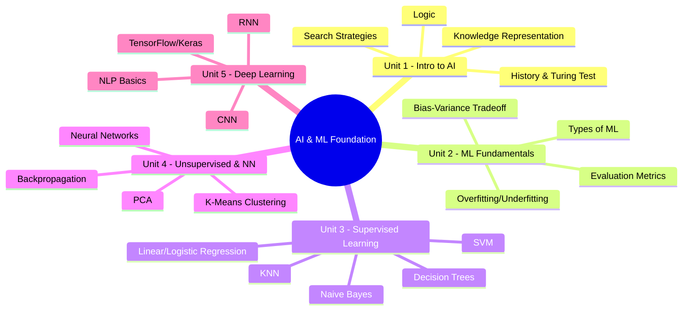
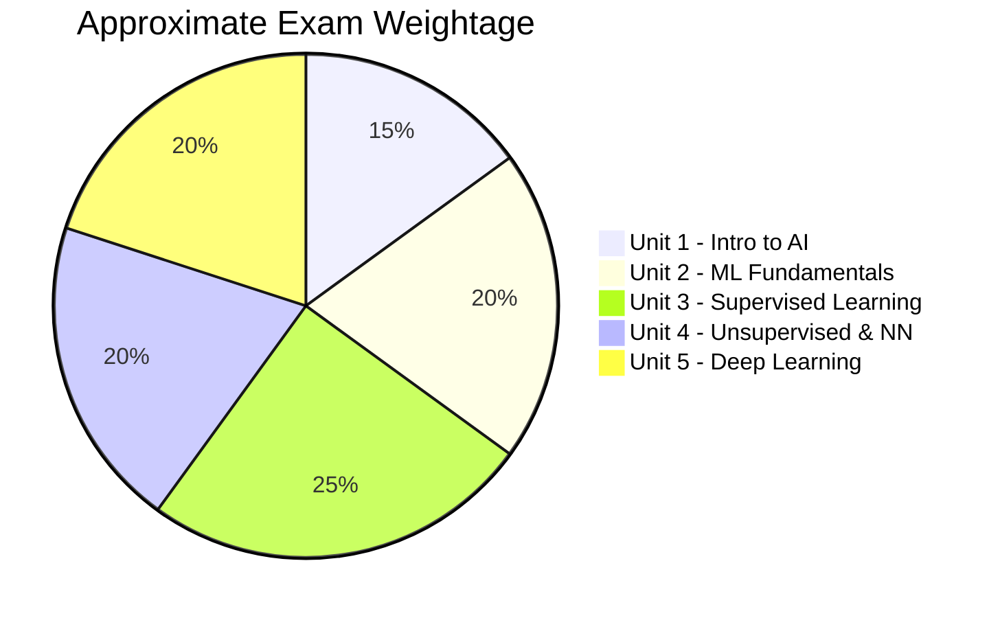

[[00-Dashboard/Home|Home]] | [[01-Semester-V/Semester-V-Dashboard|Semester V]] | [[Overview]] | [[Syllabus]] | [[Unit-1]] | [[Unit-2]] | [[Unit-3]] | [[Unit-4]] | [[Unit-5]] | [[Important-Questions|Imp. Qs]] | [[Revision]] | [[Interview-Prep]]

# CS-321-VSC-P: Foundation of Artificial Intelligence and Machine Learning

> [!important] Subject Information
> **Subject Code:** CS-321-VSC-P  
> **Type:** Value-Skill Course (Practical)  
> **Semester:** V (Third Year)  
> **University:** Savitribai Phule Pune University (SPPU)  
> **Credits:** 2

---

## Subject Map

---

## Units at a Glance

| Unit | Title | Key Topics | Weight |
|------|-------|------------|--------|
| [[Unit-1|Unit 1]] | Introduction to AI | History, Search algorithms, Logic |  |
| [[Unit-2|Unit 2]] | ML Fundamentals | Types of ML, Evaluation metrics, Bias-Variance |  |
| [[Unit-3|Unit 3]] | Supervised Learning | Regression, Trees, SVM, KNN, Naive Bayes |  |
| [[Unit-4|Unit 4]] | Unsupervised & Neural Networks | Clustering, PCA, Perceptron, Backprop |  |
| [[Unit-5|Unit 5]] | Deep Learning & Applications | CNN, RNN, NLP, TensorFlow |  |

---

## Learning Objectives

By the end of this course, students will be able to:

- [ ] Explain the history of AI and key milestones including the Turing Test
- [ ] Implement search strategies (BFS, DFS, A*, Hill Climbing) in Python
- [ ] Distinguish between types of machine learning
- [ ] Apply supervised learning algorithms for regression and classification
- [ ] Implement unsupervised learning (K-Means, Hierarchical)
- [ ] Understand neural networks, perceptron, and backpropagation
- [ ] Explain CNN, RNN architectures conceptually
- [ ] Use Python libraries: NumPy, Pandas, Scikit-learn, TensorFlow/Keras
- [ ] Evaluate ML models using appropriate metrics

---

## Quick Navigation

| Document | Purpose |
|----------|---------|
| [[Syllabus]] | Detailed syllabus with topics |
| [[Unit-1]] | Introduction to AI |
| [[Unit-2]] | ML Fundamentals |
| [[Unit-3]] | Supervised Learning |
| [[Unit-4]] | Unsupervised Learning & Neural Networks |
| [[Unit-5]] | Deep Learning & Applications |
| [[Important-Questions]] | Exam-focused questions |
| [[Revision]] | Quick revision notes |
| [[Interview-Prep]] | 40+ Interview Q&A |

---

## Exam Blueprint

> [!tip] Exam Strategy
> As a VSC Practical subject, focus on **coding implementations** in Python. Units 3 and 5 are highest priority for practicals. Know all evaluation metrics cold for Unit 2.

---

## Practical Tools & Libraries

| Tool/Library | Version | Purpose |
|-------------|---------|---------|
| **Python** | 3.9+ | Core language |
| **NumPy** | 1.24+ | Array operations |
| **Pandas** | 2.0+ | Data manipulation |
| **Matplotlib/Seaborn** | - | Visualization |
| **Scikit-learn** | 1.3+ | Classical ML |
| **TensorFlow** | 2.13+ | Deep Learning |
| **Keras** | (built into TF) | High-level DL API |
| **Jupyter Notebook** | - | Development environment |

---

## Reference Books

1. *Artificial Intelligence: A Modern Approach* - Russell & Norvig (AIMA)
2. *Pattern Recognition and Machine Learning* - Bishop
3. *Deep Learning* - Goodfellow, Bengio, Courville
4. *Hands-On Machine Learning with Scikit-Learn, Keras, and TensorFlow* - Géron
5. *Machine Learning* - Tom Mitchell

---

## Related Subjects

- [[01-Semester-V/CS-307-MJ-T-Data-Science-Analytics/Overview|CS-307 Data Science]] - Shares ML concepts, preprocessing
- [[01-Semester-V/CS-302-MJ-T-Operating-Systems/Overview|CS-302 Database]] - Data foundation

---

*Last updated: 2026-06-16 | Semester V | SPPU*
