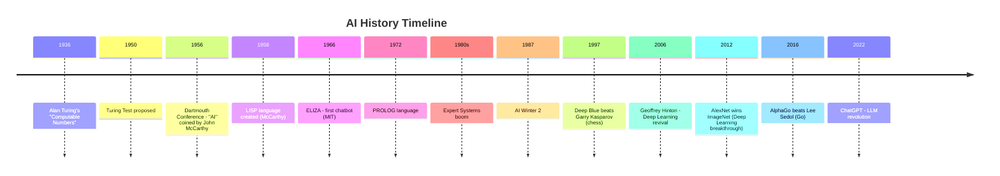
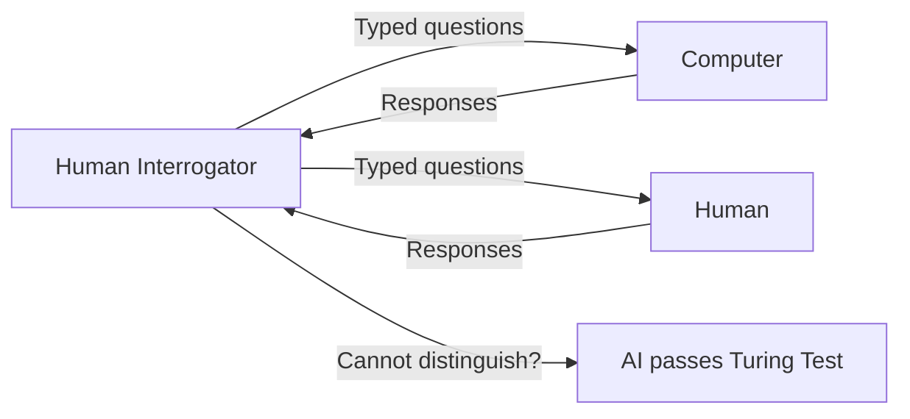
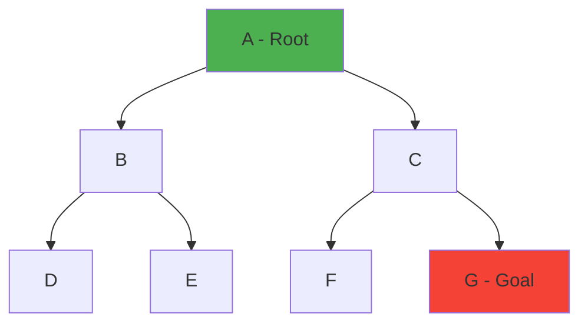

[[00-Dashboard/Home|Home]] | [[01-Semester-V/Semester-V-Dashboard|Semester V]] | [[Overview]] | [[Syllabus]] | [[Unit-1]] | [[Unit-2]] | [[Unit-3]] | [[Unit-4]] | [[Unit-5]] | [[Important-Questions|Imp. Qs]] | [[Revision]] | [[Interview-Prep]]


# Unit 1: Introduction to Artificial Intelligence

> [!note] Navigation
> ← [[Syllabus]] | [[Overview]] | [[Unit-2]] →

---

## Learning Objectives

- [ ] Trace the history of AI from Turing to modern deep learning
- [ ] Explain the Turing Test and its significance
- [ ] Implement BFS, DFS, and A* search algorithms in Python
- [ ] Explain Hill Climbing and its variants
- [ ] Represent knowledge using Propositional and First-Order Logic

---

## 1.1 History of Artificial Intelligence



### Key Milestones

| Year | Event | Significance |
|------|-------|-------------|
| 1950 | Turing Test | Formal definition of machine intelligence |
| 1956 | Dartmouth Conference | Birth of AI as a field |
| 1966 | ELIZA | First natural language processing chatbot |
| 1997 | Deep Blue | AI defeats world chess champion |
| 2012 | AlexNet | Deep learning revolution begins |
| 2016 | AlphaGo | AI beats human in Go (10^170 possibilities!) |
| 2022 | ChatGPT | LLMs accessible to general public |

### AI Winters
> [!warning] AI Winters
> There were two major "AI winters" - periods of reduced funding and interest:
> 1. **1974–1980**: Overpromised, under-delivered. Limited compute.
> 2. **1987–1993**: Expert systems too expensive, not scalable.
> AI was revived by: Big Data, GPU computing, and better algorithms.

---

## 1.2 What is Intelligence? - The Turing Test

> [!important] Turing Test (1950)
> Alan Turing proposed the **Imitation Game**: If a human interrogator cannot distinguish between a computer and a human based on text responses alone, the computer is considered to be demonstrating intelligence.



### Criticisms of Turing Test

1. **Chinese Room Argument (Searle, 1980)**: A computer can manipulate symbols without understanding meaning
2. **Brittleness**: Clever tricks (ELIZA effect) can fool humans
3. **Wrong criterion**: Mimicking human behavior ≠ being intelligent

### Types of AI

| Type | Description | Example |
|------|-------------|---------|
| **ANI** (Narrow AI) | One specific task | Chess engines, Image recognition, Siri |
| **AGI** (General AI) | Human-level general intelligence | Theoretical |
| **ASI** (Super AI) | Surpasses human intelligence in all areas | Theoretical |

---

## 1.3 AI Applications

| Domain | Application | Technology |
|--------|-------------|------------|
| **Healthcare** | Disease diagnosis, drug discovery | CNN, NLP |
| **Finance** | Fraud detection, algorithmic trading | ML, Anomaly detection |
| **Transportation** | Self-driving cars | Computer Vision, Reinforcement Learning |
| **NLP** | Translation, sentiment analysis | Transformers, BERT |
| **Gaming** | Game-playing AI | Deep RL (AlphaGo, OpenAI Five) |
| **Robotics** | Industrial automation | ROS, Path planning |

---

## 1.4 Problem Solving: Search Strategies

### State Space Representation

> [!important] Key Concepts
> - **State**: Configuration of the world at a given time
> - **Initial State**: Starting configuration
> - **Goal State**: Desired end configuration
> - **Actions/Operators**: Transitions between states
> - **Path Cost**: Cost to reach a state from initial state

**Example - 8-Puzzle Problem:**

```
Initial:        Goal:
2 8 3          1 2 3
1 6 4    →     8   4
7   5          7 6 5
```

---

### 1.4.1 Uninformed (Blind) Search

These search strategies have **no information about the goal location**.

#### BFS - Breadth-First Search

> [!note] BFS Properties
> - **Completeness**:  Yes (if branching factor is finite)
> - **Optimality**:  Yes (if all step costs equal)
> - **Time Complexity**: O(b^d) where b=branching factor, d=depth
> - **Space Complexity**: O(b^d) - keeps all frontier nodes



BFS visits: A → B → C → D → E → F → **G** (level by level)

```python
from collections import deque

def bfs(graph, start, goal):
    """Breadth-First Search"""
    queue = deque()    # Queue of paths
    visited = set([start])
    
    while queue:
        path = queue.popleft()
        node = path[-1]
        
        if node == goal:
            return path
        
        for neighbor in graph.get(node, []):
            if neighbor not in visited:
                visited.add(neighbor)
                new_path = path + [neighbor]
                queue.append(new_path)
    
    return None  # No path found

# Example graph
graph = {
    'A': ['B', 'C'],
    'B': ['D', 'E'],
    'C': ['F', 'G'],
    'D': [], 'E': [], 'F': [], 'G': []
}

path = bfs(graph, 'A', 'G')
print(f"BFS Path: {' → '.join(path)}")
# Output: BFS Path: A → C → G
```

#### DFS - Depth-First Search

> [!note] DFS Properties
> - **Completeness**:  No (may get stuck in infinite loops)
> - **Optimality**:  No (doesn't find shortest path)
> - **Time Complexity**: O(b^m) where m=max depth
> - **Space Complexity**: O(b·m) - only stores current path

```python
def dfs(graph, start, goal, path=None, visited=None):
    """Depth-First Search (Recursive)"""
    if path is None:
        path = [start]
    if visited is None:
        visited = set([start])
    
    if start == goal:
        return path
    
    for neighbor in graph.get(start, []):
        if neighbor not in visited:
            visited.add(neighbor)
            result = dfs(graph, neighbor, goal, path + [neighbor], visited)
            if result:
                return result
    
    return None

# Iterative DFS
def dfs_iterative(graph, start, goal):
    stack = 
    visited = set()
    
    while stack:
        path = stack.pop()   # Use pop() instead of popleft() for DFS
        node = path[-1]
        
        if node in visited:
            continue
        visited.add(node)
        
        if node == goal:
            return path
        
        for neighbor in graph.get(node, []):
            stack.append(path + [neighbor])
    
    return None
```

#### Comparison: BFS vs DFS

| Property | BFS | DFS |
|----------|-----|-----|
| Data Structure | Queue (FIFO) | Stack (LIFO) |
| Completeness |  Complete |  May loop |
| Optimality |  Optimal (equal costs) |  Not optimal |
| Time | O(b^d) | O(b^m) |
| Space | O(b^d) - HIGH | O(b·m) - LOW |
| Use Case | Shortest path, level-order | Memory constrained, deep solutions |

---

### 1.4.2 Informed (Heuristic) Search

Uses domain-specific knowledge (heuristic function h(n)) to guide search.

#### A* Algorithm

> [!important] A* Formula
> $$f(n) = g(n) + h(n)$$
> - **g(n)**: Actual cost from start to node n
> - **h(n)**: Estimated (heuristic) cost from n to goal
> - **f(n)**: Total estimated cost of path through n

> [!tip] Admissible Heuristic
> A heuristic is ==admissible== if it **never overestimates** the actual cost: $h(n) \leq h^*(n)$
> - For grid maps: Manhattan distance or Euclidean distance are admissible

> [!note] A* Properties
> - **Completeness**:  Yes
> - **Optimality**:  Yes (with admissible heuristic)
> - **Time**: O(b^d) worst case
> - **Space**: O(b^d) - stores all nodes in memory

```python
import heapq

def a_star(graph, start, goal, heuristic):
    """A* Search Algorithm"""
    # Priority queue: (f_cost, g_cost, node, path)
    open_list = [(heuristic[start], 0, start, [start])]
    closed_set = set()
    
    while open_list:
        f, g, node, path = heapq.heappop(open_list)
        
        if node == goal:
            return path, g  # Return path and total cost
        
        if node in closed_set:
            continue
        closed_set.add(node)
        
        for neighbor, cost in graph.get(node, {}).items():
            if neighbor not in closed_set:
                new_g = g + cost
                new_f = new_g + heuristic.get(neighbor, 0)
                heapq.heappush(open_list, (new_f, new_g, neighbor, path + [neighbor]))
    
    return None, float('inf')

# Example: Romania Map problem
graph = {
    'Arad': {'Zerind': 75, 'Timisoara': 118, 'Sibiu': 140},
    'Zerind': {'Arad': 75, 'Oradea': 71},
    'Sibiu': {'Arad': 140, 'Oradea': 151, 'Fagaras': 99, 'RimnicuVilcea': 80},
    'Fagaras': {'Sibiu': 99, 'Bucharest': 211},
    'Bucharest': {'Fagaras': 211, 'Pitesti': 101, 'Giurgiu': 90}
}

# Heuristic: Straight-line distance to Bucharest
heuristic = {
    'Arad': 366, 'Zerind': 374, 'Timisoara': 329,
    'Sibiu': 253, 'Fagaras': 176, 'RimnicuVilcea': 193,
    'Bucharest': 0, 'Pitesti': 100, 'Giurgiu': 77
}

path, cost = a_star(graph, 'Arad', 'Bucharest', heuristic)
print(f"A* Path: {' → '.join(path)}")
print(f"Total Cost: {cost}")
```

#### Hill Climbing

> [!note] Hill Climbing
> A local search algorithm that always moves to the neighbor with the highest value (best improvement). Like climbing a hill - always go up!

**Variants:**
1. **Steepest Ascent**: Choose the best among all neighbors
2. **First-Choice**: Choose the first neighbor better than current
3. **Stochastic**: Randomly choose among better neighbors
4. **Random Restart**: Restart from random positions to avoid local optima

**Problems:**
- **Local maxima**: Stuck at a peak that isn't the global maximum
- **Plateaux**: Flat area, no improvement signal
- **Ridges**: Diagonal path difficult to navigate

```python
def hill_climbing(problem, max_iterations=1000):
    """Hill Climbing Search"""
    current = problem.initial_state()
    
    for _ in range(max_iterations):
        neighbors = problem.get_neighbors(current)
        
        if not neighbors:
            break
        
        # Find best neighbor
        best_neighbor = max(neighbors, key=problem.value)
        
        # If no improvement, stop (local maximum)
        if problem.value(best_neighbor) <= problem.value(current):
            return current  # Local maximum
        
        current = best_neighbor
    
    return current
```

---

## 1.5 Knowledge Representation

### 1.5.1 Propositional Logic

> [!note] Definition
> ==Propositional Logic== uses **atomic propositions** (True/False) connected by logical connectives.

**Logical Connectives:**

| Symbol | Name | Meaning | Example |
|--------|------|---------|---------|
| ¬ | NOT | Negation | ¬P = "not P" |
| ∧ | AND | Conjunction | P ∧ Q = "P and Q" |
| ∨ | OR | Disjunction | P ∨ Q = "P or Q" |
| → | IMPLIES | Implication | P → Q = "if P then Q" |
| ↔ | IFF | Biconditional | P ↔ Q = "P if and only if Q" |

**Truth Table for key connectives:**

| P | Q | P∧Q | P∨Q | P→Q | ¬P |
|---|---|-----|-----|-----|----|
| T | T |  T  |  T  |  T  |  F |
| T | F |  F  |  T  |  F  |  F |
| F | T |  F  |  T  |  T  |  T |
| F | F |  F  |  F  |  T  |  T |

**Inference Rules:**

$$\text{Modus Ponens: } \frac{P, \quad P \rightarrow Q}{Q}$$

$$\text{Modus Tollens: } \frac{\neg Q, \quad P \rightarrow Q}{\neg P}$$

```python
# Propositional Logic in Python
def modus_ponens(P, P_implies_Q):
    """If P is true and P→Q, then Q is true"""
    if P and P_implies_Q:
        return True  # Q is true
    return None      # Cannot conclude

# Truth table generator
def truth_table(n_vars):
    from itertools import product
    variables = list(range(n_vars))
    for values in product([True, False], repeat=n_vars):
        print(values)
```

### 1.5.2 First-Order Logic (Predicate Logic)

> [!important] FOL extends propositional logic with:
> - **Predicates**: Properties/Relations - `IsStudent(x)`, `Loves(x, y)`
> - **Quantifiers**: 
>   - ∀ (For all): `∀x IsStudent(x) → IsYoung(x)`
>   - ∃ (There exists): `∃x IsStudent(x) ∧ IsGenius(x)`
> - **Functions**: `FatherOf(x)`, `Add(x, y)`

**Example:**

```
English: "All students who study hard will pass"
FOL: ∀x [Student(x) ∧ StudiesHard(x)] → Passes(x)

English: "There exists a student who is a genius"
FOL: ∃x [Student(x) ∧ IsGenius(x)]
```

| Feature | Propositional Logic | First-Order Logic |
|---------|---------------------|-------------------|
| Variables | None | Yes |
| Quantifiers | None | ∀, ∃ |
| Predicates | None | Yes |
| Expressiveness | Low | High |
| Decidability | Yes | Partially |

---

## Interview Questions - Unit 1

> [!question] Q1: What is the Turing Test? Is it a good measure of intelligence?
> **Answer**: The Turing Test (1950) proposes that if a machine can converse in natural language indistinguishably from a human, it can be said to exhibit intelligence. Limitations: John Searle's "Chinese Room" shows that symbol manipulation doesn't imply understanding. ELIZA passed early versions through tricks.

> [!question] Q2: Compare BFS and DFS. When would you use each?
> **Answer**: 
> - **BFS**: Use when you need the shortest path (optimal) and memory isn't a constraint. E.g., social network "degree of connection", GPS shortest route.
> - **DFS**: Use when memory is limited, solution is deep, or when any solution is acceptable. E.g., solving mazes, topological sort.

> [!question] Q3: Explain the A* algorithm. What makes it optimal?
> **Answer**: A* uses f(n) = g(n) + h(n) where g(n) is actual cost so far and h(n) is an admissible heuristic (never overestimates). A* is **optimal** when the heuristic is admissible because it always expands the node with lowest estimated total cost. It's **complete** as long as all step costs > 0.

> [!question] Q4: What is the difference between Propositional Logic and First-Order Logic?
> **Answer**: 
> - **Propositional Logic**: Deals with atomic True/False statements and logical connectives. Cannot express relationships or quantify over objects.
> - **First-Order Logic**: Can express objects, predicates, functions, and quantifiers (∀, ∃). Much more expressive. Used to represent complex knowledge.

> [!question] Q5: What is the problem with Hill Climbing?
> **Answer**: Hill Climbing can get stuck in:
> 1. **Local maxima**: A peak that isn't the global maximum
> 2. **Plateaux**: Flat area with no improvement gradient
> 3. **Ridges**: Narrow peaks hard to navigate
> Solution: Random restart hill climbing to explore multiple starting points.

---

## Revision Summary

> [!summary] Unit 1 Key Points
> 1. **AI coined** at Dartmouth Conference 1956 by John McCarthy
> 2. **Turing Test**: Machine indistinguishable from human in text = intelligent
> 3. **BFS**: Queue, optimal, complete, high space | **DFS**: Stack, not optimal, low space
> 4. **A***: f(n) = g(n) + h(n); optimal with admissible heuristic
> 5. **Hill Climbing**: Local search; problems: local maxima, plateaux, ridges
> 6. **Propositional Logic**: T/F statements; **FOL**: Adds predicates, quantifiers (∀, ∃)
> 7. **Modus Ponens**: If P and P→Q, then Q

---

← [[Syllabus]] | [[Unit-2]] →

#artificial-intelligence #unit-1 #search #SPPU #semester-5
