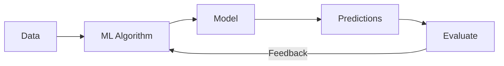
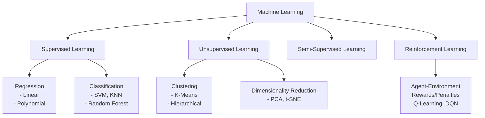
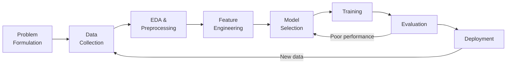
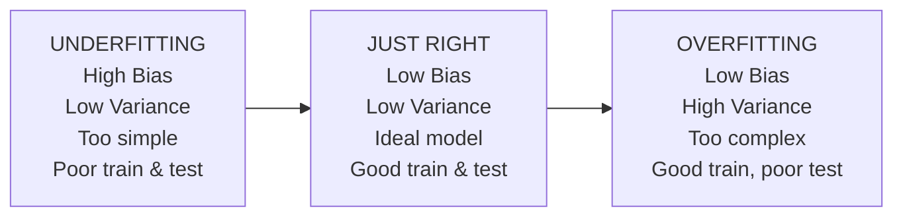
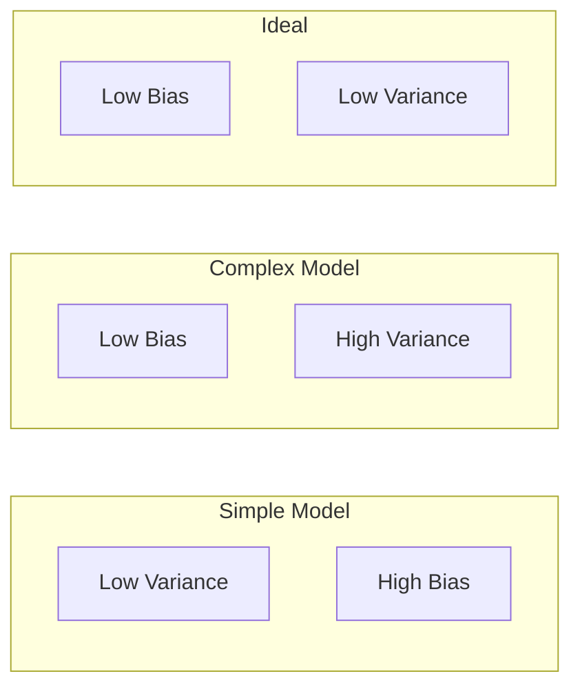

[[00-Dashboard/Home|Home]] | [[01-Semester-V/Semester-V-Dashboard|Semester V]] | [[Overview]] | [[Syllabus]] | [[Unit-1]] | [[Unit-2]] | [[Unit-3]] | [[Unit-4]] | [[Unit-5]] | [[Important-Questions|Imp. Qs]] | [[Revision]] | [[Interview-Prep]]


# Unit 2: Machine Learning Fundamentals

> [!note] Navigation
> ← [[Unit-1]] | [[Overview]] | [[Unit-3]] →

---

## Learning Objectives

- [ ] Define and distinguish types of machine learning
- [ ] Explain the complete ML workflow
- [ ] Describe overfitting, underfitting, and the bias-variance tradeoff
- [ ] Calculate and interpret: Accuracy, Precision, Recall, F1-Score, ROC-AUC
- [ ] Apply k-fold cross-validation
- [ ] Understand regularization (L1, L2)

---

## 2.1 What is Machine Learning?

> [!important] Definition
> ==Machine Learning== is a subset of AI that enables systems to **learn from data** and improve their performance on a task **without being explicitly programmed**. - Arthur Samuel (1959)



---

## 2.2 Types of Machine Learning



### Detailed Comparison

| Type | Input | Output | Examples |
|------|-------|--------|---------|
| **Supervised** | Labelled (X, y) | Predictions | Email spam, price prediction |
| **Unsupervised** | Unlabelled (X) | Structure/Clusters | Customer segments, anomaly detection |
| **Semi-Supervised** | Mostly unlabelled + some labelled | Mixed | Medical imaging |
| **Reinforcement** | States, actions, rewards | Policy | Games, robotics |

---

## 2.3 ML Workflow



---

## 2.4 Data Splitting

> [!important] Why Split Data?
> We need separate data for **training** (teaching the model) and **testing** (evaluating on unseen data) to get an honest estimate of real-world performance.

### Standard Split Ratios

| Split | Training | Validation | Test |
|-------|----------|------------|------|
| Common | 70% | 15% | 15% |
| Alternative | 80% | 10% | 10% |
| Large datasets | 98% | 1% | 1% |

```python
from sklearn.model_selection import train_test_split
import numpy as np

X = np.random.randn(1000, 10)
y = np.random.randint(0, 2, 1000)

# Simple train-test split (80-20)
X_train, X_test, y_train, y_test = train_test_split(
    X, y, 
    test_size=0.2, 
    random_state=42, 
    stratify=y    # Maintain class distribution
)

print(f"Train: {X_train.shape}, Test: {X_test.shape}")

# Train-Validation-Test split (70-15-15)
X_train, X_temp, y_train, y_temp = train_test_split(X, y, test_size=0.3, random_state=42)
X_val, X_test, y_val, y_test = train_test_split(X_temp, y_temp, test_size=0.5, random_state=42)
```

### K-Fold Cross Validation

> [!note] Cross Validation
> Instead of a single train-test split, divide data into **K folds**. Train on K-1 folds, test on remaining fold. Repeat K times. Average the results.

$$CV_{score} = \frac{1}{K} \sum_{i=1}^{K} score_i$$

```python
from sklearn.model_selection import KFold, StratifiedKFold, cross_val_score
from sklearn.linear_model import LogisticRegression

# K-Fold Cross Validation
kf = KFold(n_splits=5, shuffle=True, random_state=42)
model = LogisticRegression()

cv_scores = cross_val_score(model, X, y, cv=kf, scoring='accuracy')
print(f"CV Scores: {cv_scores}")
print(f"Mean: {cv_scores.mean():.3f} ± {cv_scores.std():.3f}")

# Stratified K-Fold (for imbalanced datasets)
skf = StratifiedKFold(n_splits=5, shuffle=True, random_state=42)
cv_scores_stratified = cross_val_score(model, X, y, cv=skf, scoring='f1')
```

---

## 2.5 Overfitting and Underfitting

### Visual Understanding



| Issue | Training Error | Test Error | Model | Fix |
|-------|---------------|------------|-------|-----|
| **Underfitting** | High | High | Too simple | More features, complex model, reduce regularization |
| **Ideal** | Low | Low | Just right | - |
| **Overfitting** | Low | High | Too complex | Regularization, more data, dropout, pruning |

```python
import matplotlib.pyplot as plt
import numpy as np
from sklearn.preprocessing import PolynomialFeatures
from sklearn.linear_model import LinearRegression, Ridge
from sklearn.pipeline import Pipeline

# Generate noisy data
np.random.seed(0)
X = np.sort(np.random.rand(30, 1), axis=0)
y = np.sin(2 * np.pi * X).ravel() + np.random.randn(30) * 0.3

X_test = np.linspace(0, 1, 100).reshape(-1, 1)

fig, axes = plt.subplots(1, 3, figsize=(15, 4))

for i, degree in enumerate([1, 4, 15]):
    poly = Pipeline([
        ('poly', PolynomialFeatures(degree=degree)),
        ('reg', LinearRegression())
    ])
    poly.fit(X, y)
    y_pred = poly.predict(X_test)
    
    axes[i].scatter(X, y, label='Data')
    axes[i].plot(X_test, y_pred, 'r-', label=f'Degree {degree}')
    axes[i].set_title(['Underfitting (degree=1)', 
                        'Good Fit (degree=4)', 
                        'Overfitting (degree=15)'][i])
    axes[i].legend()

plt.tight_layout()
plt.savefig('fitting.png')
plt.show()
```

### Regularization

**L1 Regularization (Lasso):**
$$J(\theta) = MSE + \lambda \sum_{j=1}^{n} |\theta_j|$$

- Drives some weights to **exactly zero** → Feature selection
- Produces sparse models

**L2 Regularization (Ridge):**
$$J(\theta) = MSE + \lambda \sum_{j=1}^{n} \theta_j^2$$

- Shrinks weights towards zero but rarely to exactly zero
- Better when all features are useful

**Elastic Net** = L1 + L2 combination

```python
from sklearn.linear_model import Lasso, Ridge, ElasticNet

# L1 - Lasso
lasso = Lasso(alpha=0.1)  # alpha = lambda (regularization strength)
lasso.fit(X_train, y_train)
print("Lasso non-zero coefficients:", np.sum(lasso.coef_ != 0))

# L2 - Ridge
ridge = Ridge(alpha=1.0)
ridge.fit(X_train, y_train)

# Elastic Net
elastic = ElasticNet(alpha=0.1, l1_ratio=0.5)  # l1_ratio: mix of L1/L2
elastic.fit(X_train, y_train)
```

---

## 2.6 Bias-Variance Tradeoff

> [!important] Key Formula
> $$\text{Total Error} = \text{Bias}^2 + \text{Variance} + \text{Irreducible Noise}$$

| Term | Definition |
|------|-----------|
| ==Bias== | Error from wrong assumptions in the model (underfitting) |
| ==Variance== | Error from sensitivity to small fluctuations in training data (overfitting) |
| ==Irreducible Noise== | Inherent randomness in the data; cannot be eliminated |



**Key Insight:**
- **High Bias** → Underfitting → Model is too simple to capture patterns
- **High Variance** → Overfitting → Model memorizes training data
- **Goal**: Find the sweet spot with low bias AND low variance

---

## 2.7 Evaluation Metrics

### 2.7.1 Confusion Matrix

> [!important] Confusion Matrix (Binary Classification)

|  | Predicted Positive | Predicted Negative |
|--|-------------------|--------------------|
| **Actual Positive** | TP (True Positive) | FN (False Negative) |
| **Actual Negative** | FP (False Positive) | TN (True Negative) |

**Interpretation:**
- **TP**: Correctly predicted positive (spam correctly caught)
- **TN**: Correctly predicted negative (ham correctly passed)
- **FP (Type I Error)**: Predicted positive, actually negative (ham marked as spam) ← **False Alarm**
- **FN (Type II Error)**: Predicted negative, actually positive (spam not caught) ← **Missed**

### 2.7.2 Classification Metrics

$$\text{Accuracy} = \frac{TP + TN}{TP + TN + FP + FN}$$

$$\text{Precision} = \frac{TP}{TP + FP}$$

$$\text{Recall (Sensitivity)} = \frac{TP}{TP + FN}$$

$$\text{Specificity} = \frac{TN}{TN + FP}$$

$$\text{F1-Score} = 2 \times \frac{\text{Precision} \times \text{Recall}}{\text{Precision} + \text{Recall}} = \frac{2 \cdot TP}{2 \cdot TP + FP + FN}$$

> [!tip] When to use which metric?
> - **Accuracy**: When classes are balanced
> - **Precision**: When FP is costly (email spam - don't want ham to go to spam)
> - **Recall**: When FN is costly (cancer detection - don't miss actual cancer cases!)
> - **F1-Score**: When you need balance between Precision and Recall (imbalanced classes)

```python
from sklearn.metrics import (confusion_matrix, accuracy_score, precision_score,
                              recall_score, f1_score, classification_report,
                              roc_auc_score, roc_curve)
import seaborn as sns
import matplotlib.pyplot as plt

# Generate predictions
y_true = [1, 0, 1, 1, 0, 1, 0, 0, 1, 0]
y_pred = [1, 0, 1, 0, 0, 1, 1, 0, 1, 0]

# Confusion Matrix
cm = confusion_matrix(y_true, y_pred)
print("Confusion Matrix:\n", cm)

# Plot confusion matrix
plt.figure(figsize=(6, 5))
sns.heatmap(cm, annot=True, fmt='d', cmap='Blues',
            xticklabels=['Predicted Neg', 'Predicted Pos'],
            yticklabels=['Actual Neg', 'Actual Pos'])
plt.title('Confusion Matrix')
plt.tight_layout()
plt.show()

# Individual metrics
print(f"Accuracy:  {accuracy_score(y_true, y_pred):.4f}")
print(f"Precision: {precision_score(y_true, y_pred):.4f}")
print(f"Recall:    {recall_score(y_true, y_pred):.4f}")
print(f"F1-Score:  {f1_score(y_true, y_pred):.4f}")

# Complete report
print("\nClassification Report:")
print(classification_report(y_true, y_pred))
```

### 2.7.3 ROC-AUC Curve

> [!note] ROC-AUC
> - **ROC**: Plots True Positive Rate (Recall) vs. False Positive Rate at various thresholds
> - **AUC** (Area Under Curve): Single number summary (0.5 = random, 1.0 = perfect)

$$FPR = \frac{FP}{FP + TN}$$

$$TPR = \frac{TP}{TP + FN} = \text{Recall}$$

```python
from sklearn.linear_model import LogisticRegression

# Get probability scores (not just predictions)
model = LogisticRegression()
model.fit(X_train, y_train)
y_prob = model.predict_proba(X_test)[:, 1]  # Probability of positive class

# ROC Curve
fpr, tpr, thresholds = roc_curve(y_test, y_prob)
auc_score = roc_auc_score(y_test, y_prob)

plt.figure(figsize=(8, 6))
plt.plot(fpr, tpr, 'b-', label=f'ROC Curve (AUC = {auc_score:.3f})')
plt.plot([0, 1], [0, 1], 'k--', label='Random Classifier')
plt.xlabel('False Positive Rate')
plt.ylabel('True Positive Rate (Recall)')
plt.title('ROC Curve')
plt.legend()
plt.grid(True)
plt.show()
```

### 2.7.4 Regression Metrics

$$MAE = \frac{1}{n}\sum_{i=1}^{n}|y_i - \hat{y}_i|$$

$$MSE = \frac{1}{n}\sum_{i=1}^{n}(y_i - \hat{y}_i)^2$$

$$RMSE = \sqrt{\frac{1}{n}\sum_{i=1}^{n}(y_i - \hat{y}_i)^2}$$

$$R^2 = 1 - \frac{\sum(y_i - \hat{y}_i)^2}{\sum(y_i - \bar{y})^2}$$

```python
from sklearn.metrics import mean_absolute_error, mean_squared_error, r2_score

y_true_reg = [3, -0.5, 2, 7]
y_pred_reg = [2.5, 0.0, 2, 8]

print(f"MAE:  {mean_absolute_error(y_true_reg, y_pred_reg):.4f}")
print(f"MSE:  {mean_squared_error(y_true_reg, y_pred_reg):.4f}")
print(f"RMSE: {mean_squared_error(y_true_reg, y_pred_reg, squared=False):.4f}")
print(f"R²:   {r2_score(y_true_reg, y_pred_reg):.4f}")
```

| Metric | Range | Better When | Interpretation |
|--------|-------|-------------|----------------|
| MAE | [0, ∞) | Lower | Average absolute error |
| MSE | [0, ∞) | Lower | Penalizes large errors more |
| RMSE | [0, ∞) | Lower | In same units as target |
| R² | (-∞, 1] | Higher (1=perfect) | Proportion of variance explained |

---

## Interview Questions - Unit 2

> [!question] Q1: What is the Bias-Variance Tradeoff?
> **Answer**: Total prediction error = Bias² + Variance + Irreducible Noise.
> - **High Bias** = Underfitting (model too simple, wrong assumptions)
> - **High Variance** = Overfitting (model too complex, memorizes training data)
> The tradeoff: reducing bias increases variance and vice versa. Goal is to minimize total error.

> [!question] Q2: What is the difference between Precision and Recall? When would you prioritize each?
> **Answer**: 
> - **Precision** = TP/(TP+FP): Of all predicted positives, how many are correct? High when FP is costly (spam filter - don't mark real emails as spam)
> - **Recall** = TP/(TP+FN): Of all actual positives, how many did we catch? High when FN is costly (cancer detection - don't miss real cancer cases)

> [!question] Q3: What is K-Fold Cross Validation? Why is it better than simple train-test split?
> **Answer**: K-Fold splits data into K equal parts. Each part serves as the test set once, while the remaining K-1 parts train the model. K results are averaged. Benefits: Uses all data for both training and testing, provides more reliable performance estimate, reduces dependency on a specific split.

> [!question] Q4: What is AUC-ROC? When is it preferred over accuracy?
> **Answer**: AUC-ROC plots TPR vs FPR at various classification thresholds. AUC of 1.0 = perfect, 0.5 = random. Preferred over accuracy when: classes are imbalanced (e.g., 95% negative, 5% positive - a model predicting all negative has 95% accuracy but AUC = 0.5).

> [!question] Q5: What is regularization? What is the difference between L1 and L2?
> **Answer**: Regularization adds a penalty term to the loss function to prevent overfitting:
> - **L1 (Lasso)**: λ·Σ|θ|  - Drives some coefficients to exactly zero (feature selection, sparse models)
> - **L2 (Ridge)**: λ·Σθ² - Shrinks coefficients towards zero but not exactly (good when all features matter)

---

## Revision Summary

> [!summary] Unit 2 Key Points
> 1. **ML Types**: Supervised (labelled), Unsupervised (unlabelled), Reinforcement (rewards)
> 2. **Overfitting**: Low train error, High test error → Use regularization, more data
> 3. **Underfitting**: High train error, High test error → More complex model, more features
> 4. **Bias-Variance**: Total Error = Bias² + Variance + Noise
> 5. **Confusion Matrix**: TP, TN, FP, FN → Accuracy, Precision, Recall, F1
> 6. **F1 = Harmonic mean** of Precision and Recall
> 7. **AUC-ROC**: Better than accuracy for imbalanced datasets
> 8. **L1**: Feature selection | **L2**: Weight shrinkage

---

← [[Unit-1]] | [[Unit-3]] →

#machine-learning #unit-2 #fundamentals #SPPU #semester-5
