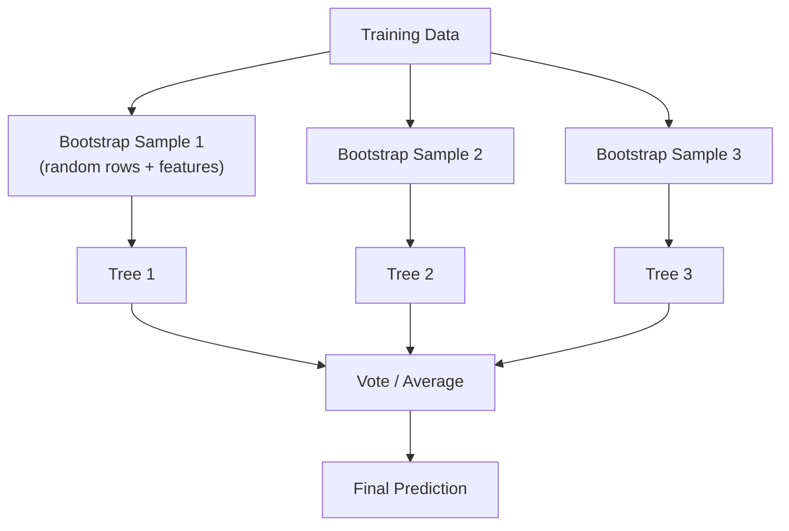

#  Unit 3: Supervised Learning

> [!note] Navigation
> ← [[Unit-2]] | [[Overview]] | [[Unit-4]] →

---

##  Learning Objectives

- [ ] Implement and interpret Linear and Logistic Regression
- [ ] Build and prune Decision Trees
- [ ] Implement Random Forest and explain ensemble learning
- [ ] Apply SVM with different kernel functions
- [ ] Implement KNN with various distance metrics
- [ ] Apply Naive Bayes for classification

---

## 3.1 Linear Regression

> [!important] Definition
> ==Linear Regression== models the relationship between a dependent variable (y) and one or more independent variables (X) as a linear function.

### Simple Linear Regression

$$\hat{y} = \beta_0 + \beta_1 x$$

### Multiple Linear Regression

$$\hat{y} = \beta_0 + \beta_1 x_1 + \beta_2 x_2 + \cdots + \beta_n x_n$$

### Ordinary Least Squares (OLS) - Finding β

**Cost Function (MSE):**
$$J(\beta) = \frac{1}{2m}\sum_{i=1}^{m}(\hat{y}_i - y_i)^2$$

**Closed-form solution:**
$$\hat{\beta} = (X^TX)^{-1}X^Ty$$

**Gradient Descent update rule:**
$$\beta_j := \beta_j - \alpha \frac{\partial J}{\partial \beta_j}$$

where $\alpha$ is the learning rate.

### R² (Coefficient of Determination)

$$R^2 = 1 - \frac{SS_{res}}{SS_{tot}} = 1 - \frac{\sum(y_i - \hat{y}_i)^2}{\sum(y_i - \bar{y})^2}$$

- $R^2 = 1$: Perfect fit
- $R^2 = 0$: Model explains nothing
- $R^2 < 0$: Model is worse than simply predicting mean

```python
import numpy as np
import pandas as pd
import matplotlib.pyplot as plt
from sklearn.linear_model import LinearRegression
from sklearn.metrics import mean_squared_error, r2_score
from sklearn.model_selection import train_test_split

# Generate data
np.random.seed(42)
X = 2 * np.random.rand(100, 1)
y = 4 + 3 * X + np.random.randn(100, 1)

# Split
X_train, X_test, y_train, y_test = train_test_split(X, y, test_size=0.2, random_state=42)

# Train
model = LinearRegression()
model.fit(X_train, y_train)

print(f"Intercept (β₀): {model.intercept_[0]:.4f}")
print(f"Slope (β₁):     {model.coef_[0][0]:.4f}")

# Predict and evaluate
y_pred = model.predict(X_test)
print(f"MSE:  {mean_squared_error(y_test, y_pred):.4f}")
print(f"RMSE: {mean_squared_error(y_test, y_pred, squared=False):.4f}")
print(f"R²:   {r2_score(y_test, y_pred):.4f}")

# Plot
plt.figure(figsize=(8, 5))
plt.scatter(X_test, y_test, color='blue', alpha=0.7, label='Actual')
plt.plot(X_test, y_pred, color='red', linewidth=2, label='Predicted Line')
plt.xlabel('X')
plt.ylabel('y')
plt.title(f'Linear Regression (R² = {r2_score(y_test, y_pred):.3f})')
plt.legend()
plt.show()
```

### Assumptions of Linear Regression (LINE)
1. **L**inearity: Relationship between X and y is linear
2. **I**ndependence: Observations are independent
3. **N**ormality: Residuals are normally distributed
4. **E**qual variance (Homoscedasticity): Residuals have constant variance

---

## 3.2 Logistic Regression

> [!important] Definition
> ==Logistic Regression== is used for **binary classification**. It models the probability that an instance belongs to a class using the **sigmoid function**.

### Sigmoid (Logistic) Function

$$\sigma(z) = \frac{1}{1 + e^{-z}} = \frac{1}{1 + e^{-(\beta_0 + \beta_1 x)}}$$

**Properties**: Output ∈ (0, 1), S-shaped curve, σ(0) = 0.5

**Decision boundary**: 
- If $\hat{p} \geq 0.5$ → Predict class 1
- If $\hat{p} < 0.5$ → Predict class 0

**Log-odds (Logit):**
$$\log\left(\frac{p}{1-p}\right) = \beta_0 + \beta_1 x_1 + \cdots + \beta_n x_n$$

**Loss function (Log-Loss / Cross-Entropy):**
$$J(\beta) = -\frac{1}{m}\sum_{i=1}^{m}\left[y_i\log(\hat{p}_i) + (1-y_i)\log(1-\hat{p}_i)\right]$$

```python
from sklearn.linear_model import LogisticRegression
from sklearn.datasets import load_breast_cancer
from sklearn.preprocessing import StandardScaler
from sklearn.metrics import classification_report, confusion_matrix
import seaborn as sns

# Load data
data = load_breast_cancer()
X, y = data.data, data.target

X_train, X_test, y_train, y_test = train_test_split(X, y, test_size=0.2, random_state=42)

# Scale features (important for Logistic Regression)
scaler = StandardScaler()
X_train_sc = scaler.fit_transform(X_train)
X_test_sc = scaler.transform(X_test)

# Train
log_reg = LogisticRegression(C=1.0, max_iter=1000, random_state=42)
log_reg.fit(X_train_sc, y_train)

# Evaluate
y_pred = log_reg.predict(X_test_sc)
y_prob = log_reg.predict_proba(X_test_sc)[:, 1]

print(classification_report(y_test, y_pred, 
                              target_names=data.target_names))

# Confusion matrix
cm = confusion_matrix(y_test, y_pred)
sns.heatmap(cm, annot=True, fmt='d', cmap='Blues',
            xticklabels=data.target_names,
            yticklabels=data.target_names)
plt.title('Logistic Regression - Confusion Matrix')
plt.show()
```

---

## 3.3 Decision Trees

> [!note] Decision Tree
> A tree-like model that makes decisions by recursively splitting data based on feature values, selecting the split that maximizes information gain.

### Key Concepts

**Entropy (Measure of Impurity):**
$$H(S) = -\sum_{i=1}^{c} p_i \log_2(p_i)$$

- H = 0: Pure node (all same class)
- H = 1 (for binary): Maximum impurity (50-50 split)

**Information Gain:**
$$IG(S, A) = H(S) - \sum_{v \in Values(A)} \frac{|S_v|}{|S|} H(S_v)$$

**Gini Impurity (used by CART):**
$$Gini(S) = 1 - \sum_{i=1}^{c} p_i^2$$

- Gini = 0: Pure node
- Gini = 0.5: Maximum impurity (binary)

| Algorithm | Split Criterion | Handles Multi-class |
|-----------|----------------|---------------------|
| ID3 | Information Gain (Entropy) | Yes |
| C4.5 | Gain Ratio | Yes |
| CART | Gini Impurity | Yes |

```python
from sklearn.tree import DecisionTreeClassifier, export_text, plot_tree
from sklearn.datasets import load_iris

iris = load_iris()
X, y = iris.data, iris.target

X_train, X_test, y_train, y_test = train_test_split(X, y, test_size=0.2, random_state=42)

# Train Decision Tree
dt = DecisionTreeClassifier(
    criterion='gini',       # 'gini' or 'entropy'
    max_depth=4,            # Limit depth (prevent overfitting)
    min_samples_split=5,    # Min samples to split a node
    min_samples_leaf=2,     # Min samples in leaf node
    random_state=42
)
dt.fit(X_train, y_train)

# Evaluate
y_pred = dt.predict(X_test)
print(f"Accuracy: {(y_pred == y_test).mean():.4f}")

# Print tree text representation
print(export_text(dt, feature_names=iris.feature_names))

# Visualize tree
plt.figure(figsize=(20, 8))
plot_tree(dt, feature_names=iris.feature_names, 
          class_names=iris.target_names,
          filled=True, rounded=True, fontsize=10)
plt.title('Decision Tree Visualization')
plt.show()

# Feature importance
importance = pd.DataFrame({
    'feature': iris.feature_names,
    'importance': dt.feature_importances_
}).sort_values('importance', ascending=False)
print("\nFeature Importance:")
print(importance)
```

---

## 3.4 Random Forest

> [!important] Random Forest
> An ==ensemble method== that builds many decision trees on random subsets of data and features (bagging), then aggregates predictions by majority vote (classification) or averaging (regression).

**Why better than single tree?**
- Reduces variance (overfitting) through averaging
- Less sensitive to noise and outliers
- Provides feature importance



```python
from sklearn.ensemble import RandomForestClassifier

rf = RandomForestClassifier(
    n_estimators=100,     # Number of trees
    max_depth=None,       # Trees grow fully (then averaged)
    max_features='sqrt',  # sqrt(features) for each tree - KEY feature
    min_samples_leaf=1,
    oob_score=True,       # Out-of-bag score
    random_state=42,
    n_jobs=-1             # Use all CPU cores
)
rf.fit(X_train, y_train)

print(f"Accuracy: {rf.score(X_test, y_test):.4f}")
print(f"OOB Score: {rf.oob_score_:.4f}")

# Feature importance
feat_imp = pd.DataFrame({
    'Feature': iris.feature_names,
    'Importance': rf.feature_importances_
}).sort_values('Importance', ascending=False)

plt.figure(figsize=(8, 4))
plt.barh(feat_imp['Feature'], feat_imp['Importance'])
plt.title('Random Forest - Feature Importance')
plt.tight_layout()
plt.show()
```

---

## 3.5 Support Vector Machine (SVM)

> [!important] SVM Concept
> SVM finds the ==maximum margin hyperplane== that separates classes. Support vectors are the data points closest to the hyperplane.

**Hyperplane equation:**
$$\mathbf{w}^T \mathbf{x} + b = 0$$

**Margin:**
$$\text{Margin} = \frac{2}{\|\mathbf{w}\|}$$

**Optimization (Hard Margin):**
$$\min_{\mathbf{w}, b} \frac{1}{2}\|\mathbf{w}\|^2 \quad \text{subject to} \quad y_i(\mathbf{w}^T \mathbf{x}_i + b) \geq 1$$

**Soft Margin (with slack variables ξ):**
$$\min_{\mathbf{w}, b, \xi} \frac{1}{2}\|\mathbf{w}\|^2 + C\sum_{i=1}^{n}\xi_i$$

- **C**: Regularization (small C = soft margin, large C = hard margin)

**Kernel Functions:**

| Kernel | Formula | Use Case |
|--------|---------|----------|
| Linear | $K(x, z) = x^Tz$ | Linearly separable |
| Polynomial | $K(x, z) = (x^Tz + c)^d$ | Non-linear |
| RBF (Gaussian) | $K(x, z) = e^{-\gamma\|x-z\|^2}$ | Most common |
| Sigmoid | $K(x, z) = \tanh(\kappa x^Tz + c)$ | Neural networks |

```python
from sklearn.svm import SVC
from sklearn.datasets import make_classification
from sklearn.preprocessing import StandardScaler

X, y = make_classification(n_samples=200, n_features=2, n_redundant=0, 
                            n_clusters_per_class=1, random_state=42)
X_train, X_test, y_train, y_test = train_test_split(X, y, test_size=0.2, random_state=42)

# Scale (CRITICAL for SVM!)
scaler = StandardScaler()
X_train_sc = scaler.fit_transform(X_train)
X_test_sc = scaler.transform(X_test)

# SVM with RBF kernel
svm = SVC(
    kernel='rbf',        # 'linear', 'rbf', 'poly', 'sigmoid'
    C=1.0,               # Regularization strength
    gamma='scale',       # 'scale', 'auto', or float
    probability=True     # Enable probability estimates
)
svm.fit(X_train_sc, y_train)

print(f"SVM Accuracy: {svm.score(X_test_sc, y_test):.4f}")
print(f"Support Vectors per class: {svm.n_support_}")

# Compare kernels
for kernel in ['linear', 'rbf', 'poly']:
    sv = SVC(kernel=kernel, C=1.0, gamma='scale')
    sv.fit(X_train_sc, y_train)
    print(f"Kernel={kernel}: {sv.score(X_test_sc, y_test):.4f}")
```

---

## 3.6 K-Nearest Neighbors (KNN)

> [!note] KNN
> ==Instance-based, lazy learner==. Classifies a new point based on majority vote of its K nearest neighbors. No explicit training phase.

**Distance Metrics:**

$$\text{Euclidean: } d(p, q) = \sqrt{\sum_{i=1}^{n}(p_i - q_i)^2}$$

$$\text{Manhattan: } d(p, q) = \sum_{i=1}^{n}|p_i - q_i|$$

$$\text{Minkowski: } d(p, q) = \left(\sum_{i=1}^{n}|p_i - q_i|^p\right)^{1/p}$$

(p=2 → Euclidean, p=1 → Manhattan)

> [!tip] Choosing K
> - **Small K** (e.g., 1): Low bias, high variance (overfitting)
> - **Large K** (e.g., n): High bias, low variance (underfitting)
> - **Rule of thumb**: K ≈ √n; Always use odd K for binary classification

```python
from sklearn.neighbors import KNeighborsClassifier

# Find optimal K using cross-validation
train_errors = []
test_errors = []

for k in range(1, 31):
    knn = KNeighborsClassifier(n_neighbors=k, metric='euclidean')
    knn.fit(X_train_sc, y_train)
    train_errors.append(1 - knn.score(X_train_sc, y_train))
    test_errors.append(1 - knn.score(X_test_sc, y_test))

# Find optimal K
optimal_k = np.argmin(test_errors) + 1
print(f"Optimal K: {optimal_k}")

# Plot error vs K
plt.figure(figsize=(10, 5))
plt.plot(range(1, 31), train_errors, 'b-o', label='Training Error')
plt.plot(range(1, 31), test_errors, 'r-o', label='Test Error')
plt.axvline(x=optimal_k, color='green', linestyle='--', label=f'Optimal K={optimal_k}')
plt.xlabel('K')
plt.ylabel('Error Rate')
plt.title('KNN - Error Rate vs K')
plt.legend()
plt.show()

# Final model
knn = KNeighborsClassifier(n_neighbors=optimal_k)
knn.fit(X_train_sc, y_train)
print(f"KNN (K={optimal_k}) Accuracy: {knn.score(X_test_sc, y_test):.4f}")
```

---

## 3.7 Naive Bayes

> [!important] Bayes' Theorem
> $$P(C|X) = \frac{P(X|C) \cdot P(C)}{P(X)}$$
> 
> - **P(C|X)**: Posterior - probability of class C given features X
> - **P(X|C)**: Likelihood - probability of features given class
> - **P(C)**: Prior - probability of class
> - **P(X)**: Evidence - constant (normalization)

**"Naive" Assumption**: Features are ==conditionally independent== given the class.

$$P(C|x_1, x_2, ..., x_n) \propto P(C) \cdot \prod_{i=1}^{n} P(x_i|C)$$

**Types of Naive Bayes:**

| Type | Distribution Assumption | Use Case |
|------|------------------------|---------|
| **Gaussian NB** | Normal distribution | Continuous features |
| **Multinomial NB** | Multinomial distribution | Text (word counts) |
| **Bernoulli NB** | Bernoulli distribution | Binary features |

```python
from sklearn.naive_bayes import GaussianNB, MultinomialNB, BernoulliNB
from sklearn.datasets import load_iris, fetch_20newsgroups
from sklearn.feature_extraction.text import TfidfVectorizer

# Gaussian Naive Bayes for continuous data
gnb = GaussianNB()
gnb.fit(X_train, y_train)
print(f"Gaussian NB Accuracy: {gnb.score(X_test, y_test):.4f}")

# Multinomial Naive Bayes for text classification
categories = ['alt.atheism', 'soc.religion.christian', 'comp.graphics']
newsgroups_train = fetch_20newsgroups(subset='train', categories=categories)
newsgroups_test = fetch_20newsgroups(subset='test', categories=categories)

vectorizer = TfidfVectorizer(stop_words='english', max_features=10000)
X_train_text = vectorizer.fit_transform(newsgroups_train.data)
X_test_text = vectorizer.transform(newsgroups_test.data)

mnb = MultinomialNB(alpha=1.0)  # alpha = Laplace smoothing
mnb.fit(X_train_text, newsgroups_train.target)
print(f"MultinomialNB Text Accuracy: {mnb.score(X_test_text, newsgroups_test.target):.4f}")
```

---

## 3.8 Algorithm Comparison

| Algorithm | Type | Speed | Interpretability | Handles Non-linear | Handles Scale |
|-----------|------|-------|-----------------|-------------------|---------------|
| Linear Regression | Regression |  Fast |  |  | Important |
| Logistic Regression | Classification |  Fast |  |  | Important |
| Decision Tree | Both |  Fast |  |  |  |
| Random Forest | Both |  Slow train |  |  |  |
| SVM | Both |  Slow (large n) |  |  (kernel) | CRITICAL |
| KNN | Both |  Slow predict |  |  | CRITICAL |
| Naive Bayes | Classification |  Fast |  |  |  |

---

##  Interview Questions - Unit 3

> [!question] Q1: What is the difference between Gradient Descent and OLS in Linear Regression?
> **Answer**: 
> - **OLS (Closed-form)**: Direct analytical solution β = (XᵀX)⁻¹Xᵀy. Exact but computationally expensive for large datasets (O(n²) or O(n³)).
> - **Gradient Descent**: Iterative optimization using partial derivatives. Scales to large datasets. Converges to solution (may be local minimum, but MSE is convex so finds global minimum).

> [!question] Q2: Why is feature scaling important for SVM and KNN but not Decision Trees?
> **Answer**: SVM and KNN use distance metrics (Euclidean, etc.). Features with larger scales dominate the distance calculation. Decision Trees split on thresholds and rank values, so scale doesn't affect which split is chosen. Always scale for SVM and KNN!

> [!question] Q3: What is the kernel trick in SVM?
> **Answer**: Kernel trick allows SVM to classify non-linearly separable data by implicitly mapping it to a higher-dimensional space where it becomes linearly separable. Instead of computing coordinates in the high-dimensional space (expensive), kernels compute the inner product between mapped points directly, making it efficient.

> [!question] Q4: What is the "Naive" assumption in Naive Bayes? When does it fail?
> **Answer**: Naive assumption: all features are conditionally independent given the class label. This is "naive" because features are rarely independent in practice. Fails when: words co-occur together frequently (text), correlated measurements (medical data). Despite this, it often works surprisingly well in practice.

> [!question] Q5: What is Information Gain in Decision Trees?
> **Answer**: Information Gain measures the reduction in entropy after splitting on an attribute. IG(S, A) = H(S) - Σ(|Sv|/|S|)H(Sv). The Decision Tree algorithm selects the attribute with the highest Information Gain as the split criterion. It prefers attributes that produce the purest (most homogeneous) child nodes.

---

##  Revision Summary

> [!summary] Unit 3 Key Points
> 1. **Linear Regression**: OLS, y = β₀ + β₁x, MSE cost function, R² measure
> 2. **Logistic Regression**: Sigmoid function, log-odds, cross-entropy loss
> 3. **Decision Trees**: Entropy/IG or Gini for splits; prone to overfitting
> 4. **Random Forest**: Bagging + random features; reduces overfitting; gives feature importance
> 5. **SVM**: Maximum margin hyperplane; C for regularization; Kernel trick for non-linear
> 6. **KNN**: No training; K affects bias-variance; MUST scale features
> 7. **Naive Bayes**: Bayes theorem + conditional independence; fast; good for text

---

← [[Unit-2]] | [[Unit-4]] →

#machine-learning #supervised-learning #unit-3 #SPPU #semester-5
