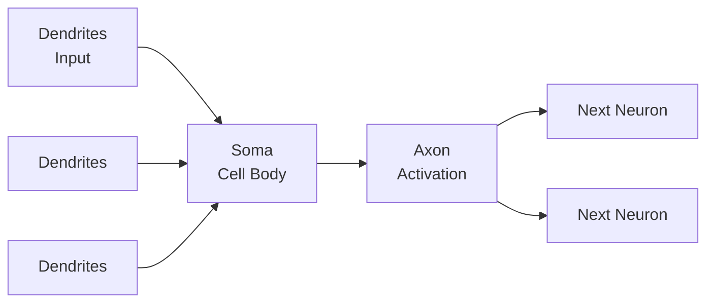
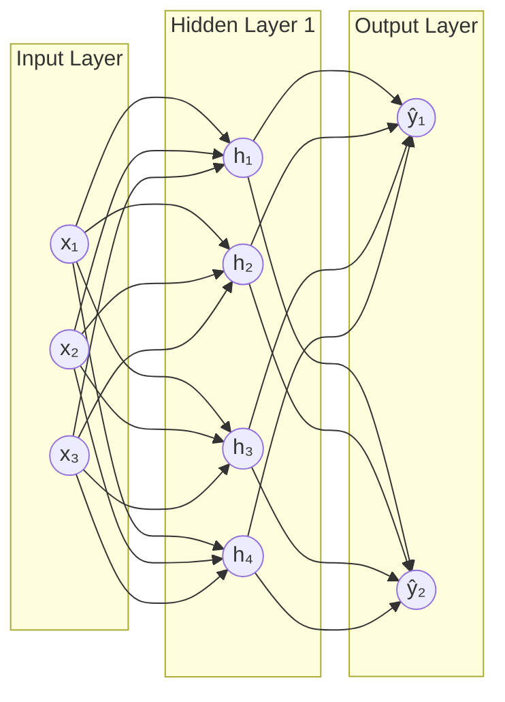

[[00-Dashboard/Home|Home]] | [[01-Semester-V/Semester-V-Dashboard|Semester V]] | [[Overview]] | [[Syllabus]] | [[Unit-1]] | [[Unit-2]] | [[Unit-3]] | [[Unit-4]] | [[Unit-5]] | [[Important-Questions|Imp. Qs]] | [[Revision]] | [[Interview-Prep]]


# Unit 4: Unsupervised Learning & Neural Networks

> [!note] Navigation
> ← [[Unit-3]] | [[Overview]] | [[Unit-5]] →

---

## Learning Objectives

- [ ] Implement K-Means clustering and choose optimal K
- [ ] Build and interpret hierarchical clustering with dendrograms
- [ ] Apply PCA for dimensionality reduction
- [ ] Explain the biological neuron analogy and perceptron model
- [ ] Implement a simple neural network in Python
- [ ] Understand activation functions and backpropagation

---

## 4.1 K-Means Clustering

> [!important] Algorithm
> **K-Means** partitions n points into K clusters, minimizing Within-Cluster Sum of Squares (WCSS).

**Algorithm Steps:**
1. Initialize K centroids (randomly or using K-Means++)
2. **Assignment step**: Assign each point to nearest centroid
3. **Update step**: Recompute centroids as cluster means
4. Repeat until convergence (no assignment changes or max iterations)

**Objective Function:**
$$J = \sum_{j=1}^{K}\sum_{x_i \in C_j} |x_i - \mu_j|^2$$

**K-Means++ Initialization** (smarter):
- Choose first centroid randomly
- Each subsequent centroid is chosen with probability proportional to its squared distance from nearest existing centroid

```python
from sklearn.cluster import KMeans
from sklearn.metrics import silhouette_score
from sklearn.preprocessing import StandardScaler
from sklearn.datasets import make_blobs
import matplotlib.pyplot as plt
import numpy as np

# Generate clustered data
X, y_true = make_blobs(n_samples=300, centers=4, cluster_std=0.8, random_state=42)
scaler = StandardScaler()
X_scaled = scaler.fit_transform(X)

# ---- Elbow Method ----
inertias = []
silhouette_scores = []
K_range = range(2, 11)

for k in K_range:
    km = KMeans(n_clusters=k, init='k-means++', random_state=42, n_init=10)
    labels = km.fit_predict(X_scaled)
    inertias.append(km.inertia_)
    silhouette_scores.append(silhouette_score(X_scaled, labels))

fig, axes = plt.subplots(1, 2, figsize=(14, 5))
axes[0].plot(K_range, inertias, 'b-o', linewidth=2)
axes[0].set_xlabel('K'); axes[0].set_ylabel('Inertia (WCSS)')
axes[0].set_title('Elbow Method')
axes[0].axvline(x=4, color='red', linestyle='--', label='Elbow at K=4')
axes[0].legend()

axes[1].plot(K_range, silhouette_scores, 'g-o', linewidth=2)
axes[1].set_xlabel('K'); axes[1].set_ylabel('Silhouette Score')
axes[1].set_title('Silhouette Score vs K')
axes[1].axvline(x=4, color='red', linestyle='--', label='Best K=4')
axes[1].legend()
plt.tight_layout()
plt.show()

# Final clustering with K=4
km_final = KMeans(n_clusters=4, init='k-means++', random_state=42, n_init=10)
labels = km_final.fit_predict(X_scaled)

plt.figure(figsize=(8, 6))
colors = ['#e74c3c', '#3498db', '#2ecc71', '#f39c12']
for k in range(4):
    mask = labels == k
    plt.scatter(X_scaled[mask, 0], X_scaled[mask, 1], 
                c=colors[k], s=50, label=f'Cluster {k+1}', alpha=0.7)

plt.scatter(km_final.cluster_centers_[:, 0], km_final.cluster_centers_[:, 1], 
            c='black', s=300, marker='X', zorder=5, label='Centroids')
plt.title(f'K-Means (K=4) - Silhouette: {silhouette_score(X_scaled, labels):.3f}')
plt.legend()
plt.show()

print(f"Final Silhouette Score: {silhouette_score(X_scaled, labels):.4f}")
print(f"Cluster sizes: {np.bincount(labels)}")
```

**Limitations of K-Means:**
1. Must choose K in advance
2. Sensitive to initialization
3. Assumes spherical, equal-size clusters
4. Sensitive to outliers
5. Only numerical data

---

## 4.2 Hierarchical Clustering

> [!note] Hierarchical Clustering
> ==Hierarchical Clustering== builds a tree (dendrogram) of clusters. No need to specify K in advance!

### Types:
- **Agglomerative (Bottom-up)**: Each point starts as own cluster → merge closest pairs → one cluster
- **Divisive (Top-down)**: Start with one cluster → split → individual points

### Linkage Methods (how to measure distance between clusters):

| Linkage | Distance Measure | Property |
|---------|-----------------|----------|
| **Single** | Min distance between any two points | Elongated clusters |
| **Complete** | Max distance between any two points | Compact clusters |
| **Average** | Mean distance between all pairs | Balanced |
| **Ward** | Minimizes within-cluster variance | Most compact; often best |

```python
from scipy.cluster.hierarchy import dendrogram, linkage, fcluster
from scipy.spatial.distance import pdist

# Generate data
np.random.seed(42)
X_hier = np.vstack([
    np.random.randn(15, 2) + [0, 0],
    np.random.randn(15, 2) + [5, 5],
    np.random.randn(15, 2) + [10, 0]
])

# Compute linkage matrix
Z = linkage(X_hier, method='ward', metric='euclidean')

# Plot Dendrogram
plt.figure(figsize=(12, 5))
dendrogram(
    Z,
    leaf_font_size=8,
    color_threshold=6.0,   # Color clusters at this height
    above_threshold_color='gray'
)
plt.axhline(y=6.0, color='red', linestyle='--', label='Cut here → 3 clusters')
plt.xlabel('Data Points')
plt.ylabel('Euclidean Distance')
plt.title('Hierarchical Clustering Dendrogram (Ward Linkage)')
plt.legend()
plt.tight_layout()
plt.show()

# Extract cluster labels
cluster_labels = fcluster(Z, t=3, criterion='maxclust')  # 3 clusters
print(f"Cluster labels: {cluster_labels}")
print(f"Cluster sizes: {np.bincount(cluster_labels)}")

# Using sklearn
from sklearn.cluster import AgglomerativeClustering
agg = AgglomerativeClustering(n_clusters=3, linkage='ward')
labels_agg = agg.fit_predict(X_hier)
print(f"Agglomerative Clustering Silhouette: {silhouette_score(X_hier, labels_agg):.4f}")
```

### K-Means vs. Hierarchical

| Aspect | K-Means | Hierarchical |
|--------|---------|-------------|
| K required upfront |  Yes |  No |
| Scalability |  Good (large datasets) |  Poor (O(n²) or O(n³)) |
| Result | Flat partition | Tree (dendrogram) |
| Algorithm | Iterative, stochastic | Deterministic |
| Cluster shape | Spherical | Flexible |

---

## 4.3 Dimensionality Reduction - PCA

> [!important] PCA (Principal Component Analysis)
> Transforms data into a new coordinate system where the greatest variance lies on the first axis (PC1), second greatest on PC2, etc. Reduces dimensions while preserving maximum variance.

**Mathematical Basis:**
1. Standardize the data
2. Compute covariance matrix $\Sigma$
3. Find eigenvectors (principal components) and eigenvalues of $\Sigma$
4. Sort by eigenvalue (highest = most variance)
5. Project data onto top K eigenvectors

**Explained Variance:**
$$EV_i = \frac{\lambda_i}{\sum_j \lambda_j}$$

where $\lambda_i$ = eigenvalue of i-th principal component.

```python
from sklearn.decomposition import PCA
from sklearn.preprocessing import StandardScaler
from sklearn.datasets import load_iris
import matplotlib.pyplot as plt
import numpy as np

# Load data
iris = load_iris()
X = iris.data
y = iris.target

# Standardize
scaler = StandardScaler()
X_scaled = scaler.fit_transform(X)

# ---- PCA ----
pca_full = PCA()
pca_full.fit(X_scaled)

# Explained Variance Ratio
print("Explained Variance Ratios:", pca_full.explained_variance_ratio_)
print("Cumulative:", np.cumsum(pca_full.explained_variance_ratio_))

# Scree Plot
plt.figure(figsize=(8, 4))
plt.plot(range(1, 5), pca_full.explained_variance_ratio_, 'b-o', label='Individual')
plt.plot(range(1, 5), np.cumsum(pca_full.explained_variance_ratio_), 'r-s', label='Cumulative')
plt.axhline(y=0.95, color='green', linestyle='--', label='95% threshold')
plt.xlabel('Principal Component')
plt.ylabel('Explained Variance Ratio')
plt.title('PCA Scree Plot')
plt.legend()
plt.grid(True)
plt.show()

# Reduce to 2D for visualization
pca_2d = PCA(n_components=2)
X_pca = pca_2d.fit_transform(X_scaled)

print(f"\nOriginal shape: {X_scaled.shape}")
print(f"Reduced shape: {X_pca.shape}")
print(f"Variance explained by 2 PCs: {pca_2d.explained_variance_ratio_.sum()*100:.1f}%")

# Visualize in 2D
plt.figure(figsize=(8, 6))
colors = ['red', 'blue', 'green']
for i, target_name in enumerate(iris.target_names):
    mask = y == i
    plt.scatter(X_pca[mask, 0], X_pca[mask, 1], c=colors[i], 
                label=target_name, s=60, alpha=0.7)
plt.xlabel(f'PC1 ({pca_2d.explained_variance_ratio_[0]*100:.1f}% variance)')
plt.ylabel(f'PC2 ({pca_2d.explained_variance_ratio_[1]*100:.1f}% variance)')
plt.title('PCA - Iris Dataset (2D projection)')
plt.legend()
plt.grid(True)
plt.show()

# Loading matrix (which original features contribute to each PC)
loadings = pd.DataFrame(
    pca_2d.components_.T,
    columns=['PC1', 'PC2'],
    index=iris.feature_names
)
print("\nPCA Loadings (feature contributions):")
print(loadings)
```

---

## 4.4 Introduction to Neural Networks

### Biological Inspiration



### Artificial Neuron (Perceptron)

**Mathematical Model:**

$$z = \sum_{i=1}^{n} w_i x_i + b = \mathbf{w}^T\mathbf{x} + b$$

$$\hat{y} = f(z) = f\left(\sum_{i=1}^{n} w_i x_i + b\right)$$

where $f$ is the **activation function** and $b$ is the **bias**.

```python
import numpy as np

class Perceptron:
    """Simple binary perceptron"""
    def __init__(self, learning_rate=0.01, n_epochs=100):
        self.lr = learning_rate
        self.n_epochs = n_epochs
        self.weights = None
        self.bias = None
        self.errors = []
    
    def fit(self, X, y):
        n_features = X.shape[1]
        self.weights = np.zeros(n_features)
        self.bias = 0
        
        for epoch in range(self.n_epochs):
            total_errors = 0
            for xi, yi in zip(X, y):
                z = np.dot(self.weights, xi) + self.bias
                y_pred = 1 if z >= 0 else 0  # Step function
                error = yi - y_pred
                
                # Update rule: w = w + lr * error * x
                self.weights += self.lr * error * xi
                self.bias += self.lr * error
                total_errors += abs(error)
            
            self.errors.append(total_errors)
            if total_errors == 0:
                print(f"Converged at epoch {epoch + 1}")
                break
        
        return self
    
    def predict(self, X):
        z = np.dot(X, self.weights) + self.bias
        return (z >= 0).astype(int)

# Test on AND gate
X_and = np.array([[0,0],[0,1],[1,0],[1,1]])
y_and = np.array([0, 0, 0, 1])

p = Perceptron(learning_rate=0.1, n_epochs=100)
p.fit(X_and, y_and)
print("Predictions:", p.predict(X_and))
print("True labels:", y_and)
```

---

## 4.5 Activation Functions

> [!important] Role
> Activation functions introduce ==non-linearity== into neural networks, allowing them to learn complex patterns.

| Function | Formula | Range | Pros | Cons |
|----------|---------|-------|------|------|
| **Step** | 1 if z≥0 else 0 | {0,1} | Simple | Not differentiable |
| **Sigmoid** | $\frac{1}{1+e^{-z}}$ | (0,1) | Smooth, probabilistic | Vanishing gradient |
| **Tanh** | $\frac{e^z - e^{-z}}{e^z + e^{-z}}$ | (-1,1) | Zero-centered | Vanishing gradient |
| **ReLU** | max(0, z) | [0,∞) | Fast, sparse | Dying ReLU |
| **Leaky ReLU** | max(0.01z, z) | (-∞,∞) | Fixes dying ReLU | Hyperparameter |
| **Softmax** | $\frac{e^{z_i}}{\sum_j e^{z_j}}$ | (0,1), Σ=1 | Multiclass | - |

```python
import numpy as np
import matplotlib.pyplot as plt

x = np.linspace(-5, 5, 200)

def sigmoid(x): return 1 / (1 + np.exp(-x))
def tanh(x): return np.tanh(x)
def relu(x): return np.maximum(0, x)
def leaky_relu(x, alpha=0.01): return np.where(x > 0, x, alpha * x)

fig, axes = plt.subplots(2, 2, figsize=(12, 8))

activations = [
    ('Sigmoid', sigmoid(x), '#e74c3c'),
    ('Tanh', tanh(x), '#3498db'),
    ('ReLU', relu(x), '#2ecc71'),
    ('Leaky ReLU', leaky_relu(x), '#f39c12')
]

for ax, (name, y, color) in zip(axes.flat, activations):
    ax.plot(x, y, color=color, linewidth=2.5)
    ax.axhline(y=0, color='k', linewidth=0.5)
    ax.axvline(x=0, color='k', linewidth=0.5)
    ax.set_title(name, fontsize=12)
    ax.grid(True, alpha=0.3)
    ax.set_xlabel('Input z')
    ax.set_ylabel('Output f(z)')

plt.suptitle('Activation Functions', fontsize=14)
plt.tight_layout()
plt.show()
```

---

## 4.6 Multi-Layer Perceptron (MLP) and Backpropagation

### Network Architecture



### Backpropagation - Step by Step

1. **Forward Pass**: Compute activations layer by layer
2. **Compute Loss**: $L = -\frac{1}{m}\sum y_i \log(\hat{y}_i)$ (cross-entropy)
3. **Backward Pass**: Compute gradients using chain rule

$$\frac{\partial L}{\partial W} = \frac{\partial L}{\partial \hat{y}} \cdot \frac{\partial \hat{y}}{\partial z} \cdot \frac{\partial z}{\partial W}$$

4. **Update Weights**: 
$$W := W - \alpha \frac{\partial L}{\partial W}$$

```python
import numpy as np

class SimpleNeuralNetwork:
    """2-layer neural network: input -> hidden -> output"""
    
    def __init__(self, input_size, hidden_size, output_size, lr=0.01):
        # Xavier initialization
        self.W1 = np.random.randn(input_size, hidden_size) * np.sqrt(2/input_size)
        self.b1 = np.zeros((1, hidden_size))
        self.W2 = np.random.randn(hidden_size, output_size) * np.sqrt(2/hidden_size)
        self.b2 = np.zeros((1, output_size))
        self.lr = lr
    
    def sigmoid(self, z):
        return 1 / (1 + np.exp(-np.clip(z, -500, 500)))
    
    def sigmoid_derivative(self, a):
        return a * (1 - a)
    
    def forward(self, X):
        # Layer 1
        self.z1 = np.dot(X, self.W1) + self.b1
        self.a1 = self.sigmoid(self.z1)
        # Output layer
        self.z2 = np.dot(self.a1, self.W2) + self.b2
        self.a2 = self.sigmoid(self.z2)
        return self.a2
    
    def backward(self, X, y, output):
        m = X.shape[0]
        
        # Output layer gradient
        dz2 = output - y
        dW2 = np.dot(self.a1.T, dz2) / m
        db2 = np.sum(dz2, axis=0, keepdims=True) / m
        
        # Hidden layer gradient (chain rule)
        da1 = np.dot(dz2, self.W2.T)
        dz1 = da1 * self.sigmoid_derivative(self.a1)
        dW1 = np.dot(X.T, dz1) / m
        db1 = np.sum(dz1, axis=0, keepdims=True) / m
        
        # Update weights
        self.W2 -= self.lr * dW2
        self.b2 -= self.lr * db2
        self.W1 -= self.lr * dW1
        self.b1 -= self.lr * db1
    
    def train(self, X, y, epochs=1000):
        losses = []
        for epoch in range(epochs):
            output = self.forward(X)
            loss = -np.mean(y * np.log(output + 1e-8) + (1-y) * np.log(1-output + 1e-8))
            self.backward(X, y, output)
            losses.append(loss)
            
            if epoch % 100 == 0:
                print(f"Epoch {epoch:4d}, Loss: {loss:.4f}")
        
        return losses

# XOR problem (not linearly separable - needs hidden layer)
X = np.array([[0,0],[0,1],[1,0],[1,1]])
y = np.array([[0],[1],[1],[0]])

nn = SimpleNeuralNetwork(2, 4, 1, lr=0.5)
losses = nn.train(X, y, epochs=5000)

predictions = nn.forward(X)
print("\nPredictions:")
for xi, yi, pred in zip(X, y, predictions):
    print(f"  {xi} → {pred[0]:.4f} (True: {yi[0]})")
```

---

## Interview Questions - Unit 4

> [!question] Q1: What is the difference between K-Means and Hierarchical Clustering?
> **Answer**: K-Means: requires K upfront, iterative, scalable, stochastic, assumes spherical clusters. Hierarchical: no K needed, builds tree (dendrogram), O(n²) space, deterministic. Use K-Means for large datasets, Hierarchical when you don't know K or need to visualize cluster structure via dendrogram.

> [!question] Q2: What does PCA do? How is it different from feature selection?
> **Answer**: PCA creates NEW features (principal components) that are linear combinations of original features. Feature selection chooses a SUBSET of original features without transformation. PCA: unsupervised, maximizes variance, interpretability may reduce. Feature selection: keeps original features, interpretable, supervised or unsupervised.

> [!question] Q3: Why is ReLU preferred over Sigmoid in hidden layers?
> **Answer**: 
> 1. **No vanishing gradient**: Sigmoid gradients saturate near 0 and 1 (gradient ≈ 0), making deep networks hard to train. ReLU has gradient 1 for positive inputs.
> 2. **Computationally faster**: ReLU = max(0, x) is simpler than sigmoid's exponential
> 3. **Sparse activation**: ~50% neurons are inactive, reducing computation
> Downside: "Dying ReLU" - neurons with all negative inputs die permanently. Solution: Leaky ReLU.

> [!question] Q4: Explain backpropagation step by step.
> **Answer**: 
> 1. **Forward pass**: Compute predictions layer by layer using current weights
> 2. **Compute loss**: Calculate error (MSE, cross-entropy) between prediction and truth
> 3. **Backward pass**: Using chain rule, compute gradient of loss with respect to each weight: ∂L/∂W = ∂L/∂ŷ × ∂ŷ/∂z × ∂z/∂W
> 4. **Update weights**: W = W - η × ∂L/∂W (gradient descent)
> Repeat until convergence.

> [!question] Q5: What is the vanishing gradient problem?
> **Answer**: In deep networks using sigmoid/tanh, gradients become exponentially smaller as they propagate back through layers. For a 10-layer network, the gradient at layer 1 may be ~0.0001 of the gradient at layer 10. Early layers learn very slowly or stop learning. Solutions: ReLU, batch normalization, residual connections (ResNet), better initialization.

---

## Revision Summary

> [!summary] Unit 4 Key Points
> 1. **K-Means**: K centroids; assign-update loop; Elbow method + Silhouette to choose K
> 2. **Hierarchical**: Dendrogram; Ward linkage (best); no K needed; O(n²) memory
> 3. **PCA**: Eigenvectors of covariance matrix; maximize variance; use scree plot for # components
> 4. **Perceptron**: w·x + b → activation → output; update rule: w += η·error·x
> 5. **Activation functions**: Sigmoid (0,1) | Tanh (-1,1) | ReLU max(0,x) (most common) | Softmax (multiclass)
> 6. **Backpropagation**: Forward → Compute Loss → Backward (chain rule) → Update weights
> 7. **Vanishing gradient**: Sigmoid gradients → 0 in deep nets; ReLU solves this

---

← [[Unit-3]] | [[Unit-5]] →

#machine-learning #neural-networks #unsupervised-learning #unit-4 #SPPU #semester-5
