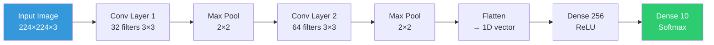
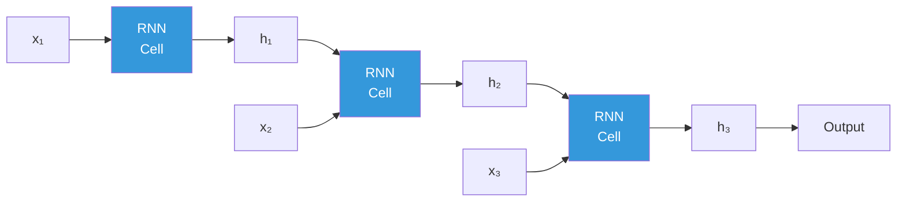
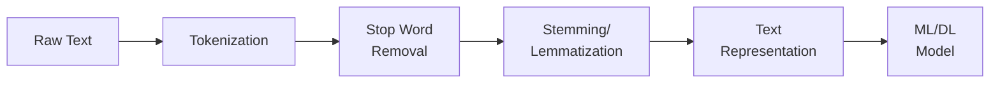

#  Unit 5: Deep Learning & Applications

> [!note] Navigation
> ← [[Unit-4]] | [[Overview]] | [[Important-Questions]] →

---

##  Learning Objectives

- [ ] Explain deep learning vs. shallow ML
- [ ] Describe CNN architecture and its applications
- [ ] Explain RNN, LSTM architecture for sequential data
- [ ] Understand NLP basics: tokenization, TF-IDF, word embeddings
- [ ] Build and train models using TensorFlow/Keras
- [ ] Use NumPy, Pandas, Scikit-learn in ML pipelines

---

## 5.1 Introduction to Deep Learning

> [!important] Definition
> ==Deep Learning== is a subset of machine learning that uses **neural networks with many layers (deep architectures)** to automatically learn hierarchical feature representations from raw data.

### Deep Learning vs. Traditional ML

| Aspect | Traditional ML | Deep Learning |
|--------|---------------|---------------|
| **Feature Engineering** | Manual (domain expertise) | Automatic (learned from data) |
| **Data requirements** | Less data needed | Huge datasets (millions) |
| **Computation** | CPU-friendly | GPU required |
| **Interpretability** | Higher | Lower (black box) |
| **Performance** | Good for structured data | State-of-art for images, text, audio |

### Why Deep Learning Works Now
1. **Big Data**: Availability of massive labeled datasets
2. **GPU Computing**: Parallel computation on GPUs (1000× speedup)
3. **Better Algorithms**: ReLU, batch norm, dropout, residual connections
4. **Frameworks**: TensorFlow, PyTorch make implementation easy

### Feature Hierarchy (Why "Deep")

```mermaid
graph LR
    P[Pixel Values] --> E[Edges &<br>Textures]
    E --> P2[Parts<br>nose, eye]
    P2 --> O[Objects<br>face]
    O --> C[Concept<br>"Person"]
    
    style P fill:#ffcccc
    style E fill:#ffe0cc
    style P2 fill:#fff0cc
    style O fill:#e0ffcc
    style C fill:#ccffcc
```

---

## 5.2 Convolutional Neural Networks (CNN)

> [!important] CNN
> CNNs are specialized neural networks for **grid-like data** (images, time series). They use convolution operations to automatically detect local patterns (edges, textures, shapes).

### Key Components

#### 1. Convolutional Layer

**Convolution Operation:**
$$\text{Output}[i,j] = \sum_{m}\sum_{n} Input[i+m, j+n] \cdot Kernel[m,n] + bias$$

- **Kernel/Filter**: Small matrix that slides over input
- **Stride**: Step size of filter movement
- **Padding**: Add zeros around input edges

**Output size formula:**
$$O = \left\lfloor\frac{I - K + 2P}{S}\right\rfloor + 1$$

where I=input size, K=kernel size, P=padding, S=stride

#### 2. Pooling Layer (Subsampling)

- **Max Pooling**: Keep maximum value in window → Detects presence of feature
- **Average Pooling**: Average of window → More smooth representation

#### 3. Fully Connected Layer

After conv+pool layers, flatten feature maps → Feed to standard MLP for classification

### CNN Architecture



```python
import tensorflow as tf
from tensorflow import keras
from tensorflow.keras import layers, models
from tensorflow.keras.datasets import mnist, cifar10
from tensorflow.keras.utils import to_categorical
import numpy as np
import matplotlib.pyplot as plt

# ---- CNN for MNIST Digit Classification ----

# Load and preprocess data
(X_train, y_train), (X_test, y_test) = mnist.load_data()

# Normalize and reshape
X_train = X_train.reshape(-1, 28, 28, 1).astype('float32') / 255.0
X_test = X_test.reshape(-1, 28, 28, 1).astype('float32') / 255.0

# One-hot encode labels
y_train_cat = to_categorical(y_train, 10)
y_test_cat = to_categorical(y_test, 10)

print(f"Training data: {X_train.shape}")
print(f"Test data: {X_test.shape}")

# Build CNN model
model_cnn = models.Sequential([
    # Block 1
    layers.Conv2D(32, (3, 3), activation='relu', padding='same', input_shape=(28, 28, 1)),
    layers.BatchNormalization(),
    layers.Conv2D(32, (3, 3), activation='relu', padding='same'),
    layers.MaxPooling2D(pool_size=(2, 2)),
    layers.Dropout(0.25),
    
    # Block 2
    layers.Conv2D(64, (3, 3), activation='relu', padding='same'),
    layers.BatchNormalization(),
    layers.Conv2D(64, (3, 3), activation='relu', padding='same'),
    layers.MaxPooling2D(pool_size=(2, 2)),
    layers.Dropout(0.25),
    
    # Classifier
    layers.Flatten(),
    layers.Dense(256, activation='relu'),
    layers.BatchNormalization(),
    layers.Dropout(0.5),
    layers.Dense(10, activation='softmax')  # 10 classes
])

model_cnn.summary()

# Compile
model_cnn.compile(
    optimizer='adam',
    loss='categorical_crossentropy',
    metrics=['accuracy']
)

# Train
history = model_cnn.fit(
    X_train, y_train_cat,
    epochs=10,
    batch_size=128,
    validation_split=0.1,
    verbose=1
)

# Evaluate
test_loss, test_acc = model_cnn.evaluate(X_test, y_test_cat, verbose=0)
print(f"\nTest Accuracy: {test_acc:.4f}")

# Plot training history
fig, axes = plt.subplots(1, 2, figsize=(12, 4))
axes[0].plot(history.history['accuracy'], label='Train')
axes[0].plot(history.history['val_accuracy'], label='Validation')
axes[0].set_title('Model Accuracy')
axes[0].set_xlabel('Epoch')
axes[0].legend()

axes[1].plot(history.history['loss'], label='Train')
axes[1].plot(history.history['val_loss'], label='Validation')
axes[1].set_title('Model Loss')
axes[1].set_xlabel('Epoch')
axes[1].legend()

plt.tight_layout()
plt.show()
```

### Famous CNN Architectures

| Architecture | Year | Depth | Key Innovation |
|-------------|------|-------|----------------|
| LeNet-5 | 1998 | 7 layers | First CNN (handwriting) |
| AlexNet | 2012 | 8 layers | Deep CNN + ReLU + Dropout |
| VGGNet | 2014 | 16-19 layers | Very deep with small 3×3 kernels |
| GoogLeNet | 2014 | 22 layers | Inception modules |
| ResNet | 2015 | 152 layers | Skip connections → very deep networks |
| EfficientNet | 2019 | Variable | Compound scaling |

---

## 5.3 Recurrent Neural Networks (RNN)

> [!important] RNN
> ==RNN== is designed for **sequential data**. It has loops that allow information to persist (hidden state). Unlike feedforward networks, it processes sequences one element at a time while maintaining a "memory".

**Hidden State:**
$$h_t = \tanh(W_h h_{t-1} + W_x x_t + b)$$

**Output:**
$$y_t = W_y h_t + b_y$$



> [!warning] Vanishing Gradient in RNNs
> For long sequences, gradients vanish through many timesteps → RNN can't learn long-range dependencies.
> **Solution**: LSTM (Long Short-Term Memory) or GRU

### LSTM (Long Short-Term Memory)

LSTM has three gates to control information flow:

| Gate | Formula | Purpose |
|------|---------|---------|
| **Forget Gate** | $f_t = \sigma(W_f[h_{t-1}, x_t] + b_f)$ | What to forget from cell state |
| **Input Gate** | $i_t = \sigma(W_i[h_{t-1}, x_t] + b_i)$ | What new info to add |
| **Output Gate** | $o_t = \sigma(W_o[h_{t-1}, x_t] + b_o)$ | What to output |
| **Cell State** | $C_t = f_t \cdot C_{t-1} + i_t \cdot \tilde{C}_t$ | Long-term memory |
| **Hidden State** | $h_t = o_t \cdot \tanh(C_t)$ | Short-term memory + output |

### GRU (Gated Recurrent Unit)

Simplified LSTM with only 2 gates (Reset + Update). Fewer parameters, faster training.

```python
# RNN/LSTM for Text Sentiment Classification
import tensorflow as tf
from tensorflow.keras import layers, models
from tensorflow.keras.datasets import imdb
from tensorflow.keras.preprocessing.sequence import pad_sequences

# Load IMDB dataset (movie reviews)
vocab_size = 10000
maxlen = 200

(X_train, y_train), (X_test, y_test) = imdb.load_data(num_words=vocab_size)

# Pad sequences to same length
X_train = pad_sequences(X_train, maxlen=maxlen, padding='post')
X_test = pad_sequences(X_test, maxlen=maxlen, padding='post')

print(f"X_train shape: {X_train.shape}")
print(f"Class distribution: {np.bincount(y_train)}")

# Build LSTM model
model_lstm = models.Sequential([
    layers.Embedding(input_dim=vocab_size, output_dim=64, input_length=maxlen),
    layers.LSTM(64, dropout=0.2, recurrent_dropout=0.2, return_sequences=True),
    layers.LSTM(32, dropout=0.2),
    layers.Dense(32, activation='relu'),
    layers.Dropout(0.5),
    layers.Dense(1, activation='sigmoid')   # Binary: positive/negative
])

model_lstm.compile(
    optimizer='adam',
    loss='binary_crossentropy',
    metrics=['accuracy']
)

model_lstm.summary()

# Train
history_lstm = model_lstm.fit(
    X_train, y_train,
    epochs=5,
    batch_size=128,
    validation_split=0.1,
    verbose=1
)

# Evaluate
loss, acc = model_lstm.evaluate(X_test, y_test, verbose=0)
print(f"LSTM Test Accuracy: {acc:.4f}")

# Compare with Bidirectional LSTM
model_bilstm = models.Sequential([
    layers.Embedding(vocab_size, 64, input_length=maxlen),
    layers.Bidirectional(layers.LSTM(64, dropout=0.2)),
    layers.Dense(64, activation='relu'),
    layers.Dropout(0.5),
    layers.Dense(1, activation='sigmoid')
])
```

---

## 5.4 Natural Language Processing (NLP) Basics

### NLP Pipeline



### Text Preprocessing

```python
import re
import nltk
from nltk.tokenize import word_tokenize, sent_tokenize
from nltk.corpus import stopwords
from nltk.stem import PorterStemmer, WordNetLemmatizer

nltk.download('punkt')
nltk.download('stopwords')
nltk.download('wordnet')

text = "Data Science is amazing! Machine learning models are learning from large datasets."

# 1. Lowercase
text_lower = text.lower()

# 2. Remove punctuation
text_clean = re.sub(r'[^\w\s]', '', text_lower)

# 3. Tokenization
tokens = word_tokenize(text_clean)
print("Tokens:", tokens)

# 4. Stop word removal
stop_words = set(stopwords.words('english'))
filtered_tokens = [t for t in tokens if t not in stop_words]
print("After stop word removal:", filtered_tokens)

# 5. Stemming (reduce to root form)
stemmer = PorterStemmer()
stemmed = [stemmer.stem(t) for t in filtered_tokens]
print("Stemmed:", stemmed)

# 6. Lemmatization (grammatically correct root)
lemmatizer = WordNetLemmatizer()
lemmatized = [lemmatizer.lemmatize(t) for t in filtered_tokens]
print("Lemmatized:", lemmatized)
```

### Text Representation

**Bag of Words (BoW):**
- Create vocabulary of all unique words
- Represent each document as word count vector
- Loses word order

**TF-IDF (Term Frequency - Inverse Document Frequency):**

$$TF(t, d) = \frac{\text{Count of } t \text{ in } d}{\text{Total words in } d}$$

$$IDF(t) = \log\left(\frac{N}{\text{Documents containing } t}\right)$$

$$TF\text{-}IDF(t, d) = TF(t, d) \times IDF(t)$$

```python
from sklearn.feature_extraction.text import CountVectorizer, TfidfVectorizer

corpus = [
    "data science is amazing",
    "machine learning is a subset of data science",
    "deep learning is deep neural networks"
]

# Bag of Words
bow = CountVectorizer()
X_bow = bow.fit_transform(corpus)
print("Vocabulary:", bow.get_feature_names_out())
print("BoW Matrix:\n", X_bow.toarray())

# TF-IDF
tfidf = TfidfVectorizer(ngram_range=(1, 2))  # unigrams and bigrams
X_tfidf = tfidf.fit_transform(corpus)
print("\nTF-IDF Matrix shape:", X_tfidf.shape)
```

### Word Embeddings

> [!important] Word Embeddings
> Dense vector representations of words where **semantically similar words have similar vectors**.

- **Word2Vec**: Predict surrounding words from center word (Skip-gram) or vice versa (CBOW)
- **GloVe**: Global co-occurrence statistics
- **FastText**: Character n-gram based embeddings (handles OOV words)

```python
# Using pre-trained embeddings in Keras
from tensorflow.keras.layers import Embedding

# Embedding layer: vocab_size → embedding_dim
# Each word is represented by a dense vector of size embedding_dim
embedding = layers.Embedding(
    input_dim=vocab_size,       # Vocabulary size
    output_dim=100,              # Embedding dimension
    input_length=maxlen          # Sequence length
)
# Output shape: (batch_size, maxlen, 100)
```

---

## 5.5 Computer Vision Applications

| Application | Technique | Example |
|------------|-----------|---------|
| **Image Classification** | CNN | VGG, ResNet → "Cat vs Dog" |
| **Object Detection** | YOLO, R-CNN | "Where is the car?" |
| **Semantic Segmentation** | U-Net, FCN | Medical image segmentation |
| **Face Recognition** | FaceNet, ArcFace | Unlock phone |
| **OCR** | CNN + RNN | Read car license plates |
| **Image Generation** | GAN | DeepFake, DALL-E |

```python
# Transfer Learning with Pre-trained CNN
from tensorflow.keras.applications import VGG16, ResNet50
from tensorflow.keras import layers, models

# Load pre-trained VGG16 (trained on ImageNet)
base_model = VGG16(weights='imagenet', include_top=False, input_shape=(224, 224, 3))

# Freeze base model weights
base_model.trainable = False

# Add custom classifier on top
model_transfer = models.Sequential([
    base_model,
    layers.GlobalAveragePooling2D(),
    layers.Dense(256, activation='relu'),
    layers.Dropout(0.5),
    layers.Dense(2, activation='softmax')  # Binary classification
])

model_transfer.compile(optimizer='adam', loss='categorical_crossentropy', metrics=['accuracy'])
print(f"Total params: {model_transfer.count_params():,}")
print(f"Trainable params: {sum(np.prod(v.shape) for v in model_transfer.trainable_weights):,}")
```

---

## 5.6 Practical: Python Libraries for ML

### NumPy - Numerical Computing

```python
import numpy as np

# Array operations
a = np.array([[1, 2, 3], [4, 5, 6]])
print(f"Shape: {a.shape}, Dtype: {a.dtype}")

# Broadcasting
b = np.array([10, 20, 30])
print(a + b)           # Broadcasts b across rows

# Linear algebra
A = np.random.randn(3, 3)
eigenvalues, eigenvectors = np.linalg.eig(A)
inv_A = np.linalg.inv(A)
det_A = np.linalg.det(A)

# Essential operations
print(np.dot(a, a.T))  # Matrix multiplication
print(np.sum(a, axis=0))  # Sum along rows
print(np.mean(a, axis=1)) # Mean along columns
```

### Pandas - Data Manipulation

```python
import pandas as pd

# DataFrame operations
df = pd.read_csv('data.csv')
print(df.info(), df.describe())

# Selection
df_subset = df[['col1', 'col2']].iloc[0:100]
df_filtered = df[df['age'] > 25]

# GroupBy
df_grouped = df.groupby('category')['value'].agg(['mean', 'sum', 'count'])

# Merge
df_merged = pd.merge(df1, df2, on='id', how='inner')

# Apply function
df['new_col'] = df['col'].apply(lambda x: x ** 2)

# Handling dates
df['date'] = pd.to_datetime(df['date'])
df['year'] = df['date'].dt.year
df['month'] = df['date'].dt.month
```

### Scikit-learn Pipeline

```python
from sklearn.pipeline import Pipeline
from sklearn.compose import ColumnTransformer
from sklearn.preprocessing import StandardScaler, OneHotEncoder
from sklearn.impute import SimpleImputer
from sklearn.ensemble import RandomForestClassifier
from sklearn.model_selection import cross_val_score

# Column types
num_cols = ['age', 'salary', 'experience']
cat_cols = ['department', 'city']

# Numeric pipeline
num_pipe = Pipeline([
    ('imputer', SimpleImputer(strategy='median')),
    ('scaler', StandardScaler())
])

# Categorical pipeline
cat_pipe = Pipeline([
    ('imputer', SimpleImputer(strategy='most_frequent')),
    ('encoder', OneHotEncoder(handle_unknown='ignore', drop='first'))
])

# Combine
preprocessor = ColumnTransformer([
    ('num', num_pipe, num_cols),
    ('cat', cat_pipe, cat_cols)
])

# Full ML pipeline
full_pipeline = Pipeline([
    ('preprocessor', preprocessor),
    ('model', RandomForestClassifier(n_estimators=100, random_state=42))
])

# Train and evaluate
scores = cross_val_score(full_pipeline, X, y, cv=5, scoring='accuracy')
print(f"CV Accuracy: {scores.mean():.4f} ± {scores.std():.4f}")
```

### TensorFlow/Keras - Deep Learning

```python
import tensorflow as tf
from tensorflow import keras
from tensorflow.keras import layers

# Simple Dense Neural Network
model = keras.Sequential([
    layers.Dense(128, activation='relu', input_shape=(n_features,)),
    layers.BatchNormalization(),
    layers.Dropout(0.3),
    layers.Dense(64, activation='relu'),
    layers.BatchNormalization(),
    layers.Dropout(0.3),
    layers.Dense(n_classes, activation='softmax')
])

# Compile
model.compile(
    optimizer=keras.optimizers.Adam(learning_rate=0.001),
    loss='sparse_categorical_crossentropy',
    metrics=['accuracy']
)

# Callbacks
callbacks = [
    keras.callbacks.EarlyStopping(monitor='val_loss', patience=5, restore_best_weights=True),
    keras.callbacks.ReduceLROnPlateau(monitor='val_loss', factor=0.5, patience=3),
    keras.callbacks.ModelCheckpoint('best_model.keras', save_best_only=True)
]

# Train
history = model.fit(
    X_train, y_train,
    epochs=50,
    batch_size=32,
    validation_split=0.15,
    callbacks=callbacks,
    verbose=1
)

# Evaluate
model.evaluate(X_test, y_test)

# Save and load
model.save('my_model.keras')
loaded_model = keras.models.load_model('my_model.keras')
```

---

##  Interview Questions - Unit 5

> [!question] Q1: What is the difference between CNN and fully-connected neural networks?
> **Answer**: Fully-connected networks connect every neuron to all neurons in the next layer - expensive for images (28×28 image = 784 inputs per neuron). CNNs use local connectivity (filters look at small regions), weight sharing (same filter reused across image), and pooling (reduce spatial dimensions). This gives translation invariance and massively reduces parameters.

> [!question] Q2: What is the vanishing gradient problem in RNNs? How does LSTM solve it?
> **Answer**: In standard RNN, gradients are multiplied by the same weight matrix at each timestep. For long sequences, gradients become exponentially small (vanish) or large (explode), preventing learning of long-range dependencies. LSTM introduces cell state (long-term memory) and gates (forget, input, output) that use additive rather than multiplicative updates, allowing gradients to flow unchanged through long sequences.

> [!question] Q3: What is Transfer Learning? Why is it useful?
> **Answer**: Transfer Learning reuses a model trained on one large task (e.g., ImageNet) for a different but related task (e.g., medical image classification). Useful when: target dataset is small, similar features exist. Freezes early layers (general features: edges, textures) and fine-tunes final layers. Saves training time and data.

> [!question] Q4: What is the difference between TF-IDF and Word Embeddings?
> **Answer**: 
> - **TF-IDF**: Sparse representation (vocabulary size), no semantic meaning (similar words not close), frequency-based
> - **Word Embeddings (Word2Vec, GloVe)**: Dense representation (100-300 dimensions), semantic meaning (king - man + woman ≈ queen), learned from context
> Embeddings are generally better for deep learning; TF-IDF is effective for classical ML (SVM, Naive Bayes).

> [!question] Q5: What are Batch Normalization and Dropout? Why use them?
> **Answer**: 
> - **Batch Normalization**: Normalizes layer inputs to mean=0, std=1 during training. Reduces internal covariate shift, allows higher learning rates, acts as regularizer. Applied BEFORE activation.
> - **Dropout**: Randomly deactivates neurons (probability p) during training. Prevents co-adaptation of neurons, acts as ensemble of many networks. Applied AFTER activation. At test time, all neurons active but scaled by (1-p).

---

##  Revision Summary

> [!summary] Unit 5 Key Points
> 1. **Deep Learning**: Automatic feature hierarchy; needs GPU + big data
> 2. **CNN**: Conv layers (filters, stride, padding) → Pool → FC; for images
> 3. **Output size formula**: O = (I - K + 2P) / S + 1
> 4. **RNN**: Sequential data; hidden state h_t = tanh(W_h·h_{t-1} + W_x·x_t + b)
> 5. **LSTM**: Forget + Input + Output gates; solves vanishing gradient
> 6. **NLP**: Tokenize → Remove stops → Stem/Lemmatize → BoW/TF-IDF/Embeddings
> 7. **TF-IDF**: TF × IDF; important words get higher scores
> 8. **Transfer Learning**: Pre-trained model + custom head; great for small datasets
> 9. **Keras**: Sequential model → compile → fit → evaluate

---

← [[Unit-4]] | [[Important-Questions]] →

#deep-learning #CNN #RNN #NLP #tensorflow #unit-5 #SPPU #semester-5
