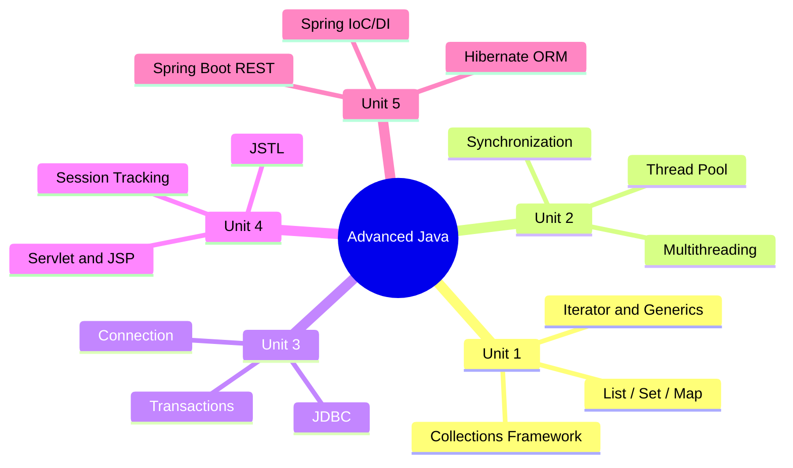

[[00-Dashboard/Home|Home]] | [[02-Semester-VI/Semester-VI-Dashboard|Semester VI]] | [[Overview]] | [[Syllabus]] | [[Unit-1]] | [[Unit-2]] | [[Unit-3]] | [[Unit-4]] | [[Unit-5]] | [[Important-Questions|Imp. Qs]] | [[Revision]] | [[Interview-Prep]]

# CS-351-MJ-T - Advanced Java

> [!important] Subject at a Glance
> Advanced Java covers enterprise-level Java programming concepts including Collections, Multithreading, JDBC, Servlets/JSP, and Spring/Hibernate frameworks - all highly sought-after skills in the industry.

## Learning Objectives

After completing this subject, students will be able to:

- [ ] Use the Java Collections Framework effectively for data manipulation
- [ ] Write multithreaded programs using proper synchronization mechanisms
- [ ] Connect Java applications to databases using JDBC
- [ ] Build web applications using Servlets and JSP
- [ ] Understand ORM with Hibernate and application development with Spring Boot
- [ ] Design and expose RESTful APIs using Spring Boot

## Subject Map



## Units Summary

| Unit | Topic | Hours | Weight |
|------|-------|-------|--------|
| [[Unit-1|Unit 1: Collections Framework]] | Collections Framework | 6H | |
| [[Unit-2|Unit 2: Multithreading]] | Multithreading | 6H | |
| [[Unit-3|Unit 3: JDBC]] | JDBC | 6H | |
| [[Unit-4|Unit 4: Servlets and JSP]] | Servlet and JSP | 6H | |
| [[Unit-5|Unit 5: Spring Boot]] | Hibernate / Spring Basics | 6H | |

**Total: 30 Hours**

## Reference Books

1. **Herbert Schildt** - *Java: The Complete Reference* (Primary)
2. **Kathy Sierra and Bert Bates** - *Head First Java*
3. **Craig Walls** - *Spring in Action*
4. **Christian Bauer and Gavin King** - *Hibernate in Action*

## Quick Navigation

- [[Syllabus]] - Detailed syllabus breakdown
- [[Unit-1|Unit 1: Collections Framework]] - List, Set, Map, Generics
- [[Unit-2|Unit 2: Multithreading]] - Threads, Sync, Executor
- [[Unit-3|Unit 3: JDBC]] - Database connectivity
- [[Unit-4|Unit 4: Servlets and JSP]] - Web layer
- [[Unit-5|Unit 5: Spring Boot]] - Frameworks
- [[Important-Questions]] - Exam-focused questions
- [[Revision]] - Quick revision notes
- [[Interview-Prep]] - Interview Q&A

## Why This Subject Matters

> [!tip] Industry Relevance
> Advanced Java topics are **core requirements** for backend Java developer roles. Spring Boot + Hibernate alone appear in **70%+ of Java job descriptions**. Collections and Multithreading are tested in **every Java technical interview**.

## Difficulty Heatmap

```
Collections    ████████░░  Hard (many classes/interfaces)
Multithreading █████████░  Very Hard (concurrency bugs)
JDBC           ██████░░░░  Medium
Servlet/JSP    ███████░░░  Medium-Hard
Spring/Hibernate ████████░  Hard (concepts + config)
```

## Related Subjects

- [[02-Semester-VI/CS-353-MJ-T-Web-Technology-II/Overview|Web Technology II]] - Frontend complement
- [[02-Semester-VI/CS-354-MJ-T-Compiler-Construction/Overview|Compiler Construction]] - Language internals
- [[02-Semester-VI/CS-357-MJ-T-Android-Programming/Overview|Android Programming]] - Mobile Java

---
*Last updated: 2026-06-16 | Semester VI | CS-351-MJ-T*
