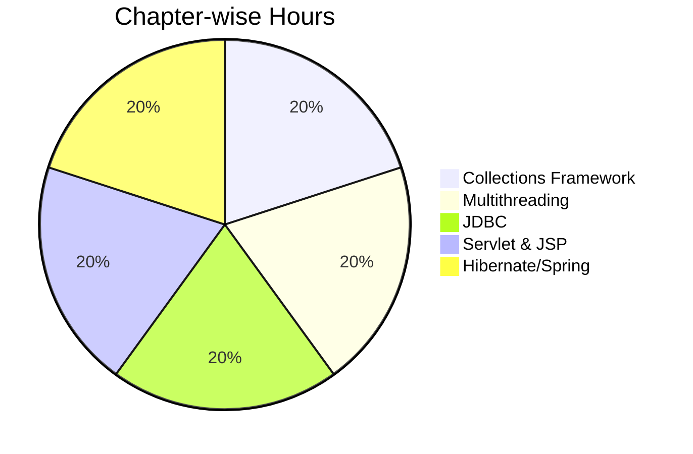

#  CS-351-MJ-T - Advanced Java Syllabus

> [!note] Official Syllabus
> This document contains the complete chapter-wise syllabus as prescribed. Total contact hours: **30H**.

## Chapter 1: Collections Framework (6H)

### Topics Covered
- **List Interface**: `ArrayList`, `LinkedList`
- **Set Interface**: `HashSet`, `TreeSet`, `LinkedHashSet`
- **Map Interface**: `HashMap`, `TreeMap`, `LinkedHashMap`
- **Queue & Deque**: `PriorityQueue`, `ArrayDeque`
- **Iterator** pattern, `ListIterator`
- **Comparable vs Comparator** - natural ordering vs custom ordering
- **Generics** - type parameters, bounded types, wildcards

### Expected Outcomes
 Choose the right collection for a given problem  
 Implement custom sorting using Comparator  
 Write generic classes and methods  

---

## Chapter 2: Multithreading (6H)

### Topics Covered
- **Thread class vs Runnable interface** - creation approaches
- **Thread lifecycle** - New → Runnable → Running → Blocked → Dead
- **Thread priorities** - `MIN_PRIORITY`, `NORM_PRIORITY`, `MAX_PRIORITY`
- **Synchronization** - `synchronized` keyword, `wait()`, `notify()`, `notifyAll()`
- **Thread Pool** - `ExecutorService`, `Executors` factory
- **`volatile` keyword** - visibility guarantee
- **Deadlock** - conditions, detection, prevention

### Expected Outcomes
 Create and manage threads using both approaches  
 Prevent race conditions using synchronization  
 Use ExecutorService for thread pooling  

---

## Chapter 3: JDBC (6H)

### Topics Covered
- **JDBC Architecture** - JDBC API, Driver Manager, JDBC Driver
- **Driver Types** - Type 1, 2, 3, 4 (Thin Driver)
- **Connection** - `DriverManager.getConnection()`
- **Statement vs PreparedStatement vs CallableStatement**
- **ResultSet** - navigating results, types (`TYPE_SCROLL_SENSITIVE`)
- **Transaction Management** - `commit()`, `rollback()`, `setAutoCommit()`
- **Connection Pooling Basics** - `DataSource`, `c3p0`, HikariCP

### Expected Outcomes
 Connect Java to MySQL/Oracle via JDBC  
 Use PreparedStatement to prevent SQL injection  
 Manage transactions programmatically  

---

## Chapter 4: Servlet & JSP (6H)

### Topics Covered
- **Servlet Lifecycle** - `init()`, `service()`, `destroy()`
- **HTTP Methods** - GET, POST, PUT, DELETE handling
- **HttpServletRequest / HttpServletResponse** - reading params, writing response
- **Session Tracking** - Cookies, `HttpSession`, URL Rewriting, Hidden Fields
- **JSP Directives** - `<%@ page %>`, `<%@ include %>`, `<%@ taglib %>`
- **Scriptlets** - `<% %>`, `<%= %>`, `<%! %>`
- **Implicit Objects** - `request`, `response`, `session`, `application`, `out`, `page`, `config`, `pageContext`, `exception`
- **JSTL Basics** - `<c:out>`, `<c:if>`, `<c:forEach>`, `<c:set>`

### Expected Outcomes
 Build a complete Servlet-based web app  
 Implement session management using cookies and HttpSession  
 Write JSP pages using directives, scriptlets, and JSTL  

---

## Chapter 5: Hibernate / Spring Basics (6H)

### Topics Covered
- **ORM Concept** - Object-Relational Mapping, impedance mismatch
- **Hibernate Architecture** - `SessionFactory`, `Session`, `Transaction`
- **HQL** - Hibernate Query Language, criteria queries
- **Spring IoC/DI Concept** - Inversion of Control, Dependency Injection types
- **Spring MVC Basics** - `DispatcherServlet`, Controller, View Resolver
- **Spring Boot Introduction** - Auto-configuration, starters, `@SpringBootApplication`
- **REST API with Spring Boot** - `@RestController`, `@GetMapping`, `@PostMapping`, `@RequestBody`, `@PathVariable`

### Expected Outcomes
 Map Java classes to database tables using Hibernate  
 Understand the Spring IoC container and DI  
 Build a basic REST API using Spring Boot  

---

##  Syllabus Weightage

##  Recommended Reading

| Book | Author | Best For |
|------|--------|----------|
| Java: The Complete Reference | Herbert Schildt | All units |
| Head First Java | Sierra & Bates | Concepts |
| Spring in Action | Craig Walls | Unit 5 |
| Hibernate in Action | Bauer & King | Unit 5 |
| Effective Java | Joshua Bloch | Best practices |

##  Navigation

- [[Overview]] - Subject overview
- [[Unit-1|Unit-1 - Collections Framework]]
- [[Unit-2|Unit-2 - Multithreading]]
- [[Unit-3|Unit-3 - JDBC]]
- [[Unit-4|Unit-4 - Servlet & JSP]]
- [[Unit-5|Unit-5 - Hibernate & Spring]]
- [[Important-Questions]]
- [[Revision]]
- [[Interview-Prep]]

---
*CS-351-MJ-T Advanced Java | Semester VI*
