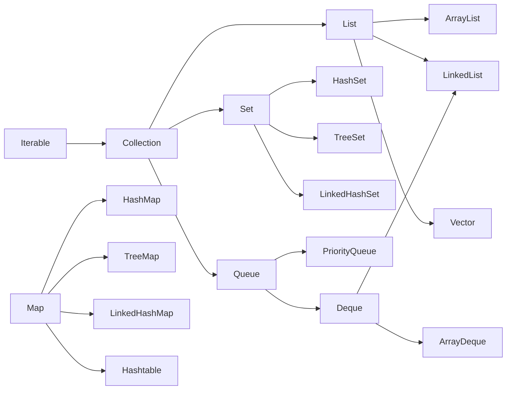

[[00-Dashboard/Home|Home]] | [[02-Semester-VI/Semester-VI-Dashboard|Semester VI]] | [[Overview]] | [[Syllabus]] | [[Unit-1]] | [[Unit-2]] | [[Unit-3]] | [[Unit-4]] | [[Unit-5]] | [[Important-Questions|Imp. Qs]] | [[Revision]] | [[Interview-Prep]]


# Unit 1 - Collections Framework

> [!note] Unit Overview
> The Java Collections Framework provides a unified architecture for storing and manipulating groups of objects. This unit covers all major collection types, iterators, ordering mechanisms, and generics.

## Learning Objectives

- [ ] Distinguish between List, Set, Map, and Queue interfaces
- [ ] Choose the appropriate collection class for a given use case
- [ ] Use `Comparable` and `Comparator` for custom sorting
- [ ] Write generic classes, methods, and bounded type parameters
- [ ] Use `Iterator` and `ListIterator` to traverse collections

---

## 1.1 Collections Framework Overview

The ==Java Collections Framework (JCF)== is a set of classes and interfaces in `java.util` package that provides ready-made data structures.



> [!tip] Key Point
> `Map` does **NOT** extend `Collection` interface. It is a separate hierarchy.

---

## 1.2 List Interface

The ==List interface== represents an **ordered, index-based, duplicate-allowing** collection.

### ArrayList

- Backed by a **dynamic array**
- Fast random access: O(1)
- Slow insertions/deletions in the middle: O(n)
- **Not thread-safe**

```java
import java.util.*;

public class ArrayListDemo {
    public static void main(String[] args) {
        List<String> list = new ArrayList<>();
        list.add("Apple");
        list.add("Banana");
        list.add("Cherry");
        list.add("Apple");  // Duplicates allowed
        
        System.out.println(list.get(1));  // Banana
        System.out.println(list.size());  // 4
        
        list.remove("Banana");
        System.out.println(list);  // [Apple, Cherry, Apple]
        
        // Sort
        Collections.sort(list);
        System.out.println(list);  // [Apple, Apple, Cherry]
    }
}
```

### LinkedList

- Backed by a **doubly linked list**
- Fast insertions/deletions: O(1) at head/tail
- Slow random access: O(n)
- Implements both `List` and `Deque`

```java
LinkedList<Integer> ll = new LinkedList<>();
ll.addFirst(1);
ll.addLast(3);
ll.add(1, 2);  // Insert at index 1
System.out.println(ll);  // [1, 2, 3]

ll.removeFirst();
ll.removeLast();
System.out.println(ll);  // [2]
```

### ArrayList vs LinkedList - Comparison Table

| Feature | ArrayList | LinkedList |
|---------|-----------|------------|
| Internal Structure | Dynamic Array | Doubly Linked List |
| Random Access | O(1)  | O(n)  |
| Insertion at middle | O(n)  | O(1)  |
| Memory overhead | Low | High (node pointers) |
| Implements Deque |  |  |
| Thread-safe |  |  |
| Best for | Read-heavy | Insert/Delete-heavy |

^arraylist-vs-linkedlist

---

## 1.3 Set Interface

The ==Set interface== represents an **unordered collection of unique elements** - no duplicates allowed.

### HashSet

- Backed by **HashMap**
- **No ordering** of elements
- O(1) average for add, remove, contains
- Allows one `null`

```java
Set<String> hs = new HashSet<>();
hs.add("Mango");
hs.add("Apple");
hs.add("Mango");  // Duplicate - ignored
System.out.println(hs);  // [Apple, Mango] or [Mango, Apple] - no order
System.out.println(hs.size());  // 2
```

### TreeSet

- Backed by **Red-Black Tree**
- Elements stored in **sorted (natural) order**
- O(log n) for add, remove, contains
- Does NOT allow `null`

```java
TreeSet<Integer> ts = new TreeSet<>();
ts.add(5); ts.add(1); ts.add(3);
System.out.println(ts);  // [1, 3, 5] - sorted!
System.out.println(ts.first());  // 1
System.out.println(ts.last());   // 5
```

### LinkedHashSet

- Backed by **LinkedHashMap**
- Maintains **insertion order**
- O(1) average performance
- Allows one `null`

```java
LinkedHashSet<String> lhs = new LinkedHashSet<>();
lhs.add("Banana"); lhs.add("Apple"); lhs.add("Cherry");
System.out.println(lhs);  // [Banana, Apple, Cherry] - insertion order!
```

### Set Implementations Comparison

| Feature | HashSet | TreeSet | LinkedHashSet |
|---------|---------|---------|---------------|
| Order | None | Sorted | Insertion |
| Time Complexity | O(1) | O(log n) | O(1) |
| Null allowed | Yes (one) | No | Yes (one) |
| Implements | Set | SortedSet, NavigableSet | Set |
| Backed by | HashMap | TreeMap | LinkedHashMap |

---

## 1.4 Map Interface

The ==Map interface== represents **key-value pairs** - keys must be unique, values can be duplicated.

### HashMap

- Backed by **hash table**
- Keys are **unordered**
- One `null` key, multiple `null` values
- O(1) average for get/put

```java
Map<String, Integer> hm = new HashMap<>();
hm.put("Alice", 90);
hm.put("Bob", 75);
hm.put("Charlie", 85);
hm.put("Alice", 95);  // Key "Alice" updated - no duplicate keys

System.out.println(hm.get("Bob"));  // 75
System.out.println(hm.containsKey("Charlie"));  // true

// Iterating
for (Map.Entry<String, Integer> entry : hm.entrySet()) {
    System.out.println(entry.getKey() + " → " + entry.getValue());
}
```

### TreeMap

- Backed by **Red-Black Tree**
- Keys stored in **sorted order**
- O(log n) for get/put
- No `null` keys

```java
TreeMap<String, Integer> tm = new TreeMap<>();
tm.put("Banana", 2);
tm.put("Apple", 5);
tm.put("Cherry", 1);
System.out.println(tm);  // {Apple=5, Banana=2, Cherry=1} - sorted by key
System.out.println(tm.firstKey());  // Apple
System.out.println(tm.lastKey());   // Cherry
```

### LinkedHashMap

- Maintains **insertion order** or **access order**
- Used to build LRU Cache (access-order mode)

```java
LinkedHashMap<String, Integer> lhm = new LinkedHashMap<>();
lhm.put("First", 1);
lhm.put("Second", 2);
lhm.put("Third", 3);
System.out.println(lhm);  // {First=1, Second=2, Third=3}
```

### Map Implementations Comparison

| Feature | HashMap | TreeMap | LinkedHashMap |
|---------|---------|---------|---------------|
| Key Order | None | Sorted | Insertion/Access |
| Null Key | Yes (one) | No | Yes |
| Performance | O(1) avg | O(log n) | O(1) avg |
| Thread-safe | No | No | No |
| Backed by | Hash Table | Red-Black Tree | Hash Table + LinkedList |

---

## 1.5 Queue and Deque

### Queue Interface

==Queue== follows **FIFO** (First In First Out). Key methods:
- `offer()` / `add()` - insert
- `poll()` / `remove()` - remove head
- `peek()` / `element()` - view head

```java
Queue<String> queue = new LinkedList<>();
queue.offer("Task1");
queue.offer("Task2");
queue.offer("Task3");

System.out.println(queue.peek());   // Task1 (does not remove)
System.out.println(queue.poll());   // Task1 (removes it)
System.out.println(queue);          // [Task2, Task3]
```

### PriorityQueue

- Elements ordered by **priority** (natural or custom)

```java
PriorityQueue<Integer> pq = new PriorityQueue<>();  // Min-heap
pq.offer(5); pq.offer(1); pq.offer(3);
System.out.println(pq.poll());  // 1 (smallest first)
System.out.println(pq.poll());  // 3
```

### Deque (Double-Ended Queue)

==Deque== allows insertion/removal from **both ends**.

```java
Deque<String> dq = new ArrayDeque<>();
dq.addFirst("A");
dq.addLast("B");
dq.addFirst("Z");
System.out.println(dq);  // [Z, A, B]

dq.removeFirst();  // Z
dq.removeLast();   // B
System.out.println(dq);  // [A]
```

---

## 1.6 Iterator

==Iterator== provides a standard way to traverse any collection.

```java
List<String> list = new ArrayList<>(Arrays.asList("A", "B", "C", "D"));
Iterator<String> it = list.iterator();

while (it.hasNext()) {
    String s = it.next();
    if (s.equals("B")) {
        it.remove();  // Safe removal during iteration
    }
}
System.out.println(list);  // [A, C, D]
```

### ListIterator

- Bidirectional iteration (for List only)

```java
ListIterator<String> lit = list.listIterator();
while (lit.hasPrevious()) {
    System.out.println(lit.previous());  // Backward traversal
}
```

> [!warning] ConcurrentModificationException
> Never use `list.remove()` while iterating with a `for-each` or `Iterator` - use `iterator.remove()` instead.

---

## 1.7 Comparable vs Comparator

### Comparable - Natural Ordering

- Interface in `java.lang`
- Implement `compareTo()` in the class itself
- Defines the **default/natural sort order**

```java
class Student implements Comparable<Student> {
    String name;
    int marks;
    
    Student(String name, int marks) {
        this.name = name;
        this.marks = marks;
    }
    
    @Override
    public int compareTo(Student other) {
        return this.marks - other.marks;  // Sort by marks ascending
    }
    
    @Override
    public String toString() {
        return name + "(" + marks + ")";
    }
}

// Usage
List<Student> students = new ArrayList<>();
students.add(new Student("Alice", 90));
students.add(new Student("Bob", 75));
students.add(new Student("Charlie", 85));

Collections.sort(students);
System.out.println(students);  // [Bob(75), Charlie(85), Alice(90)]
```

### Comparator - Custom Ordering

- Interface in `java.util`
- External class or lambda - separates sorting logic from data class
- Allows **multiple sort orders**

```java
// Sort by name
Comparator<Student> byName = (s1, s2) -> s1.name.compareTo(s2.name);

// Sort by marks descending
Comparator<Student> byMarksDesc = (s1, s2) -> s2.marks - s1.marks;

students.sort(byName);
System.out.println(students);  // Alphabetical

students.sort(byMarksDesc);
System.out.println(students);  // Marks descending

// Chaining comparators
students.sort(Comparator.comparing((Student s) -> s.marks)
                        .thenComparing(s -> s.name));
```

### Comparable vs Comparator

| Feature | Comparable | Comparator |
|---------|------------|------------|
| Package | `java.lang` | `java.util` |
| Method | `compareTo(T o)` | `compare(T o1, T o2)` |
| Implementation | Inside the class | Outside (separate class/lambda) |
| Sort orders | Only one | Multiple possible |
| Use case | Natural ordering | Custom/multiple ordering |
| Modifies class | Yes | No |

^comparable-vs-comparator

---

## 1.8 Generics

==Generics== enable type-safe code by parameterizing classes, interfaces, and methods with type parameters.

### Generic Class

```java
class Box<T> {
    private T value;
    
    public Box(T value) { this.value = value; }
    
    public T getValue() { return value; }
    
    @Override
    public String toString() {
        return "Box[" + value + "]";
    }
}

// Usage
Box<Integer> intBox = new Box<>(42);
Box<String> strBox = new Box<>("Hello");

System.out.println(intBox.getValue());  // 42
System.out.println(strBox.getValue());  // Hello
```

### Generic Method

```java
public static <T extends Comparable<T>> T findMax(T[] arr) {
    T max = arr[0];
    for (T item : arr) {
        if (item.compareTo(max) > 0) max = item;
    }
    return max;
}

// Usage
Integer[] ints = {3, 1, 4, 1, 5, 9};
String[] strs = {"banana", "apple", "cherry"};

System.out.println(findMax(ints));  // 9
System.out.println(findMax(strs));  // cherry
```

### Bounded Type Parameters

```java
// Upper bound - T must be Number or its subclass
public <T extends Number> double sum(List<T> list) {
    double total = 0;
    for (T item : list) total += item.doubleValue();
    return total;
}

// Wildcard - unknown type
public void printList(List<?> list) {
    for (Object o : list) System.out.print(o + " ");
}

// Upper bounded wildcard
public double sumList(List<? extends Number> list) {
    double total = 0;
    for (Number n : list) total += n.doubleValue();
    return total;
}
```

### Type Erasure

> [!note] Type Erasure
> At runtime, generic type information is **erased** by the compiler. `List<Integer>` and `List<String>` are both just `List` at runtime. This is why you cannot do `new T[]` or `instanceof List<Integer>`.

---

## Key Terms Summary

| Term | Definition |
|------|------------|
| ==Collection== | Root interface for all collections except Map |
| ==ArrayList== | Resizable array - fast random access |
| ==LinkedList== | Doubly linked list - fast insertions |
| ==HashSet== | Unordered set backed by HashMap |
| ==TreeSet== | Sorted set backed by Red-Black Tree |
| ==HashMap== | Key-value store with hash-based lookup |
| ==Iterator== | Interface for traversing collections |
| ==Comparable== | Natural ordering - `compareTo()` |
| ==Comparator== | Custom ordering - `compare()` |
| ==Generics== | Type parameters for type-safe collections |

---

## Practice Questions

1. What is the difference between `ArrayList` and `LinkedList`? When would you prefer each?
2. How does `HashSet` prevent duplicate elements internally?
3. Explain the difference between `HashMap`, `TreeMap`, and `LinkedHashMap`.
4. What happens when you add a duplicate key to a `HashMap`?
5. Write a program to sort a list of `Employee` objects by salary using `Comparator`.
6. What is the difference between `Iterator` and `ListIterator`?
7. How do generics help achieve type safety in Java?
8. What is `ConcurrentModificationException` and how is it caused?
9. Explain `Comparable` vs `Comparator` with an example.
10. What is the time complexity of operations in `TreeMap` vs `HashMap`?

---

## Navigation

- [[Overview]] | [[Syllabus]]
- ← Previous: (Start)
- → Next: [[Unit-2|Unit-2 - Multithreading]]
- [[Important-Questions]] | [[Revision]] | [[Interview-Prep]]

---
*CS-351-MJ-T Advanced Java | Unit 1 | Semester VI*
