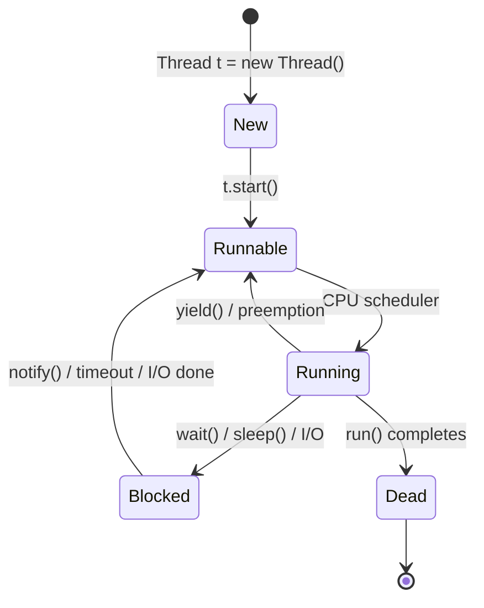

#  Unit 2 - Multithreading

> [!important] Critical Unit
> Multithreading is one of the **most frequently asked** topics in Java interviews. Understanding race conditions, synchronization, and the Executor framework is essential for any professional Java developer.

##  Learning Objectives

- [ ] Create threads using `Thread` class and `Runnable` interface
- [ ] Describe all states in the thread lifecycle
- [ ] Use `synchronized`, `wait()`, `notify()` correctly
- [ ] Use `ExecutorService` for thread pool management
- [ ] Understand `volatile` keyword semantics
- [ ] Identify and prevent deadlock

---

## 2.1 Thread Creation: Two Approaches

### Approach 1: Extending Thread Class

```java
class MyThread extends Thread {
    private String threadName;
    
    MyThread(String name) {
        this.threadName = name;
    }
    
    @Override
    public void run() {
        for (int i = 1; i <= 5; i++) {
            System.out.println(threadName + " - Count: " + i);
            try { Thread.sleep(500); } catch (InterruptedException e) {}
        }
    }
}

// Usage
public class ThreadDemo {
    public static void main(String[] args) {
        MyThread t1 = new MyThread("Thread-A");
        MyThread t2 = new MyThread("Thread-B");
        t1.start();  // start() internally calls run() in a new thread
        t2.start();
    }
}
```

### Approach 2: Implementing Runnable Interface

```java
class MyTask implements Runnable {
    private String taskName;
    
    MyTask(String name) { this.taskName = name; }
    
    @Override
    public void run() {
        for (int i = 1; i <= 5; i++) {
            System.out.println(taskName + " - Step: " + i);
        }
    }
}

// Usage
Thread t = new Thread(new MyTask("Task-1"));
t.start();

// With Lambda (since Runnable is a functional interface)
Thread t2 = new Thread(() -> System.out.println("Lambda thread!"));
t2.start();
```

### Thread vs Runnable - Comparison

| Feature | Thread (extends) | Runnable (implements) |
|---------|-------------------|----------------------|
| Inheritance | Single inheritance used up | Free to extend another class |
| Coupling | Tight - logic tied to Thread | Loose - separates task from thread |
| Reusability | Lower | Higher (same Runnable with multiple threads) |
| Flexibility | Less | More (can pass to Executor) |
| **Preferred approach** |  Rarely |  Preferred |

^thread-vs-runnable

---

## 2.2 Thread Lifecycle



### States Description

| State | Description | Method Causing Transition |
|-------|-------------|--------------------------|
| **New** | Thread object created but not started | `new Thread()` |
| **Runnable** | Ready to run, waiting for CPU | `start()` |
| **Running** | CPU is executing thread | Scheduler picks it |
| **Blocked/Waiting** | Waiting for monitor/lock/condition | `wait()`, `sleep()`, I/O |
| **Timed Waiting** | Waiting with timeout | `sleep(ms)`, `wait(ms)` |
| **Dead/Terminated** | Thread finished execution | `run()` returns |

---

## 2.3 Thread Priorities

```java
Thread t = new Thread(() -> System.out.println("Task"));
t.setPriority(Thread.MAX_PRIORITY);  // 10
t.setPriority(Thread.NORM_PRIORITY); // 5 (default)
t.setPriority(Thread.MIN_PRIORITY);  // 1

System.out.println(t.getPriority()); // Get priority
```

> [!warning] Priority Note
> Thread priority is a **hint** to the scheduler - it does not guarantee execution order. The JVM and OS may or may not honor priorities.

---

## 2.4 Synchronization

Without synchronization, concurrent access to shared data leads to **race conditions**.

### Example - Race Condition (Problem)

```java
class Counter {
    int count = 0;
    
    void increment() {
        count++;  // NOT atomic! Read-Modify-Write = 3 steps
    }
}

Counter c = new Counter();
Thread t1 = new Thread(() -> { for(int i=0; i<1000; i++) c.increment(); });
Thread t2 = new Thread(() -> { for(int i=0; i<1000; i++) c.increment(); });
t1.start(); t2.start();
t1.join(); t2.join();

// Expected: 2000, Actual: < 2000 (race condition!)
System.out.println(c.count);
```

### Synchronized Method

```java
class Counter {
    int count = 0;
    
    synchronized void increment() {
        count++;  // Only one thread can execute at a time
    }
    
    synchronized int getCount() {
        return count;
    }
}
```

### Synchronized Block (Finer-grained)

```java
class Counter {
    int count = 0;
    Object lock = new Object();
    
    void increment() {
        synchronized (lock) {  // Lock on specific object
            count++;
        }
        // Other code here runs concurrently
    }
}
```

### wait() and notify()

`wait()` and `notify()` are used for **thread communication** (Producer-Consumer pattern):

```java
class SharedQueue {
    private Queue<Integer> queue = new LinkedList<>();
    private int maxSize = 5;
    
    synchronized void produce(int item) throws InterruptedException {
        while (queue.size() == maxSize) {
            System.out.println("Queue full, producer waiting...");
            wait();  // Releases lock and waits
        }
        queue.add(item);
        System.out.println("Produced: " + item);
        notify();  // Wake up a waiting consumer
    }
    
    synchronized int consume() throws InterruptedException {
        while (queue.isEmpty()) {
            System.out.println("Queue empty, consumer waiting...");
            wait();  // Releases lock and waits
        }
        int item = queue.poll();
        System.out.println("Consumed: " + item);
        notify();  // Wake up a waiting producer
        return item;
    }
}
```

> [!important] wait/notify Rules
> - Must be called from **synchronized** context
> - `wait()` releases the lock temporarily
> - `notify()` wakes one thread, `notifyAll()` wakes all
> - After `notify()`, the awakened thread must still re-acquire the lock

---

## 2.5 Thread Pool - ExecutorService

Creating a new thread for every task is expensive. ==ExecutorService== provides a **pool of reusable threads**.

```java
import java.util.concurrent.*;

public class ExecutorDemo {
    public static void main(String[] args) throws InterruptedException {
        // Fixed thread pool - 3 threads
        ExecutorService executor = Executors.newFixedThreadPool(3);
        
        for (int i = 1; i <= 10; i++) {
            final int taskId = i;
            executor.submit(() -> {
                System.out.println("Task " + taskId + " executed by " 
                    + Thread.currentThread().getName());
                try { Thread.sleep(500); } catch (InterruptedException e) {}
            });
        }
        
        executor.shutdown();  // Stop accepting new tasks
        executor.awaitTermination(10, TimeUnit.SECONDS);  // Wait for completion
        System.out.println("All tasks done!");
    }
}
```

### ExecutorService Factory Methods

| Method | Description |
|--------|-------------|
| `Executors.newFixedThreadPool(n)` | Pool of n threads |
| `Executors.newCachedThreadPool()` | Dynamic pool, reuses idle threads |
| `Executors.newSingleThreadExecutor()` | Single background thread |
| `Executors.newScheduledThreadPool(n)` | For scheduled/periodic tasks |

### Callable and Future

`Callable` is like `Runnable` but **can return a value** and throw exceptions:

```java
ExecutorService exec = Executors.newFixedThreadPool(2);

Callable<Integer> task = () -> {
    Thread.sleep(1000);
    return 42;
};

Future<Integer> future = exec.submit(task);
System.out.println("Doing other work...");
Integer result = future.get();  // Blocks until result is ready
System.out.println("Result: " + result);  // 42

exec.shutdown();
```

---

## 2.6 volatile Keyword

The ==volatile keyword== ensures **visibility** of changes across threads. Without it, threads may read stale cached values.

```java
class StatusChecker {
    private volatile boolean running = true;  // Visible to all threads
    
    void stop() {
        running = false;  // Change visible immediately to all threads
    }
    
    void checkStatus() {
        while (running) {  // Reads fresh value each time
            System.out.println("Running...");
            try { Thread.sleep(500); } catch (InterruptedException e) {}
        }
        System.out.println("Stopped!");
    }
}
```

> [!note] volatile vs synchronized
> - `volatile` guarantees **visibility** but NOT **atomicity**
> - `volatile` is suitable for simple flag variables
> - `synchronized` guarantees both visibility and atomicity
> - `volatile` does NOT prevent race conditions on compound operations like `count++`

---

## 2.7 Deadlock

==Deadlock== occurs when two or more threads are waiting for each other to release locks - circular dependency.

### Deadlock Example

```java
Object lock1 = new Object();
Object lock2 = new Object();

Thread t1 = new Thread(() -> {
    synchronized (lock1) {
        System.out.println("T1: holding lock1, waiting for lock2");
        try { Thread.sleep(100); } catch (InterruptedException e) {}
        synchronized (lock2) {  // Waiting for lock2
            System.out.println("T1: holding both locks");
        }
    }
});

Thread t2 = new Thread(() -> {
    synchronized (lock2) {  // lock2 acquired by T2
        System.out.println("T2: holding lock2, waiting for lock1");
        try { Thread.sleep(100); } catch (InterruptedException e) {}
        synchronized (lock1) {  // Waiting for lock1 - DEADLOCK!
            System.out.println("T2: holding both locks");
        }
    }
});

t1.start(); t2.start();  // DEADLOCK! Both threads wait forever
```

### Deadlock Conditions (Coffman's 4 Conditions)

| Condition | Description |
|-----------|-------------|
| **Mutual Exclusion** | Resources cannot be shared |
| **Hold and Wait** | Thread holds one resource, waits for another |
| **No Preemption** | Resources cannot be forcibly taken |
| **Circular Wait** | Circular chain of threads, each waiting for next |

### Deadlock Prevention

```java
// Fix: Always acquire locks in the SAME ORDER
Thread t1 = new Thread(() -> {
    synchronized (lock1) {
        synchronized (lock2) {  // Both threads acquire lock1 first, then lock2
            System.out.println("T1 done");
        }
    }
});

Thread t2 = new Thread(() -> {
    synchronized (lock1) {  // Same order as t1
        synchronized (lock2) {
            System.out.println("T2 done");
        }
    }
});
```

---

##  Key Terms Summary

| Term | Definition |
|------|------------|
| ==Thread== | Lightweight process - unit of execution |
| ==Runnable== | Functional interface with `run()` method |
| ==synchronized== | Keyword ensuring mutual exclusion |
| ==wait()== | Releases lock, waits for `notify()` |
| ==notify()== | Wakes one thread waiting on the object |
| ==ExecutorService== | Thread pool management interface |
| ==volatile== | Ensures variable visibility across threads |
| ==Deadlock== | Circular wait - all threads blocked forever |
| ==Race Condition== | Bug from unsynchronized concurrent access |

---

##  Practice Questions

1. What is the difference between `Thread` class and `Runnable` interface? Which is preferred?
2. Explain all states of a thread's lifecycle with a diagram.
3. What is a race condition? Write an example demonstrating it.
4. What is the difference between `synchronized` method and `synchronized` block?
5. Explain `wait()`, `notify()`, and `notifyAll()` with a Producer-Consumer example.
6. What is `ExecutorService`? What are the benefits of using a thread pool?
7. What is the `volatile` keyword? How is it different from `synchronized`?
8. What is deadlock? State the four Coffman conditions.
9. Write a program that demonstrates deadlock and then fix it.
10. What is `Callable`? How does it differ from `Runnable`?

---

##  Navigation

- [[Overview]] | [[Syllabus]]
- ← Previous: [[Unit-1|Unit-1 - Collections Framework]]
- → Next: [[Unit-3|Unit-3 - JDBC]]
- [[Important-Questions]] | [[Revision]] | [[Interview-Prep]]

---
*CS-351-MJ-T Advanced Java | Unit 2 | Semester VI*
