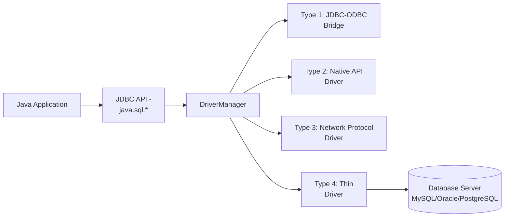
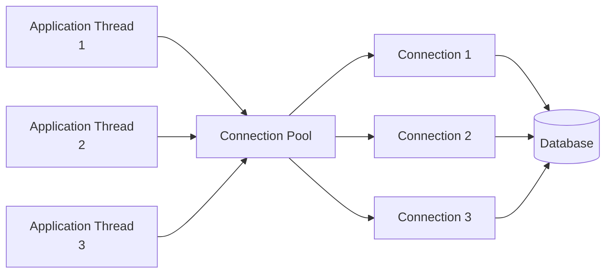

[[00-Dashboard/Home|Home]] | [[02-Semester-VI/Semester-VI-Dashboard|Semester VI]] | [[Overview]] | [[Syllabus]] | [[Unit-1]] | [[Unit-2]] | [[Unit-3]] | [[Unit-4]] | [[Unit-5]] | [[Important-Questions|Imp. Qs]] | [[Revision]] | [[Interview-Prep]]


# Unit 3 - JDBC (Java Database Connectivity)

> [!note] Unit Overview
> JDBC is the standard Java API for interacting with relational databases. This unit covers the complete JDBC workflow from driver loading to transaction management and connection pooling.

## Learning Objectives

- [ ] Describe JDBC architecture with all components
- [ ] Connect Java to a database using `DriverManager`
- [ ] Use `Statement`, `PreparedStatement`, and `CallableStatement`
- [ ] Navigate `ResultSet` to process query results
- [ ] Manage transactions with commit and rollback
- [ ] Explain connection pooling concepts

---

## 3.1 JDBC Architecture



### JDBC Components

| Component | Package | Role |
|-----------|---------|------|
| `DriverManager` | `java.sql` | Loads drivers, creates connections |
| `Connection` | `java.sql` | Represents DB connection |
| `Statement` | `java.sql` | Executes static SQL |
| `PreparedStatement` | `java.sql` | Executes parameterized SQL |
| `CallableStatement` | `java.sql` | Executes stored procedures |
| `ResultSet` | `java.sql` | Holds query results |
| `SQLException` | `java.sql` | DB errors |

---

## 3.2 JDBC Driver Types

| Type | Name | Description | Use Case |
|------|------|-------------|----------|
| **Type 1** | JDBC-ODBC Bridge | Translates JDBC to ODBC | Legacy - deprecated |
| **Type 2** | Native API | Uses native DB client library | Performance critical |
| **Type 3** | Network Protocol | Middleware server translates | Three-tier architecture |
| **Type 4** | Thin Driver | Pure Java, direct TCP to DB | **Most common today**  |

---

## 3.3 Establishing Connection

### Step-by-Step JDBC Workflow

```java
import java.sql.*;

public class JDBCExample {
    // Connection URL format: jdbc:<driver>://<host>:<port>/<database>
    private static final String URL = "jdbc:mysql://localhost:3306/school_db";
    private static final String USER = "root";
    private static final String PASS = "password";
    
    public static void main(String[] args) {
        // Step 1: Load driver (automatic from JDBC 4.0+)
        // Class.forName("com.mysql.cj.jdbc.Driver");
        
        // Step 2: Create Connection
        try (Connection conn = DriverManager.getConnection(URL, USER, PASS)) {
            
            System.out.println("Connected to database!");
            System.out.println("Catalog: " + conn.getCatalog());
            
            // Step 3: Create Statement
            Statement stmt = conn.createStatement();
            
            // Step 4: Execute Query
            ResultSet rs = stmt.executeQuery("SELECT * FROM students");
            
            // Step 5: Process ResultSet
            while (rs.next()) {
                int id = rs.getInt("student_id");
                String name = rs.getString("name");
                double marks = rs.getDouble("marks");
                System.out.printf("ID: %d | Name: %s | Marks: %.1f%n", id, name, marks);
            }
            
            // Step 6: Close resources (auto-closed by try-with-resources)
            
        } catch (SQLException e) {
            System.err.println("SQL Error: " + e.getMessage());
            System.err.println("SQL State: " + e.getSQLState());
            System.err.println("Error Code: " + e.getErrorCode());
        }
    }
}
```

---

## 3.4 Statement vs PreparedStatement vs CallableStatement

### Statement - Static SQL

```java
Statement stmt = conn.createStatement();

// DDL
stmt.executeUpdate("CREATE TABLE IF NOT EXISTS students (id INT, name VARCHAR(50))");

// DML
int rowsAffected = stmt.executeUpdate("INSERT INTO students VALUES (1, 'Alice')");

// Query
ResultSet rs = stmt.executeQuery("SELECT * FROM students WHERE id = 1");
```

> [!warning] SQL Injection Risk!
> Never concatenate user input into SQL strings with `Statement`:
> ```java
> // DANGEROUS!
> String sql = "SELECT * FROM users WHERE name = '" + userInput + "'";
> // Input: ' OR '1'='1 → exposes all records!
> ```

### PreparedStatement - Parameterized SQL

```java
String insertSQL = "INSERT INTO students (id, name, marks) VALUES (?, ?, ?)";

try (PreparedStatement pstmt = conn.prepareStatement(insertSQL)) {
    // Batch insert
    for (int i = 1; i <= 5; i++) {
        pstmt.setInt(1, i);           // Sets first ?
        pstmt.setString(2, "Student" + i);  // Sets second ?
        pstmt.setDouble(3, 70 + i * 5);     // Sets third ?
        pstmt.addBatch();
    }
    
    int[] results = pstmt.executeBatch();
    System.out.println("Inserted " + results.length + " rows");
}

// Query with PreparedStatement
String selectSQL = "SELECT * FROM students WHERE marks > ? AND name LIKE ?";
try (PreparedStatement pstmt = conn.prepareStatement(selectSQL)) {
    pstmt.setDouble(1, 80.0);
    pstmt.setString(2, "A%");  // Names starting with A
    
    ResultSet rs = pstmt.executeQuery();
    while (rs.next()) {
        System.out.println(rs.getString("name") + ": " + rs.getDouble("marks"));
    }
}
```

### CallableStatement - Stored Procedures

```java
// Assuming stored procedure: CALL get_student_details(IN student_id INT, OUT student_name VARCHAR)
try (CallableStatement cstmt = conn.prepareCall("{CALL get_student_details(?, ?)}")) {
    cstmt.setInt(1, 101);         // IN parameter
    cstmt.registerOutParameter(2, Types.VARCHAR);  // OUT parameter
    
    cstmt.execute();
    
    String name = cstmt.getString(2);  // Get OUT parameter
    System.out.println("Student Name: " + name);
}
```

### Statement Comparison Table

| Feature | Statement | PreparedStatement | CallableStatement |
|---------|-----------|-------------------|-------------------|
| SQL type | Static | Parameterized | Stored Procedure |
| SQL Injection | Vulnerable | **Safe**  | Safe |
| Precompilation | No | **Yes** (faster) | Yes |
| Reusability | Low | High | High |
| Batch support | Yes | Yes | Yes |
| Use case | DDL, one-time | DML, queries | Stored procedures |

^statement-types

---

## 3.5 ResultSet - Processing Results

```java
// Different ResultSet types
Statement stmt = conn.createStatement(
    ResultSet.TYPE_SCROLL_SENSITIVE,  // Can scroll backward
    ResultSet.CONCUR_UPDATABLE        // Can update through ResultSet
);

ResultSet rs = stmt.executeQuery("SELECT * FROM students ORDER BY marks DESC");

// Forward navigation
while (rs.next()) {
    System.out.println(rs.getString("name"));
}

// Scrollable ResultSet navigation
rs.beforeFirst();   // Before first row
rs.afterLast();     // After last row
rs.first();         // Move to first row
rs.last();          // Move to last row
rs.absolute(3);     // Move to row 3
rs.relative(-1);    // Move back 1 row

// Getting data by column index or name
int id = rs.getInt(1);          // By index (1-based!)
String name = rs.getString("name");  // By column name
double marks = rs.getDouble("marks");
Date dob = rs.getDate("dob");
boolean active = rs.getBoolean("active");

// Check for NULL
if (rs.wasNull()) {
    System.out.println("Last value was NULL");
}

// ResultSet types
// TYPE_FORWARD_ONLY - default, forward only
// TYPE_SCROLL_INSENSITIVE - scroll but no live updates
// TYPE_SCROLL_SENSITIVE - scroll with live database updates

// Concurrency modes
// CONCUR_READ_ONLY - default, read only
// CONCUR_UPDATABLE - can update through ResultSet
```

---

## 3.6 Transaction Management

By default, JDBC runs in **auto-commit mode** (each statement = one transaction).

```java
Connection conn = DriverManager.getConnection(URL, USER, PASS);

try {
    // Step 1: Disable auto-commit
    conn.setAutoCommit(false);
    
    // Step 2: Perform operations
    Statement stmt = conn.createStatement();
    
    // Bank transfer example - both operations must succeed or both fail
    stmt.executeUpdate("UPDATE accounts SET balance = balance - 1000 WHERE id = 1");
    
    // Simulate an error
    if (Math.random() > 0.5) throw new SQLException("Transfer failed!");
    
    stmt.executeUpdate("UPDATE accounts SET balance = balance + 1000 WHERE id = 2");
    
    // Step 3: Commit if all successful
    conn.commit();
    System.out.println("Transfer successful!");
    
} catch (SQLException e) {
    // Step 4: Rollback on error
    try {
        conn.rollback();
        System.out.println("Transaction rolled back!");
    } catch (SQLException rb) {
        rb.printStackTrace();
    }
    e.printStackTrace();
} finally {
    conn.setAutoCommit(true);  // Restore auto-commit
    conn.close();
}
```

### Savepoints

```java
conn.setAutoCommit(false);
Savepoint sp1 = conn.setSavepoint("after_insert");

try {
    stmt.executeUpdate("INSERT INTO orders VALUES (1, 100)");
    Savepoint sp2 = conn.setSavepoint("after_order");
    
    stmt.executeUpdate("UPDATE inventory SET qty = qty - 1 WHERE id = 100");
    
    // Partial rollback - undo only inventory update, keep order insert
    conn.rollback(sp2);
    
    conn.commit();
} catch (SQLException e) {
    conn.rollback();
}
```

---

## 3.7 Connection Pooling Basics

Creating a new connection for every DB operation is **expensive** (~100ms). ==Connection Pooling== maintains a pool of pre-established connections.



### HikariCP Example (Most Popular Pool)

```java
import com.zaxxer.hikari.HikariConfig;
import com.zaxxer.hikari.HikariDataSource;
import javax.sql.DataSource;

public class ConnectionPoolDemo {
    private static HikariDataSource dataSource;
    
    static {
        HikariConfig config = new HikariConfig();
        config.setJdbcUrl("jdbc:mysql://localhost:3306/mydb");
        config.setUsername("root");
        config.setPassword("password");
        config.setMaximumPoolSize(10);      // Max connections in pool
        config.setMinimumIdle(2);           // Minimum idle connections
        config.setConnectionTimeout(30000); // 30 seconds timeout
        config.setIdleTimeout(600000);      // 10 min idle before close
        
        dataSource = new HikariDataSource(config);
    }
    
    public static Connection getConnection() throws SQLException {
        return dataSource.getConnection();  // Borrows from pool
    }
}

// Usage - connection is returned to pool, not physically closed
try (Connection conn = ConnectionPoolDemo.getConnection()) {
    // Use connection
}  // Auto-returned to pool here
```

### Connection Pooling Libraries

| Library | Popularity | Description |
|---------|-----------|-------------|
| **HikariCP** |  Most popular | Fastest, Spring Boot default |
| **Apache DBCP** |  | Apache commons |
| **C3P0** |  | Older, widely used |
| **Vibur** |  | Performance-focused |

---

## Key Terms Summary

| Term | Definition |
|------|------------|
| ==JDBC== | Java Database Connectivity - standard API for DB operations |
| ==DriverManager== | Class that manages JDBC drivers and creates connections |
| ==Connection== | Interface representing a DB session |
| ==Statement== | Executes static SQL queries |
| ==PreparedStatement== | Precompiled, parameterized SQL - prevents SQL injection |
| ==CallableStatement== | Executes stored procedures |
| ==ResultSet== | Contains rows returned by a query |
| ==Transaction== | Unit of work - all succeed or all fail |
| ==Commit== | Permanently saves transaction changes |
| ==Rollback== | Undoes uncommitted transaction changes |
| ==Connection Pool== | Pool of reusable connections for performance |

---

## Practice Questions

1. What is JDBC? Explain its architecture with a diagram.
2. List and explain the four types of JDBC drivers.
3. What is the difference between `Statement`, `PreparedStatement`, and `CallableStatement`?
4. What is SQL Injection? How does `PreparedStatement` prevent it?
5. Write a JDBC program to insert, update, and delete records from a student table.
6. Explain the types of `ResultSet`. What is the difference between `TYPE_SCROLL_INSENSITIVE` and `TYPE_SCROLL_SENSITIVE`?
7. What is transaction management in JDBC? Write a program demonstrating `commit()` and `rollback()`.
8. What is `auto-commit` mode in JDBC? When should you disable it?
9. What is connection pooling? Why is it important for performance?
10. What are Savepoints in JDBC? How do they differ from a full rollback?

---

## Navigation

- [[Overview]] | [[Syllabus]]
- ← Previous: [[Unit-2|Unit-2 - Multithreading]]
- → Next: [[Unit-4|Unit-4 - Servlet & JSP]]
- [[Important-Questions]] | [[Revision]] | [[Interview-Prep]]

---
*CS-351-MJ-T Advanced Java | Unit 3 | Semester VI*
