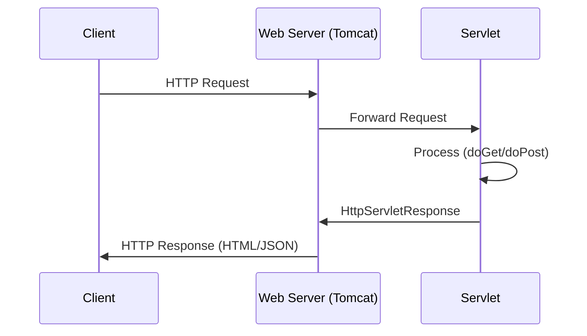
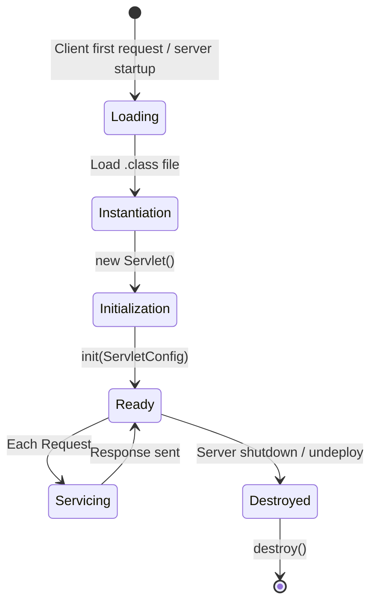

[[00-Dashboard/Home|Home]] | [[02-Semester-VI/Semester-VI-Dashboard|Semester VI]] | [[Overview]] | [[Syllabus]] | [[Unit-1]] | [[Unit-2]] | [[Unit-3]] | [[Unit-4]] | [[Unit-5]] | [[Important-Questions|Imp. Qs]] | [[Revision]] | [[Interview-Prep]]


# Unit 4 - Servlet & JSP

> [!note] Unit Overview
> Servlets and JSP are the foundation of Java web development. Even with modern frameworks like Spring Boot, understanding these technologies provides essential context for web layer concepts.

## Learning Objectives

- [ ] Describe the Servlet lifecycle with all three phases
- [ ] Handle HTTP GET and POST requests
- [ ] Use `HttpServletRequest` and `HttpServletResponse` effectively
- [ ] Implement session tracking using Cookies, HttpSession, and URL Rewriting
- [ ] Write JSP pages with directives, scriptlets, and implicit objects
- [ ] Use JSTL core tags for cleaner JSP pages

---

## 4.1 Servlet Overview

A ==Servlet== is a Java class that extends server capabilities to respond to HTTP requests. It runs on the **server side** within a Servlet container (like Apache Tomcat).



---

## 4.2 Servlet Lifecycle

The ==Servlet Lifecycle== has three main phases managed by the Servlet Container:



### Three Lifecycle Methods

| Method | Called By | Called When | Purpose |
|--------|-----------|-------------|---------|
| `init(ServletConfig)` | Container | **Once** - first request | Initialize resources (DB conn, config) |
| `service(req, res)` | Container | **Every** request | Dispatches to doGet/doPost |
| `destroy()` | Container | **Once** - shutdown | Cleanup resources |

### Simple Servlet Example

```java
import javax.servlet.*;
import javax.servlet.http.*;
import javax.servlet.annotation.*;
import java.io.*;

@WebServlet("/hello")  // URL mapping using annotation
public class HelloServlet extends HttpServlet {
    private String greeting;
    
    // Phase 1: Initialization - called ONCE
    @Override
    public void init(ServletConfig config) throws ServletException {
        super.init(config);
        greeting = config.getInitParameter("greeting");
        if (greeting == null) greeting = "Hello";
        System.out.println("Servlet initialized!");
    }
    
    // Phase 2: Service - for GET requests
    @Override
    protected void doGet(HttpServletRequest req, HttpServletResponse resp)
            throws ServletException, IOException {
        
        String name = req.getParameter("name");
        if (name == null) name = "World";
        
        resp.setContentType("text/html;charset=UTF-8");
        
        PrintWriter out = resp.getWriter();
        out.println("<!DOCTYPE html>");
        out.println("<html><body>");
        out.println("<h1>" + greeting + ", " + name + "!</h1>");
        out.println("</body></html>");
    }
    
    // Phase 2: Service - for POST requests
    @Override
    protected void doPost(HttpServletRequest req, HttpServletResponse resp)
            throws ServletException, IOException {
        String name = req.getParameter("name");
        resp.sendRedirect("/welcome?name=" + name);
    }
    
    // Phase 3: Cleanup - called ONCE on shutdown
    @Override
    public void destroy() {
        System.out.println("Servlet destroyed - releasing resources");
    }
}
```

---

## 4.3 HttpServletRequest & HttpServletResponse

### HttpServletRequest

```java
protected void doGet(HttpServletRequest req, HttpServletResponse resp) throws ... {
    // Reading request parameters
    String name = req.getParameter("name");           // Single value
    String[] hobbies = req.getParameterValues("hobby"); // Multiple values
    
    // Request info
    String method = req.getMethod();          // GET, POST, etc.
    String uri = req.getRequestURI();         // /myapp/hello
    String queryString = req.getQueryString(); // name=Alice&age=25
    String remoteIP = req.getRemoteAddr();    // Client IP
    
    // Headers
    String userAgent = req.getHeader("User-Agent");
    String contentType = req.getHeader("Content-Type");
    
    // Request attributes (set within server)
    req.setAttribute("userRole", "admin");
    String role = (String) req.getAttribute("userRole");
    
    // Request dispatching
    RequestDispatcher rd = req.getRequestDispatcher("/WEB-INF/views/result.jsp");
    rd.forward(req, resp);  // Forward (stays in server)
    // OR
    rd.include(req, resp);  // Include another resource
}
```

### HttpServletResponse

```java
protected void doGet(HttpServletRequest req, HttpServletResponse resp) throws ... {
    // Set response properties
    resp.setContentType("text/html;charset=UTF-8");
    resp.setStatus(HttpServletResponse.SC_OK);  // 200
    resp.setHeader("Cache-Control", "no-cache");
    
    // Write response
    PrintWriter out = resp.getWriter();
    out.println("<h1>Hello World</h1>");
    
    // Or for binary data
    // OutputStream os = resp.getOutputStream();
    
    // Redirect (sends 302 to client)
    resp.sendRedirect("http://example.com/newpage");
    
    // Error response
    resp.sendError(HttpServletResponse.SC_NOT_FOUND, "Page not found");
}
```

### web.xml Configuration (Alternative to Annotations)

```xml
<?xml version="1.0" encoding="UTF-8"?>
<web-app xmlns="http://xmlns.jcp.org/xml/ns/javaee" version="4.0">
    
    <servlet>
        <servlet-name>HelloServlet</servlet-name>
        <servlet-class>com.example.HelloServlet</servlet-class>
        <init-param>
            <param-name>greeting</param-name>
            <param-value>Namaste</param-value>
        </init-param>
        <load-on-startup>1</load-on-startup>
    </servlet>
    
    <servlet-mapping>
        <servlet-name>HelloServlet</servlet-name>
        <url-pattern>/hello</url-pattern>
    </servlet-mapping>
    
    <session-config>
        <session-timeout>30</session-timeout>
    </session-config>
</web-app>
```

---

## 4.4 Session Tracking

HTTP is ==stateless== - each request is independent. Session tracking maintains user state across requests.

### Method 1: Cookies

```java
// Creating a cookie
Cookie userCookie = new Cookie("username", "Alice");
userCookie.setMaxAge(3600);  // 1 hour (seconds)
userCookie.setPath("/");      // Available throughout site
resp.addCookie(userCookie);   // Send to browser

// Reading cookies from request
Cookie[] cookies = req.getCookies();
if (cookies != null) {
    for (Cookie c : cookies) {
        if ("username".equals(c.getName())) {
            System.out.println("Username: " + c.getValue());
        }
    }
}

// Deleting cookie
Cookie deleteCookie = new Cookie("username", "");
deleteCookie.setMaxAge(0);  // Expire immediately
resp.addCookie(deleteCookie);
```

> [!warning] Cookie Limitations
> - Max size: 4KB per cookie
> - Stored on **client side** - can be viewed/edited by users
> - Can be disabled by users
> - Not suitable for sensitive data

### Method 2: HttpSession (Server-side)

```java
// Creating/getting session
HttpSession session = req.getSession();         // Create if not exists
HttpSession session = req.getSession(false);    // Only get, don't create

// Storing data in session
session.setAttribute("loggedInUser", "Alice");
session.setAttribute("userRole", "admin");
session.setAttribute("cartItems", new ArrayList<>());

// Retrieving session data
String user = (String) session.getAttribute("loggedInUser");

// Session info
String sessionId = session.getId();
long createdTime = session.getCreationTime();
boolean isNew = session.isNew();

// Invalidate session (logout)
session.invalidate();

// Session timeout
session.setMaxInactiveInterval(1800);  // 30 minutes
```

### Method 3: URL Rewriting

Appends session ID to every URL - used when cookies are disabled.

```java
// Encoding URL with session ID
String encodedURL = resp.encodeURL("/cart");
// Results in: /cart;jsessionid=ABC123DEF456

out.println("<a href='" + encodedURL + "'>View Cart</a>");
```

### Method 4: Hidden Form Fields

```html
<form action="/checkout" method="POST">
    <input type="hidden" name="userId" value="12345">
    <input type="hidden" name="sessionToken" value="xyz789">
    <!-- Other form fields -->
    <button type="submit">Checkout</button>
</form>
```

### Session Tracking Methods Comparison

| Method | Storage | Security | Scalability | Cookie-free |
|--------|---------|----------|-------------|-------------|
| Cookies | Client | Low (client-editable) | High | No |
| HttpSession | Server | High | Needs sticky sessions | Yes (URL rewrite) |
| URL Rewriting | URL | Very Low (visible) | High | Yes |
| Hidden Fields | Form | Low | High | Yes |

^session-tracking-methods

---

## 4.5 JSP (JavaServer Pages)

==JSP== allows embedding Java code directly in HTML pages. JSP is compiled to a Servlet behind the scenes.

### JSP to Servlet Lifecycle

```
.jsp file → JSP Container compiles → _servlet.java → .class → Executes
```

### JSP Directives

Directives give instructions to the JSP container at **translation time**.

```jsp
<%-- Page directive: configure JSP properties --%>
<%@ page language="java" 
         contentType="text/html; charset=UTF-8"
         pageEncoding="UTF-8"
         import="java.util.*, java.sql.*"
         session="true"
         errorPage="error.jsp"
         isErrorPage="false" %>

<%-- Include directive: static inclusion at compile time --%>
<%@ include file="header.jsp" %>

<%-- Taglib directive: use JSTL or custom tags --%>
<%@ taglib uri="http://java.sun.com/jsp/jstl/core" prefix="c" %>
```

### JSP Scriptlets and Expressions

```jsp
<%-- Declaration: define variables/methods at class level --%>
<%!
    int pageViews = 0;
    
    String formatName(String name) {
        return name.toUpperCase();
    }
%>

<%-- Scriptlet: Java code executed per request --%>
<%
    pageViews++;
    String name = request.getParameter("name");
    if (name == null) name = "Guest";
    List<String> items = (List<String>) session.getAttribute("cartItems");
%>

<%-- Expression: outputs value to response --%>
<p>Hello, <%= name %>!</p>
<p>Page views: <%= pageViews %></p>
<p>Formatted: <%= formatName(name) %></p>

<%-- Comment: not sent to client --%>
<%-- This is a JSP comment --%>
```

---

## 4.6 JSP Implicit Objects

JSP provides **9 implicit objects** pre-created by the container:

| Object | Type | Scope | Description |
|--------|------|-------|-------------|
| `request` | `HttpServletRequest` | Request | Current HTTP request |
| `response` | `HttpServletResponse` | Page | Current HTTP response |
| `session` | `HttpSession` | Session | Current user session |
| `application` | `ServletContext` | Application | Entire web application context |
| `out` | `JspWriter` | Page | Output stream |
| `page` | `Object` | Page | Current Servlet (= this) |
| `config` | `ServletConfig` | Page | Servlet configuration |
| `pageContext` | `PageContext` | Page | All page attributes |
| `exception` | `Throwable` | Page | Only in error pages |

```jsp
<%-- Using implicit objects --%>
<p>Request Method: <%= request.getMethod() %></p>
<p>Session ID: <%= session.getId() %></p>
<p>Server Name: <%= application.getServerInfo() %></p>
<p>Context Path: <%= request.getContextPath() %></p>

<%
    // Get user from session
    String user = (String) session.getAttribute("user");
    if (user != null) {
        out.println("<p>Welcome, " + user + "</p>");
    }
    
    // Application-level counter (shared by all users)
    Integer visits = (Integer) application.getAttribute("visits");
    if (visits == null) visits = 0;
    application.setAttribute("visits", ++visits);
%>
<p>Total visits: <%= application.getAttribute("visits") %></p>
```

---

## 4.7 JSTL (JSP Standard Tag Library) Basics

==JSTL== eliminates Java code from JSP pages - cleaner, MVC-friendly.

```jsp
<%@ taglib uri="http://java.sun.com/jsp/jstl/core" prefix="c" %>
<%@ taglib uri="http://java.sun.com/jsp/jstl/fmt" prefix="fmt" %>

<%-- c:out: Safe output (escapes HTML) --%>
<p><c:out value="${user.name}" default="Guest"/></p>

<%-- c:set: Set variable --%>
<c:set var="greeting" value="Hello" scope="page"/>

<%-- c:if: Conditional --%>
<c:if test="${user != null}">
    <p>Welcome, ${user.name}!</p>
</c:if>
<c:if test="${user == null}">
    <p>Please log in</p>
</c:if>

<%-- c:choose/when/otherwise: if-else --%>
<c:choose>
    <c:when test="${user.role == 'admin'}">
        <a href="/admin">Admin Panel</a>
    </c:when>
    <c:when test="${user.role == 'manager'}">
        <a href="/reports">Reports</a>
    </c:when>
    <c:otherwise>
        <a href="/dashboard">Dashboard</a>
    </c:otherwise>
</c:choose>

<%-- c:forEach: Loop over collection --%>
<table>
    <tr><th>ID</th><th>Name</th><th>Marks</th></tr>
    <c:forEach var="student" items="${studentList}" varStatus="status">
        <tr class="${status.index % 2 == 0 ? 'even' : 'odd'}">
            <td>${status.count}</td>
            <td><c:out value="${student.name}"/></td>
            <td>${student.marks}</td>
        </tr>
    </c:forEach>
</table>

<%-- c:forTokens: Split and iterate string --%>
<c:forTokens var="item" items="Apple,Banana,Cherry" delims=",">
    <li>${item}</li>
</c:forTokens>

<%-- c:redirect: Redirect --%>
<c:redirect url="/login" />

<%-- EL (Expression Language) --%>
${requestScope.user}         <%-- From request --%>
${sessionScope.cart}         <%-- From session --%>
${applicationScope.config}   <%-- From application --%>
${param.name}                <%-- Request parameter --%>
${header['User-Agent']}      <%-- Request header --%>

<%-- fmt: Formatting --%>
<fmt:formatNumber value="${price}" type="currency" currencySymbol="₹"/>
<fmt:formatDate value="${today}" pattern="dd-MM-yyyy"/>
```

---


## 4.8 Retrieving Data from Database to Servlet
To connect a Servlet to a database, you typically integrate JDBC within the Servlet's `doGet` or `doPost` methods.

### Steps:
1. Load the database driver (e.g., `Class.forName("com.mysql.cj.jdbc.Driver")`).
2. Establish a connection using `DriverManager.getConnection()`.
3. Create a `Statement` or `PreparedStatement`.
4. Execute the query and process the `ResultSet`.
5. Write the retrieved data to the response using `PrintWriter`.

```java
@WebServlet("/users")
public class UserServlet extends HttpServlet {
    protected void doGet(HttpServletRequest request, HttpServletResponse response) throws IOException {
        response.setContentType("text/html");
        PrintWriter out = response.getWriter();
        out.println("<html><body><h2>User List</h2><ul>");
        
        try (Connection conn = DriverManager.getConnection("jdbc:mysql://localhost:3306/mydb", "user", "pass");
             PreparedStatement ps = conn.prepareStatement("SELECT name, email FROM users");
             ResultSet rs = ps.executeQuery()) {
             
            while(rs.next()) {
                out.println("<li>" + rs.getString("name") + " - " + rs.getString("email") + "</li>");
            }
        } catch(SQLException e) {
            e.printStackTrace();
        }
        out.println("</ul></body></html>");
    }
}
```

## Key Terms Summary

| Term | Definition |
|------|------------|
| ==Servlet== | Java class running on server responding to HTTP requests |
| ==init()== | Servlet lifecycle - called once on first request |
| ==service()== | Dispatches to doGet/doPost - called per request |
| ==destroy()== | Called once on server shutdown - cleanup |
| ==Cookie== | Name-value pair stored on client browser |
| ==HttpSession== | Server-side session storage |
| ==JSP== | JavaServer Pages - HTML with embedded Java |
| ==Directive== | `<%@` - compile-time instruction (page, include, taglib) |
| ==Scriptlet== | `<% %>` - Java code block in JSP |
| ==JSTL== | JSP Standard Tag Library - XML-based tags replacing scriptlets |
| ==EL== | Expression Language - `${}` for accessing data in JSP |

---

## Practice Questions

1. Explain the Servlet lifecycle with all three phases and their methods.
2. What is the difference between `doGet()` and `doPost()`?
3. Write a Servlet that accepts a username via POST form and displays a welcome message.
4. Compare the four session tracking methods. When would you use each?
5. What are cookies? Write code to create, read, and delete a cookie.
6. Explain `HttpSession`. How is it different from cookies?
7. What are JSP directives? Explain page, include, and taglib directives.
8. What are the 9 implicit objects available in JSP? Explain any 4.
9. What is the difference between `<%@ include file="..." %>` and `<jsp:include page="..."/>`?
10. What is JSTL? Write a JSP page using `c:forEach` to display a list of students.

---

## Navigation

- [[Overview]] | [[Syllabus]]
- ← Previous: [[Unit-3|Unit-3 - JDBC]]
- → Next: [[Unit-5|Unit-5 - Hibernate & Spring]]
- [[Important-Questions]] | [[Revision]] | [[Interview-Prep]]

---
*CS-351-MJ-T Advanced Java | Unit 4 | Semester VI*
