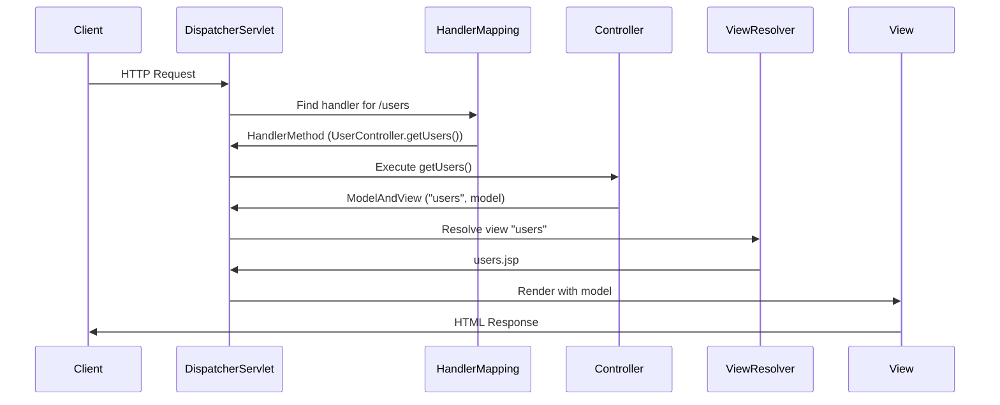

#  Unit 5 - Hibernate / Spring Basics

> [!important] Industry-Critical Unit
> Spring Boot + Hibernate is the most widely used Java enterprise stack. Virtually every Java backend role requires knowledge of Spring MVC, Spring Boot REST APIs, and Hibernate ORM.

##  Learning Objectives

- [ ] Explain ORM and the impedance mismatch problem
- [ ] Describe Hibernate architecture with SessionFactory and Session
- [ ] Write HQL queries and use Hibernate for CRUD
- [ ] Understand Spring IoC and Dependency Injection
- [ ] Explain Spring MVC request flow
- [ ] Build a REST API using Spring Boot

---

## 5.1 ORM - Object-Relational Mapping

==ORM (Object-Relational Mapping)== is a technique that maps Java objects to relational database tables, eliminating the need for manual SQL.

### The Impedance Mismatch Problem

| Aspect | Java (OOP) | Relational DB | Mismatch |
|--------|-----------|---------------|----------|
| Data unit | Object | Row | Object has methods; rows don't |
| Relationships | References | Foreign keys | Different navigation |
| Inheritance | Class hierarchy | No direct support | Must simulate |
| Identity | Object reference | Primary key | Two concepts |

### Without ORM (JDBC - lots of boilerplate)

```java
String sql = "SELECT id, name, email FROM users WHERE id = ?";
PreparedStatement ps = conn.prepareStatement(sql);
ps.setInt(1, userId);
ResultSet rs = ps.executeQuery();
if (rs.next()) {
    User user = new User();
    user.setId(rs.getInt("id"));
    user.setName(rs.getString("name"));
    user.setEmail(rs.getString("email"));
    return user;
}
// Lots of boilerplate!
```

### With ORM (Hibernate - clean)

```java
User user = session.get(User.class, userId);  // Done! No SQL, no mapping!
```

---

## 5.2 Hibernate Architecture

```mermaid
graph TD
  APP[Java Application] --> SF[SessionFactory\n Immutable, thread-safe]
  SF --> S[Session\n Lightweight, not thread-safe]
  S --> T[Transaction]
  S --> Q[Query / HQL]
  S --> DB[(Database)]
  
  CF[Configuration\nhibernate.cfg.xml] --> SF
  MP[Mapping\n@Entity annotations] --> SF
```

### Hibernate Core Components

| Component | Description |
|-----------|-------------|
| **Configuration** | Loads `hibernate.cfg.xml`, registers entity classes |
| **SessionFactory** | Created once per database; creates Sessions |
| **Session** | Single unit of work with DB; not thread-safe |
| **Transaction** | Wraps DB operations for ACID compliance |
| **Query / HQL** | Object-oriented query language |
| **Criteria API** | Type-safe programmatic queries |

---

## 5.3 Hibernate Setup and Configuration

### Step 1: Maven Dependencies

```xml
<!-- pom.xml -->
<dependency>
    <groupId>org.hibernate</groupId>
    <artifactId>hibernate-core</artifactId>
    <version>5.6.15.Final</version>
</dependency>
<dependency>
    <groupId>mysql</groupId>
    <artifactId>mysql-connector-java</artifactId>
    <version>8.0.33</version>
</dependency>
```

### Step 2: Configuration File

```xml
<!-- hibernate.cfg.xml -->
<?xml version="1.0" encoding="UTF-8"?>
<!DOCTYPE hibernate-configuration PUBLIC ...>
<hibernate-configuration>
    <session-factory>
        <!-- Database connection -->
        <property name="hibernate.connection.driver_class">com.mysql.cj.jdbc.Driver</property>
        <property name="hibernate.connection.url">jdbc:mysql://localhost:3306/mydb</property>
        <property name="hibernate.connection.username">root</property>
        <property name="hibernate.connection.password">password</property>
        
        <!-- Hibernate dialect -->
        <property name="hibernate.dialect">org.hibernate.dialect.MySQL8Dialect</property>
        
        <!-- Auto DDL -->
        <property name="hibernate.hbm2ddl.auto">update</property>
        <!-- create, create-drop, validate, update, none -->
        
        <!-- Show SQL -->
        <property name="hibernate.show_sql">true</property>
        <property name="hibernate.format_sql">true</property>
        
        <!-- Entity classes -->
        <mapping class="com.example.entity.Student"/>
        <mapping class="com.example.entity.Course"/>
    </session-factory>
</hibernate-configuration>
```

### Step 3: Entity Class

```java
import javax.persistence.*;

@Entity
@Table(name = "students")  // Maps to "students" table
public class Student {
    
    @Id
    @GeneratedValue(strategy = GenerationType.IDENTITY)
    @Column(name = "student_id")
    private int id;
    
    @Column(name = "name", nullable = false, length = 100)
    private String name;
    
    @Column(name = "email", unique = true)
    private String email;
    
    @Column(name = "marks")
    private double marks;
    
    // Many-to-One relationship
    @ManyToOne
    @JoinColumn(name = "course_id")
    private Course course;
    
    // Constructors, getters, setters
    public Student() {}
    
    public Student(String name, String email, double marks) {
        this.name = name;
        this.email = email;
        this.marks = marks;
    }
    
    // Getters and setters...
    public int getId() { return id; }
    public String getName() { return name; }
    public void setName(String name) { this.name = name; }
    // ... etc
}
```

### Step 4: SessionFactory and CRUD

```java
public class HibernateUtil {
    private static SessionFactory sessionFactory;
    
    static {
        Configuration cfg = new Configuration().configure();
        sessionFactory = cfg.buildSessionFactory();
    }
    
    public static SessionFactory getSessionFactory() {
        return sessionFactory;
    }
}

public class StudentDAO {
    // CREATE
    public void save(Student student) {
        Session session = HibernateUtil.getSessionFactory().openSession();
        Transaction tx = null;
        try {
            tx = session.beginTransaction();
            session.save(student);  // or session.persist(student)
            tx.commit();
        } catch (Exception e) {
            if (tx != null) tx.rollback();
            e.printStackTrace();
        } finally {
            session.close();
        }
    }
    
    // READ by ID
    public Student findById(int id) {
        Session session = HibernateUtil.getSessionFactory().openSession();
        try {
            return session.get(Student.class, id);
        } finally {
            session.close();
        }
    }
    
    // READ all
    public List<Student> findAll() {
        Session session = HibernateUtil.getSessionFactory().openSession();
        try {
            return session.createQuery("FROM Student", Student.class).list();
        } finally {
            session.close();
        }
    }
    
    // UPDATE
    public void update(Student student) {
        Session session = HibernateUtil.getSessionFactory().openSession();
        Transaction tx = null;
        try {
            tx = session.beginTransaction();
            session.update(student);  // or session.merge(student)
            tx.commit();
        } catch (Exception e) {
            if (tx != null) tx.rollback();
        } finally {
            session.close();
        }
    }
    
    // DELETE
    public void delete(int id) {
        Session session = HibernateUtil.getSessionFactory().openSession();
        Transaction tx = null;
        try {
            tx = session.beginTransaction();
            Student student = session.get(Student.class, id);
            if (student != null) session.delete(student);
            tx.commit();
        } catch (Exception e) {
            if (tx != null) tx.rollback();
        } finally {
            session.close();
        }
    }
}
```

---

## 5.4 HQL (Hibernate Query Language)

==HQL== is an object-oriented query language, similar to SQL but operates on **entity classes and properties** rather than tables and columns.

```java
Session session = HibernateUtil.getSessionFactory().openSession();

// Basic query - use class name and field names, NOT table/column names
List<Student> all = session.createQuery("FROM Student", Student.class).list();

// WHERE clause
List<Student> toppers = session.createQuery(
    "FROM Student s WHERE s.marks > 80 ORDER BY s.marks DESC", 
    Student.class
).list();

// Parameterized HQL (prevents HQL injection)
Query<Student> q = session.createQuery("FROM Student WHERE name = :name", Student.class);
q.setParameter("name", "Alice");
Student alice = q.uniqueResult();

// Aggregate functions
Long count = session.createQuery("SELECT count(s) FROM Student s", Long.class).uniqueResult();
Double avg = session.createQuery("SELECT avg(s.marks) FROM Student s", Double.class).uniqueResult();

// Projection - select specific fields
List<Object[]> data = session.createQuery(
    "SELECT s.name, s.marks FROM Student s"
).list();

// UPDATE and DELETE
int updated = session.createQuery(
    "UPDATE Student SET marks = marks + 5 WHERE marks < 50"
).executeUpdate();

// JOIN
List<Student> students = session.createQuery(
    "FROM Student s JOIN FETCH s.course WHERE s.course.name = 'Java'",
    Student.class
).list();
```

---

## 5.5 Spring IoC / Dependency Injection

### Inversion of Control (IoC)

==IoC== is a design principle where the **framework controls object creation and lifecycle**, instead of the application code.

```
Without IoC:
  Class A creates object of B → A depends on and controls B

With IoC (Spring):
  Spring creates both A and B → Spring injects B into A
  A doesn't know how B is created → loose coupling
```

### Dependency Injection Types

```java
// 1. CONSTRUCTOR INJECTION (Preferred)
@Service
public class OrderService {
    private final ProductRepository productRepo;
    private final EmailService emailService;
    
    // Spring automatically injects these when creating OrderService
    @Autowired  // Optional if only one constructor
    public OrderService(ProductRepository productRepo, EmailService emailService) {
        this.productRepo = productRepo;
        this.emailService = emailService;
    }
}

// 2. SETTER INJECTION
@Service
public class ReportService {
    private DataService dataService;
    
    @Autowired
    public void setDataService(DataService dataService) {
        this.dataService = dataService;
    }
}

// 3. FIELD INJECTION (Convenient but less testable)
@Service
public class UserService {
    @Autowired
    private UserRepository userRepository;
    
    @Autowired
    private EmailService emailService;
}
```

### Spring Annotations

| Annotation | Purpose |
|------------|---------|
| `@Component` | Generic Spring bean |
| `@Service` | Business layer bean |
| `@Repository` | Data access layer bean |
| `@Controller` | Web layer (MVC) bean |
| `@RestController` | REST API controller |
| `@Autowired` | Inject dependency |
| `@Bean` | Declare bean in `@Configuration` class |
| `@Configuration` | Class providing Spring configuration |

---

## 5.6 Spring MVC Basics

### Spring MVC Request Flow



---

## 5.7 Spring Boot Introduction

==Spring Boot== simplifies Spring configuration with **auto-configuration, embedded server, and starter dependencies**.

### Spring Boot vs Spring MVC

| Feature | Spring MVC | Spring Boot |
|---------|-----------|-------------|
| Configuration | XML or Java config | **Auto-configured**  |
| Server | Deploy to Tomcat | **Embedded Tomcat**  |
| Dependencies | Manual | **Starter POMs**  |
| Setup time | Hours | **Minutes**  |

### Spring Boot Project Structure

```
spring-boot-app/
├── src/main/java/com/example/
│   ├── SpringBootAppApplication.java  ← Main class
│   ├── controller/
│   │   └── StudentController.java
│   ├── service/
│   │   └── StudentService.java
│   ├── repository/
│   │   └── StudentRepository.java
│   └── entity/
│       └── Student.java
├── src/main/resources/
│   ├── application.properties
│   └── static/
└── pom.xml
```

### Spring Boot Main Class

```java
@SpringBootApplication  // = @Configuration + @ComponentScan + @EnableAutoConfiguration
public class MyApplication {
    public static void main(String[] args) {
        SpringApplication.run(MyApplication.class, args);
    }
}
```

---

## 5.8 REST API with Spring Boot

```java
// Entity
@Entity
@Table(name = "students")
public class Student {
    @Id @GeneratedValue(strategy = GenerationType.IDENTITY)
    private Long id;
    private String name;
    private String email;
    private double marks;
    // Constructors, getters, setters
}

// Repository - Spring Data JPA
public interface StudentRepository extends JpaRepository<Student, Long> {
    List<Student> findByName(String name);
    List<Student> findByMarksGreaterThan(double marks);
    Optional<Student> findByEmail(String email);
}

// Service
@Service
public class StudentService {
    @Autowired
    private StudentRepository studentRepository;
    
    public List<Student> getAllStudents() {
        return studentRepository.findAll();
    }
    
    public Optional<Student> getById(Long id) {
        return studentRepository.findById(id);
    }
    
    public Student create(Student student) {
        return studentRepository.save(student);
    }
    
    public Student update(Long id, Student details) {
        Student student = studentRepository.findById(id)
            .orElseThrow(() -> new RuntimeException("Student not found: " + id));
        student.setName(details.getName());
        student.setEmail(details.getEmail());
        student.setMarks(details.getMarks());
        return studentRepository.save(student);
    }
    
    public void delete(Long id) {
        studentRepository.deleteById(id);
    }
}

// REST Controller
@RestController
@RequestMapping("/api/students")
public class StudentController {
    
    @Autowired
    private StudentService studentService;
    
    // GET all students
    @GetMapping
    public ResponseEntity<List<Student>> getAllStudents() {
        return ResponseEntity.ok(studentService.getAllStudents());
    }
    
    // GET student by ID
    @GetMapping("/{id}")
    public ResponseEntity<Student> getStudentById(@PathVariable Long id) {
        return studentService.getById(id)
            .map(ResponseEntity::ok)
            .orElse(ResponseEntity.notFound().build());
    }
    
    // POST - create student
    @PostMapping
    public ResponseEntity<Student> createStudent(@RequestBody Student student) {
        Student saved = studentService.create(student);
        return ResponseEntity.status(HttpStatus.CREATED).body(saved);
    }
    
    // PUT - update student
    @PutMapping("/{id}")
    public ResponseEntity<Student> updateStudent(
            @PathVariable Long id, 
            @RequestBody Student details) {
        try {
            Student updated = studentService.update(id, details);
            return ResponseEntity.ok(updated);
        } catch (RuntimeException e) {
            return ResponseEntity.notFound().build();
        }
    }
    
    // DELETE student
    @DeleteMapping("/{id}")
    public ResponseEntity<Void> deleteStudent(@PathVariable Long id) {
        studentService.delete(id);
        return ResponseEntity.noContent().build();
    }
    
    // Query params example
    @GetMapping("/search")
    public ResponseEntity<List<Student>> searchStudents(
            @RequestParam(required = false) String name,
            @RequestParam(required = false, defaultValue = "0") double minMarks) {
        List<Student> results = studentService.getAllStudents()
            .stream()
            .filter(s -> name == null || s.getName().contains(name))
            .filter(s -> s.getMarks() >= minMarks)
            .collect(java.util.stream.Collectors.toList());
        return ResponseEntity.ok(results);
    }
}
```

### application.properties (Spring Boot Config)

```properties
# Database
spring.datasource.url=jdbc:mysql://localhost:3306/mydb
spring.datasource.username=root
spring.datasource.password=password
spring.datasource.driver-class-name=com.mysql.cj.jdbc.Driver

# JPA / Hibernate
spring.jpa.hibernate.ddl-auto=update
spring.jpa.show-sql=true
spring.jpa.properties.hibernate.dialect=org.hibernate.dialect.MySQL8Dialect

# Server
server.port=8080
server.servlet.context-path=/api

# App name
spring.application.name=student-api
```

### REST HTTP Methods Convention

| HTTP Method | Endpoint | Action | Status Code |
|-------------|----------|--------|-------------|
| `GET` | `/students` | Get all | 200 OK |
| `GET` | `/students/{id}` | Get one | 200 / 404 |
| `POST` | `/students` | Create | 201 Created |
| `PUT` | `/students/{id}` | Full update | 200 OK |
| `PATCH` | `/students/{id}` | Partial update | 200 OK |
| `DELETE` | `/students/{id}` | Delete | 204 No Content |

---

##  Key Terms Summary

| Term | Definition |
|------|------------|
| ==ORM== | Maps Java objects to DB tables - eliminates manual SQL |
| ==Hibernate== | Popular Java ORM framework |
| ==SessionFactory== | Thread-safe factory for creating Sessions |
| ==Session== | Single DB work unit - not thread-safe |
| ==HQL== | Hibernate Query Language - object-oriented SQL |
| ==IoC== | Inversion of Control - framework controls object lifecycle |
| ==DI== | Dependency Injection - objects receive dependencies externally |
| ==Spring Boot== | Opinionated Spring with auto-configuration |
| ==`@RestController`== | Spring annotation for REST API controllers |
| ==`@Autowired`== | Inject Spring bean dependency |
| ==`JpaRepository`== | Spring Data interface with built-in CRUD methods |

---

##  Practice Questions

1. What is ORM? What problem does it solve (impedance mismatch)?
2. Explain Hibernate architecture with SessionFactory and Session.
3. Write Hibernate entity class for a `Product` with id, name, price, category.
4. What are the differences between `session.save()`, `session.persist()`, `session.update()`, and `session.merge()`?
5. What is HQL? How is it different from SQL? Write 3 HQL queries.
6. What is Spring IoC? Explain the concept with a diagram.
7. What is Dependency Injection? Explain its three types with code examples.
8. What is Spring Boot? How does it differ from Spring MVC?
9. Build a complete REST CRUD API for a `Student` entity using Spring Boot.
10. What are the common Spring annotations? Explain `@Component`, `@Service`, `@Repository`, `@Controller`, `@RestController`.

---

##  Navigation

- [[Overview]] | [[Syllabus]]
- ← Previous: [[Unit-4|Unit-4 - Servlet & JSP]]
- → Next: (End)
- [[Important-Questions]] | [[Revision]] | [[Interview-Prep]]

---
*CS-351-MJ-T Advanced Java | Unit 5 | Semester VI*
