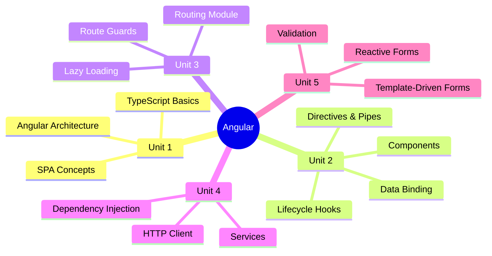
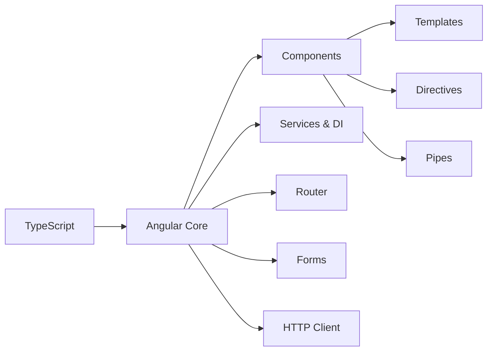

# ️ CS-352-MJ-T - Design Framework (Angular)

> [!important] Subject at a Glance
> This subject covers Angular - Google's production-grade frontend framework - along with TypeScript fundamentals, component-driven architecture, routing, services, dependency injection, and form handling.

##  Learning Objectives

After completing this subject, students will be able to:

- [ ] Understand Angular's architecture and how SPAs work
- [ ] Write TypeScript code with types, interfaces, classes, and decorators
- [ ] Build Angular components with templates and data binding
- [ ] Configure client-side routing with guards and lazy loading
- [ ] Create and inject services using Angular's DI system
- [ ] Build template-driven and reactive forms with validation

## ️ Subject Map

##  Units Summary

| Unit | Topic | Hours | Weight |
|------|-------|-------|--------|
| [[Unit-1 - Introduction to Angular\|Unit 1]] | Introduction to Angular & TypeScript | 4H |  |
| [[Unit-2 - Components & Data Binding\|Unit 2]] | Components, Lifecycle, Data Binding, Directives | 7H |  |
| [[Unit-3 - Angular Routing\|Unit 3]] | Routing, Guards, Lazy Loading | 7H |  |
| [[Unit-4 - Services & DI\|Unit 4]] | Services, DI, HTTP | 6H |  |
| [[Unit-5 - Forms & Validation\|Unit 5]] | Forms (Template & Reactive), Validation | 6H |  |

**Total: 30 Hours**

##  Reference Books

1. **Yakov Fain & Anton Moiseev** - *Angular Development with TypeScript* (Primary)
2. **Aristeidis Bampakos & Pablo Garcia** - *Learning Angular*
3. **Shyam Seshadri** - *Angular: Up and Running*
4. **Pablo Garcia** - *Getting Started with Angular*

##  Quick Navigation

- [[Syllabus]] - Detailed syllabus breakdown
- [[Unit-1|Unit-1 - Introduction to Angular]] - Angular & TypeScript fundamentals
- [[Unit-2|Unit-2 - Components & Data Binding]] - Core building blocks
- [[Unit-3|Unit-3 - Angular Routing]] - Navigation and guards
- [[Unit-4|Unit-4 - Services & DI]] - Services and HTTP
- [[Unit-5|Unit-5 - Forms & Validation]] - Form handling
- [[Important-Questions]] - Exam-focused questions
- [[Revision]] - Quick revision notes
- [[Interview-Prep]] - Interview Q&A

##  Why This Subject Matters

> [!tip] Industry Relevance
> Angular is used by enterprises like Google, Microsoft, Forbes, and Samsung. Frontend roles requiring Angular/TypeScript skills are among the **fastest-growing in the industry**. Combined with Spring Boot (AJ), this gives you full-stack Java web development capability.

##  Angular Ecosystem

## ️ Related Subjects

- [[../CS-351-MJ-T-Advanced-Java/Overview|Advanced Java]] - Backend complement (Spring Boot)
- [[../CS-353-MJ-T-Web-Technology-II/Overview|Web Technology II]] - HTML/CSS/JS foundation

---
*Last updated: 2026-06-16 | Semester VI | CS-352-MJ-T*
