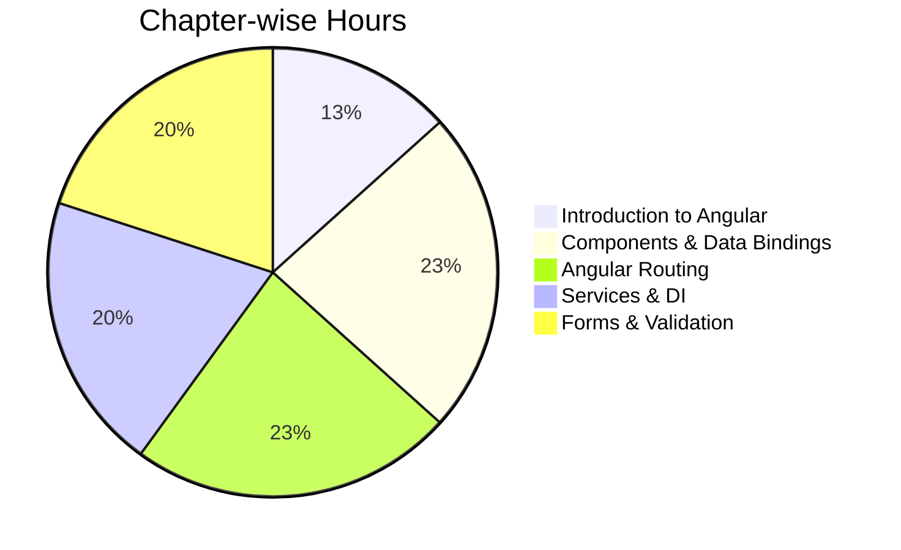

[[00-Dashboard/Home|Home]] | [[02-Semester-VI/Semester-VI-Dashboard|Semester VI]] | [[Overview]] | [[Syllabus]] | [[Unit-1]] | [[Unit-2]] | [[Unit-3]] | [[Unit-4]] | [[Unit-5]] | [[Important-Questions|Imp. Qs]] | [[Revision]] | [[Interview-Prep]]

# CS-352-MJ-T - Design Framework (Angular) Syllabus

> [!note] Official Syllabus
> Complete chapter-wise syllabus for Design Framework (Angular). Total contact hours: **30H**.

## Chapter 1: Introduction to Angular (4H)

### Topics Covered
- **Angular Framework** - what it is, why use it
- **Features of Angular** - TypeScript-based, Component architecture, CLI, DI
- **Angular Architecture** - Modules, Components, Templates, Services, Routing
- **SPA (Single Page Application)** concepts - how routing works without page reload
- **Angular vs AngularJS** - key differences (versions, architecture, language)
- **TypeScript Fundamentals**:
  - Types (string, number, boolean, any, void, never, tuple, enum)
  - Classes and inheritance
  - Interfaces
  - Functions (arrow functions, optional/default parameters)
  - Modules (import/export)
  - Decorators (`@Component`, `@NgModule`, `@Injectable`)
- **Design Philosophy** - declarative templates, unidirectional data flow

### Expected Outcomes
 Set up an Angular development environment  
 Understand TypeScript syntax  
 Explain Angular's component-based architecture  

---

## Chapter 2: Components & Data Bindings (7H)

### Topics Covered
- **Angular CLI** - `ng new`, `ng generate`, `ng build`, `ng serve`, `ng test`
- **Project Structure** - `src/app`, `angular.json`, `tsconfig.json`, `package.json`
- **Components & Templates** - `@Component` decorator, selector, template, styleUrls
- **Component Lifecycle Hooks**:
  - `ngOnChanges` - input property changes
  - `ngOnInit` - component initialized
  - `ngDoCheck` - change detection cycle
  - `ngAfterContentInit`, `ngAfterContentChecked`
  - `ngAfterViewInit`, `ngAfterViewChecked`
  - `ngOnDestroy` - cleanup
- **Template Syntax** - template expressions, template statements
- **Data Binding**:
  - Interpolation: `{{ expression }}`
  - Property binding: `[property]="expression"`
  - Event binding: `(event)="handler()"`
  - Two-way binding: `[(ngModel)]="property"`
- **Directives**:
  - Structural: `*ngIf`, `*ngFor`, `*ngSwitch`
  - Attribute: `ngClass`, `ngStyle`
- **Built-in Pipes** - `date`, `uppercase`, `lowercase`, `currency`, `decimal`, `json`, `async`

### Expected Outcomes
 Create components using Angular CLI  
 Implement all four types of data binding  
 Use structural and attribute directives  
 Apply built-in pipes for data transformation  

---

## Chapter 3: Angular Routing (7H)

### Topics Covered
- **Router Module** - `RouterModule.forRoot()`, `RouterModule.forChild()`
- **`<router-outlet>`** - where routed components render
- **`routerLink`** - navigation without page reload
- **Route Configuration** - path, component, redirectTo, pathMatch
- **Default & Wildcard Routes** - `''` and `'**'`
- **Route Parameters** - `ActivatedRoute`, `paramMap`, `snapshot`
- **Child Routes** - nested routing with `children` array
- **Route Guards**:
  - `CanActivate` - protect routes from unauthorized access
  - `CanDeactivate` - confirm before leaving a route
  - `CanLoad`, `Resolve`, `CanActivateChild`
- **Lazy Loading** - `loadChildren`, `import()` syntax
- **Preloading Strategies** - `NoPreloading`, `PreloadAllModules`, custom
- **Error Handling** - 404 with wildcard, error pages

### Expected Outcomes
 Configure single-page routing in Angular  
 Pass and receive route parameters  
 Implement route guards for auth protection  
 Implement lazy loading for performance  

---

## Chapter 4: Services and Dependency Injection (6H)

### Topics Covered
- **Creating Services** - `@Injectable()`, `ng generate service`
- **Built-in Services**:
  - `HttpClient` - for REST API calls
  - `Router` - for programmatic navigation
  - `FormBuilder` - for reactive forms
- **DI Core Concepts** - providers, injectors, tokens
- **Angular DI Framework** - hierarchical injectors (root, module, component)
- **Providing Dependencies** - `providedIn: 'root'`, module providers, component providers
- **Injection Tokens** - `InjectionToken<T>`, `@Inject()`
- **DI Decorators** - `@Optional()`, `@Self()`, `@SkipSelf()`, `@Host()`
- **Provider Types** - `useClass`, `useValue`, `useExisting`, `useFactory`
- **RESTful Services with DI** - `HttpClient` in services, `Observable`, `subscribe()`

### Expected Outcomes
 Create injectable services  
 Use `HttpClient` to consume REST APIs  
 Understand and configure the DI hierarchy  
 Use RxJS Observables with HTTP requests  

---

## Chapter 5: Angular Forms & Validation (6H)

### Topics Covered
- **Template-Driven Forms**:
  - `FormsModule` import
  - Form controls - `ngModel`
  - Built-in validators - `required`, `minlength`, `maxlength`, `pattern`
  - Custom validation directives
  - `ngModel` two-way binding
  - `ngForm` and form submission
- **Reactive Forms**:
  - `ReactiveFormsModule` import
  - `FormGroup`, `FormControl`, `FormArray`
  - `FormBuilder` service
  - Dynamic forms - adding/removing controls
  - Built-in validators - `Validators.required`, `Validators.email`
  - Custom validators (sync and async)
- **Form Handling** - accessing form values, `setValue()`, `patchValue()`, `reset()`
- **`ngModel` & `ngGroup`**
- **Validation Error Messages** - conditional display, CSS classes (`ng-valid`, `ng-invalid`, `ng-touched`)

### Expected Outcomes
 Build template-driven forms with validation  
 Build reactive forms using FormGroup and FormControl  
 Display appropriate validation error messages  
 Create custom validators  

---

## Syllabus Weightage

## Recommended Reading

| Book | Author | Best For |
|------|--------|----------|
| Angular Development with TypeScript | Fain & Moiseev | All units |
| Getting Started with Angular | Garcia | Beginners |
| Angular: Up and Running | Seshadri | All units |
| Learning Angular | Bampakos | Comprehensive |
| Angular Docs | angular.io | Reference |

## Navigation

- [[Overview]] - Subject overview
- [[Unit-1|Unit-1 - Introduction to Angular]]
- [[Unit-2|Unit-2 - Components & Data Binding]]
- [[Unit-3|Unit-3 - Angular Routing]]
- [[Unit-4|Unit-4 - Services & DI]]
- [[Unit-5|Unit-5 - Forms & Validation]]
- [[Important-Questions]]
- [[Revision]]
- [[Interview-Prep]]

---
*CS-352-MJ-T Design Framework (Angular) | Semester VI*
