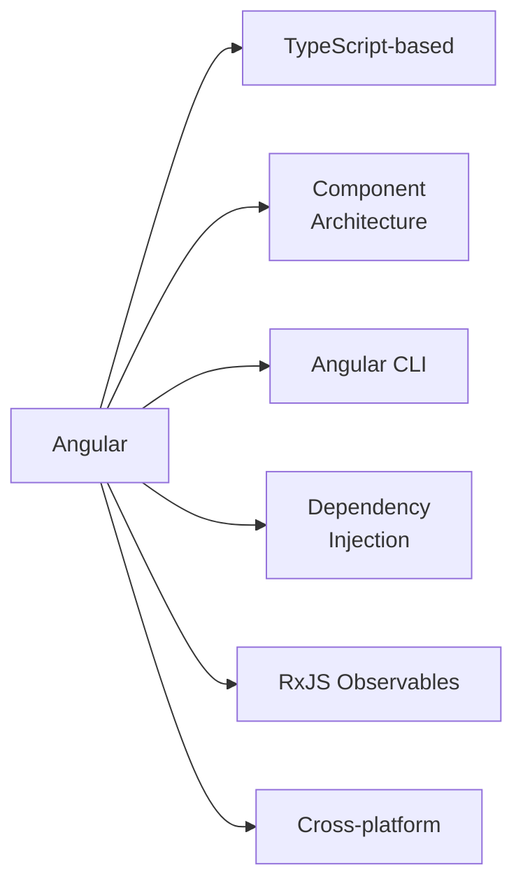
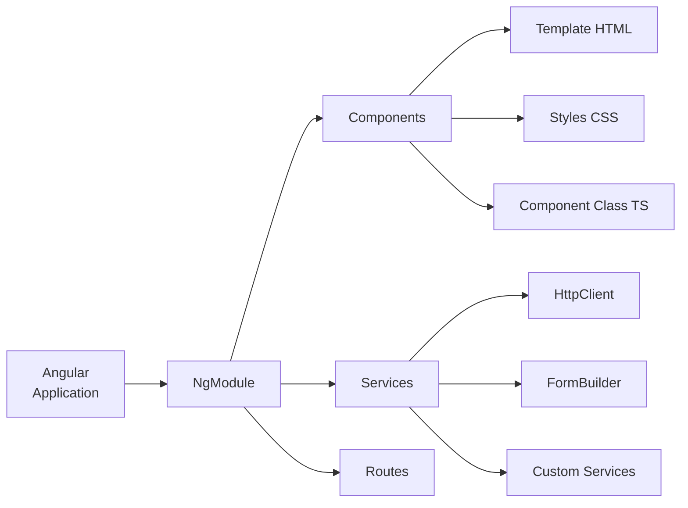
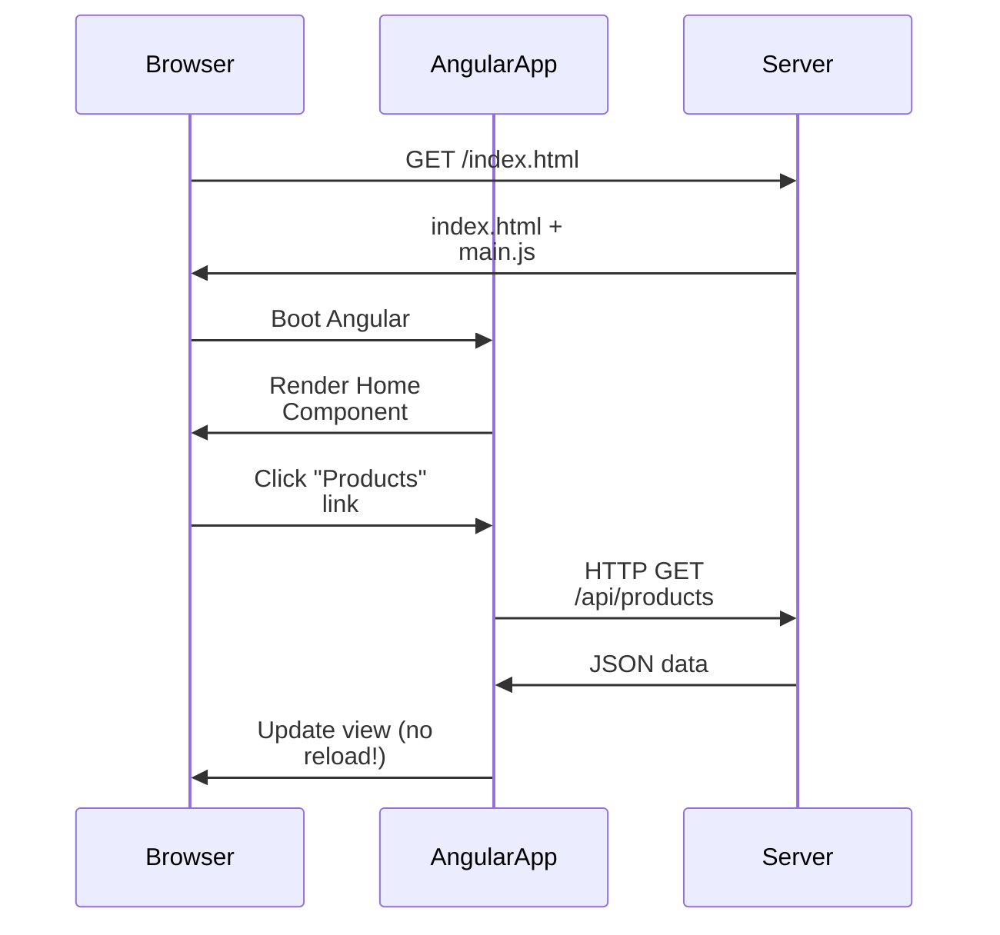

[[00-Dashboard/Home|Home]] | [[02-Semester-VI/Semester-VI-Dashboard|Semester VI]] | [[Overview]] | [[Syllabus]] | [[Unit-1]] | [[Unit-2]] | [[Unit-3]] | [[Unit-4]] | [[Unit-5]] | [[Important-Questions|Imp. Qs]] | [[Revision]] | [[Interview-Prep]]


# Unit 1 - Introduction to Angular

> [!note] Unit Overview
> This unit establishes the foundation for Angular development - understanding the framework's architecture, the SPA paradigm, and TypeScript fundamentals that power Angular applications.

## Learning Objectives

- [ ] Explain Angular's architecture and core building blocks
- [ ] Distinguish Angular from AngularJS
- [ ] Understand SPA concepts and benefits
- [ ] Write TypeScript code with types, interfaces, classes, decorators
- [ ] Use TypeScript modules with import/export

---

## 1.1 What is Angular?

==Angular== is an open-source, TypeScript-based **web application framework** developed and maintained by Google. It follows a **component-based architecture** and provides a complete solution for building enterprise-grade single-page applications.



### Key Features of Angular

| Feature | Description |
|---------|-------------|
| **Component-based** | UI divided into reusable, self-contained components |
| **Two-way Data Binding** | Sync between model and view automatically |
| **Dependency Injection** | Built-in DI for loose coupling |
| **Angular CLI** | Code generation, build, test, deploy tools |
| **RxJS Integration** | Reactive programming with Observables |
| **TypeScript** | Strongly typed, compile-time error detection |
| **Angular Universal** | Server-side rendering (SSR) |
| **PWA Support** | Progressive Web Apps out of the box |

---

## 1.2 Angular Architecture



### Core Building Blocks

1. **Modules** (`NgModule`) - organize related components, services, pipes
2. **Components** - UI blocks with template, class, and styles
3. **Templates** - HTML with Angular-specific syntax
4. **Metadata** - decorators that configure classes
5. **Data Binding** - connects component class to template
6. **Directives** - extend HTML with custom behavior
7. **Services** - reusable business logic
8. **Dependency Injection** - provides services to components

---

## 1.3 Single Page Application (SPA)

==SPA (Single Page Application)== is a web app that loads a **single HTML page** and dynamically updates content using JavaScript - without full page reloads.

### Traditional MPA vs SPA

| Feature | Multi-Page App (MPA) | Single Page App (SPA) |
|---------|---------------------|----------------------|
| Page Load | Full reload every navigation | Only initial load |
| Server Role | Renders HTML pages | Serves API (JSON) |
| User Experience | Slower, flickering | Fast, app-like |
| SEO | Easier | Harder (needs SSR) |
| Examples | Wikipedia, E-commerce | Gmail, Google Maps |
| Technology | PHP/JSP rendering | React, Angular, Vue |



---

## 1.4 Angular vs AngularJS

| Feature | AngularJS (Angular 1.x) | Angular (2+) |
|---------|------------------------|--------------|
| Release | 2010 | 2016 |
| Language | JavaScript | **TypeScript** |
| Architecture | MVC | Component-based |
| Data Binding | Two-way (ng-model) | Both (explicit) |
| Dependency Injection | Yes (basic) | Hierarchical DI |
| Mobile Support | Limited | Full (Ionic) |
| Performance | Digest cycle | Change detection |
| CLI | None | Angular CLI |
| Testing | Karma | Jasmine + Karma |
| Learning Curve | Lower | Higher |

> [!important] They are completely different frameworks
> Angular (2+) is a **complete rewrite** of AngularJS. They share a name but are architecturally different. Modern Angular uses TypeScript and a component tree model.

---

## 1.5 TypeScript Fundamentals

==TypeScript== is a **superset of JavaScript** that adds optional static typing and advanced OOP features. Angular is written in and requires TypeScript.

### 1.5.1 Types

```typescript
// Primitive types
let name: string = "Alice";
let age: number = 25;
let isActive: boolean = true;

// Any type (avoid when possible)
let anything: any = "hello";
anything = 42;  // No error

// Void - for functions that return nothing
function logMessage(msg: string): void {
    console.log(msg);
}

// Never - function never returns
function throwError(msg: string): never {
    throw new Error(msg);
}

// Array types
let scores: number[] = [90, 85, 75];
let names: Array<string> = ["Alice", "Bob"];

// Tuple - fixed-length, typed array
let point: [number, number] = [10, 20];
let record: [string, number] = ["Alice", 90];

// Enum
enum Direction {
    Up = "UP",
    Down = "DOWN",
    Left = "LEFT",
    Right = "RIGHT"
}
let dir: Direction = Direction.Up;

// Union type
let id: string | number = "ABC123";
id = 42;  // Also valid

// Literal type
let role: "admin" | "user" | "guest" = "admin";
```

### 1.5.2 Interfaces

```typescript
interface User {
    id: number;
    name: string;
    email: string;
    age?: number;  // Optional property
    readonly createdAt: Date;  // Cannot be modified after creation
}

interface Admin extends User {
    permissions: string[];
    adminLevel: number;
}

// Usage
const user: User = {
    id: 1,
    name: "Alice",
    email: "alice@example.com",
    createdAt: new Date()
};

// Function interface
interface Formatter {
    format(value: string): string;
}
```

### 1.5.3 Classes

```typescript
class Animal {
    private name: string;
    protected sound: string;
    
    constructor(name: string, sound: string) {
        this.name = name;
        this.sound = sound;
    }
    
    // Getter
    get animalName(): string {
        return this.name;
    }
    
    speak(): string {
        return `${this.name} says ${this.sound}`;
    }
}

class Dog extends Animal {
    breed: string;
    
    constructor(name: string, breed: string) {
        super(name, "Woof");
        this.breed = breed;
    }
    
    // Override
    speak(): string {
        return `${super.speak()}! (${this.breed})`;
    }
    
    // Abstract method simulation
    fetch(): void {
        console.log(`${this.animalName} fetches the ball!`);
    }
}

const dog = new Dog("Rex", "Labrador");
console.log(dog.speak());  // Rex says Woof! (Labrador)
```

### 1.5.4 Functions

```typescript
// Typed function
function add(a: number, b: number): number {
    return a + b;
}

// Arrow function
const multiply = (a: number, b: number): number => a * b;

// Optional parameters
function greet(name: string, title?: string): string {
    return title ? `Hello, ${title} ${name}` : `Hello, ${name}`;
}

// Default parameters
function createUser(name: string, role: string = "user"): object {
    return { name, role };
}

// Rest parameters
function sum(...numbers: number[]): number {
    return numbers.reduce((acc, n) => acc + n, 0);
}

// Function type
type MathOperation = (a: number, b: number) => number;
const divide: MathOperation = (a, b) => a / b;
```

### 1.5.5 Modules

```typescript
// math.ts - Export
export const PI = 3.14159;

export function square(n: number): number {
    return n * n;
}

export class Calculator {
    add(a: number, b: number) { return a + b; }
}

// Default export
export default class Logger {
    log(msg: string) { console.log(msg); }
}

// app.ts - Import
import Logger from './math';               // Default import
import { PI, square, Calculator } from './math';  // Named imports
import * as MathUtils from './math';        // Namespace import
```

### 1.5.6 Decorators

==Decorators== are special annotations (`@`) that add metadata or modify behavior of classes, methods, or properties.

```typescript
// Class decorator
@Component({
    selector: 'app-root',
    templateUrl: './app.component.html',
    styleUrls: ['./app.component.css']
})
export class AppComponent {
    title = 'my-app';
}

// Property decorator
@Injectable({
    providedIn: 'root'
})
export class DataService {
    // ...
}

// Method decorator (custom example)
function log(target: any, key: string, descriptor: PropertyDescriptor) {
    const original = descriptor.value;
    descriptor.value = function(...args: any[]) {
        console.log(`Calling ${key} with`, args);
        return original.apply(this, args);
    };
    return descriptor;
}

class Example {
    @log
    greet(name: string) {
        return `Hello, ${name}`;
    }
}
```

---

## 1.6 Angular Design Philosophy

> [!tip] Core Principles
> 1. **Component-based** - Everything is a component or service
> 2. **Declarative templates** - HTML + Angular directives describe the UI
> 3. **Unidirectional data flow** - (for performance in change detection)
> 4. **Reactive** - RxJS Observables for async data
> 5. **Opinionated** - Angular provides structure, conventions, and tools

---

## Key Terms Summary

| Term | Definition |
|------|------------|
| ==Angular== | Google's TypeScript-based frontend framework |
| ==SPA== | Single Page App - one HTML page, dynamic updates |
| ==TypeScript== | Typed superset of JavaScript |
| ==Component== | Reusable UI building block with template + class |
| ==NgModule== | Container organizing components, services, pipes |
| ==Decorator== | `@` annotation adding metadata to a class/method |
| ==Interface== | TypeScript contract for object shape |
| ==DI== | Dependency Injection - design pattern for loose coupling |

---

## Practice Questions

1. What is Angular? List its key features.
2. What is a Single Page Application (SPA)? How does it differ from a Multi-Page Application?
3. What are the differences between Angular and AngularJS?
4. List and explain the core building blocks of Angular architecture.
5. What are TypeScript decorators? Give two examples used in Angular.
6. Explain the difference between an `interface` and a `class` in TypeScript.
7. What is the difference between `any` and `unknown` types in TypeScript?
8. What are TypeScript modules? How are `import` and `export` used?
9. What are the access modifiers in TypeScript classes?
10. What is the Angular CLI? Name 4 important CLI commands.

---

## Navigation

- [[Overview]] | [[Syllabus]]
- ← Previous: (Start)
- → Next: [[Unit-2|Unit-2 - Components & Data Binding]]
- [[Important-Questions]] | [[Revision]] | [[Interview-Prep]]

---
*CS-352-MJ-T Design Framework (Angular) | Unit 1 | Semester VI*
