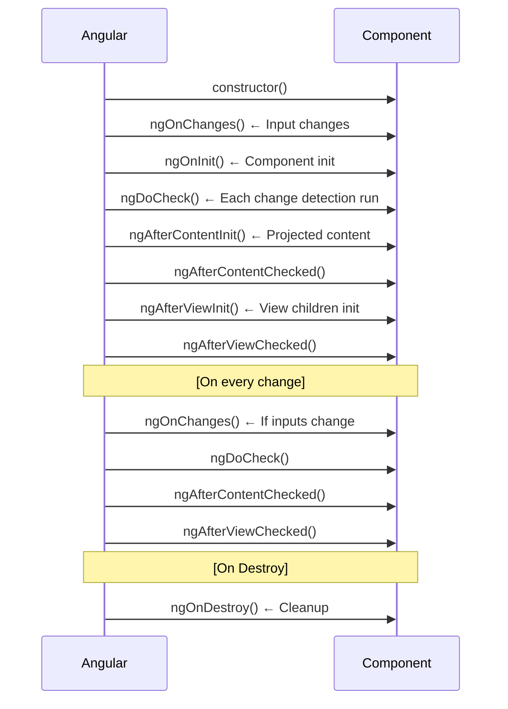

[[00-Dashboard/Home|Home]] | [[02-Semester-VI/Semester-VI-Dashboard|Semester VI]] | [[Overview]] | [[Syllabus]] | [[Unit-1]] | [[Unit-2]] | [[Unit-3]] | [[Unit-4]] | [[Unit-5]] | [[Important-Questions|Imp. Qs]] | [[Revision]] | [[Interview-Prep]]


# Unit 2 - Components & Data Binding

> [!important] Core Angular Unit
> Components are the **fundamental building blocks** of Angular applications. This unit covers everything about creating, configuring, and communicating between components - the most heavily tested area in Angular exams and interviews.

## Learning Objectives

- [ ] Use Angular CLI to create components and projects
- [ ] Understand Angular project structure
- [ ] Implement all four types of data binding
- [ ] Use component lifecycle hooks appropriately
- [ ] Apply structural and attribute directives
- [ ] Transform data with built-in pipes

---

## 2.1 Angular CLI

The ==Angular CLI== (`@angular/cli`) is a command-line tool for Angular development.

```bash
# Install Angular CLI globally
npm install -g @angular/cli

# Create a new project
ng new my-app
# Options:
# --routing    Add routing module
# --style=scss Use SCSS instead of CSS

# Navigate and serve
cd my-app
ng serve --open          # Starts dev server on port 4200

# Generate components, services, etc.
ng generate component user-list      # or ng g c user-list
ng generate service data             # or ng g s data
ng generate module products          # or ng g m products
ng generate pipe capitalize          # or ng g p capitalize
ng generate directive highlight      # or ng g d highlight
ng generate guard auth               # or ng g g auth

# Build
ng build                # Development build
ng build --configuration production  # Production build (optimized)

# Testing
ng test                 # Run unit tests (Karma + Jasmine)
ng e2e                  # End-to-end tests
```

---

## 2.2 Angular Project Structure

```
my-app/
├── src/
│   ├── app/
│   │   ├── app.module.ts          ← Root module
│   │   ├── app.component.ts       ← Root component
│   │   ├── app.component.html     ← Root template
│   │   ├── app.component.css      ← Root styles
│   │   └── app.component.spec.ts  ← Tests
│   ├── assets/                    ← Static files (images, etc.)
│   ├── environments/
│   │   ├── environment.ts         ← Dev config
│   │   └── environment.prod.ts    ← Prod config
│   ├── index.html                 ← Single HTML page
│   ├── main.ts                    ← Bootstrap entry point
│   └── styles.css                 ← Global styles
├── angular.json                   ← CLI configuration
├── package.json                   ← npm dependencies
├── tsconfig.json                  ← TypeScript config
└── tsconfig.app.json
```

---

## 2.3 Angular Module (NgModule)

```typescript
// app.module.ts
import { NgModule } from '@angular/core';
import { BrowserModule } from '@angular/platform-browser';
import { FormsModule } from '@angular/forms';
import { HttpClientModule } from '@angular/common/http';

import { AppRoutingModule } from './app-routing.module';
import { AppComponent } from './app.component';
import { UserListComponent } from './user-list/user-list.component';
import { UserCardComponent } from './user-card/user-card.component';

@NgModule({
  declarations: [      // Components, directives, pipes OWNED by this module
    AppComponent,
    UserListComponent,
    UserCardComponent
  ],
  imports: [           // Other modules needed
    BrowserModule,
    FormsModule,
    HttpClientModule,
    AppRoutingModule
  ],
  providers: [],       // Services (prefer providedIn: 'root' instead)
  bootstrap: [AppComponent]  // Root component
})
export class AppModule { }
```

---

## 2.4 Components

A ==Component== is a TypeScript class decorated with `@Component` that controls a patch of the screen (view).

### Component Structure

```typescript
// user-card.component.ts
import { Component, Input, Output, EventEmitter, OnInit } from '@angular/core';

@Component({
  selector: 'app-user-card',            // HTML tag name
  templateUrl: './user-card.component.html',
  styleUrls: ['./user-card.component.css'],
  // OR inline:
  // template: '<h1>{{ title }}</h1>',
  // styles: ['h1 { color: red; }']
})
export class UserCardComponent implements OnInit {
  // Input property - receives data from parent
  @Input() userName: string = '';
  @Input() userEmail: string = '';
  
  // Output property - emits events to parent
  @Output() userSelected = new EventEmitter<string>();
  
  title: string = 'User Profile';
  
  ngOnInit(): void {
    console.log('Component initialized with user:', this.userName);
  }
  
  onSelect(): void {
    this.userSelected.emit(this.userName);
  }
}
```

```html
<!-- user-card.component.html -->
<div class="user-card">
  <h2>{{ title }}</h2>
  <p>Name: {{ userName }}</p>
  <p>Email: {{ userEmail }}</p>
  <button (click)="onSelect()">Select User</button>
</div>
```

### Parent-Child Communication

```typescript
// parent.component.ts
@Component({
  selector: 'app-parent',
  template: `
    <h1>Parent Component</h1>
    <p>Selected: {{ selectedUser }}</p>
    
    <!-- Pass data DOWN to child with Property Binding -->
    <app-user-card
      [userName]="'Alice'"
      [userEmail]="'alice@example.com'"
      (userSelected)="onUserSelected($event)">    <!-- Listen for events UP from child -->
    </app-user-card>
  `
})
export class ParentComponent {
  selectedUser: string = '';
  
  onUserSelected(userName: string): void {
    this.selectedUser = userName;
    console.log('User selected:', userName);
  }
}
```

---

## 2.5 Component Lifecycle Hooks

==Lifecycle hooks== are interfaces that let you tap into key moments in a component's life.



### All Lifecycle Hooks

| Hook | Interface | When Called | Common Use |
|------|-----------|-------------|------------|
| `ngOnChanges` | `OnChanges` | Before `ngOnInit`, when `@Input` changes | React to input changes |
| `ngOnInit` | `OnInit` | After first `ngOnChanges` | **Init logic, API calls**  |
| `ngDoCheck` | `DoCheck` | Every change detection cycle | Custom change detection |
| `ngAfterContentInit` | `AfterContentInit` | After `<ng-content>` projected | Access projected content |
| `ngAfterContentChecked` | `AfterContentChecked` | After content checked | |
| `ngAfterViewInit` | `AfterViewInit` | After view and children init | **Access ViewChild**  |
| `ngAfterViewChecked` | `AfterViewChecked` | After view checked | |
| `ngOnDestroy` | `OnDestroy` | Just before component destroyed | **Unsubscribe, cleanup**  |

### Usage Example

```typescript
import { Component, OnInit, OnDestroy, OnChanges, SimpleChanges, Input } from '@angular/core';
import { Subscription } from 'rxjs';

@Component({
  selector: 'app-demo',
  template: '<p>Demo Component</p>'
})
export class DemoComponent implements OnInit, OnDestroy, OnChanges {
  @Input() data: string = '';
  private subscription: Subscription = new Subscription();
  
  constructor() {
    console.log('1. Constructor');
  }
  
  ngOnChanges(changes: SimpleChanges): void {
    console.log('2. ngOnChanges:', changes);
    if (changes['data']) {
      console.log('  data changed from', 
        changes['data'].previousValue, 'to', changes['data'].currentValue);
    }
  }
  
  ngOnInit(): void {
    console.log('3. ngOnInit - perfect for API calls');
    this.subscription = someObservable.subscribe();
  }
  
  ngOnDestroy(): void {
    console.log('8. ngOnDestroy - cleanup!');
    this.subscription.unsubscribe();  // Prevent memory leaks!
  }
}
```

---

## 2.6 Data Binding - All Four Types

```mermaid
graph LR
  subgraph Component Class
    DATA[Component Data]
  end
  subgraph Template HTML
    VIEW[Template View]
  end
  DATA -->|Interpolation {{ }}| VIEW
  DATA -->|Property Binding [prop]| VIEW
  VIEW -->|Event Binding event| DATA
  DATA <-->|Two-way Binding ngModel| VIEW
```

### Type 1: Interpolation

Displays component data as text in the template.

```html
<!-- component.ts -->
<!-- title = 'Angular App'; count = 42; user = {name: 'Alice'} -->

<h1>{{ title }}</h1>
<p>Count: {{ count }}</p>
<p>Name: {{ user.name }}</p>
<p>2 + 2 = {{ 2 + 2 }}</p>
<p>Upper: {{ title.toUpperCase() }}</p>
<p>Today: {{ today | date:'fullDate' }}</p>
```

### Type 2: Property Binding

Binds component data to a DOM element property.

```html
<!-- Bind to element properties -->

<button [disabled]="isLoading">Submit</button>
<input [value]="inputValue">
<div [style.color]="textColor">Colored text</div>
<p [class.active]="isActive">Active paragraph</p>

<!-- Bind to component @Input -->
<app-user-card [userName]="currentUser.name"></app-user-card>
```

### Type 3: Event Binding

Listens for DOM events and calls component methods.

```html
<button (click)="onClick()">Click Me</button>
<input (keyup)="onKeyUp($event)">
<form (ngSubmit)="onSubmit()">
<div (mouseover)="onHover()" (mouseout)="onLeave()">Hover me</div>

<!-- $event - the native DOM event object -->
<input (keyup.enter)="onEnter($event.target.value)">
```

```typescript
onClick(): void {
  console.log('Button clicked!');
}

onKeyUp(event: KeyboardEvent): void {
  console.log('Key pressed:', (event.target as HTMLInputElement).value);
}
```

### Type 4: Two-Way Binding (Banana in a Box)

Combines property binding and event binding - keeps model and view in sync.

```html
<!-- Requires FormsModule imported in AppModule -->
<input [(ngModel)]="userName" placeholder="Enter name">
<p>Hello, {{ userName }}!</p>

<!-- Equivalent long form: -->
<input [value]="userName" (input)="userName = $event.target.value">
```

```typescript
userName: string = '';  // Automatically synced with input field
```

### Data Binding Summary

| Type | Syntax | Direction | Use Case |
|------|--------|-----------|----------|
| Interpolation | `{{ expression }}` | Component → Template | Display text values |
| Property Binding | `[property]="expr"` | Component → Template | Bind to DOM properties |
| Event Binding | `(event)="method()"` | Template → Component | Handle user events |
| Two-way Binding | `[(ngModel)]="prop"` | Both ways | Form inputs |

^data-binding-types

---

## 2.7 Directives

==Directives== extend HTML with custom behavior. Angular has three types.

### Structural Directives - Change DOM Structure

**`*ngIf`** - conditionally renders element:
```html
<div *ngIf="isLoggedIn">Welcome, {{ userName }}!</div>
<div *ngIf="!isLoggedIn">Please log in</div>

<!-- With else template -->
<div *ngIf="isLoggedIn; else loginBlock">
  Welcome, {{ userName }}!
</div>
<ng-template #loginBlock>
  <p>Please log in</p>
</ng-template>
```

**`*ngFor`** - renders a list:
```html
<ul>
  <li *ngFor="let user of users; let i = index; trackBy: trackByFn">
    {{ i + 1 }}. {{ user.name }} ({{ user.email }})
  </li>
</ul>

<p *ngFor="let item of items; let first = first; let last = last">
  {{ first ? 'FIRST: ' : '' }}{{ item }}{{ last ? ' :LAST' : '' }}
</p>
```

**`*ngSwitch`** - switch-case for templates:
```html
<div [ngSwitch]="userRole">
  <p *ngSwitchCase="'admin'">Admin Dashboard</p>
  <p *ngSwitchCase="'user'">User Dashboard</p>
  <p *ngSwitchCase="'guest'">Guest View</p>
  <p *ngSwitchDefault>Unknown Role</p>
</div>
```

### Attribute Directives - Change Appearance

**`ngClass`** - conditionally apply CSS classes:
```html
<div [ngClass]="{'active': isActive, 'error': hasError, 'highlight': isHighlighted}">
  Dynamic classes
</div>

<!-- Or with expression -->
<p [ngClass]="isError ? 'error-text' : 'success-text'">Status</p>
```

**`ngStyle`** - apply inline styles dynamically:
```html
<p [ngStyle]="{'color': textColor, 'font-size': fontSize + 'px', 'font-weight': isBold ? 'bold' : 'normal'}">
  Styled text
</p>
```

---

## 2.8 Built-in Pipes

==Pipes== transform data for display in templates. Syntax: `{{ value | pipeName:param1:param2 }}`

```html
<!-- String pipes -->
<p>{{ name | uppercase }}</p>          <!-- ALICE -->
<p>{{ name | lowercase }}</p>          <!-- alice -->
<p>{{ name | titlecase }}</p>          <!-- Alice Smith -->

<!-- Number pipes -->
<p>{{ price | currency:'USD' }}</p>     <!-- $1,234.56 -->
<p>{{ price | currency:'INR':'symbol' }}</p>  <!-- ₹1,234.56 -->
<p>{{ ratio | percent:'1.2-2' }}</p>   <!-- 73.86% -->
<p>{{ pi | number:'1.2-4' }}</p>       <!-- 3.1416 -->

<!-- Date pipes -->
<p>{{ today | date }}</p>              <!-- Jun 16, 2026 -->
<p>{{ today | date:'fullDate' }}</p>   <!-- Tuesday, June 16, 2026 -->
<p>{{ today | date:'yyyy-MM-dd' }}</p>  <!-- 2026-06-16 -->
<p>{{ today | date:'short' }}</p>      <!-- 6/16/26, 8:00 PM -->

<!-- Other pipes -->
<p>{{ data | json }}</p>              <!-- JSON stringify (debugging) -->
<p>{{ text | slice:0:20 }}</p>        <!-- First 20 chars -->
<ul>
  <li *ngFor="let item of items | slice:0:5">{{ item }}</li>
</ul>
<p>{{ observable$ | async }}</p>      <!-- Subscribe to Observable -->
```

### Pipe Chaining

```html
<p>{{ name | uppercase | slice:0:5 }}</p>    <!-- First 5 chars uppercase -->
<p>{{ amount | currency | uppercase }}</p>   <!-- $1,234.56 → $1,234.56 -->
```

---

## Key Terms Summary

| Term | Definition |
|------|------------|
| ==Component== | TypeScript class with `@Component` decorator - basic UI unit |
| ==Template== | HTML file with Angular-specific syntax |
| ==`@Input()`== | Decorator to receive data from parent component |
| ==`@Output()`== | Decorator to emit events to parent component |
| ==`ngOnInit`== | Lifecycle hook - called once after component initialized |
| ==`ngOnDestroy`== | Lifecycle hook - called before component is destroyed |
| ==Interpolation== | `{{ }}` - display component data in template |
| ==Two-way Binding== | `[(ngModel)]` - sync model and view |
| ==Structural Directive== | Changes DOM structure (`*ngIf`, `*ngFor`) |
| ==Pipe== | Transforms display data (date, currency, uppercase) |

---

## Practice Questions

1. What is a component in Angular? How do you create one using CLI?
2. Explain all four types of data binding in Angular with examples.
3. What are lifecycle hooks? List all hooks in order and explain the three most important ones.
4. What is the difference between `*ngIf` and `[hidden]`? When would you use each?
5. How do you pass data from a parent to a child component? Write a complete example.
6. How does a child component send events to a parent? What decorators are used?
7. Explain the difference between `ngClass` and `ngStyle` directives.
8. What is `trackBy` in `*ngFor`? Why is it important for performance?
9. Write an example using `*ngFor` that shows index, first, and last variables.
10. What is the `async` pipe? When would you use it?

---

## Navigation

- [[Overview]] | [[Syllabus]]
- ← Previous: [[Unit-1|Unit-1 - Introduction to Angular]]
- → Next: [[Unit-3|Unit-3 - Angular Routing]]
- [[Important-Questions]] | [[Revision]] | [[Interview-Prep]]

---
*CS-352-MJ-T Design Framework (Angular) | Unit 2 | Semester VI*
