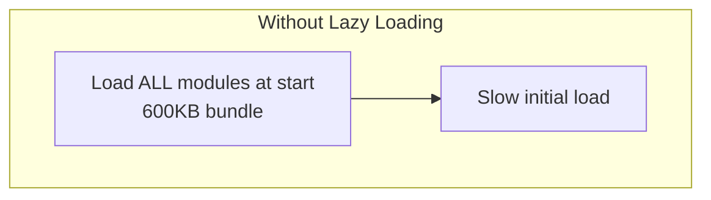
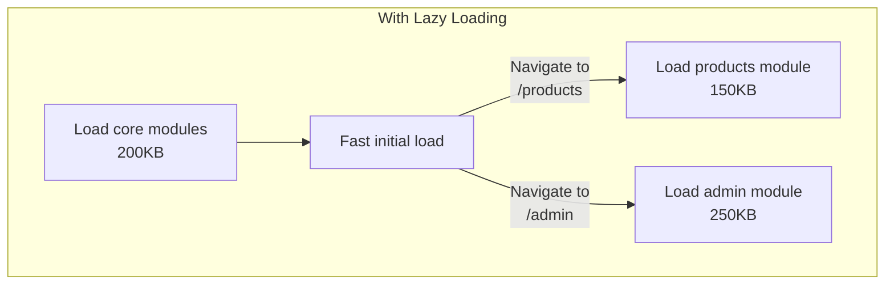

[[00-Dashboard/Home|Home]] | [[02-Semester-VI/Semester-VI-Dashboard|Semester VI]] | [[Overview]] | [[Syllabus]] | [[Unit-1]] | [[Unit-2]] | [[Unit-3]] | [[Unit-4]] | [[Unit-5]] | [[Important-Questions|Imp. Qs]] | [[Revision]] | [[Interview-Prep]]


# Unit 3 - Angular Routing

> [!note] Unit Overview
> Angular Router enables navigation between views in a Single Page Application without page reloads. This unit covers route configuration, parameters, child routes, guards for authentication, and lazy loading for performance optimization.

## Learning Objectives

- [ ] Configure routes using `RouterModule`
- [ ] Navigate using `routerLink` and programmatic navigation
- [ ] Pass and read route parameters
- [ ] Implement nested/child routes
- [ ] Protect routes using `CanActivate` guard
- [ ] Implement lazy loading for feature modules

---

## 3.1 RouterModule Setup

```typescript
// app-routing.module.ts - Standard setup
import { NgModule } from '@angular/core';
import { RouterModule, Routes } from '@angular/router';

import { HomeComponent } from './home/home.component';
import { AboutComponent } from './about/about.component';
import { ProductListComponent } from './products/product-list.component';
import { ProductDetailComponent } from './products/product-detail.component';
import { NotFoundComponent } from './not-found/not-found.component';

const routes: Routes = [
  // Default route - redirect to home
  { path: '', redirectTo: '/home', pathMatch: 'full' },
  
  // Static routes
  { path: 'home', component: HomeComponent },
  { path: 'about', component: AboutComponent },
  
  // Route with parameter
  { path: 'products', component: ProductListComponent },
  { path: 'products/:id', component: ProductDetailComponent },
  
  // Wildcard - must be LAST
  { path: '**', component: NotFoundComponent }
];

@NgModule({
  imports: [RouterModule.forRoot(routes)],  // forRoot() - only in root module
  exports: [RouterModule]
})
export class AppRoutingModule { }
```

---

## 3.2 Router Outlet & RouterLink

### router-outlet - Where Components Render

```html
<!-- app.component.html -->
<nav>
  <a routerLink="/home" routerLinkActive="active">Home</a>
  <a routerLink="/about" routerLinkActive="active">About</a>
  <a routerLink="/products" routerLinkActive="active">Products</a>
</nav>

<!-- Routed component renders here -->
<router-outlet></router-outlet>
```

### routerLink - Navigation in Templates

```html
<!-- Static route -->
<a routerLink="/home">Home</a>

<!-- With route parameter -->
<a [routerLink]="['/products', product.id]">View Product</a>

<!-- With query parameters -->
<a [routerLink]="['/products']" [queryParams]="{page: 1, sort: 'name'}">
  Products
</a>

<!-- Active class styling -->
<a routerLink="/home" routerLinkActive="active-link" 
   [routerLinkActiveOptions]="{exact: true}">Home</a>
```

### Programmatic Navigation

```typescript
import { Component } from '@angular/core';
import { Router, ActivatedRoute } from '@angular/router';

@Component({ ... })
export class NavigationComponent {
  constructor(private router: Router, private route: ActivatedRoute) {}
  
  goHome(): void {
    this.router.navigate(['/home']);
  }
  
  goToProduct(id: number): void {
    this.router.navigate(['/products', id]);
  }
  
  goWithParams(): void {
    this.router.navigate(['/search'], {
      queryParams: { q: 'angular', page: 1 }
    });
  }
  
  goRelative(): void {
    // Navigate relative to current route
    this.router.navigate(['../sibling'], { relativeTo: this.route });
  }
}
```

---

## 3.3 Route Parameters

### Defining Routes with Parameters

```typescript
const routes: Routes = [
  { path: 'users/:id', component: UserDetailComponent },
  { path: 'products/:category/:id', component: ProductComponent },
];
```

### Reading Route Parameters

```typescript
import { Component, OnInit } from '@angular/core';
import { ActivatedRoute, ParamMap } from '@angular/router';
import { switchMap } from 'rxjs/operators';

@Component({
  selector: 'app-user-detail',
  template: '<div>User: {{ userId }}</div>'
})
export class UserDetailComponent implements OnInit {
  userId: string = '';
  
  constructor(private route: ActivatedRoute) {}
  
  ngOnInit(): void {
    // Method 1: Snapshot (static - won't update if route params change)
    this.userId = this.route.snapshot.paramMap.get('id') || '';
    
    // Method 2: Observable (reacts to param changes - preferred!)
    this.route.paramMap.subscribe((params: ParamMap) => {
      this.userId = params.get('id') || '';
      console.log('User ID changed to:', this.userId);
      this.loadUser(this.userId);
    });
    
    // Query params
    this.route.queryParamMap.subscribe(qParams => {
      const page = qParams.get('page') || '1';
      const sort = qParams.get('sort') || 'name';
    });
  }
  
  loadUser(id: string): void {
    // Fetch user from service
  }
}
```

---

## 3.4 Child Routes (Nested Routing)

Child routes define routing inside a parent component - useful for tab-based navigation.

```typescript
const routes: Routes = [
  {
    path: 'products',
    component: ProductsComponent,      // Parent component
    children: [
      { path: '', redirectTo: 'list', pathMatch: 'full' },
      { path: 'list', component: ProductListComponent },     // /products/list
      { path: 'create', component: ProductCreateComponent }, // /products/create
      { path: ':id', component: ProductDetailComponent },    // /products/123
      { path: ':id/edit', component: ProductEditComponent }, // /products/123/edit
    ]
  }
];
```

```html
<!-- products.component.html - Parent with nested outlet -->
<h2>Products Section</h2>
<nav>
  <a routerLink="list">List</a>
  <a routerLink="create">Create New</a>
</nav>

<!-- Child components render here -->
<router-outlet></router-outlet>
```

---

## 3.5 Route Guards

==Route Guards== are interfaces that control navigation - they can **allow or prevent** navigation to/from a route.

### CanActivate - Protect Route Access

```typescript
// auth.guard.ts
import { Injectable } from '@angular/core';
import { CanActivate, ActivatedRouteSnapshot, RouterStateSnapshot, Router } from '@angular/router';
import { AuthService } from './auth.service';

@Injectable({
  providedIn: 'root'
})
export class AuthGuard implements CanActivate {
  constructor(private authService: AuthService, private router: Router) {}
  
  canActivate(
    route: ActivatedRouteSnapshot,
    state: RouterStateSnapshot
  ): boolean {
    if (this.authService.isLoggedIn()) {
      return true;  // Allow navigation
    } else {
      // Redirect to login, save intended URL
      this.router.navigate(['/login'], {
        queryParams: { returnUrl: state.url }
      });
      return false;  // Block navigation
    }
  }
}

// Applying guard to routes
const routes: Routes = [
  { path: 'dashboard', component: DashboardComponent, canActivate: [AuthGuard] },
  { 
    path: 'admin', 
    component: AdminComponent, 
    canActivate: [AuthGuard, AdminGuard]  // Multiple guards
  }
];
```

### CanDeactivate - Confirm Before Leaving

```typescript
// unsaved-changes.guard.ts
import { Injectable } from '@angular/core';
import { CanDeactivate } from '@angular/router';

export interface CanComponentDeactivate {
  canDeactivate: () => boolean | Observable<boolean>;
}

@Injectable({ providedIn: 'root' })
export class UnsavedChangesGuard implements CanDeactivate<CanComponentDeactivate> {
  canDeactivate(component: CanComponentDeactivate): boolean {
    if (component.canDeactivate && !component.canDeactivate()) {
      return confirm('You have unsaved changes. Leave anyway?');
    }
    return true;
  }
}

// Component implementing the interface
export class EditFormComponent implements CanComponentDeactivate {
  hasUnsavedChanges = false;
  
  canDeactivate(): boolean {
    return !this.hasUnsavedChanges;
  }
}

// Route config
{ path: 'edit/:id', component: EditFormComponent, canDeactivate: [UnsavedChangesGuard] }
```

### All Route Guard Types

| Guard | Interface | Purpose |
|-------|-----------|---------|
| `CanActivate` | `CanActivate` | Can user access this route? |
| `CanActivateChild` | `CanActivateChild` | Can user access child routes? |
| `CanDeactivate` | `CanDeactivate<T>` | Can user leave this route? |
| `CanLoad` | `CanLoad` | Can lazy module be loaded? |
| `Resolve` | `Resolve<T>` | Pre-fetch data before navigation |

---

## 3.6 Lazy Loading

==Lazy Loading== delays loading of feature modules until the user navigates to them - improves initial load time.

```typescript
// app-routing.module.ts - Lazy loading with dynamic import
const routes: Routes = [
  { path: '', component: HomeComponent },
  { path: 'about', component: AboutComponent },
  
  // Lazy-loaded modules
  {
    path: 'products',
    loadChildren: () => import('./products/products.module')
                        .then(m => m.ProductsModule)
  },
  {
    path: 'admin',
    loadChildren: () => import('./admin/admin.module')
                        .then(m => m.AdminModule),
    canLoad: [AuthGuard]  // Guard prevents even loading
  }
];

// products/products-routing.module.ts - Feature module routing
const productRoutes: Routes = [
  { path: '', component: ProductListComponent },
  { path: ':id', component: ProductDetailComponent }
];

@NgModule({
  imports: [RouterModule.forChild(productRoutes)],  // forChild() ← not forRoot!
  exports: [RouterModule]
})
export class ProductsRoutingModule { }
```

### Benefits of Lazy Loading

### Without Lazy Loading



### With Lazy Loading




### Preloading Strategies

```typescript
import { PreloadAllModules, NoPreloading } from '@angular/router';

// Strategy 1: No preloading (default) - lazy modules loaded on demand
RouterModule.forRoot(routes, { preloadingStrategy: NoPreloading })

// Strategy 2: Preload all - load all lazy modules in background after initial load
RouterModule.forRoot(routes, { preloadingStrategy: PreloadAllModules })

// Strategy 3: Custom preloading
@Injectable({ providedIn: 'root' })
export class SelectivePreloadingStrategy implements PreloadingStrategy {
  preload(route: Route, load: () => Observable<any>): Observable<any> {
    return route.data?.['preload'] ? load() : of(null);
  }
}

// Use in route: { path: 'products', loadChildren: ..., data: { preload: true } }
```

---

## 3.7 Default and Wildcard Routes

```typescript
const routes: Routes = [
  // Default route - exact match on empty path
  { path: '', redirectTo: '/home', pathMatch: 'full' },
  
  { path: 'home', component: HomeComponent },
  { path: 'about', component: AboutComponent },
  
  // Wildcard - catch-all for 404 (must be LAST!)
  { path: '**', component: PageNotFoundComponent }
];
```

> [!warning] Route Order Matters!
> Angular Router matches routes in order. The wildcard `**` route must be **LAST** - otherwise it catches all routes.

---

## Key Terms Summary

| Term | Definition |
|------|------------|
| ==RouterModule== | Angular module providing routing functionality |
| ==router-outlet== | Placeholder where routed components render |
| ==routerLink== | Directive for declarative navigation |
| ==ActivatedRoute== | Service to access current route info and params |
| ==Route Parameters== | Dynamic URL segments (`:id` in path) |
| ==Child Routes== | Nested routes within a parent route's component |
| ==CanActivate== | Guard that controls access to a route |
| ==CanDeactivate== | Guard that controls leaving a route |
| ==Lazy Loading== | Loading feature modules on demand |
| ==Wildcard Route== | `**` - catches all unmatched routes (404) |

---

## Practice Questions

1. What is `RouterModule`? What is the difference between `forRoot()` and `forChild()`?
2. What is `<router-outlet>`? How does it work in Angular navigation?
3. How do you pass and read route parameters in Angular? Show both snapshot and Observable approaches.
4. What are child routes? Write an example of nested routing for a product module.
5. What is a Route Guard? Explain `CanActivate` with a complete authentication example.
6. What is the difference between `CanActivate` and `CanDeactivate` guards?
7. What is lazy loading? How does it improve application performance?
8. What is a wildcard route? Why must it be placed last?
9. What are preloading strategies in Angular Router? When would you use `PreloadAllModules`?
10. How do you implement programmatic navigation in Angular? Show using `Router.navigate()`.

---

## Navigation

- [[Overview]] | [[Syllabus]]
- ← Previous: [[Unit-2|Unit-2 - Components & Data Binding]]
- → Next: [[Unit-4|Unit-4 - Services & DI]]
- [[Important-Questions]] | [[Revision]] | [[Interview-Prep]]

---
*CS-352-MJ-T Design Framework (Angular) | Unit 3 | Semester VI*
