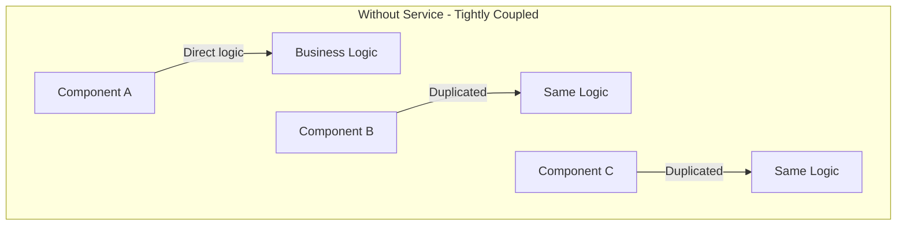
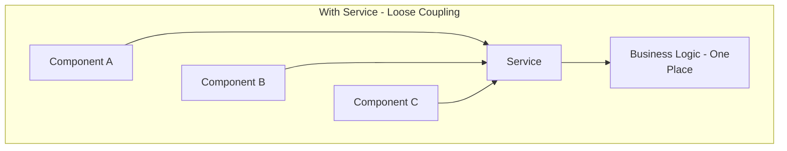
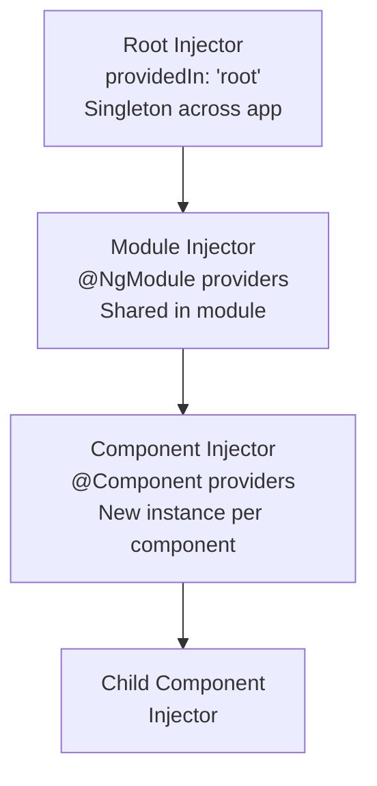

[[00-Dashboard/Home|Home]] | [[02-Semester-VI/Semester-VI-Dashboard|Semester VI]] | [[Overview]] | [[Syllabus]] | [[Unit-1]] | [[Unit-2]] | [[Unit-3]] | [[Unit-4]] | [[Unit-5]] | [[Important-Questions|Imp. Qs]] | [[Revision]] | [[Interview-Prep]]


# Unit 4 - Services & Dependency Injection

> [!note] Unit Overview
> Services encapsulate business logic and data access, while Angular's DI framework provides them to components without tight coupling. This unit covers service creation, the DI hierarchy, HTTP communication, and provider configurations.

## Learning Objectives

- [ ] Create and inject Angular services
- [ ] Use `HttpClient` to communicate with REST APIs
- [ ] Understand Angular's hierarchical injector system
- [ ] Configure providers using `useClass`, `useValue`, `useFactory`
- [ ] Handle HTTP responses with RxJS Observables
- [ ] Use injection tokens for non-class dependencies

---

## 4.1 What is a Service?

An Angular ==Service== is a class with focused purpose - it contains **reusable business logic** that doesn't belong in a component.

### Why Use Services?

### Without Service - Tightly Coupled



### With Service - Loose Coupling




### When to Create a Service

- Sharing data between unrelated components
- HTTP/API calls
- Business logic that doesn't belong in a component
- Stateful data that persists across route changes

---

## 4.2 Creating Services

```bash
# Angular CLI command
ng generate service services/user
# Creates: src/app/services/user.service.ts
# src/app/services/user.service.spec.ts
```

```typescript
// user.service.ts
import { Injectable } from '@angular/core';
import { HttpClient } from '@angular/common/http';
import { Observable } from 'rxjs';
import { map, catchError } from 'rxjs/operators';

export interface User {
  id: number;
  name: string;
  email: string;
  role: string;
}

@Injectable({
  providedIn: 'root'  // Available throughout entire app (singleton)
})
export class UserService {
  private apiUrl = 'https://api.example.com/users';
  private selectedUser: User | null = null;
  
  constructor(private http: HttpClient) {}
  
  // Return Observable - component subscribes to it
  getUsers(): Observable<User[]> {
    return this.http.get<User[]>(this.apiUrl);
  }
  
  getUserById(id: number): Observable<User> {
    return this.http.get<User>(`${this.apiUrl}/${id}`);
  }
  
  createUser(user: User): Observable<User> {
    return this.http.post<User>(this.apiUrl, user);
  }
  
  updateUser(id: number, user: User): Observable<User> {
    return this.http.put<User>(`${this.apiUrl}/${id}`, user);
  }
  
  deleteUser(id: number): Observable<void> {
    return this.http.delete<void>(`${this.apiUrl}/${id}`);
  }
  
  // Shared state in service
  setSelectedUser(user: User): void {
    this.selectedUser = user;
  }
  
  getSelectedUser(): User | null {
    return this.selectedUser;
  }
}
```

### Consuming a Service in a Component

```typescript
// user-list.component.ts
import { Component, OnInit, OnDestroy } from '@angular/core';
import { Subscription } from 'rxjs';
import { UserService, User } from '../services/user.service';

@Component({
  selector: 'app-user-list',
  template: `
    <div *ngIf="loading">Loading...</div>
    <div *ngIf="error" class="error">{{ error }}</div>
    <ul *ngIf="!loading">
      <li *ngFor="let user of users">
        {{ user.name }} - {{ user.email }}
        <button (click)="deleteUser(user.id)">Delete</button>
      </li>
    </ul>
  `
})
export class UserListComponent implements OnInit, OnDestroy {
  users: User[] = [];
  loading = false;
  error = '';
  private subscription = new Subscription();
  
  constructor(private userService: UserService) {}  // DI via constructor
  
  ngOnInit(): void {
    this.loadUsers();
  }
  
  loadUsers(): void {
    this.loading = true;
    this.subscription.add(
      this.userService.getUsers().subscribe({
        next: (users) => {
          this.users = users;
          this.loading = false;
        },
        error: (err) => {
          this.error = 'Failed to load users: ' + err.message;
          this.loading = false;
        },
        complete: () => {
          console.log('Users loaded completely');
        }
      })
    );
  }
  
  deleteUser(id: number): void {
    this.userService.deleteUser(id).subscribe(() => {
      this.users = this.users.filter(u => u.id !== id);
    });
  }
  
  ngOnDestroy(): void {
    this.subscription.unsubscribe();  // Prevent memory leaks!
  }
}
```

---

## 4.3 Built-in Angular Services

### HttpClient Service

```typescript
// 1. Import HttpClientModule in AppModule
@NgModule({
  imports: [BrowserModule, HttpClientModule]
})
export class AppModule { }

// 2. Use HttpClient in service
@Injectable({ providedIn: 'root' })
export class ApiService {
  constructor(private http: HttpClient) {}
  
  // GET with headers and params
  getData(filters: any): Observable<any[]> {
    const headers = new HttpHeaders({
      'Authorization': 'Bearer ' + localStorage.getItem('token'),
      'Content-Type': 'application/json'
    });
    
    const params = new HttpParams()
      .set('page', '1')
      .set('limit', '10')
      .set('sort', filters.sort || 'name');
    
    return this.http.get<any[]>('/api/data', { headers, params });
  }
  
  // POST with body
  createItem(item: any): Observable<any> {
    return this.http.post<any>('/api/items', item);
  }
  
  // Error handling with operators
  getUsers(): Observable<User[]> {
    return this.http.get<User[]>('/api/users').pipe(
      map(users => users.filter(u => u.role !== 'admin')),
      catchError(error => {
        console.error('Error:', error);
        return throwError(() => new Error(error.message));
      })
    );
  }
}
```

### Router Service

```typescript
@Injectable({ providedIn: 'root' })
export class NavigationService {
  constructor(private router: Router, private route: ActivatedRoute) {}
  
  goToProfile(userId: number): void {
    this.router.navigate(['/profile', userId]);
  }
  
  goBack(): void {
    window.history.back();
  }
  
  getCurrentUrl(): string {
    return this.router.url;
  }
}
```

---

## 4.4 Angular Dependency Injection Framework

### Hierarchical Injectors

Angular has a **tree of injectors** corresponding to the component tree:



### What Happens When DI Can't Find a Token?

```
1. Look in Component injector → Not found
2. Look in Parent Component injector → Not found
3. Look in Module injector → Not found
4. Look in Root injector → Found! Return singleton
5. If not found anywhere → NullInjectorError!
```

---

## 4.5 Provider Configuration

### providedIn: 'root' (Singleton - Preferred)

```typescript
@Injectable({
  providedIn: 'root'  // Single instance shared by entire app
})
export class AuthService { }
```

### Module-level Providers

```typescript
@NgModule({
  providers: [DataService]  // New instance for each module
})
export class FeatureModule { }
```

### Component-level Providers (New Instance per Component)

```typescript
@Component({
  selector: 'app-counter',
  template: '...',
  providers: [CounterService]  // Each CounterComponent gets its OWN instance
})
export class CounterComponent { }
```

### Provider Types (`useClass`, `useValue`, `useFactory`, `useExisting`)

```typescript
// useClass - provide a different implementation
{ provide: LoggingService, useClass: ProdLoggingService }
// In tests:
{ provide: LoggingService, useClass: MockLoggingService }

// useValue - provide a constant value
{ provide: API_URL, useValue: 'https://api.example.com' }
{ provide: MAX_RETRIES, useValue: 3 }

// useFactory - provide a value from a factory function
{
  provide: ConfigService,
  useFactory: (http: HttpClient) => {
    return new ConfigService(http, environment.apiUrl);
  },
  deps: [HttpClient]  // Inject these into factory
}

// useExisting - alias one token to another
{ provide: OldService, useExisting: NewService }
```

---

## 4.6 Injection Tokens

==InjectionToken== allows injecting non-class values (strings, objects, functions):

```typescript
import { InjectionToken, Inject } from '@angular/core';

// Define token
export const API_URL = new InjectionToken<string>('API_URL');
export const APP_CONFIG = new InjectionToken<AppConfig>('App Config');

// Define interface
export interface AppConfig {
  apiUrl: string;
  maxRetries: number;
  debug: boolean;
}

// Provide the value
@NgModule({
  providers: [
    { provide: API_URL, useValue: 'https://api.example.com' },
    {
      provide: APP_CONFIG,
      useValue: {
        apiUrl: 'https://api.example.com',
        maxRetries: 3,
        debug: !environment.production
      }
    }
  ]
})
export class AppModule { }

// Inject using @Inject
@Injectable({ providedIn: 'root' })
export class DataService {
  constructor(
    private http: HttpClient,
    @Inject(API_URL) private apiUrl: string,        // Inject string token
    @Inject(APP_CONFIG) private config: AppConfig   // Inject object token
  ) {
    console.log('API URL:', this.apiUrl);
    console.log('Max retries:', this.config.maxRetries);
  }
}
```

---

## 4.7 DI Decorators

| Decorator | Purpose | Example |
|-----------|---------|---------|
| `@Injectable()` | Mark class as injectable | `@Injectable({ providedIn: 'root' })` |
| `@Inject()` | Inject specific token | `@Inject(API_URL) url: string` |
| `@Optional()` | Make dependency optional | `@Optional() private log: LogService` |
| `@Self()` | Only look in own injector | `@Self() private service: Service` |
| `@SkipSelf()` | Skip own injector, look in parent | `@SkipSelf() private service: Service` |
| `@Host()` | Look in host component only | `@Host() private dir: Directive` |

```typescript
@Component({ ... })
export class MyComponent {
  constructor(
    private required: RequiredService,         // Must exist - error if not
    @Optional() private optional: OptService,  // OK if not provided
    @Inject(API_URL) private apiUrl: string,   // Inject non-class token
    @Self() private selfOnly: LocalService,    // Only from this component
    @SkipSelf() private fromParent: Service    // Skip this, go to parent
  ) {
    if (this.optional) {
      console.log('Optional service found!');
    }
  }
}
```

---

## 4.8 RESTful Services with DI and RxJS

```typescript
import { Injectable } from '@angular/core';
import { HttpClient, HttpErrorResponse } from '@angular/common/http';
import { Observable, throwError, BehaviorSubject } from 'rxjs';
import { catchError, retry, map, tap, shareReplay } from 'rxjs/operators';

@Injectable({ providedIn: 'root' })
export class ProductService {
  private apiUrl = 'https://api.example.com/products';
  
  // BehaviorSubject for shared state
  private productsSubject = new BehaviorSubject<Product[]>([]);
  public products$ = this.productsSubject.asObservable();
  
  constructor(private http: HttpClient) {}
  
  // Fetch and cache products
  getProducts(): Observable<Product[]> {
    return this.http.get<Product[]>(this.apiUrl).pipe(
      retry(2),           // Retry up to 2 times on error
      tap(products => this.productsSubject.next(products)),  // Update shared state
      shareReplay(1),     // Cache and share result
      catchError(this.handleError)
    );
  }
  
  getProduct(id: number): Observable<Product> {
    return this.http.get<Product>(`${this.apiUrl}/${id}`).pipe(
      catchError(this.handleError)
    );
  }
  
  // Error handler
  private handleError(error: HttpErrorResponse): Observable<never> {
    let message = 'An error occurred';
    if (error.error instanceof ErrorEvent) {
      // Client-side error
      message = error.error.message;
    } else {
      // Server-side error
      message = `Server Error ${error.status}: ${error.message}`;
    }
    console.error(message);
    return throwError(() => new Error(message));
  }
}
```

---

## Key Terms Summary

| Term | Definition |
|------|------------|
| ==Service== | Reusable class for business logic, HTTP, shared state |
| ==`@Injectable()`== | Marks class as injectable by DI |
| ==`providedIn: 'root'`== | Singleton service available app-wide |
| ==Injector== | Framework component that creates and provides services |
| ==Hierarchical DI== | Tree of injectors - component → module → root |
| ==`InjectionToken`== | Token for non-class injectables (strings, objects) |
| ==`HttpClient`== | Angular service for HTTP requests |
| ==Observable== | RxJS stream of asynchronous data |
| ==`subscribe()`== | Start listening to an Observable |
| ==`BehaviorSubject`== | Observable with current value - useful for shared state |

---

## Practice Questions

1. What is a service in Angular? Why are services used instead of putting logic in components?
2. How do you create an Angular service using CLI? Write a basic service example.
3. Explain Angular's hierarchical DI system with a diagram.
4. What is the difference between `providedIn: 'root'` and providing a service in a component?
5. What are the four provider types (`useClass`, `useValue`, `useFactory`, `useExisting`)? Give an example of each.
6. What is an `InjectionToken`? When would you use it?
7. Explain the DI decorators: `@Optional()`, `@Self()`, `@SkipSelf()`.
8. How do you use `HttpClient` to make GET, POST, PUT, DELETE requests in Angular?
9. What is an `Observable` in RxJS? How is it different from a `Promise`?
10. What is `BehaviorSubject`? How is it used for shared state between components?

---

## Navigation

- [[Overview]] | [[Syllabus]]
- ← Previous: [[Unit-3|Unit-3 - Angular Routing]]
- → Next: [[Unit-5|Unit-5 - Forms & Validation]]
- [[Important-Questions]] | [[Revision]] | [[Interview-Prep]]

---
*CS-352-MJ-T Design Framework (Angular) | Unit 4 | Semester VI*
