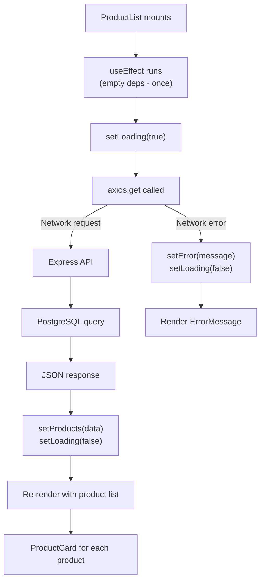

[[Overview]] | [[Syllabus]] | [[Unit-1]] | [[Unit-2]] | [[Unit-3]] | [[Unit-4]] | [[Unit-5]]

---

# CS-353 Web Technology II - Important Questions

> [!warning] Exam Focus Areas
> Unit 2 (Components, Props, State, Hooks) and Unit 3 (React Router) carry the most exam weight.
> Always write code examples in answers wherever applicable - they earn extra marks.
> Know how to compare React vs Angular, and controlled vs uncontrolled components.

---

## Unit 1 - Introduction to Angular/React Framework

### 2-Mark Questions

**Q1. What is React? How is it different from a full framework like Angular?**

**Model Answer:** ==React== is a JavaScript library developed by Meta (Facebook) for building user interfaces. It focuses solely on the View layer of an application, handling component rendering and UI updates. ==Angular== is a full MVC framework developed by Google that includes routing, HTTP client, dependency injection, and form handling out of the box. React requires separate libraries for these concerns (react-router-dom, Axios, etc.), while Angular provides everything in one package. React uses a Virtual DOM; Angular uses incremental DOM with change detection.

---

**Q2. What is the Virtual DOM in React? Why is it used?**

**Model Answer:** The ==Virtual DOM== is a lightweight, in-memory representation of the actual browser DOM. When state changes, React creates a new Virtual DOM tree and compares it with the previous one using a process called ==reconciliation== (diffing). Only the nodes that actually changed are updated in the real DOM. This is more efficient than directly manipulating the real DOM for every state change, because real DOM operations are expensive. The Virtual DOM minimizes direct DOM manipulation and batches updates.

---

**Q3. What is JSX? List three rules of JSX syntax.**

**Model Answer:** ==JSX (JavaScript XML)== is a syntax extension for JavaScript that allows you to write HTML-like markup inside JavaScript files. It is not valid JavaScript - Babel transpiles JSX to `React.createElement()` calls. Three rules: (1) JSX must have a single root element (use `<>` fragment if needed). (2) HTML attributes use camelCase (`className` not `class`, `onClick` not `onclick`, `htmlFor` not `for`). (3) All tags must be closed, including self-closing tags like `` and `<br />`.

---

**Q4. What is `create-react-app`? What does it set up?**

**Model Answer:** `create-react-app` (CRA) is an officially supported tool that sets up a React project with zero build configuration. Running `npx create-react-app my-app` creates a project with Webpack (module bundler), Babel (transpiler for JSX and ES6+), ESLint (linting), Jest (testing), a development server with hot reloading, and production build scripts. The developer can focus on writing components without configuring build tools manually.

---

### 5-Mark Questions

**Q5. Compare React and Angular across five key dimensions with a comparison table.**

**Model Answer:**

| Dimension | React | Angular |
|-----------|-------|---------|
| Type | UI Library | Full Framework |
| Language | JavaScript (JSX) | TypeScript (mandatory) |
| Data Binding | One-way (top-down) | Two-way (`[(ngModel)]`) |
| DOM | Virtual DOM | Incremental DOM |
| Learning Curve | Moderate | Steep |
| Bundle Size | Smaller | Larger |
| State Management | useState, Context, Redux | Services, NgRx |
| HTTP | Axios / fetch (external) | HttpClient (built-in, RxJS) |
| Routing | react-router-dom (external) | @angular/router (built-in) |
| Creator | Meta (Facebook) | Google |

React's one-way data binding makes data flow predictable - data flows down via props, events bubble up. Angular's two-way binding automatically synchronizes the model and the view, simplifying form handling but making large app data flow harder to trace.

---

**Q6. Explain the React component lifecycle using hooks. What are the three phases?**

**Model Answer:** The three phases of a React component lifecycle are ==Mounting== (component is created and inserted into the DOM), ==Updating== (component re-renders due to state or prop changes), and ==Unmounting== (component is removed from the DOM). With functional components and hooks:

- **Mounting:** `useEffect(() => { fetchData(); }, [])` - The empty dependency array ensures the effect runs once after the first render, equivalent to `componentDidMount`.
- **Updating:** `useEffect(() => { doSomething(); }, [dependency])` - The effect runs after the first render and every time `dependency` changes, equivalent to `componentDidUpdate`.
- **Unmounting:** The cleanup function returned from `useEffect` runs before the component unmounts, equivalent to `componentWillUnmount`.

```jsx
useEffect(() => {
  const subscription = dataSource.subscribe();  // Mount: subscribe
  return () => {
    subscription.unsubscribe();                 // Unmount: clean up
  };
}, []);
```

---

## Unit 2 - Components, Props and State

### 5-Mark Questions

**Q7. What are React Hooks? Explain `useState` and `useEffect` with examples.**

**Model Answer:** ==Hooks== are functions introduced in React 16.8 that allow functional components to use state and other React features that were previously only available in class components. Hooks must be called at the top level of a component (not inside loops or conditionals) and only inside React function components.

`useState` manages local component state:
```jsx
const [count, setCount] = useState(0);
// count: current value, setCount: setter function, 0: initial value
<button onClick={() => setCount(prev => prev + 1)}>Count: {count}</button>
```

`useEffect` performs side effects after render:
```jsx
useEffect(() => {
  document.title = `Count: ${count}`;  // Runs after every render where count changed
}, [count]);
```

---

**Q8. Differentiate between Props and State in React. When would you use each?**

**Model Answer:**

| Aspect | Props | State |
|--------|-------|-------|
| Ownership | Passed from parent | Owned by the component |
| Mutability | Read-only in the child | Changed via setState |
| Who controls | Parent component | The component itself |
| Triggers re-render | Yes (when parent re-renders) | Yes (on every setState call) |
| Initial value | Set by parent | Set in useState() |

**Use Props** for: passing configuration, data, or callback functions from parent to child. Props represent what a component is told from the outside.
**Use State** for: data that changes due to user interaction, API responses, or timers - any internal data that affects how the component renders.

Example: A `<Button>` component receives `label` and `onClick` as props (configuration from parent). A `<Counter>` component holds `count` in state (internal changing value).

---

**Q9. Explain the Context API. How does it solve the prop drilling problem?**

**Model Answer:** ==Prop drilling== occurs when data must be passed through many intermediate components that do not need it, just to reach a deeply nested component that does. The ==Context API== provides a way to share data globally across the component tree without explicitly passing props at every level.

Three steps to use Context:
1. **Create context:** `const ThemeContext = createContext(null);`
2. **Provide context:** Wrap the component tree with `<ThemeContext.Provider value={theme}>`. All descendants can access `theme`.
3. **Consume context:** `const theme = useContext(ThemeContext);` in any descendant component.

```jsx
// 1. Create
const UserContext = createContext(null);

// 2. Provide (in App)
<UserContext.Provider value={{ user, setUser }}>
  <Navbar />
  <MainContent />
</UserContext.Provider>

// 3. Consume (in any nested component - no prop drilling needed)
function Navbar() {
  const { user } = useContext(UserContext);
  return <div>Welcome, {user.name}</div>;
}
```

---

**Q10. Write a React component that renders a list of students fetched from an API. Handle loading and error states.**

**Model Answer:**

```jsx
import React, { useState, useEffect } from 'react';
import axios from 'axios';

function StudentList() {
  const [students, setStudents] = useState([]);
  const [loading, setLoading] = useState(true);
  const [error, setError] = useState(null);

  useEffect(() => {
    const fetchStudents = async () => {
      try {
        const { data } = await axios.get('/api/students');
        setStudents(data);
      } catch (err) {
        setError('Failed to load students. Please try again.');
      } finally {
        setLoading(false);
      }
    };
    fetchStudents();
  }, []); // Empty array = run once on mount

  if (loading) return <div className="spinner">Loading students...</div>;
  if (error) return <div className="error">{error}</div>;
  if (students.length === 0) return <p>No students found.</p>;

  return (
    <div>
      <h2>Students ({students.length})</h2>
      <ul>
        {students.map((student) => (
          <li key={student.id}>
            <strong>{student.name}</strong> - {student.rollNo} - {student.email}
          </li>
        ))}
      </ul>
    </div>
  );
}

export default StudentList;
```

---

**Q11. What is `useCallback`? When should it be used?**

**Model Answer:** `useCallback` is a hook that returns a memoized version of a callback function. It only creates a new function reference when its dependency array changes. Without `useCallback`, every render creates a new function object, which causes child components that receive the function as a prop to re-render unnecessarily (since the prop reference changed).

```jsx
// Without useCallback: handleDelete is a new function every render
// → ProductItem re-renders even if the product didn't change

// With useCallback: handleDelete reference is stable
const handleDelete = useCallback((id) => {
  setProducts(prev => prev.filter(p => p.id !== id));
}, []);  // No dependencies - function never changes

// ProductItem will NOT re-render unless its own props change
<ProductItem product={p} onDelete={handleDelete} />
```

Use `useCallback` when: passing callback functions to child components wrapped in `React.memo`, or when a function is a dependency of another hook (useEffect).

---

## Unit 3 - Routing and Navigation

### 5-Mark Questions

**Q12. Explain React Router v6. How do you set up routing in a React application?**

**Model Answer:** ==React Router v6== is a client-side routing library for React. It uses the HTML5 History API to manage URL changes without page reloads, making the application a Single Page Application (SPA).

Setup:
```bash
npm install react-router-dom
```

Basic structure:
```jsx
import { BrowserRouter, Routes, Route } from 'react-router-dom';

function App() {
  return (
    <BrowserRouter>
      <Routes>
        <Route path="/" element={<Home />} />
        <Route path="/about" element={<About />} />
        <Route path="/users/:id" element={<UserProfile />} />
        <Route path="*" element={<NotFound />} />
      </Routes>
    </BrowserRouter>
  );
}
```

Key components: `BrowserRouter` wraps the app; `Routes` holds all routes; `Route` maps a path to a component; `Link` replaces `<a>` tags for navigation; `NavLink` adds an active class to the current route link; `useNavigate` enables programmatic navigation; `useParams` reads dynamic URL segments.

---

**Q13. What is a Protected Route? Implement one in React Router.**

**Model Answer:** A ==protected route== restricts access to certain pages, redirecting unauthenticated users to a login page. It is a pattern built on top of React Router's `Route` component.

```jsx
import { Navigate, Outlet } from 'react-router-dom';
import { useAuth } from './context/AuthContext';

// Protected Route component
function PrivateRoute() {
  const { isAuthenticated } = useAuth();
  return isAuthenticated ? <Outlet /> : <Navigate to="/login" replace />;
}

// Usage in Routes
<Routes>
  <Route path="/login" element={<Login />} />
  <Route path="/register" element={<Register />} />

  {/* All routes inside PrivateRoute require authentication */}
  <Route element={<PrivateRoute />}>
    <Route path="/dashboard" element={<Dashboard />} />
    <Route path="/profile" element={<Profile />} />
    <Route path="/settings" element={<Settings />} />
  </Route>
</Routes>
```

`<Navigate to="/login" replace />` redirects to the login page and replaces the current history entry so the back button does not bring the user back to the protected page.

---

**Q14. Explain nested routing with `Outlet` in React Router v6.**

**Model Answer:** ==Nested routes== allow a parent route to render a layout component and child routes to render inside that layout using the `<Outlet />` component as a placeholder. This is used for layouts such as dashboards with a sidebar.

```jsx
// Routes setup
<Route path="/dashboard" element={<DashboardLayout />}>
  <Route index element={<DashboardHome />} />      {/* /dashboard */}
  <Route path="users" element={<UserList />} />    {/* /dashboard/users */}
  <Route path="reports" element={<Reports />} />   {/* /dashboard/reports */}
</Route>

// DashboardLayout component
function DashboardLayout() {
  return (
    <div style={{ display: 'flex' }}>
      <Sidebar>
        <Link to="/dashboard">Home</Link>
        <Link to="/dashboard/users">Users</Link>
        <Link to="/dashboard/reports">Reports</Link>
      </Sidebar>
      <main>
        <Outlet />  {/* Child route renders here */}
      </main>
    </div>
  );
}
```

---

## Unit 4 - HTTP Client, API Integration, Observables

### 5-Mark Questions

**Q15. Compare `fetch` and `Axios` for making HTTP requests.**

**Model Answer:**

| Feature | fetch (built-in) | Axios (library) |
|---------|-----------------|-----------------|
| Installation | None (browser API) | `npm install axios` |
| JSON parsing | Manual: `res.json()` | Automatic: `response.data` |
| Error handling | Manual: check `res.ok` | Throws on 4xx/5xx |
| Request timeout | Manual with AbortController | `timeout: 5000` option |
| Request cancellation | AbortController | CancelToken / AbortController |
| Interceptors | No | Yes - modify all requests/responses |
| Base URL | Manual prefix | `axios.create({ baseURL })` |
| Progress tracking | No | Yes (for uploads) |
| Browser support | Modern browsers | All (uses XMLHttpRequest) |

**Recommendation:** Axios is preferred for production apps because of automatic JSON parsing, better error handling (4xx/5xx throw errors unlike fetch), interceptors for adding auth headers, and the axios instance for shared configuration.

---

**Q16. What are Observables? Compare them with Promises.**

**Model Answer:** An ==Observable== (from RxJS) represents a stream of values over time. It is lazy (does not execute until subscribed), can emit multiple values, and can be cancelled by unsubscribing. A ==Promise== represents a single asynchronous operation and is eager (starts executing immediately when created).

| Feature | Promise | Observable |
|---------|---------|-----------|
| Values | Single | Multiple (stream) |
| Execution | Eager (starts immediately) | Lazy (starts on subscribe) |
| Cancellation | Not directly cancellable | Yes - unsubscribe() |
| Operators | Limited (.then, .catch) | Rich (map, filter, merge, etc.) |
| Error handling | .catch() | error callback in subscribe() |
| Use in React | Yes (with async/await) | Common in Angular (HttpClient) |
| Use in Angular | Yes | Preferred (HttpClient returns Observable) |

```javascript
// Promise (single value)
fetch('/api/data')
  .then(res => res.json())
  .then(data => console.log(data));

// Observable (RxJS)
import { from } from 'rxjs';
const obs$ = from(fetch('/api/data').then(r => r.json()));
const sub = obs$.subscribe({ next: data => console.log(data) });
sub.unsubscribe();  // Cancel
```

---

**Q17. Write an Express REST API for a simple CRUD resource (books). Show all routes.**

**Model Answer:**

```javascript
const express = require('express');
const router = express.Router();
// Assume pool = PostgreSQL connection pool

// GET all books
router.get('/', async (req, res) => {
  try {
    const result = await pool.query('SELECT * FROM books ORDER BY id');
    res.json(result.rows);
  } catch (err) {
    res.status(500).json({ error: 'Server error' });
  }
});

// GET single book
router.get('/:id', async (req, res) => {
  try {
    const { id } = req.params;
    const result = await pool.query('SELECT * FROM books WHERE id = $1', [id]);
    if (result.rows.length === 0) return res.status(404).json({ error: 'Book not found' });
    res.json(result.rows[0]);
  } catch (err) {
    res.status(500).json({ error: 'Server error' });
  }
});

// POST - create book
router.post('/', async (req, res) => {
  try {
    const { title, author, isbn } = req.body;
    if (!title || !author) return res.status(400).json({ error: 'Title and author required' });
    const result = await pool.query(
      'INSERT INTO books (title, author, isbn) VALUES ($1, $2, $3) RETURNING *',
      [title, author, isbn]
    );
    res.status(201).json(result.rows[0]);
  } catch (err) {
    res.status(500).json({ error: 'Server error' });
  }
});

// PUT - update book
router.put('/:id', async (req, res) => {
  try {
    const { id } = req.params;
    const { title, author, isbn } = req.body;
    const result = await pool.query(
      'UPDATE books SET title=$1, author=$2, isbn=$3 WHERE id=$4 RETURNING *',
      [title, author, isbn, id]
    );
    if (result.rows.length === 0) return res.status(404).json({ error: 'Book not found' });
    res.json(result.rows[0]);
  } catch (err) {
    res.status(500).json({ error: 'Server error' });
  }
});

// DELETE - remove book
router.delete('/:id', async (req, res) => {
  try {
    const { id } = req.params;
    const result = await pool.query('DELETE FROM books WHERE id=$1 RETURNING id', [id]);
    if (result.rows.length === 0) return res.status(404).json({ error: 'Book not found' });
    res.status(204).send();
  } catch (err) {
    res.status(500).json({ error: 'Server error' });
  }
});

module.exports = router;
```

---

## Unit 5 - Forms, Validation and Deployment

### 5-Mark Questions

**Q18. What is a controlled component in React? Write a registration form with validation.**

**Model Answer:** A ==controlled component== is a form element whose value is bound to React state via the `value` prop and updated via an `onChange` handler. React is the single source of truth for the input's value.

```jsx
function RegisterForm() {
  const [formData, setFormData] = useState({ name: '', email: '', password: '' });
  const [errors, setErrors] = useState({});

  const handleChange = (e) => {
    const { name, value } = e.target;
    setFormData(prev => ({ ...prev, [name]: value }));
  };

  const validate = () => {
    const errs = {};
    if (!formData.name.trim()) errs.name = 'Name is required';
    if (!formData.email || !/^[^\s@]+@[^\s@]+\.[^\s@]+$/.test(formData.email))
      errs.email = 'Valid email required';
    if (formData.password.length < 8) errs.password = 'Min 8 characters';
    return errs;
  };

  const handleSubmit = (e) => {
    e.preventDefault();
    const errs = validate();
    if (Object.keys(errs).length > 0) { setErrors(errs); return; }
    console.log('Valid data:', formData);
    // Call API
  };

  return (
    <form onSubmit={handleSubmit}>
      <input name="name" value={formData.name} onChange={handleChange} placeholder="Name" />
      {errors.name && <span>{errors.name}</span>}
      <input name="email" value={formData.email} onChange={handleChange} placeholder="Email" />
      {errors.email && <span>{errors.email}</span>}
      <input type="password" name="password" value={formData.password}
             onChange={handleChange} placeholder="Password" />
      {errors.password && <span>{errors.password}</span>}
      <button type="submit">Register</button>
    </form>
  );
}
```

---

**Q19. How do you deploy a React application to Netlify? Explain all steps.**

**Model Answer:** Netlify is a cloud hosting platform for static and JAMstack sites. Deploying a React app involves the following steps:

1. **Build the application:** Run `npm run build` in the project directory. This creates a `build/` folder containing optimized static files (HTML, JS, CSS).

2. **Create a `netlify.toml` file** for configuration:
   ```toml
   [build]
     command = "npm run build"
     publish = "build"
   Netlify _redirects
     from = "/*"
     to = "/index.html"
     status = 200
   ```
   The redirect rule is essential for React Router - it ensures all paths return `index.html` so React Router can handle them client-side.

3. **Connect to Git:** Push the project to GitHub/GitLab/Bitbucket.

4. **Configure on Netlify:** Log in to netlify.com, click "Add new site", choose "Import an existing project", select the repository, and confirm the build settings.

5. **Set environment variables:** In Site Settings > Environment Variables, add production values like `REACT_APP_API_URL=https://api.myapp.com`.

6. **Deploy:** Netlify automatically builds and deploys on every push to the main branch. The site receives a `.netlify.app` URL and can be configured with a custom domain.

---

**Q20. Explain the purpose of environment variables in React. What is the difference between development and production environments?**

**Model Answer:** ==Environment variables== allow the same React codebase to connect to different resources depending on the environment (development vs production), without hardcoding values.

In Create React App, environment variables must be prefixed with `REACT_APP_` to be included in the bundle (a security measure). They are defined in `.env` files:

```bash
# .env.development (used by npm start)
REACT_APP_API_URL=http://localhost:5000
REACT_APP_DEBUG=true

# .env.production (used by npm run build)
REACT_APP_API_URL=https://api.myapp.com
REACT_APP_DEBUG=false
```

Accessed in code:
```javascript
const apiUrl = process.env.REACT_APP_API_URL;
```

Development environment: fast builds, detailed error messages, hot module reloading, source maps visible. Production environment: minified code, no source maps, optimized bundle, `NODE_ENV = 'production'` which disables React developer warnings.

**Important warning:** All `REACT_APP_` variables are embedded in the JavaScript bundle at build time and are visible to anyone who downloads the app. Never store private keys, database credentials, or API secrets in React environment variables. These belong only in server-side `.env` files.

---

### 10-Mark Questions

**Q21. Trace a complete React application from component rendering to API call to displaying data. Include component hierarchy, state management, and error handling.**

**Model Answer:** This question requires a full explanation with a diagram.

**Component hierarchy:**
```
App
  Router
    Navbar
    Routes
      ProductList        ← manages state: products, loading, error
        ProductCard      ← receives product via props
        LoadingSpinner   ← rendered when loading = true
        ErrorMessage     ← rendered when error != null
```

**Data flow:**


**Code:**
```jsx
function ProductList() {
  const [products, setProducts] = useState([]);
  const [loading, setLoading] = useState(true);
  const [error, setError] = useState(null);

  useEffect(() => {
    axios.get('/api/products')
      .then(({ data }) => setProducts(data))
      .catch(err => setError(err.message))
      .finally(() => setLoading(false));
  }, []);

  if (loading) return <LoadingSpinner />;
  if (error) return <ErrorMessage message={error} />;
  return (
    <div className="grid">
      {products.map(p => <ProductCard key={p.id} product={p} />)}
    </div>
  );
}

function ProductCard({ product }) {
  return (
    <div className="card">
      <h3>{product.name}</h3>
      <p>Rs. {product.price}</p>
    </div>
  );
}
```

The `key` prop on each `ProductCard` is mandatory when rendering lists. It helps React's reconciliation algorithm identify which items have changed, been added, or removed efficiently.

---

**Q22. Explain session management and JWT authentication. When would you choose one over the other?**

**Model Answer:** See Unit 4 notes for detailed comparison. Sessions are ==stateful== (server stores session data, sends only session ID to client via cookie). JWT is ==stateless== (server stores nothing, client holds token containing all user data).

**Choose Session-based when:**
- Building a traditional web application
- You need immediate token revocation (logout invalidates session instantly)
- Users are on a single server (or you have a shared session store)

**Choose JWT when:**
- Building a REST API consumed by mobile apps or SPAs
- Building microservices (any service can verify the token without a DB call)
- Scalability is critical (no shared session store needed across servers)
- The application is stateless by design

---

*CS-353-MJ-T Web Technology II | Important Questions | Semester VI*
