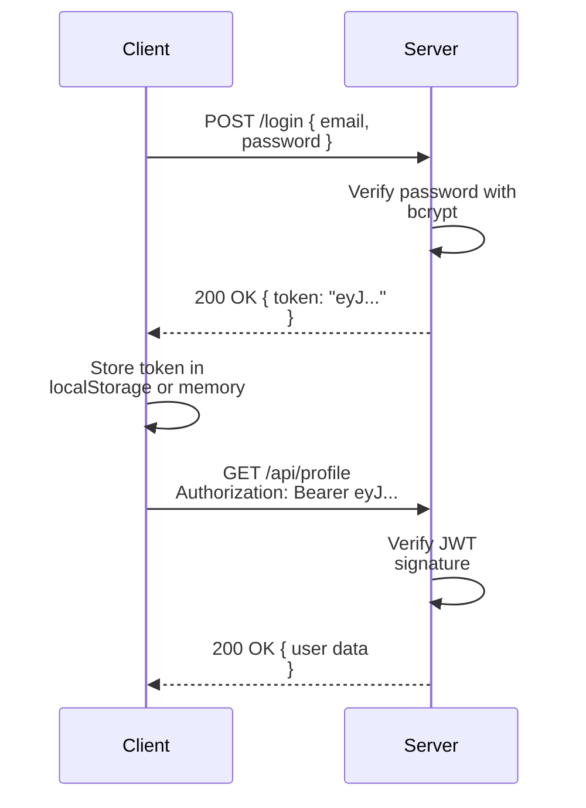

[[Overview]] | [[Syllabus]] | [[Revision]] | [[Important-Questions]]

---

# CS-353 Web Technology II - Interview Preparation

> [!tip] Interview Tips
> - Always relate your answer to a practical use-case or code example.
> - For React questions, interviewers expect you to know hooks thoroughly.
> - Know the difference between library and framework with concrete examples.
> - Be ready to code a simple CRUD component on a whiteboard/screen.

---

## React Fundamentals

**Q1. What is the Virtual DOM? How does React use it for efficient rendering?**

The ==Virtual DOM (VDOM)== is a lightweight JavaScript object that is a copy of the real browser DOM tree. When a component's state or props change, React creates a new VDOM tree representing the updated UI. React then ==diffs== (compares) the new VDOM with the previous VDOM snapshot using its reconciliation algorithm. Only the differences (the minimal set of changes) are applied to the real DOM. This is more efficient because real DOM operations (reflow, repaint) are expensive; batching and minimizing them significantly improves performance.

---

**Q2. What is the difference between a library and a framework? Where does React fit?**

A ==library== provides specific functionality that you call from your own code - you are in control of the overall application flow. A ==framework== provides a complete structure and calls your code at specific points (Inversion of Control). React is a ==library== because it handles only the View layer (component rendering and UI updates). You choose when and how to use it, and you add separate libraries for routing (react-router-dom), HTTP (Axios), and state management (Redux). Angular is a ==framework== because it provides routing, HTTP, forms, dependency injection, and testing in a single, opinionated package.

---

**Q3. What are React Hooks? Why were they introduced?**

==Hooks== are functions (introduced in React 16.8) that let functional components use React features like state, lifecycle effects, and context. Before hooks, only class components could have state and lifecycle methods. Hooks were introduced to: (1) reuse stateful logic between components without render props or higher-order components, (2) make components simpler (class components required understanding `this`, binding, and complex lifecycle methods), and (3) group related code by concern rather than by lifecycle phase. Key rules: hooks must be called at the top level (not in loops or conditions), and only inside React functions.

---

**Q4. Explain the `useState` hook with an example. What is the functional update form and when do you need it?**

```jsx
const [count, setCount] = useState(0);
```

`useState` returns an array: the current state value and a setter function. When `setCount` is called, React schedules a re-render with the new value.

The ==functional update form== `setCount(prev => prev + 1)` is needed when the new state depends on the previous state, especially when the update may happen in an asynchronous callback or when multiple updates are batched. React batches state updates, so if you call `setCount(count + 1)` three times in a row, all three may read the same stale `count` value. Using the functional form ensures each update builds on the latest state.

```jsx
// Problem: stale closure
const handleThreeIncrements = () => {
  setCount(count + 1); // all three see same 'count'
  setCount(count + 1);
  setCount(count + 1);
  // Result: count + 1, not count + 3
};

// Correct: functional update
const handleThreeIncrements = () => {
  setCount(prev => prev + 1);
  setCount(prev => prev + 1);
  setCount(prev => prev + 1);
  // Result: count + 3
};
```

---

**Q5. What is the `useEffect` hook? Explain the dependency array.**

`useEffect` runs a side effect (data fetching, DOM manipulation, subscriptions, timers) after a render. The ==dependency array== controls when the effect re-runs:

| Dependency Array | Effect Runs |
|-----------------|-------------|
| Omitted | After every render |
| `[]` | Only after the first render (mount) |
| `[a, b]` | After first render, and when `a` or `b` changes |

The effect can return a cleanup function that React calls before running the effect again and when the component unmounts.

```jsx
useEffect(() => {
  const id = setInterval(() => setTime(new Date()), 1000);
  return () => clearInterval(id);  // Cleanup: stop timer on unmount
}, []);
```

---

**Q6. What is `useRef`? How is it different from `useState`?**

`useRef` returns a mutable object `{ current: initialValue }` that persists across renders but does ==not trigger a re-render== when its `current` value changes. This is the key difference from `useState`.

**Uses of `useRef`:**
1. Accessing a DOM element directly:
```jsx
const inputRef = useRef(null);
<input ref={inputRef} />
// Focus the input without re-rendering:
inputRef.current.focus();
```
2. Storing a mutable value that should not cause a re-render (e.g., a timer ID, previous state value, or the count of renders).

```jsx
const renderCount = useRef(0);
useEffect(() => {
  renderCount.current += 1;  // Increments without causing another render
});
```

---

**Q7. What is `useMemo`? When should you use it?**

`useMemo` memoizes the result of an expensive computation, recomputing it only when specified dependencies change. This prevents unnecessarily repeating the computation on every render.

```jsx
const expensiveResult = useMemo(() => {
  return items.filter(item => item.active).sort((a, b) => a.price - b.price);
}, [items]); // Only recomputed when 'items' changes
```

Use `useMemo` when: a computation is genuinely expensive (large array processing, complex calculations), the component renders frequently, and the input dependencies change infrequently. Do NOT overuse it - the memoization itself has a cost, and for simple operations it may be slower than just recomputing.

---

**Q8. What is `useCallback`? How does it differ from `useMemo`?**

Both are memoization hooks, but they memoize different things:

- `useMemo` memoizes the ==return value== of a function.
- `useCallback` memoizes the ==function itself== (the function reference).

`useCallback(fn, deps)` is equivalent to `useMemo(() => fn, deps)`.

```jsx
// useMemo: memoizes the value
const doubled = useMemo(() => count * 2, [count]);

// useCallback: memoizes the function
const handleClick = useCallback(() => {
  doSomething(id);
}, [id]);
```

`useCallback` is most useful when passing callbacks to child components wrapped in `React.memo`, preventing the child from re-rendering just because the parent re-rendered (which would create a new function reference on every render).

---

**Q9. What is prop drilling and how does the Context API solve it?**

==Prop drilling== is the pattern of passing props through multiple levels of components that do not use the data themselves, just to get it to a deeply nested component. It creates tight coupling and makes the intermediate components harder to refactor.

The ==Context API== solves this by creating a "broadcast" mechanism:
1. Create a context with `React.createContext()`.
2. Wrap the component tree with `<Context.Provider value={...}>`.
3. Any descendant (at any depth) can access the value with `useContext(Context)` directly, without props.

```jsx
const ThemeContext = createContext('light');
// In App:
<ThemeContext.Provider value="dark">
  <Deeply><Nested><Component /></Nested></Deeply>
</ThemeContext.Provider>
// In Component (no props passed through intermediate components):
const theme = useContext(ThemeContext);
```

---

**Q10. What are the rules of Hooks?**

There are two fundamental rules:
1. **Call Hooks only at the top level.** Do not call hooks inside loops, conditions, or nested functions. This ensures React calls hooks in the same order on every render, which is how React associates state with the correct hook instance.
2. **Call Hooks only from React function components or custom hooks.** Do not call hooks from regular JavaScript functions, class components, or event handlers.

Violating these rules leads to bugs where hooks get associated with the wrong state across renders, producing unexpected behaviour.

---

## React Router

**Q11. What is React Router? What is the difference between `BrowserRouter` and `HashRouter`?**

==React Router== is a client-side routing library that manages navigation in React SPAs without page reloads. It uses the browser URL to determine which component to render.

`BrowserRouter` uses the HTML5 History API (`window.history.pushState`). URLs look clean: `/about`, `/users/42`. Requires server-side configuration (the server must serve `index.html` for all routes) to handle direct URL access.

`HashRouter` uses the URL hash (`#`): `/#!/about`, `/#/users/42`. The part after `#` is never sent to the server, so no server-side configuration is needed. Used for static hosting that does not support URL rewriting (e.g., GitHub Pages without custom configuration).

---

**Q12. What is the difference between `Link` and `<a href>`?**

`<a href>` causes a full page reload - the browser sends a new HTTP request to the server, and the React application is reloaded from scratch. All state is lost.

`<Link to="/">` from react-router-dom uses the HTML5 History API (`pushState`) to change the URL without a page reload. React Router intercepts the navigation, updates the URL in the address bar, and renders the appropriate component without a network request. The application state is preserved.

---

**Q13. How do you pass data between components in React Router using `useNavigate`?**

```jsx
// Sending state with navigation
const navigate = useNavigate();
navigate('/profile', {
  state: { userId: 42, name: 'Alice' }  // Passed via location state
});

// Receiving in the destination component
import { useLocation } from 'react-router-dom';
function Profile() {
  const { state } = useLocation();
  return <div>Welcome, {state?.name}</div>;
}
```

Note: Location state is not in the URL and is lost on page refresh. For persistent data, use URL params (`/profile/:id`) or query strings (`/profile?id=42`).

---

## HTTP and API Integration

**Q14. What is CORS? Why does it occur and how do you fix it?**

==CORS (Cross-Origin Resource Sharing)== is a browser security mechanism that blocks web pages from making requests to a different domain/port than the one that served the page. A request from `http://localhost:3000` (React app) to `http://localhost:5000` (Express API) is cross-origin because the ports differ.

The browser sends an `Origin` header with the request. If the server does not respond with the appropriate `Access-Control-Allow-Origin` header, the browser blocks the response.

**Fix on the Express server:**
```javascript
const cors = require('cors');
// Allow all origins (development only):
app.use(cors());
// Allow specific origin (production):
app.use(cors({ origin: 'https://myapp.com', credentials: true }));
```

**Fix in CRA development (proxy):**
```json
// package.json in React app
{ "proxy": "http://localhost:5000" }
```

---

**Q15. What is JWT? Describe its structure and the authentication flow.**

==JWT (JSON Web Token)== is a compact, URL-safe token used for stateless authentication. Structure (three parts separated by `.`):

1. **Header:** `{ "alg": "HS256", "typ": "JWT" }` (base64URL encoded)
2. **Payload:** `{ "userId": 42, "role": "admin", "exp": 1700000000 }` (base64URL encoded)
3. **Signature:** `HMACSHA256(header + '.' + payload, secretKey)` - verifies authenticity

**Authentication flow:**


The server never stores the token. Any server with the secret key can verify it - enabling horizontal scaling.

---

**Q16. What is the difference between authentication and authorization?**

==Authentication== is the process of verifying identity - answering "Who are you?" Examples: username/password login, biometric scan, OTP verification.

==Authorization== is the process of verifying permissions - answering "What are you allowed to do?" Examples: admin can delete users, regular user can only view their own profile.

Authentication always happens before authorization. In Express:
```javascript
// Authentication middleware: verify who the user is
function authenticate(req, res, next) {
  const token = req.headers.authorization?.split(' ')[1];
  try {
    req.user = jwt.verify(token, process.env.JWT_SECRET);
    next();
  } catch (e) {
    res.status(401).json({ error: 'Invalid token' });
  }
}

// Authorization middleware: verify what they can do
function authorize(role) {
  return (req, res, next) => {
    if (req.user.role !== role) return res.status(403).json({ error: 'Forbidden' });
    next();
  };
}

app.delete('/api/users/:id', authenticate, authorize('admin'), deleteUser);
```

---

**Q17. Explain `async/await` in JavaScript. How does it relate to Promises?**

`async/await` is syntactic sugar over Promises. An `async` function always returns a Promise. Inside an `async` function, `await` pauses execution until the Promise resolves, then returns its value. If the Promise rejects, an error is thrown (caught by `try/catch`).

```javascript
// Promise chain
fetch('/api/users')
  .then(res => res.json())
  .then(data => console.log(data))
  .catch(err => console.error(err));

// Equivalent async/await (more readable)
async function loadUsers() {
  try {
    const response = await fetch('/api/users');
    const data = await response.json();
    console.log(data);
  } catch (err) {
    console.error(err);
  }
}
```

`await` can only be used inside an `async` function. In `useEffect`, you cannot make the callback itself `async` (because an async function returns a Promise, not a cleanup function). Instead, define an `async` function inside the effect and call it immediately.

---

## Forms and Deployment

**Q18. What is the difference between controlled and uncontrolled form components?**

A ==controlled component== has its value bound to React state via the `value` prop and updates state on every `onChange` event. React is the single source of truth. Enables real-time validation, conditional disabling, and computed values.

An ==uncontrolled component== stores its value in the DOM itself. You access it via a `ref` when needed (e.g., on submit). Simpler setup, but limited control. Required for file inputs (you cannot set the `value` of a file input for security reasons).

```jsx
// Controlled
const [name, setName] = useState('');
<input value={name} onChange={e => setName(e.target.value)} />

// Uncontrolled
const nameRef = useRef();
<input ref={nameRef} defaultValue="Alice" />
// Access: nameRef.current.value
```

---

**Q19. What is React Hook Form and what problem does it solve?**

==React Hook Form (RHF)== is a library that simplifies form management. The main problem with `useState`-based forms is that every keystroke triggers a state update and component re-render. For a form with 20 fields, this is 20 state variables and 20 re-renders per field interaction.

RHF uses uncontrolled inputs internally (refs, not state), so the component does not re-render on every keystroke. The form only re-renders when an error appears or is cleared, or on submission. Key API:

```jsx
const { register, handleSubmit, formState: { errors } } = useForm();

<input {...register('email', { required: 'Email required',
  pattern: { value: /^\S+@\S+$/, message: 'Invalid email' } })} />
{errors.email && <p>{errors.email.message}</p>}
<button onClick={handleSubmit(onSubmit)}>Submit</button>
```

---

**Q20. What happens during `npm run build` for a React application?**

`npm run build` triggers the production build process:

1. **Transpilation (Babel):** JSX and ES6+ syntax (arrow functions, destructuring, async/await) are converted to browser-compatible ES5 JavaScript.
2. **Bundling (Webpack/Rollup):** All JS modules, CSS files, and assets are bundled into a small number of optimized files.
3. **Minification:** Whitespace, comments, and long variable names are removed from JS and CSS to reduce file size.
4. **Code splitting:** The bundle is split into chunks (vendor code, app code, lazy-loaded routes) for faster initial load.
5. **Hashing:** Output filenames include a content hash (`main.3f2a9b.js`) for cache busting - when content changes, the hash changes, forcing browsers to fetch the new file.
6. **Static file output:** Everything is placed in the `build/` (CRA) or `dist/` (Vite) directory, ready to be served by any static file server.

---

**Q21. Why does React Router cause 404 errors on direct URL access, and how do you fix it on different platforms?**

React Router uses the HTML5 History API to update the browser URL without a server request. The entire React app is served from a single `index.html` file. When a user navigates to `/about` via a `<Link>`, React Router handles it client-side. But if the user refreshes the page or types `/about` directly, the browser sends a real HTTP request to the server for the path `/about`. The server has no file at that path and returns a 404.

**Fixes:**

| Platform | Fix |
|----------|-----|
| Netlify | `_redirects` file: `/* /index.html 200` |
| Vercel | `vercel.json`: `{ "rewrites": [{ "source": "/(.*)", "destination": "/index.html" }] }` |
| Express | `app.get('*', (req, res) => res.sendFile(path.join(__dirname, 'build/index.html')))` |
| Nginx | `try_files $uri /index.html;` |
| Apache | `.htaccess` with `RewriteRule . /index.html [L]` |
| GitHub Pages | Use `HashRouter` instead of `BrowserRouter` |

---

**Q22. What is `key` in React lists and why is it required?**

The `key` prop is a unique identifier that React uses during ==reconciliation== to identify which items in a list have changed, been added, or removed. When React diffs two lists, it matches elements by key. Without keys (or with index as key), React re-renders the entire list when an item is added or removed, which is inefficient and causes bugs with component state.

```jsx
// Wrong: index as key causes bugs when list order changes
{items.map((item, index) => <Item key={index} data={item} />)}

// Correct: use a stable, unique ID
{items.map(item => <Item key={item.id} data={item} />)}
```

Keys must be unique among siblings, stable (not change between renders), and meaningful to the data (not random numbers).

---

**Q23. What is the difference between `==` and `===` in JavaScript?**

`==` is the ==loose equality== operator. It performs type coercion before comparison - it converts both operands to the same type, then compares. `===` is the ==strict equality== operator. It compares both value and type without conversion.

```javascript
1 == '1'     // true  (string '1' coerced to number 1)
1 === '1'    // false (different types)
null == undefined  // true  (special case in JS)
null === undefined // false
0 == false   // true  (false coerced to 0)
0 === false  // false
```

Always use `===` in production code to avoid unexpected coercion bugs.

---

**Q24. What is event bubbling in JavaScript? How do you stop it?**

==Event bubbling== is the process where an event (like a `click`) that occurs on an inner element propagates ("bubbles") up through its ancestors in the DOM tree, triggering their event listeners. For example, clicking a `<button>` inside a `<div>` triggers both the button's and the div's click handlers.

```javascript
// Stop bubbling
element.addEventListener('click', (e) => {
  e.stopPropagation();  // Prevents event from bubbling up
});

// Prevent default action (e.g., form submit, link navigation)
form.addEventListener('submit', (e) => {
  e.preventDefault();  // Stops the form from reloading the page
});
```

In React, you use `e.stopPropagation()` inside an `onClick` handler to prevent the click from triggering parent components' click handlers.

---

**Q25. What is Express middleware? Give three examples.**

==Middleware== is a function in Express that has access to the request object (`req`), the response object (`res`), and the `next` function. It can execute code, modify `req`/`res`, end the request-response cycle, or call the next middleware.

```javascript
// Signature: (req, res, next) => {}
app.use(express.json());   // Built-in: parses JSON request bodies
app.use(cors());           // Third-party: handles CORS headers
app.use(express.static('build')); // Built-in: serves static files

// Custom middleware example
function logger(req, res, next) {
  console.log(`${req.method} ${req.url} - ${new Date().toISOString()}`);
  next(); // MUST call next() or the request hangs
}
app.use(logger);

// Error-handling middleware (4 parameters)
function errorHandler(err, req, res, next) {
  console.error(err.stack);
  res.status(500).json({ error: 'Something went wrong' });
}
app.use(errorHandler); // Must be registered last
```

Middleware executes in the order it is registered with `app.use()`.

---

**Q26. What is `bcrypt`? How does password hashing work?**

==bcrypt== is a password-hashing function designed for security. It incorporates a ==salt== (random data added to the password before hashing) to defend against rainbow table attacks, and a ==cost factor== (number of hashing rounds) that makes brute-force attacks computationally expensive.

```javascript
const bcrypt = require('bcrypt');

// Hashing (during registration)
const saltRounds = 12;              // 2^12 hashing rounds
const hashedPassword = await bcrypt.hash(plainPassword, saltRounds);
// Store hashedPassword in database, NEVER store plainPassword

// Verification (during login)
const isMatch = await bcrypt.compare(plainPassword, hashedPassword);
// Returns true if password matches, false otherwise
```

Each call to `bcrypt.hash` produces a different hash even for the same password (because a different random salt is used). The salt is stored in the hash string itself, so `bcrypt.compare` can extract and use it for verification without needing a separate salt column.

---

*CS-353-MJ-T Web Technology II | Interview Preparation | Semester VI*
