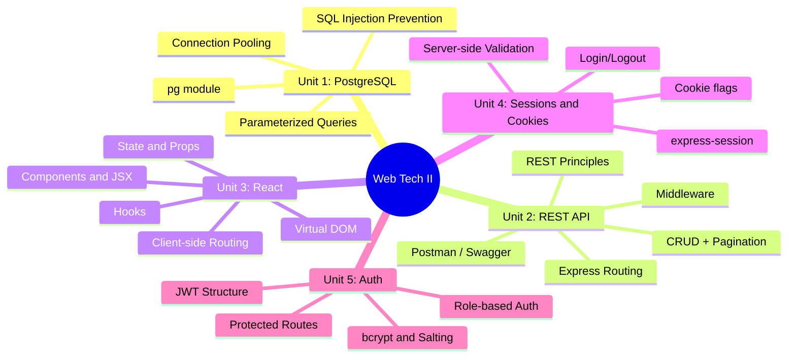
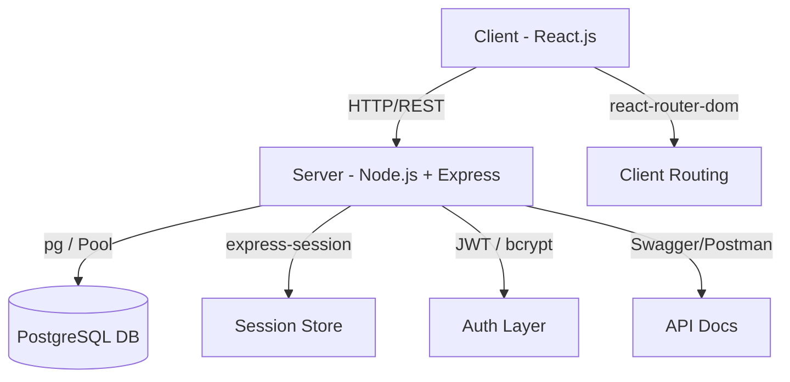

[[00-Dashboard/Home|Home]] | [[02-Semester-VI/Semester-VI-Dashboard|Semester VI]] | [[Overview]] | [[Syllabus]] | [[Unit-1]] | [[Unit-2]] | [[Unit-3]] | [[Unit-4]] | [[Unit-5]] | [[Important-Questions|Imp. Qs]] | [[Revision]] | [[Interview-Prep]]

# CS-353 Web Technology II - Overview

> [!important] Subject at a Glance
> **Code:** CS-353-MJ-T | **Type:** Major Theory | **Semester:** VI
> **Credits:** 3 | **Hours:** ~30 hours theory
> This subject extends Web Technology I by covering **server-side development with Node.js/Express**, **PostgreSQL database connectivity**, **React.js frontend**, and **authentication with JWT and bcrypt**.

---

## Quick Navigation

| File | Description |
|------|-------------|
| [[Syllabus]] | Full syllabus, chapter-wise hours, reference books |
| [[Unit-1]] | Database Connectivity - PostgreSQL, pg module, pooling, SQL injection |
| [[Unit-2]] | CRUD Operations and REST API - Express, routing, middleware, Postman |
| [[Unit-3]] | Introduction to React - Components, Hooks, JSX, routing |
| [[Unit-4]] | Forms, Sessions and Cookies - express-session, cookies, validation |
| [[Unit-5]] | Authentication and Authorization - bcrypt, JWT, RBAC, protected routes |
| [[Important-Questions]] | Chapter-wise important questions for exam |
| [[Revision]] | Quick revision notes and cheat sheets |
| [[Interview-Prep]] | 30+ interview Q&A for placements |

---

## Learning Objectives

By the end of this course, you will be able to:

- [x] Connect a Node.js application to a **PostgreSQL** database using the `pg` module
- [x] Implement **connection pooling** and prevent **SQL injection** using parameterized queries
- [x] Design and build a full **RESTful API** with Express.js following REST principles
- [x] Build interactive UIs with **React.js** using components, hooks, and routing
- [x] Implement **session management** and **cookie-based** authentication
- [x] Secure applications with **bcrypt** password hashing and **JWT** tokens
- [x] Implement **role-based access control (RBAC)** with protected middleware routes

---

## Subject Mind Map

---

## Technology Stack

---

## Chapter Summary

| # | Chapter | Hours | Key Topics |
|---|---------|-------|------------|
| 1 | Database Connectivity | 4H | PostgreSQL, pg, pooling, env vars, SQL injection |
| 2 | CRUD and REST API | 6H | REST, Express, routing, middleware, Swagger |
| 3 | Introduction to React | 10H | JSX, components, hooks, routing, API fetch |
| 4 | Forms, Sessions and Cookies | 7H | express-session, cookies, validation, login |
| 5 | Authentication and Authorization | 3H | bcrypt, JWT, RBAC, protected routes |

---

## Reference Books

| # | Title | Author(s) |
|---|-------|-----------|
| 1 | Web Development with Node and Express | Ethan Brown |
| 2 | Node.js in Action | Cantelon et al. |
| 3 | Learning React | Alex Banks and Eve Porcello |
| 4 | You Don't Know JS | Kyle Simpson |
| 5 | Mastering PostgreSQL | - |

---

## Key Terms Glossary

| Term | Definition |
|------|-----------|
| ==REST== | Representational State Transfer - architectural style for APIs |
| ==pg== | Node.js client library for PostgreSQL |
| ==Connection Pool== | Reusing DB connections for performance |
| ==JSX== | JavaScript XML - React's HTML-like syntax |
| ==Hook== | Functions letting you use state in functional React components |
| ==JWT== | JSON Web Token - stateless authentication token |
| ==bcrypt== | Password hashing algorithm with salt |
| ==Middleware== | Functions that execute between request and response in Express |
| ==RBAC== | Role-Based Access Control |
| ==Parameterized Query== | SQL query using placeholders to prevent injection |

---

## Exam Preparation Timeline

> [!tip] Suggested Study Plan
> - **Week 1:** Unit 1 (DB Connectivity) + Unit 2 (REST API)
> - **Week 2:** Unit 3 (React - largest unit, 10H)
> - **Week 3:** Unit 4 (Sessions/Cookies) + Unit 5 (Auth)
> - **Week 4:** Revision + Important Questions + Interview Prep

---

## Backlinks

- [[00-Dashboard/Home|Semester VI Home]]
- [[Important-Questions]]
- [[Revision]]
- [[Interview-Prep]]
