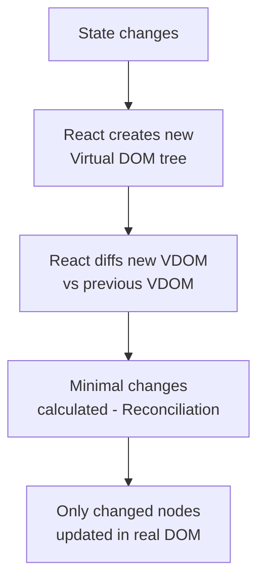

[[Overview]] | [[Syllabus]] | [[Unit-1]] | [[Unit-2]] | [[Unit-3]] | [[Unit-4]] | [[Unit-5]]

---

# CS-353 Web Technology II - Quick Revision

> [!important] Exam Strategy
> - Unit 2 (Components, Props, State) and Unit 3 (Routing) are most heavily tested.
> - Always know the difference between `useState` and `useEffect`.
> - Be able to draw React component lifecycle diagrams.
> - Know how `useEffect` dependency array controls execution.
> - HTTP methods, status codes, and Axios usage are guaranteed short-answer topics.

---

## Unit 1 - Framework Basics

### React vs Angular Quick Comparison

| Feature | React | Angular |
|---------|-------|---------|
| Type | UI Library | Full Framework |
| Language | JavaScript / JSX | TypeScript |
| Data Binding | One-way (props down, events up) | Two-way (`[(ngModel)]`) |
| Architecture | Component tree with hooks | MVC-like with services |
| Rendering | Virtual DOM | Incremental DOM |
| Bundle size | Smaller | Larger |
| Learning curve | Moderate | Steep |
| State management | useState, Context, Redux | Services, NgRx |
| Routing | react-router-dom | @angular/router |
| HTTP calls | fetch, Axios | HttpClient (RxJS) |
| Created by | Meta (Facebook) | Google |

### React Setup Cheat Sheet

```bash
# Create React App
npx create-react-app my-app
cd my-app
npm start       # Development server at localhost:3000
npm run build   # Production build in /build

# Vite (faster alternative)
npm create vite@latest my-app -- --template react
cd my-app
npm install
npm run dev     # Development server at localhost:5173
```

### JSX Rules

| Rule | Correct | Incorrect |
|------|---------|-----------|
| Single root element | `<><div/><div/></>` | `<div/><div/>` |
| className | `className="btn"` | `class="btn"` |
| Self-closing tags | `` | `` |
| JS expressions in `{}` | `{user.name}` | `user.name` |
| Inline styles | `style={{ color: 'red' }}` | `style="color:red"` |
| htmlFor | `htmlFor="email"` | `for="email"` |

---

## Unit 2 - Components, Props, State

### Component Types

```jsx
// Functional Component (modern - use this)
function Welcome({ name, age }) {
  return <h1>Hello, {name}! You are {age} years old.</h1>;
}

// Arrow function component
const Welcome = ({ name }) => <h1>Hello, {name}</h1>;

// Default export
export default Welcome;
// Named export
export { Welcome };
```

### Props Cheat Sheet

```jsx
// Passing props
<Button label="Click Me" onClick={handleClick} disabled={false} count={5} />

// Receiving props (destructuring)
function Button({ label, onClick, disabled = false, count }) {
  return <button onClick={onClick} disabled={disabled}>{label} ({count})</button>;
}

// Props.children
function Card({ children, title }) {
  return <div className="card"><h2>{title}</h2>{children}</div>;
}
// Usage:
<Card title="Info">
  <p>This is the card body content.</p>
</Card>
```

### useState Hook

```jsx
const [state, setState] = useState(initialValue);

// Primitives
const [count, setCount] = useState(0);
const [name, setName] = useState('');
const [isOpen, setIsOpen] = useState(false);

// Updating: direct value
setCount(5);
setName('Alice');

// Updating: functional form (use when new state depends on old)
setCount(prev => prev + 1);
setIsOpen(prev => !prev);

// Objects (must spread to avoid mutation)
const [user, setUser] = useState({ name: '', age: 0 });
setUser(prev => ({ ...prev, name: 'Bob' }));

// Arrays (never mutate directly)
const [items, setItems] = useState([]);
setItems(prev => [...prev, newItem]);         // Add
setItems(prev => prev.filter(i => i.id !== id));  // Remove
setItems(prev => prev.map(i => i.id === id ? {...i, done: true} : i)); // Update
```

### useEffect Hook

```jsx
// Runs AFTER every render
useEffect(() => { ... });

// Runs ONCE (on mount only) - empty dependency array
useEffect(() => {
  fetchData();
}, []);

// Runs when 'userId' changes
useEffect(() => {
  fetchUser(userId);
}, [userId]);

// Cleanup (runs on unmount or before next effect)
useEffect(() => {
  const timer = setInterval(() => setCount(c => c + 1), 1000);
  return () => clearInterval(timer);   // Cleanup function
}, []);

// Async inside useEffect (must create async function inside)
useEffect(() => {
  const loadData = async () => {
    const data = await fetchData();
    setData(data);
  };
  loadData();
}, []);
```

### useEffect Dependency Array Rules

| Dependency Array | When Effect Runs |
|-----------------|-----------------|
| Omitted | After every render |
| `[]` | Only once, after first render (mount) |
| `[a]` | After first render, and when `a` changes |
| `[a, b]` | After first render, and when `a` or `b` changes |

### Other Common Hooks

```jsx
// useRef - mutable reference, does NOT cause re-render
const inputRef = useRef(null);
<input ref={inputRef} />
inputRef.current.focus();  // Access DOM element

// useContext - consume context without prop drilling
const theme = useContext(ThemeContext);

// useCallback - memoize a function reference
const handleClick = useCallback(() => {
  doSomething(id);
}, [id]);  // Recreated only when 'id' changes

// useMemo - memoize an expensive computed value
const filtered = useMemo(() => {
  return items.filter(i => i.active);
}, [items]);  // Recomputed only when 'items' changes
```

### Props vs State Comparison

| Aspect | Props | State |
|--------|-------|-------|
| Ownership | Passed from parent | Owned by the component |
| Mutability | Immutable (read-only in child) | Mutable via `setState` |
| Re-render on change | Yes (parent controls) | Yes (triggers re-render) |
| Default value | Set by parent | Set by `useState(initialValue)` |
| Direction | Top-down (parent to child) | Internal to component |
| Used for | Configuration, data passing | UI state, user input |

---

## Unit 3 - Routing and Navigation

### React Router v6 Cheat Sheet

```jsx
import { BrowserRouter, Routes, Route, Link, NavLink,
         useNavigate, useParams, useSearchParams, Outlet } from 'react-router-dom';

// Setup (wrap entire app)
<BrowserRouter>
  <Routes>
    <Route path="/" element={<Home />} />
    <Route path="/about" element={<About />} />
    <Route path="/users/:id" element={<UserProfile />} />  {/* Dynamic */}
    <Route path="*" element={<NotFound />} />               {/* 404 */}

    {/* Nested routes */}
    <Route path="/dashboard" element={<Dashboard />}>
      <Route index element={<DashboardHome />} />
      <Route path="settings" element={<Settings />} />
    </Route>
  </Routes>
</BrowserRouter>

// Link (no page reload)
<Link to="/about">About</Link>
<Link to={`/users/${id}`}>View Profile</Link>

// NavLink (adds 'active' class when route matches)
<NavLink to="/about" className={({ isActive }) => isActive ? 'active' : ''}>
  About
</NavLink>

// useParams - access dynamic segments
function UserProfile() {
  const { id } = useParams();  // /users/42 → id = '42'
  return <div>User {id}</div>;
}

// useNavigate - programmatic navigation
function LoginForm() {
  const navigate = useNavigate();
  const handleLogin = () => {
    navigate('/dashboard');        // Go forward
    navigate(-1);                  // Go back
    navigate('/login', { replace: true });  // Replace history entry
  };
}

// useSearchParams - query string
// URL: /search?q=react&page=2
const [params, setParams] = useSearchParams();
const query = params.get('q');    // 'react'
const page = params.get('page');  // '2'

// Outlet - renders matched child route
function Dashboard() {
  return (
    <div>
      <Sidebar />
      <Outlet />  {/* Child route renders here */}
    </div>
  );
}

// Protected Route pattern
function PrivateRoute({ children }) {
  const { isAuthenticated } = useAuth();
  return isAuthenticated ? children : <Navigate to="/login" replace />;
}
```

---

## Unit 4 - HTTP Client and API Integration

### Axios Cheat Sheet

```bash
npm install axios
```

```jsx
import axios from 'axios';

// GET
const response = await axios.get('/api/users');
const data = response.data;

// GET with params
const response = await axios.get('/api/users', {
  params: { page: 1, limit: 10 }  // ?page=1&limit=10
});

// POST
const response = await axios.post('/api/users', {
  name: 'Alice', email: 'alice@example.com'
});

// PUT
await axios.put(`/api/users/${id}`, { name: 'Bob' });

// DELETE
await axios.delete(`/api/users/${id}`);

// With headers (e.g., JWT auth)
const config = {
  headers: { Authorization: `Bearer ${token}` }
};
await axios.get('/api/protected', config);

// Axios instance (shared config)
const api = axios.create({
  baseURL: process.env.REACT_APP_API_URL,
  timeout: 5000,
  headers: { 'Content-Type': 'application/json' }
});
```

### useEffect + Axios Data Fetching Pattern

```jsx
import React, { useState, useEffect } from 'react';
import axios from 'axios';

function UserList() {
  const [users, setUsers] = useState([]);
  const [loading, setLoading] = useState(true);
  const [error, setError] = useState(null);

  useEffect(() => {
    const controller = new AbortController();  // Cancel on unmount

    const fetchUsers = async () => {
      try {
        setLoading(true);
        const { data } = await axios.get('/api/users', {
          signal: controller.signal
        });
        setUsers(data);
      } catch (err) {
        if (!axios.isCancel(err)) {
          setError(err.message);
        }
      } finally {
        setLoading(false);
      }
    };

    fetchUsers();

    return () => controller.abort();  // Cleanup: cancel request
  }, []);

  if (loading) return <p>Loading...</p>;
  if (error) return <p>Error: {error}</p>;
  return <ul>{users.map(u => <li key={u.id}>{u.name}</li>)}</ul>;
}
```

### HTTP Status Codes (Must Know)

| Code | Meaning | When Used |
|------|---------|-----------|
| 200 | OK | GET, PUT success |
| 201 | Created | POST success (new resource) |
| 204 | No Content | DELETE success |
| 400 | Bad Request | Validation error |
| 401 | Unauthorized | Not logged in |
| 403 | Forbidden | Logged in but no permission |
| 404 | Not Found | Resource does not exist |
| 409 | Conflict | Duplicate (e.g., email already exists) |
| 422 | Unprocessable Entity | Invalid data format |
| 500 | Internal Server Error | Server crash |

### REST API Design Cheat Sheet

| Action | Method | URL | Body | Response |
|--------|--------|-----|------|----------|
| List all | GET | `/users` | - | 200 + array |
| Get one | GET | `/users/:id` | - | 200 + object |
| Create | POST | `/users` | user data | 201 + created |
| Update all fields | PUT | `/users/:id` | full data | 200 + updated |
| Update some fields | PATCH | `/users/:id` | partial | 200 + updated |
| Delete | DELETE | `/users/:id` | - | 204 |

---

## Unit 5 - Forms, Validation and Deployment

### Controlled Component Pattern

```jsx
// Single field
const [email, setEmail] = useState('');
<input value={email} onChange={(e) => setEmail(e.target.value)} />

// Multiple fields with generic handler
const [form, setForm] = useState({ name: '', email: '', role: 'user' });
const handleChange = (e) => {
  const { name, value, type, checked } = e.target;
  setForm(prev => ({ ...prev, [name]: type === 'checkbox' ? checked : value }));
};
```

### Validation Pattern

```jsx
const validate = (data) => {
  const errors = {};
  if (!data.email) errors.email = 'Required';
  else if (!/^[^\s@]+@[^\s@]+\.[^\s@]+$/.test(data.email)) errors.email = 'Invalid email';
  if (!data.password || data.password.length < 8) errors.password = 'Min 8 characters';
  return errors;
};

// In handleSubmit:
const errs = validate(formData);
if (Object.keys(errs).length > 0) { setErrors(errs); return; }
```

### React Hook Form (Key API)

```jsx
import { useForm } from 'react-hook-form';

const { register, handleSubmit, formState: { errors }, watch, reset } = useForm();

// Register input with validation
<input {...register('email', {
  required: 'Email is required',
  pattern: { value: /^[^\s@]+@[^\s@]+\.[^\s@]+$/, message: 'Invalid email' }
})} />
{errors.email && <span>{errors.email.message}</span>}

// Submit
<form onSubmit={handleSubmit(onSubmit)}>
```

### Deployment Commands

```bash
# Build
npm run build                  # CRA → /build, Vite → /dist

# Test production build locally
npm install -g serve
serve -s build

# Netlify CLI
netlify deploy --prod --dir=build

# Vercel CLI
vercel --prod

# GitHub Pages
npm install --save-dev gh-pages
# Add "homepage" and "deploy" script to package.json
npm run deploy
```

### Environment Variables

| Platform | Prefix | Access |
|----------|--------|--------|
| Create React App | `REACT_APP_` | `process.env.REACT_APP_NAME` |
| Vite | `VITE_` | `import.meta.env.VITE_NAME` |
| Node/Express | None | `process.env.NAME` |

---

## React Rendering and Performance

### Rendering Rules

- A component re-renders when its ==state== changes, its ==props== change, or its ==parent== re-renders.
- `React.memo(Component)` prevents re-render if props have not changed (shallow comparison).
- `useCallback` memoizes a function reference to prevent child re-renders when passing callbacks as props.
- `useMemo` memoizes an expensive computed value.

### Virtual DOM Reconciliation



---

## Key Vocabulary Table

| Term | Definition |
|------|-----------|
| ==JSX== | JavaScript XML - syntax extension that allows HTML-like code in JavaScript |
| ==Virtual DOM== | Lightweight in-memory representation of the real DOM used by React for efficient updates |
| ==Component== | Reusable, independent piece of UI that accepts props and returns JSX |
| ==Props== | Immutable data passed from parent to child component |
| ==State== | Mutable data managed within a component, triggers re-render when changed |
| ==Hook== | Function that lets functional components use state and other React features |
| ==useEffect== | Hook to perform side effects (data fetching, subscriptions, DOM manipulation) |
| ==useRef== | Hook to hold a mutable value that does not trigger re-render |
| ==Context API== | React mechanism to share state globally without prop drilling |
| ==Reconciliation== | React's process of comparing old and new Virtual DOM to compute minimal DOM updates |
| ==Controlled Component== | Form element whose value is controlled by React state |
| ==React Router== | Library providing client-side routing for React single-page applications |
| ==BrowserRouter== | Router implementation using HTML5 History API |
| ==Axios== | Promise-based HTTP client library for browsers and Node.js |
| ==CORS== | Cross-Origin Resource Sharing - HTTP mechanism allowing cross-domain requests |
| ==JWT== | JSON Web Token - compact, stateless token for authentication |
| ==REST== | Representational State Transfer - architectural style for web APIs |

---

[[Overview]] | [[Important-Questions]] | [[Interview-Prep]]
