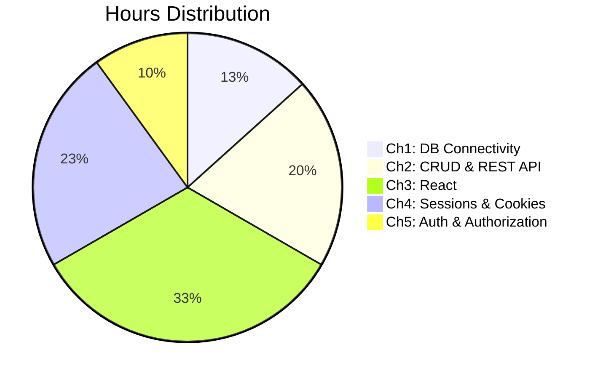

#  CS-353 Web Technology II - Syllabus

> [!note] Course Details
> **Subject Code:** CS-353-MJ-T | **Type:** Major Theory
> **Semester:** VI | **Program:** TY B.Sc. Computer Science
> **Total Hours:** ~30 Hours Theory

---

##  Chapter-wise Syllabus

### Chapter 1: Database Connectivity *(4 Hours)*

> [!note] Unit 1 → [[Unit-1|See detailed notes]]

| Topic | Sub-topics |
|-------|-----------|
| PostgreSQL Integration | Installation, `pg` module setup, basic connection |
| Connection Pooling | `Pool` class, pool configuration, lifecycle |
| Parameterized Queries | Placeholder syntax (`$1, $2`), prepared statements |
| Environment Variables | `dotenv` package, `.env` file, `process.env` |
| SQL Injection Prevention | Why it matters, parameterization as defense |

---

### Chapter 2: CRUD Operations and REST API *(6 Hours)*

> [!note] Unit 2 → [[Unit-2|See detailed notes]]

| Topic | Sub-topics |
|-------|-----------|
| REST Architecture | Principles, statelessness, resource design, URI conventions |
| HTTP Methods & Status Codes | GET, POST, PUT, PATCH, DELETE; 2xx, 4xx, 5xx codes |
| Express Framework | Installation, app setup, `app.listen()` |
| Routing | `app.get/post/put/delete`, route parameters, query strings |
| Middleware | Built-in, third-party, custom middleware, error handling |
| MVC Overview | Model-View-Controller pattern in Express context |
| CRUD Implementation | Create, Read, Update, Delete with PostgreSQL |
| Pagination & Filtering | `LIMIT`, `OFFSET`, query-based filtering |
| API Documentation | Postman (collections, environments), Swagger/OpenAPI |

---

### Chapter 3: Introduction to React *(10 Hours)*

> [!note] Unit 3 → [[Unit-3|See detailed notes]]

| Topic | Sub-topics |
|-------|-----------|
| React Fundamentals | What is React, why React, SPA concept |
| Components | Functional vs class components, component tree |
| JSX | Syntax, expressions, JSX rules, `React.createElement` |
| Rendering | ReactDOM.render, conditional rendering, list rendering |
| Virtual DOM | How it works, reconciliation, diffing algorithm |
| Props | Passing data down, prop types, default props |
| State | `useState` hook, state updates, immutability |
| Props vs State | Key differences, when to use which |
| React Hooks | `useState`, `useEffect`, dependency array, cleanup |
| API Fetching | `fetch()` / `axios` inside `useEffect` |
| Client-side Routing | `react-router-dom`, `<BrowserRouter>`, `<Route>`, `<Link>` |

---

### Chapter 4: Forms, Sessions and Cookies *(7 Hours)*

> [!note] Unit 4 → [[Unit-4|See detailed notes]]

| Topic | Sub-topics |
|-------|-----------|
| Session Management | `express-session` setup, session store, session lifecycle |
| Session Storage | Memory store (dev), Redis/DB store (prod) |
| Cookies | Creating (`res.cookie`), reading (`req.cookies`), deleting |
| Cookie Flags | `Secure`, `HttpOnly`, `SameSite`, `maxAge`/`expires` |
| Form Processing | Handling form data (`express.urlencoded`), `req.body` |
| Server-side Validation | Input validation, error messaging |
| Login/Logout | Session-based login flow, `req.session.destroy()` |
| Session vs Token | Comparison: stateful vs stateless authentication |

---

### Chapter 5: Authentication and Authorization *(3 Hours)*

> [!note] Unit 5 → [[Unit-5|See detailed notes]]

| Topic | Sub-topics |
|-------|-----------|
| Password Hashing | `bcrypt` library, hashing process |
| Salting | What is salt, why salting, salt rounds |
| Verification | `bcrypt.compare()`, timing-safe comparison |
| JWT Structure | Header, Payload, Signature - base64url encoded |
| JWT Lifecycle | Generation (`jwt.sign()`), validation (`jwt.verify()`), expiry |
| Role-based Authorization | Roles in payload, role middleware |
| Protected Routes | Middleware checking JWT/session before route handler |

---

##  Detailed Chapter Hours

---

##  Reference Books

| # | Book Title | Author | Publisher |
|---|-----------|--------|-----------|
| 1 | Web Development with Node and Express (2nd ed.) | Ethan Brown | O'Reilly |
| 2 | Node.js in Action | Cantelon, Harter, Holowaychuk, Rajlich | Manning |
| 3 | Learning React (2nd ed.) | Alex Banks & Eve Porcello | O'Reilly |
| 4 | You Don't Know JS (series) | Kyle Simpson | O'Reilly |
| 5 | Mastering PostgreSQL | - | - |

---

##  Online Resources

- **Node.js Docs:** https://nodejs.org/docs
- **Express.js:** https://expressjs.com
- **React Docs:** https://react.dev
- **PostgreSQL Docs:** https://www.postgresql.org/docs
- **JWT.io:** https://jwt.io
- **Swagger/OpenAPI:** https://swagger.io

---

##  Related Notes

- [[Overview|Subject Overview]]
- [[Unit-1|Unit 1: Database Connectivity]]
- [[Unit-2|Unit 2: CRUD & REST API]]
- [[Unit-3|Unit 3: Introduction to React]]
- [[Unit-4|Unit 4: Forms, Sessions & Cookies]]
- [[Unit-5|Unit 5: Authentication & Authorization]]
- [[Important-Questions]]
- [[Revision]]
- [[Interview-Prep]]
