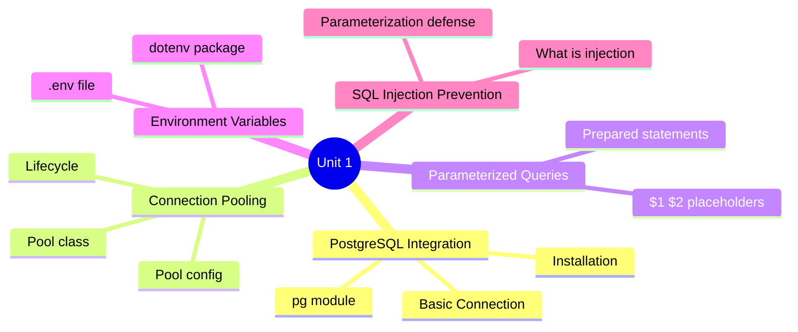
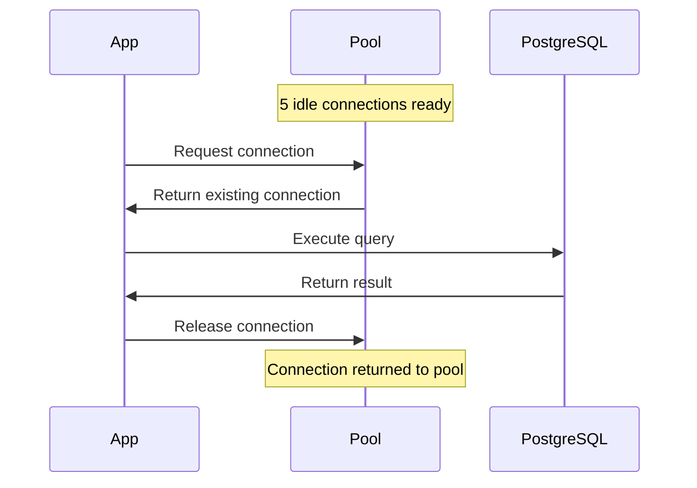
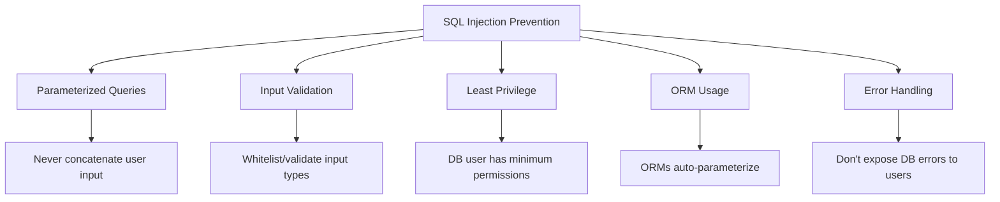

# ️ Unit 1: Database Connectivity *(4 Hours)*

> [!important] Learning Objectives
> After this unit, you should be able to:
> - Install and configure PostgreSQL and the `pg` Node.js module
> - Create database connections and implement connection pooling
> - Write parameterized queries to prevent SQL injection
> - Use environment variables with `dotenv` to secure credentials

---

##  Topics at a Glance



---

## 1.1 PostgreSQL Integration

###  What is PostgreSQL?

==PostgreSQL== (Postgres) is a powerful, open-source **object-relational database system** known for its reliability, feature richness, and standards compliance. It supports:
- ACID transactions
- Complex queries and joins
- JSON/JSONB data types
- Full-text search
- Stored procedures

> [!note] PostgreSQL vs MySQL
> PostgreSQL is more standards-compliant and better for complex queries. MySQL is simpler and faster for read-heavy operations.

---

###  Installation

**Linux (Ubuntu/Debian):**
```bash
sudo apt update
sudo apt install postgresql postgresql-contrib
sudo systemctl start postgresql
sudo systemctl enable postgresql

# Access PostgreSQL shell
sudo -u postgres psql
```

**Create a database and user:**
```sql
CREATE DATABASE myapp;
CREATE USER myuser WITH ENCRYPTED PASSWORD 'mypassword';
GRANT ALL PRIVILEGES ON DATABASE myapp TO myuser;
\q
```

---

###  The `pg` Module

==pg== is the official Node.js client library for PostgreSQL.

```bash
# Initialize project and install pg
npm init -y
npm install pg
```

**Basic Connection (Client):**
```javascript
const { Client } = require('pg');

const client = new Client({
  host: 'localhost',
  port: 5432,
  database: 'myapp',
  user: 'myuser',
  password: 'mypassword'
});

async function connectAndQuery() {
  await client.connect();
  console.log('Connected to PostgreSQL!');
  
  const result = await client.query('SELECT NOW()');
  console.log('Current time:', result.rows[0].now);
  
  await client.end();
}

connectAndQuery().catch(console.error);
```

> [!warning] Client vs Pool
> `Client` creates a single connection - suitable for **one-off scripts**. For web servers, always use `Pool` to handle multiple concurrent requests.

---

## 1.2 Connection Pooling

###  What is Connection Pooling?

==Connection Pooling== is the technique of maintaining a **cache of database connections** so that connections can be reused when future requests to the database are required.

**Why pooling?**
- Opening a new DB connection for every request is **expensive** (time + resources)
- A pool maintains `N` connections ready to use
- Requests borrow from the pool and return connections after use



---

###  Using Pool

```javascript
const { Pool } = require('pg');

const pool = new Pool({
  host: process.env.DB_HOST,
  port: process.env.DB_PORT || 5432,
  database: process.env.DB_NAME,
  user: process.env.DB_USER,
  password: process.env.DB_PASSWORD,
  max: 10,                // maximum connections in pool
  idleTimeoutMillis: 30000,  // close idle connections after 30s
  connectionTimeoutMillis: 2000  // error if no connection in 2s
});

// Query using pool (auto-checks out and releases connection)
async function getUsers() {
  try {
    const result = await pool.query('SELECT * FROM users');
    return result.rows;
  } catch (err) {
    console.error('Database error:', err);
    throw err;
  }
}

// Explicit checkout for transactions
async function transferFunds(fromId, toId, amount) {
  const client = await pool.connect();  // checkout
  try {
    await client.query('BEGIN');
    await client.query('UPDATE accounts SET balance = balance - $1 WHERE id = $2', [amount, fromId]);
    await client.query('UPDATE accounts SET balance = balance + $1 WHERE id = $2', [amount, toId]);
    await client.query('COMMIT');
  } catch (err) {
    await client.query('ROLLBACK');
    throw err;
  } finally {
    client.release();  // always release!
  }
}
```

###  Pool Configuration Options

| Option | Default | Description |
|--------|---------|-------------|
| `max` | 10 | Max connections in pool |
| `min` | 0 | Min connections to keep open |
| `idleTimeoutMillis` | 10000 | Close idle connections after ms |
| `connectionTimeoutMillis` | 0 | Timeout waiting for connection |
| `maxUses` | Infinity | Max uses per connection before recycling |

---

## 1.3 Parameterized Queries

###  What are Parameterized Queries?

==Parameterized queries== (also called **prepared statements**) separate SQL code from user-supplied data using **placeholders** (`$1`, `$2`, etc. in PostgreSQL).

```javascript
//  SAFE - Parameterized query
const result = await pool.query(
  'SELECT * FROM users WHERE email = $1 AND password = $2',
  [email, password]   // values passed separately
);

//  UNSAFE - String concatenation (SQL Injection risk!)
const result = await pool.query(
  `SELECT * FROM users WHERE email = '${email}' AND password = '${password}'`
);
```

###  PostgreSQL Placeholder Syntax

```javascript
// Single parameter
await pool.query('SELECT * FROM users WHERE id = $1', [userId]);

// Multiple parameters
await pool.query(
  'INSERT INTO products (name, price, category) VALUES ($1, $2, $3)',
  [name, price, category]
);

// UPDATE with multiple parameters
await pool.query(
  'UPDATE users SET name = $1, email = $2 WHERE id = $3',
  [newName, newEmail, userId]
);

// DELETE
await pool.query('DELETE FROM orders WHERE id = $1 AND user_id = $2', [orderId, userId]);
```

###  Query Result Object

```javascript
const result = await pool.query('SELECT * FROM users');
// result object:
// result.rows      → Array of row objects
// result.rowCount  → Number of rows returned/affected
// result.fields    → Column metadata
// result.command   → SQL command type (SELECT, INSERT, etc.)

console.log(result.rows);       // [{id: 1, name: 'Alice'}, ...]
console.log(result.rowCount);   // 5
console.log(result.rows[0].name); // 'Alice'
```

---

## 1.4 Environment Variables

###  Why Environment Variables?

> [!warning] Security Risk
> **Never** hardcode database credentials, API keys, or secrets in source code. If pushed to GitHub, they are publicly exposed.

==Environment variables== store sensitive configuration **outside** the code.

###  The `dotenv` Package

```bash
npm install dotenv
```

**Create `.env` file (project root):**
```env
# Database Configuration
DB_HOST=localhost
DB_PORT=5432
DB_NAME=myapp
DB_USER=myuser
DB_PASSWORD=supersecretpassword

# App Configuration
PORT=3000
NODE_ENV=development

# JWT
JWT_SECRET=myjwtsecretkey123
JWT_EXPIRES_IN=1h
```

**Load in your app (at the very top of `app.js` or `server.js`):**
```javascript
require('dotenv').config();   // Load .env into process.env

const pool = new Pool({
  host: process.env.DB_HOST,
  port: process.env.DB_PORT,
  database: process.env.DB_NAME,
  user: process.env.DB_USER,
  password: process.env.DB_PASSWORD
});
```

**`.gitignore` - Always exclude `.env`:**
```gitignore
node_modules/
.env
.env.local
.env.production
```

> [!tip] .env.example
> Create a `.env.example` file with dummy values to document required variables without exposing secrets:
> ```env
> DB_HOST=localhost
> DB_PORT=5432
> DB_NAME=your_db_name
> DB_USER=your_username
> DB_PASSWORD=your_password
> ```

---

## 1.5 SQL Injection Prevention

###  What is SQL Injection?

==SQL Injection== is an attack where malicious SQL code is inserted into input fields, manipulating the database query.

**Classic Example:**
```sql
-- Input: username = "admin'--"
-- Vulnerable query:
SELECT * FROM users WHERE username = 'admin'--' AND password = '...'
-- The -- comments out the password check!
-- Result: attacker logs in as admin without password
```

**Worst case:**
```sql
-- Input: "'; DROP TABLE users; --"
-- Vulnerable query:
SELECT * FROM users WHERE name = ''; DROP TABLE users; --'
-- Deletes the entire users table!
```

###  Prevention Strategies



**Complete Prevention Example:**
```javascript
//  CORRECT: Parameterized query
app.post('/login', async (req, res) => {
  const { username, password } = req.body;
  
  // Input validation
  if (!username || !password) {
    return res.status(400).json({ error: 'Username and password required' });
  }
  
  // Parameterized query - injection impossible
  const result = await pool.query(
    'SELECT * FROM users WHERE username = $1',
    [username]  // username goes as data, not code
  );
  
  if (result.rows.length === 0) {
    return res.status(401).json({ error: 'Invalid credentials' });
  }
  
  const user = result.rows[0];
  // Then verify password with bcrypt...
});
```

| Defense Layer | How it Works |
|--------------|-------------|
| ==Parameterized Queries== | Separates SQL structure from data |
| Input Validation | Rejects unexpected input types/formats |
| Least Privilege DB User | DB user can only do what's necessary |
| Web Application Firewall | Detects and blocks injection patterns |
| Error Masking | Don't show raw DB errors to users |

---

##  Practical: db.js Module

```javascript
// db.js - Centralized database configuration
require('dotenv').config();
const { Pool } = require('pg');

const pool = new Pool({
  host: process.env.DB_HOST || 'localhost',
  port: parseInt(process.env.DB_PORT) || 5432,
  database: process.env.DB_NAME,
  user: process.env.DB_USER,
  password: process.env.DB_PASSWORD,
  max: 10,
  idleTimeoutMillis: 30000,
  connectionTimeoutMillis: 2000
});

// Test connection on startup
pool.on('connect', () => {
  console.log('New client connected to PostgreSQL pool');
});

pool.on('error', (err) => {
  console.error('Unexpected error on idle client', err);
  process.exit(-1);
});

module.exports = pool;
```

```javascript
// Using db.js in other files
const pool = require('./db');

async function getAllUsers() {
  const result = await pool.query('SELECT id, name, email FROM users ORDER BY id');
  return result.rows;
}

async function getUserById(id) {
  const result = await pool.query('SELECT * FROM users WHERE id = $1', [id]);
  return result.rows[0];
}

module.exports = { getAllUsers, getUserById };
```

---

##  Key Definitions

| Term | Definition |
|------|-----------|
| ==PostgreSQL== | Open-source relational database management system |
| ==pg module== | Official Node.js PostgreSQL client library |
| ==Connection Pool== | Cache of reusable DB connections managed by `Pool` class |
| ==Parameterized Query== | SQL with `$1`, `$2` placeholders; user data passed separately |
| ==SQL Injection== | Attack inserting malicious SQL through unsanitized input |
| ==dotenv== | npm package to load `.env` file into `process.env` |
| ==process.env== | Node.js object holding environment variables |

---

##  Practice Questions

> [!question] Short Answer Questions
> 1. What is the difference between `Client` and `Pool` in the `pg` module?
> 2. Why should database credentials be stored in environment variables?
> 3. What is SQL Injection? Give an example.
> 4. How does a parameterized query prevent SQL injection?
> 5. What is connection pooling and why is it important for web servers?
> 6. What does the `max` property in Pool configuration control?
> 7. Why must `.env` files be added to `.gitignore`?
> 8. What does `client.release()` do in connection pooling?

---

##  Navigation

- [[Overview|← Overview]]
- [[Syllabus| Syllabus]]
- [[Unit-2|Unit 2: CRUD & REST API →]]
- [[Important-Questions| Important Questions]]
- [[Revision| Revision]]
