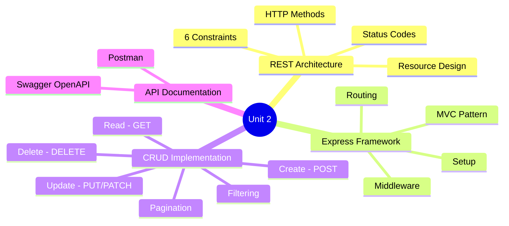
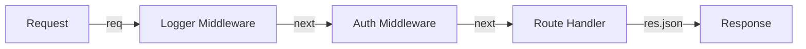

[[00-Dashboard/Home|Home]] | [[02-Semester-VI/Semester-VI-Dashboard|Semester VI]] | [[Overview]] | [[Syllabus]] | [[Unit-1]] | [[Unit-2]] | [[Unit-3]] | [[Unit-4]] | [[Unit-5]] | [[Important-Questions|Imp. Qs]] | [[Revision]] | [[Interview-Prep]]


# Unit 2: CRUD Operations and REST API *(6 Hours)*

> [!important] Learning Objectives
> After this unit, you should be able to:
> - Explain REST architecture principles and design RESTful URIs
> - Build a complete Express.js application with routing and middleware
> - Implement CRUD operations connected to PostgreSQL
> - Add pagination and filtering to API endpoints
> - Document APIs with Postman and Swagger/OpenAPI

---

## Topics at a Glance



---

## 2.1 REST Architecture

### What is REST?

==REST== (Representational State Transfer) is an **architectural style** for designing networked applications. It was defined by **Roy Fielding** in his 2000 doctoral dissertation.

A RESTful API uses **HTTP requests** to perform CRUD operations on resources.

### The 6 REST Constraints

| Constraint | Description |
|-----------|-------------|
| ==Client-Server== | Separation of concerns - UI and data storage are separate |
| ==Stateless== | Each request contains ALL information needed; server stores no session state |
| ==Cacheable== | Responses must define whether they are cacheable |
| ==Uniform Interface== | Consistent interface: resource identification via URIs, standard HTTP methods |
| ==Layered System== | Client can't tell if it's connected directly to server or intermediary |
| ==Code on Demand== (optional) | Server can transfer executable code to client |

> [!important] Statelessness
> This is the most critical constraint. Each HTTP request is **completely independent** - the server doesn't remember previous requests. Authentication tokens must be sent with every request.

---

### REST Resource Design

**Resources are nouns, not verbs:**

|  Bad (RPC-style) |  Good (REST-style) |
|-------------------|---------------------|
| `/getUsers` | `/users` |
| `/createUser` | `/users` (POST) |
| `/deleteUser/5` | `/users/5` (DELETE) |
| `/getUserOrders` | `/users/5/orders` |
| `/searchProducts` | `/products?search=term` |

**URI Naming Conventions:**
```
Collection:  /users            (plural, lowercase)
Instance:    /users/42         (specific resource by ID)
Nested:      /users/42/orders  (sub-resource)
Query:       /products?category=electronics&sort=price&page=2
```

---

### HTTP Methods (Verbs)

| Method | CRUD | Safe? | Idempotent? | Usage |
|--------|------|-------|-------------|-------|
| ==GET== | Read |  Yes |  Yes | Retrieve resource(s) |
| ==POST== | Create |  No |  No | Create new resource |
| ==PUT== | Update (full) |  No |  Yes | Replace entire resource |
| ==PATCH== | Update (partial) |  No |  No | Update specific fields |
| ==DELETE== | Delete |  No |  Yes | Remove resource |

> [!note] Safe vs Idempotent
> - **Safe**: doesn't modify data (GET is safe)
> - **Idempotent**: same result when called multiple times (DELETE /users/5 called 3 times - same result: resource is gone)

---

### HTTP Status Codes

| Range | Category | Common Codes |
|-------|---------|-------------|
| 2xx | ==Success== | 200 OK, 201 Created, 204 No Content |
| 3xx | Redirection | 301 Moved Permanently, 304 Not Modified |
| 4xx | ==Client Error== | 400 Bad Request, 401 Unauthorized, 403 Forbidden, 404 Not Found, 409 Conflict, 422 Unprocessable Entity |
| 5xx | ==Server Error== | 500 Internal Server Error, 503 Service Unavailable |

**When to use which:**
```
GET  /users         → 200 OK (with data)
POST /users         → 201 Created (with new resource)
PUT  /users/5       → 200 OK or 204 No Content
DELETE /users/5     → 204 No Content
GET  /users/999     → 404 Not Found
POST /users (bad data) → 400 Bad Request
POST /users (unauthorized) → 401 Unauthorized
```

---

## 2.2 Express Framework

### Setup

```bash
npm init -y
npm install express pg dotenv
npm install --save-dev nodemon
```

**package.json scripts:**
```json
{
  "scripts": {
    "start": "node server.js",
    "dev": "nodemon server.js"
  }
}
```

### Basic Express Application

```javascript
// server.js
require('dotenv').config();
const express = require('express');
const app = express();
const PORT = process.env.PORT || 3000;

// Built-in middleware
app.use(express.json());                         // Parse JSON bodies
app.use(express.urlencoded({ extended: true })); // Parse form data
app.use(express.static('public'));               // Serve static files

// Routes
app.use('/api/users', require('./routes/users'));
app.use('/api/products', require('./routes/products'));

// 404 handler
app.use((req, res) => {
  res.status(404).json({ error: 'Route not found' });
});

// Global error handler
app.use((err, req, res, next) => {
  console.error(err.stack);
  res.status(err.status || 500).json({ error: err.message || 'Internal server error' });
});

app.listen(PORT, () => {
  console.log(`Server running on http://localhost:${PORT}`);
});
```

---

### Express Routing

```javascript
// routes/users.js
const express = require('express');
const router = express.Router();
const userController = require('../controllers/userController');

// Collection routes
router.get('/', userController.getAllUsers);        // GET /api/users
router.post('/', userController.createUser);       // POST /api/users

// Instance routes
router.get('/:id', userController.getUserById);    // GET /api/users/42
router.put('/:id', userController.updateUser);     // PUT /api/users/42
router.patch('/:id', userController.patchUser);    // PATCH /api/users/42
router.delete('/:id', userController.deleteUser);  // DELETE /api/users/42

// Nested routes
router.get('/:id/orders', userController.getUserOrders); // GET /api/users/42/orders

module.exports = router;
```

**Accessing route data:**
```javascript
// Route parameters: /users/:id → req.params.id
// Query strings: /users?page=2&limit=10 → req.query.page, req.query.limit
// Request body: POST /users {name: "Alice"} → req.body.name
// Headers: req.headers['authorization']
```

---

### Middleware

==Middleware== functions have access to `(req, res, next)` and can:
1. Execute any code
2. Modify `req` and `res`
3. End the request-response cycle
4. Call the next middleware with `next()`



**Types of Middleware:**

```javascript
// 1. Application-level middleware (applies to all routes)
app.use((req, res, next) => {
  console.log(`${req.method} ${req.url} - ${new Date().toISOString()}`);
  next();  // MUST call next() or request hangs!
});

// 2. Router-level middleware (applies to specific router)
router.use(authMiddleware);

// 3. Built-in middleware
app.use(express.json());
app.use(express.static('public'));

// 4. Third-party middleware
const cors = require('cors');
app.use(cors());

// 5. Error-handling middleware (4 params)
app.use((err, req, res, next) => {
  res.status(500).json({ error: err.message });
});
```

**Custom Auth Middleware:**
```javascript
// middleware/auth.js
function authMiddleware(req, res, next) {
  const token = req.headers['authorization']?.split(' ')[1];
  
  if (!token) {
    return res.status(401).json({ error: 'Access token required' });
  }
  
  try {
    const decoded = jwt.verify(token, process.env.JWT_SECRET);
    req.user = decoded;  // Attach user to request
    next();
  } catch (err) {
    return res.status(401).json({ error: 'Invalid or expired token' });
  }
}

module.exports = authMiddleware;
```

---

### MVC Pattern in Express

==MVC (Model-View-Controller)== separates an application into three components:

```
Project Structure (MVC):
├── models/
│   └── userModel.js      ← Database queries (Model)
├── views/                ← Not used for REST APIs (JSON = View)
├── controllers/
│   └── userController.js ← Business logic (Controller)
├── routes/
│   └── users.js          ← URL routing
├── middleware/
│   ├── auth.js
│   └── validate.js
└── server.js
```

```javascript
// models/userModel.js (Model - database layer)
const pool = require('../db');

const getAllUsers = async (limit = 10, offset = 0) => {
  const result = await pool.query(
    'SELECT id, name, email, created_at FROM users ORDER BY id LIMIT $1 OFFSET $2',
    [limit, offset]
  );
  return result.rows;
};

const getUserById = async (id) => {
  const result = await pool.query('SELECT * FROM users WHERE id = $1', [id]);
  return result.rows[0];
};

const createUser = async (name, email, hashedPassword) => {
  const result = await pool.query(
    'INSERT INTO users (name, email, password) VALUES ($1, $2, $3) RETURNING id, name, email',
    [name, email, hashedPassword]
  );
  return result.rows[0];
};

module.exports = { getAllUsers, getUserById, createUser };
```

```javascript
// controllers/userController.js (Controller - business logic)
const User = require('../models/userModel');

exports.getAllUsers = async (req, res, next) => {
  try {
    const page = parseInt(req.query.page) || 1;
    const limit = parseInt(req.query.limit) || 10;
    const offset = (page - 1) * limit;
    
    const users = await User.getAllUsers(limit, offset);
    res.status(200).json({
      success: true,
      page,
      limit,
      data: users
    });
  } catch (err) {
    next(err);  // Pass to error middleware
  }
};

exports.getUserById = async (req, res, next) => {
  try {
    const user = await User.getUserById(req.params.id);
    if (!user) {
      return res.status(404).json({ error: 'User not found' });
    }
    res.status(200).json({ success: true, data: user });
  } catch (err) {
    next(err);
  }
};
```

---

## 2.3 CRUD Implementation

### Complete CRUD Example (Products API)

```javascript
// controllers/productController.js

// CREATE - POST /api/products
exports.createProduct = async (req, res, next) => {
  try {
    const { name, price, category, description } = req.body;
    
    if (!name || !price) {
      return res.status(400).json({ error: 'Name and price are required' });
    }
    
    const result = await pool.query(
      'INSERT INTO products (name, price, category, description) VALUES ($1, $2, $3, $4) RETURNING *',
      [name, price, category, description]
    );
    
    res.status(201).json({ success: true, data: result.rows[0] });
  } catch (err) {
    next(err);
  }
};

// READ ALL - GET /api/products?page=1&limit=10&category=electronics&sort=price
exports.getAllProducts = async (req, res, next) => {
  try {
    const page = parseInt(req.query.page) || 1;
    const limit = parseInt(req.query.limit) || 10;
    const offset = (page - 1) * limit;
    const { category, search, sort } = req.query;
    
    let query = 'SELECT * FROM products WHERE 1=1';
    const params = [];
    let paramIndex = 1;
    
    if (category) {
      query += ` AND category = $${paramIndex++}`;
      params.push(category);
    }
    
    if (search) {
      query += ` AND name ILIKE $${paramIndex++}`;
      params.push(`%${search}%`);
    }
    
    if (sort === 'price') query += ' ORDER BY price ASC';
    else query += ' ORDER BY created_at DESC';
    
    query += ` LIMIT $${paramIndex++} OFFSET $${paramIndex}`;
    params.push(limit, offset);
    
    const result = await pool.query(query, params);
    const countResult = await pool.query('SELECT COUNT(*) FROM products');
    const total = parseInt(countResult.rows[0].count);
    
    res.status(200).json({
      success: true,
      data: result.rows,
      pagination: {
        page, limit, total,
        totalPages: Math.ceil(total / limit),
        hasNext: page * limit < total,
        hasPrev: page > 1
      }
    });
  } catch (err) {
    next(err);
  }
};

// UPDATE - PUT /api/products/:id
exports.updateProduct = async (req, res, next) => {
  try {
    const { name, price, category, description } = req.body;
    const result = await pool.query(
      'UPDATE products SET name=$1, price=$2, category=$3, description=$4, updated_at=NOW() WHERE id=$5 RETURNING *',
      [name, price, category, description, req.params.id]
    );
    
    if (result.rowCount === 0) {
      return res.status(404).json({ error: 'Product not found' });
    }
    
    res.status(200).json({ success: true, data: result.rows[0] });
  } catch (err) {
    next(err);
  }
};

// DELETE - DELETE /api/products/:id
exports.deleteProduct = async (req, res, next) => {
  try {
    const result = await pool.query(
      'DELETE FROM products WHERE id = $1',
      [req.params.id]
    );
    
    if (result.rowCount === 0) {
      return res.status(404).json({ error: 'Product not found' });
    }
    
    res.status(204).send();  // 204 No Content - no body
  } catch (err) {
    next(err);
  }
};
```

---

## 2.4 Pagination & Filtering

### Pagination Strategy

==Pagination== divides large datasets into smaller pages.

**Offset-based pagination** (most common):
```
GET /api/products?page=2&limit=10
→ LIMIT 10 OFFSET 10  (skip first 10, get next 10)
```

**Pagination response structure:**
```json
{
  "success": true,
  "data": [...],
  "pagination": {
    "page": 2,
    "limit": 10,
    "total": 45,
    "totalPages": 5,
    "hasNext": true,
    "hasPrev": true
  }
}
```

**Filtering:**
```
GET /api/products?category=electronics&minPrice=100&maxPrice=500&search=laptop&sort=price&order=asc
```

---

## 2.5 API Documentation

### Postman

==Postman== is a collaboration platform for API development and testing.

**Key features:**
- Send HTTP requests (GET, POST, PUT, DELETE)
- Organize requests in **Collections**
- Use **Environments** for different base URLs (dev/staging/prod)
- Write **test scripts** in JavaScript
- Generate API documentation

**Postman request example:**
```
Method: POST
URL: http://localhost:3000/api/users
Headers:
  Content-Type: application/json
  Authorization: Bearer <jwt_token>
Body (raw JSON):
{
  "name": "Alice Johnson",
  "email": "alice@example.com",
  "password": "SecurePass123"
}
```

---

### Swagger / OpenAPI

==Swagger/OpenAPI== is a specification for describing REST APIs in a machine-readable format (YAML/JSON).

```bash
npm install swagger-ui-express swagger-jsdoc
```

```javascript
// swagger.js
const swaggerJSDoc = require('swagger-jsdoc');

const options = {
  definition: {
    openapi: '3.0.0',
    info: {
      title: 'My API',
      version: '1.0.0',
      description: 'A simple CRUD API'
    },
    servers: [{ url: 'http://localhost:3000' }]
  },
  apis: ['./routes/*.js']  // files with JSDoc comments
};

module.exports = swaggerJSDoc(options);
```

```javascript
// In your route file - JSDoc comments for Swagger:
/**
 * @swagger
 * /api/users:
 *   get:
 *     summary: Get all users
 *     parameters:
 *       - in: query
 *         name: page
 *         schema:
 *           type: integer
 *         description: Page number
 *     responses:
 *       200:
 *         description: List of users
 *       500:
 *         description: Server error
 */
router.get('/', userController.getAllUsers);
```

---

## Key Definitions

| Term | Definition |
|------|-----------|
| ==REST== | Architectural style using HTTP for stateless client-server communication |
| ==Stateless== | Server doesn't store session state between requests |
| ==Express== | Minimal, fast Node.js web framework |
| ==Middleware== | Function processing requests between receipt and response |
| ==MVC== | Model-View-Controller - separation of concerns pattern |
| ==CRUD== | Create, Read, Update, Delete - four basic database operations |
| ==Pagination== | Dividing results into pages using LIMIT and OFFSET |
| ==Idempotent== | Same result when operation is applied multiple times |
| ==Postman== | API testing and documentation tool |
| ==Swagger/OpenAPI== | Standard for REST API documentation |
| ==Route Parameter== | Variable in URL path (`/users/:id`) |
| ==Query String== | URL parameters after `?` (`/users?page=2`) |

---

## Practice Questions

> [!question] Short Answer Questions
> 1. What are the 6 constraints of REST architecture?
> 2. Why is statelessness important in REST APIs?
> 3. Differentiate between PUT and PATCH HTTP methods.
> 4. What HTTP status codes should be used for: successful creation, not found, unauthorized?
> 5. What is middleware in Express? Write an example of a custom logging middleware.
> 6. Explain the MVC pattern with a directory structure example.
> 7. How does pagination work? Write SQL with LIMIT and OFFSET.
> 8. What is the difference between route parameters and query strings?
> 9. What is Swagger/OpenAPI and why is it useful?
> 10. Explain safe vs idempotent HTTP methods with examples.

---

## Navigation

- [[Unit-1|← Unit 1: Database Connectivity]]
- [[Syllabus| Syllabus]]
- [[Unit-3|Unit 3: Introduction to React →]]
- [[Important-Questions| Important Questions]]
- [[Revision| Revision]]
