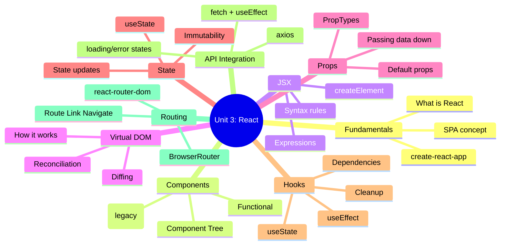
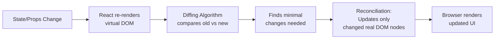

# ️ Unit 3: Introduction to React *(10 Hours)*

> [!important] Learning Objectives
> After this unit, you should be able to:
> - Explain React's core concepts: components, JSX, virtual DOM
> - Build functional components with props and state
> - Use React Hooks: `useState` and `useEffect`
> - Fetch data from an API inside `useEffect`
> - Implement client-side routing with `react-router-dom`

---

##  Topics at a Glance



---

## 3.1 What is React?

==React== is an open-source **JavaScript library** for building user interfaces, developed by **Facebook (Meta)** and released in 2013.

**Key characteristics:**
- **Component-based**: UI broken into reusable, isolated pieces
- **Declarative**: Describe what you want, React handles how
- **Virtual DOM**: Efficiently updates only what's necessary
- **Unidirectional data flow**: Data flows from parent to child
- **SPA (Single Page Application)**: One HTML page, dynamic content

**SPA vs MPA:**

| | Multi-Page App (MPA) | Single-Page App (SPA) |
|---|---|---|
| Navigation | Full page reload | Client-side routing |
| Speed | Slower | Faster after initial load |
| SEO | Better | Needs SSR for best SEO |
| Example | Traditional website | Gmail, Twitter, React app |

---

## 3.2 Setting Up React

```bash
# Option 1: Create React App (CRA)
npx create-react-app my-app
cd my-app
npm start

# Option 2: Vite (faster, recommended for new projects)
npm create vite@latest my-app -- --template react
cd my-app
npm install
npm run dev
```

**Project structure:**
```
my-app/
├── public/
│   └── index.html      ← Single HTML page
├── src/
│   ├── App.js           ← Root component
│   ├── index.js         ← Entry point (ReactDOM.render)
│   └── components/
│       └── Header.js
└── package.json
```

---

## 3.3 JSX - JavaScript XML

==JSX== (JavaScript XML) is a **syntax extension** for JavaScript that allows writing HTML-like code inside JavaScript files.

```jsx
// JSX
const element = <h1 className="title">Hello, {name}!</h1>;

// What Babel compiles it to (pure JS):
const element = React.createElement(
  'h1',
  { className: 'title' },
  'Hello, ' + name + '!'
);
```

###  JSX Rules

```jsx
// 1. Return a single root element (or Fragment)
return (
  <div>              {/* Single root */}
    <h1>Title</h1>
    <p>Content</p>
  </div>
);

// Or use Fragment (no extra DOM node)
return (
  <>
    <h1>Title</h1>
    <p>Content</p>
  </>
);

// 2. Use className instead of class
<div className="container">...</div>

// 3. Self-close single tags

<br />
<input type="text" />

// 4. Embed JavaScript expressions with {}
const name = "Alice";
<p>Hello, {name}!</p>
<p>2 + 2 = {2 + 2}</p>
<p>Today: {new Date().toLocaleDateString()}</p>

// 5. Inline styles as objects
<p style={{ color: 'red', fontSize: '16px' }}>Red text</p>

// 6. CamelCase for HTML attributes
<input onChange={handleChange} />    // not onchange
<label htmlFor="email">...</label>  // not for
```

---

## 3.4 Components

###  Functional Components (Modern)

```jsx
// Simple functional component
function Greeting({ name, age }) {
  return (
    <div>
      <h1>Hello, {name}!</h1>
      <p>Age: {age}</p>
    </div>
  );
}

// Arrow function syntax
const Button = ({ label, onClick, disabled = false }) => (
  <button onClick={onClick} disabled={disabled}>
    {label}
  </button>
);

// Usage
<Greeting name="Alice" age={25} />
<Button label="Submit" onClick={() => console.log('clicked')} />
```

###  Conditional Rendering

```jsx
function UserStatus({ isLoggedIn, username }) {
  // Using ternary
  return (
    <div>
      {isLoggedIn ? (
        <p>Welcome, {username}!</p>
      ) : (
        <p>Please log in.</p>
      )}
      
      {/* Short-circuit (&&) - only renders if true */}
      {isLoggedIn && <button>Logout</button>}
    </div>
  );
}
```

###  List Rendering

```jsx
function ProductList({ products }) {
  return (
    <ul>
      {products.map(product => (
        <li key={product.id}>  {/* key is REQUIRED */}
          {product.name} - ₹{product.price}
        </li>
      ))}
    </ul>
  );
}

// Usage
const products = [
  { id: 1, name: "Laptop", price: 50000 },
  { id: 2, name: "Mouse", price: 800 }
];
<ProductList products={products} />
```

> [!warning] Keys in Lists
> Always provide a unique `key` prop when rendering lists. React uses keys to efficiently update only changed items. Never use array index as key if list can be reordered.

---

## 3.5 Virtual DOM

###  What is the Virtual DOM?

The ==Virtual DOM== is a **lightweight JavaScript representation** of the actual DOM. React maintains this in memory and syncs it with the real DOM efficiently.



**Diffing Algorithm:**
1. Compares two virtual DOM trees element by element
2. If element type changed → unmount old, mount new
3. If element type same → update attributes only
4. Keys help identify which list items changed

---

## 3.6 Props vs State

| Feature | ==Props== | ==State== |
|---------|-----------|-----------|
| Definition | Data passed from parent to child | Data managed within a component |
| Direction | Parent → Child (one-way) | Internal to component |
| Mutability | **Read-only** (immutable in child) | Mutable (via setter) |
| Who controls | Parent component | The component itself |
| Triggers re-render | Yes (when parent re-renders) | Yes (when state changes) |
| Syntax | `function Comp({ name })` | `const [value, setValue] = useState()` |

---

## 3.7 React Hooks

###  useState

==useState== is a Hook that lets you add **state** to functional components.

```jsx
import { useState } from 'react';

function Counter() {
  const [count, setCount] = useState(0);  // [state, setter]
  const [name, setName] = useState('');
  const [user, setUser] = useState(null);
  const [items, setItems] = useState([]);
  
  return (
    <div>
      <p>Count: {count}</p>
      <button onClick={() => setCount(count + 1)}>Increment</button>
      <button onClick={() => setCount(prev => prev - 1)}>Decrement</button>
      {/* Use functional update when new state depends on old state */}
      <button onClick={() => setCount(prev => prev + 1)}>Safe Increment</button>
    </div>
  );
}
```

**State update rules:**
```jsx
//  Never mutate state directly
state.push(newItem);    // WRONG
state.name = "Alice";  // WRONG

//  Always create new references
setItems([...items, newItem]);                          // Add to array
setItems(items.filter(item => item.id !== removeId));  // Remove from array
setUser({ ...user, name: "Alice" });                   // Update object property
```

---

###  useEffect

==useEffect== lets you perform **side effects** in functional components (data fetching, subscriptions, DOM manipulation).

```jsx
import { useState, useEffect } from 'react';

function UserProfile({ userId }) {
  const [user, setUser] = useState(null);
  const [loading, setLoading] = useState(true);
  const [error, setError] = useState(null);
  
  useEffect(() => {
    // Runs after render
    console.log('Effect ran!');
    
    setLoading(true);
    
    fetch(`/api/users/${userId}`)
      .then(res => res.json())
      .then(data => {
        setUser(data);
        setLoading(false);
      })
      .catch(err => {
        setError('Failed to load user');
        setLoading(false);
      });
    
    // Cleanup function (optional) - runs before next effect or unmount
    return () => {
      console.log('Cleanup ran');
      // Cancel subscriptions, clear timers, abort requests
    };
    
  }, [userId]);  // Dependency array - effect runs when userId changes
  
  if (loading) return <p>Loading...</p>;
  if (error) return <p>{error}</p>;
  if (!user) return null;
  
  return <div><h1>{user.name}</h1><p>{user.email}</p></div>;
}
```

###  useEffect Dependency Array

```jsx
// No dependency array → runs after EVERY render
useEffect(() => { console.log('Every render') });

// Empty array [] → runs ONCE after initial mount
useEffect(() => {
  console.log('Mounted');
  return () => console.log('Unmounted');
}, []);

// With dependencies → runs when dependencies change
useEffect(() => {
  fetchUser(userId);  // Refetches when userId changes
}, [userId]);

useEffect(() => {
  document.title = `Page ${page}`;
}, [page]);
```

---

## 3.8 API Integration with useEffect

```jsx
import { useState, useEffect } from 'react';
import axios from 'axios';  // or use fetch

function ProductList() {
  const [products, setProducts] = useState([]);
  const [loading, setLoading] = useState(true);
  const [error, setError] = useState(null);
  const [page, setPage] = useState(1);
  
  useEffect(() => {
    let cancelled = false;  // Prevent race conditions
    
    const fetchProducts = async () => {
      try {
        setLoading(true);
        const response = await axios.get(`/api/products?page=${page}&limit=10`);
        if (!cancelled) {
          setProducts(response.data.data);
        }
      } catch (err) {
        if (!cancelled) {
          setError(err.message || 'Failed to fetch products');
        }
      } finally {
        if (!cancelled) setLoading(false);
      }
    };
    
    fetchProducts();
    return () => { cancelled = true; };  // Cleanup: cancel stale requests
    
  }, [page]);
  
  return (
    <div>
      {loading && <div className="spinner">Loading...</div>}
      {error && <div className="error">{error}</div>}
      {!loading && !error && (
        <>
          <ul>
            {products.map(p => (
              <li key={p.id}>{p.name} - ₹{p.price}</li>
            ))}
          </ul>
          <button onClick={() => setPage(p => p - 1)} disabled={page === 1}>Prev</button>
          <span>Page {page}</span>
          <button onClick={() => setPage(p => p + 1)}>Next</button>
        </>
      )}
    </div>
  );
}
```

---

## 3.9 Client-side Routing with react-router-dom

```bash
npm install react-router-dom
```

```jsx
// App.js - Route configuration
import { BrowserRouter, Routes, Route, Navigate } from 'react-router-dom';
import Home from './pages/Home';
import About from './pages/About';
import ProductDetail from './pages/ProductDetail';
import Login from './pages/Login';
import Dashboard from './pages/Dashboard';
import NotFound from './pages/NotFound';

function App() {
  const isLoggedIn = true; // From auth context
  
  return (
    <BrowserRouter>
      <Routes>
        <Route path="/" element={<Home />} />
        <Route path="/about" element={<About />} />
        <Route path="/products/:id" element={<ProductDetail />} />
        <Route path="/login" element={<Login />} />
        
        {/* Protected route */}
        <Route 
          path="/dashboard" 
          element={isLoggedIn ? <Dashboard /> : <Navigate to="/login" />} 
        />
        
        {/* 404 */}
        <Route path="*" element={<NotFound />} />
      </Routes>
    </BrowserRouter>
  );
}
```

```jsx
// Navigation
import { Link, NavLink, useNavigate, useParams, useLocation } from 'react-router-dom';

function Navbar() {
  const navigate = useNavigate();
  
  return (
    <nav>
      <Link to="/">Home</Link>
      <NavLink to="/about" className={({ isActive }) => isActive ? 'active' : ''}>About</NavLink>
      <button onClick={() => navigate('/login')}>Login</button>
      <button onClick={() => navigate(-1)}>Go Back</button>
    </nav>
  );
}

// Using route parameters
function ProductDetail() {
  const { id } = useParams();  // /products/42 → id = "42"
  const location = useLocation();
  const navigate = useNavigate();
  
  const [product, setProduct] = useState(null);
  
  useEffect(() => {
    fetch(`/api/products/${id}`)
      .then(r => r.json())
      .then(setProduct);
  }, [id]);
  
  return product ? (
    <div>
      <h1>{product.name}</h1>
      <button onClick={() => navigate(-1)}>← Back</button>
    </div>
  ) : <p>Loading...</p>;
}
```

---

##  Key Definitions

| Term | Definition |
|------|-----------|
| ==React== | JavaScript library for building component-based UIs |
| ==JSX== | JavaScript XML - HTML-like syntax compiled to React.createElement() |
| ==Component== | Reusable, self-contained UI piece (function returning JSX) |
| ==Props== | Read-only data passed from parent to child component |
| ==State== | Mutable data managed within a component using useState |
| ==Virtual DOM== | Lightweight JS copy of real DOM; React diffs and updates efficiently |
| ==Reconciliation== | React's process of comparing old/new virtual DOM and updating real DOM |
| ==Hook== | Function starting with `use` that provides React features to functional components |
| ==useState== | Hook to add state to functional components |
| ==useEffect== | Hook to handle side effects (API calls, subscriptions) |
| ==SPA== | Single-Page Application - one HTML page with dynamic client-side routing |
| ==react-router-dom== | Library for client-side routing in React apps |

---

##  Practice Questions

> [!question] Short Answer Questions
> 1. What is React? What are its key features?
> 2. What is JSX? Write the `React.createElement` equivalent of a JSX expression.
> 3. List 5 JSX rules with examples.
> 4. What is the Virtual DOM and how does reconciliation work?
> 5. Differentiate between props and state with examples.
> 6. What is `useState`? Write a counter component using it.
> 7. Explain the `useEffect` hook with the three forms of dependency array.
> 8. Write a component that fetches a list of users from an API and displays them.
> 9. What is `react-router-dom`? Explain `BrowserRouter`, `Routes`, `Route`, and `Link`.
> 10. How do you protect a route in React Router (show only to logged-in users)?

---

##  Navigation

- [[Unit-2|← Unit 2: CRUD & REST API]]
- [[Syllabus| Syllabus]]
- [[Unit-4|Unit 4: Forms, Sessions & Cookies →]]
- [[Important-Questions| Important Questions]]
- [[Revision| Revision]]
