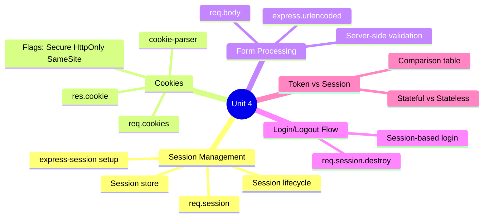
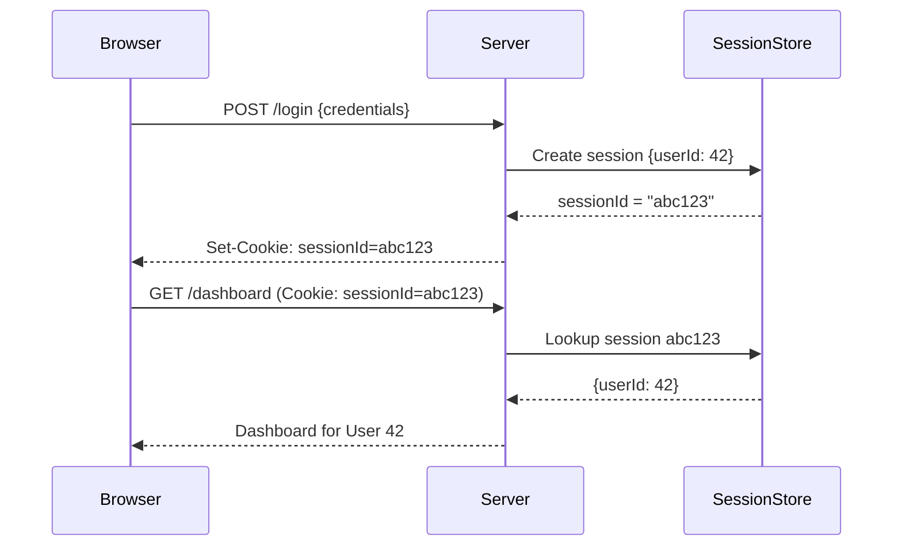
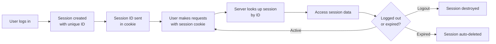
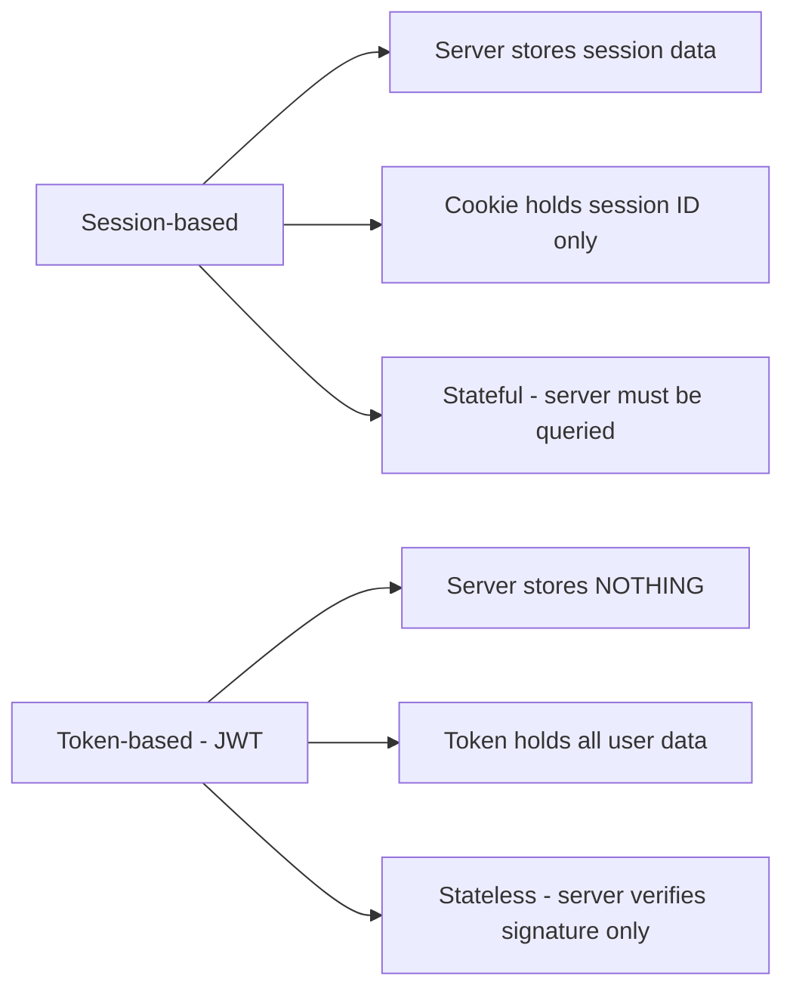

#  Unit 4: Forms, Sessions and Cookies *(7 Hours)*

> [!important] Learning Objectives
> After this unit, you should be able to:
> - Implement session management with `express-session`
> - Create, read, and delete cookies with security flags
> - Handle form data with server-side validation
> - Build a complete login/logout flow using sessions
> - Compare session-based vs token-based authentication

---

##  Topics at a Glance



---

## 4.1 Session Management

###  What is a Session?

An HTTP session is a way to **maintain state** between requests from the same user. Since HTTP is stateless (each request is independent), sessions provide a mechanism to remember the user across multiple requests.



---

###  express-session Setup

```bash
npm install express-session
npm install connect-pg-simple  # PostgreSQL session store (production)
```

```javascript
const session = require('express-session');

app.use(session({
  secret: process.env.SESSION_SECRET,  // Used to sign session ID cookie
  resave: false,              // Don't re-save session if unchanged
  saveUninitialized: false,   // Don't save empty sessions
  
  // Cookie configuration
  cookie: {
    secure: process.env.NODE_ENV === 'production',  // HTTPS only in prod
    httpOnly: true,      // Not accessible via JavaScript
    maxAge: 24 * 60 * 60 * 1000  // 24 hours in milliseconds
  },
  
  // Session store (default: MemoryStore - dev only!)
  // store: new PgSession({ pool }) - for production
}));
```

> [!warning] MemoryStore in Production
> The default `MemoryStore` is **not suitable for production**:
> - Leaks memory (sessions not cleaned up)
> - Doesn't work with multiple server instances
> Use `connect-redis`, `connect-pg-simple`, or `connect-mongo` in production.

---

###  Using Sessions

```javascript
// Set session data
app.post('/login', async (req, res) => {
  const { email, password } = req.body;
  const user = await authenticateUser(email, password);
  
  if (user) {
    // Store data in session
    req.session.userId = user.id;
    req.session.username = user.name;
    req.session.role = user.role;
    req.session.isAuthenticated = true;
    
    // Regenerate session ID to prevent session fixation
    req.session.regenerate((err) => {
      if (err) return next(err);
      res.redirect('/dashboard');
    });
  } else {
    res.status(401).json({ error: 'Invalid credentials' });
  }
});

// Read session data
app.get('/dashboard', (req, res) => {
  if (!req.session.isAuthenticated) {
    return res.redirect('/login');
  }
  
  res.json({
    message: `Welcome, ${req.session.username}!`,
    role: req.session.role
  });
});

// Destroy session (logout)
app.post('/logout', (req, res) => {
  req.session.destroy((err) => {
    if (err) console.error('Session destroy error:', err);
    res.clearCookie('connect.sid');  // Clear session cookie
    res.redirect('/login');
  });
});

// Modify session data
app.post('/update-theme', (req, res) => {
  req.session.theme = req.body.theme;
  req.session.save((err) => {  // Explicitly save if resave:false
    if (err) console.error(err);
    res.json({ success: true });
  });
});
```

###  Session Lifecycle



---

## 4.2 Cookies

###  What are Cookies?

==Cookies== are small pieces of data stored on the **client's browser** and sent automatically with every request to the server. Max size: ~4KB.

```bash
npm install cookie-parser
```

```javascript
const cookieParser = require('cookie-parser');
app.use(cookieParser(process.env.COOKIE_SECRET));  // Secret for signed cookies
```

---

###  Creating Cookies

```javascript
// res.cookie(name, value, options)
app.get('/set-cookies', (req, res) => {
  
  // Basic cookie
  res.cookie('username', 'alice');
  
  // Cookie with options
  res.cookie('userId', '42', {
    maxAge: 24 * 60 * 60 * 1000,  // 24 hours (milliseconds)
    expires: new Date(Date.now() + 86400000),  // Alternative: specific date
    httpOnly: true,      // Cannot be read by JavaScript (XSS protection)
    secure: true,        // Only sent over HTTPS
    sameSite: 'strict',  // CSRF protection: 'strict', 'lax', or 'none'
    domain: 'example.com',  // Which domain can receive
    path: '/'               // Which paths can receive
  });
  
  // Signed cookie (tamper-proof)
  res.cookie('sessionData', 'important-data', { signed: true });
  
  res.send('Cookies set!');
});
```

###  Reading Cookies

```javascript
app.get('/read-cookies', (req, res) => {
  // Unsigned cookies
  const username = req.cookies.username;
  const userId = req.cookies.userId;
  const allCookies = req.cookies;  // All cookies as object
  
  // Signed cookies (verified against secret)
  const sessionData = req.signedCookies.sessionData;
  // If tampered with: returns false
  
  res.json({ username, userId, sessionData });
});
```

###  Deleting Cookies

```javascript
// Clear cookie - must match original path/domain options
app.get('/clear-cookies', (req, res) => {
  res.clearCookie('username');
  res.clearCookie('userId', { path: '/' });
  res.send('Cookies cleared!');
});
```

---

###  Cookie Security Flags

| Flag | Description | Why Important |
|------|------------|---------------|
| ==HttpOnly== | Cookie not accessible via JavaScript (`document.cookie`) | Prevents XSS attacks from stealing cookies |
| ==Secure== | Cookie only sent over HTTPS connections | Prevents interception on HTTP |
| ==SameSite: Strict== | Cookie not sent with cross-site requests | Best CSRF protection |
| ==SameSite: Lax== | Sent with same-site and top-level GET cross-site | Balanced CSRF protection |
| ==SameSite: None== | Sent with all cross-site requests (requires Secure) | For cross-origin APIs |
| `maxAge` / `expires` | Cookie expiration | Limits exposure window |

---

## 4.3 Form Processing

###  Handling Form Data

```javascript
// Parse URL-encoded form data (HTML forms with POST)
app.use(express.urlencoded({ extended: true }));
// Parse JSON body (API requests)
app.use(express.json());

// HTML Form
// <form action="/register" method="POST">
//   <input name="email" type="email">
//   <input name="password" type="password">
//   <button type="submit">Register</button>
// </form>

// Route handler
app.post('/register', async (req, res) => {
  const { name, email, password, confirmPassword } = req.body;
  
  // Server-side validation
  const errors = [];
  
  if (!name || name.trim().length < 2) {
    errors.push('Name must be at least 2 characters');
  }
  
  if (!email || !email.includes('@')) {
    errors.push('Valid email is required');
  }
  
  if (!password || password.length < 8) {
    errors.push('Password must be at least 8 characters');
  }
  
  if (password !== confirmPassword) {
    errors.push('Passwords do not match');
  }
  
  if (errors.length > 0) {
    return res.status(400).json({ errors });
  }
  
  // Check if email already exists
  const existingUser = await pool.query('SELECT id FROM users WHERE email = $1', [email]);
  if (existingUser.rows.length > 0) {
    return res.status(409).json({ error: 'Email already registered' });
  }
  
  // Hash password and create user
  const hashedPassword = await bcrypt.hash(password, 12);
  const result = await pool.query(
    'INSERT INTO users (name, email, password) VALUES ($1, $2, $3) RETURNING id, name, email',
    [name.trim(), email.toLowerCase(), hashedPassword]
  );
  
  res.status(201).json({ success: true, user: result.rows[0] });
});
```

---

## 4.4 Complete Login/Logout Flow

```javascript
// middleware/authSession.js
function requireAuth(req, res, next) {
  if (!req.session.isAuthenticated) {
    return res.status(401).json({ error: 'Authentication required' });
  }
  next();
}

function requireRole(role) {
  return (req, res, next) => {
    if (!req.session.isAuthenticated) {
      return res.status(401).json({ error: 'Not authenticated' });
    }
    if (req.session.role !== role) {
      return res.status(403).json({ error: 'Insufficient permissions' });
    }
    next();
  };
}

// Login
app.post('/auth/login', async (req, res) => {
  try {
    const { email, password } = req.body;
    
    if (!email || !password) {
      return res.status(400).json({ error: 'Email and password required' });
    }
    
    // Get user from DB
    const result = await pool.query('SELECT * FROM users WHERE email = $1', [email.toLowerCase()]);
    
    if (result.rows.length === 0) {
      return res.status(401).json({ error: 'Invalid email or password' });
    }
    
    const user = result.rows[0];
    
    // Verify password
    const isValid = await bcrypt.compare(password, user.password);
    if (!isValid) {
      return res.status(401).json({ error: 'Invalid email or password' });
    }
    
    // Set session
    req.session.isAuthenticated = true;
    req.session.userId = user.id;
    req.session.username = user.name;
    req.session.role = user.role;
    
    res.json({ message: 'Login successful', username: user.name });
    
  } catch (err) {
    res.status(500).json({ error: 'Login failed' });
  }
});

// Logout
app.post('/auth/logout', (req, res) => {
  req.session.destroy((err) => {
    res.clearCookie('connect.sid');
    res.json({ message: 'Logged out successfully' });
  });
});

// Protected routes
app.get('/api/profile', requireAuth, async (req, res) => {
  const user = await pool.query('SELECT id, name, email FROM users WHERE id = $1', [req.session.userId]);
  res.json(user.rows[0]);
});

app.get('/api/admin', requireRole('admin'), (req, res) => {
  res.json({ message: 'Admin area' });
});
```

---

## 4.5 Session-based vs Token-based Authentication

| Feature | ==Session-based== | ==Token-based (JWT)== |
|---------|-------------------|-----------------------|
| State | **Stateful** - server stores session | **Stateless** - server stores nothing |
| Storage | Server-side (memory/DB) + session ID in cookie | Client-side (localStorage or cookie) |
| Scalability | Harder (session shared across servers) | Easy (any server can verify token) |
| Revocation | Easy - delete session from store | Hard - need blacklist (short expiry workaround) |
| Security | CSRF risk (cookie auto-sent) | XSS risk (if stored in localStorage) |
| Performance | DB lookup per request | Crypto verification (faster) |
| Mobile apps | Harder (cookies tricky on mobile) | Better (tokens work anywhere) |
| Use cases | Traditional web apps, monoliths | APIs, microservices, mobile apps, SPAs |



---

##  Key Definitions

| Term | Definition |
|------|-----------|
| ==Session== | Server-side data storage mechanism to maintain state between HTTP requests |
| ==express-session== | Express middleware for session management |
| ==Cookie== | Small client-side key-value data store (max ~4KB) |
| ==HttpOnly flag== | Cookie inaccessible to JavaScript - prevents XSS theft |
| ==Secure flag== | Cookie only transmitted over HTTPS |
| ==SameSite== | Cookie attribute controlling cross-site request behavior (CSRF protection) |
| ==Stateful== | Server maintains state information about the client |
| ==Stateless== | Server treats each request independently (no stored client state) |
| ==Session Fixation== | Attack where attacker sets session ID; prevented by `req.session.regenerate()` |
| ==CSRF== | Cross-Site Request Forgery - tricking users into unwanted actions |

---

##  Practice Questions

> [!question] Short Answer Questions
> 1. What is a session? Why are sessions needed if HTTP is stateless?
> 2. Explain how `express-session` works. What is the session lifecycle?
> 3. Why should you not use `MemoryStore` in production?
> 4. What is a cookie? List the security flags and their purposes.
> 5. What is the difference between `httpOnly` and `secure` cookie flags?
> 6. What is `SameSite` cookie attribute and how does it prevent CSRF?
> 7. How do you create, read, and delete cookies with `cookie-parser`?
> 8. Explain server-side form validation with an example.
> 9. Write a complete login/logout route using express-session.
> 10. Compare session-based and token-based authentication in a table.

---

##  Navigation

- [[Unit-3|← Unit 3: Introduction to React]]
- [[Syllabus| Syllabus]]
- [[Unit-5|Unit 5: Authentication & Authorization →]]
- [[Important-Questions| Important Questions]]
- [[Revision| Revision]]
