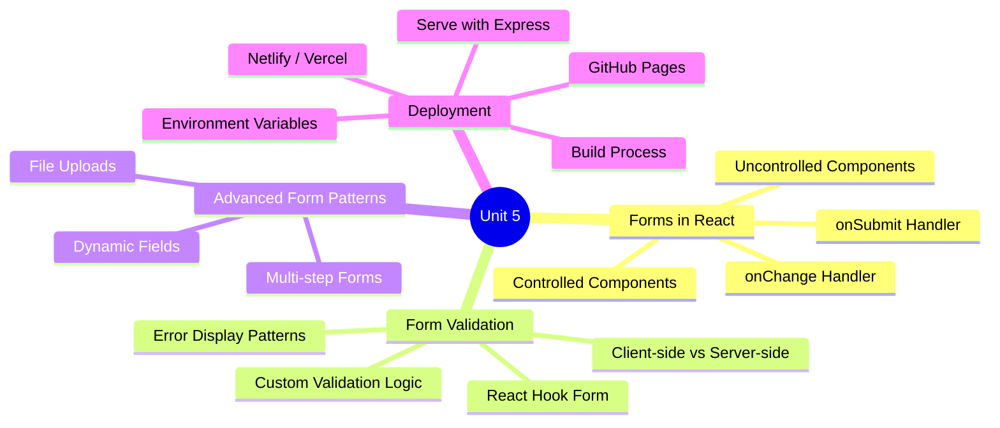
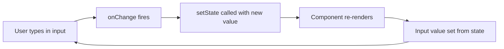
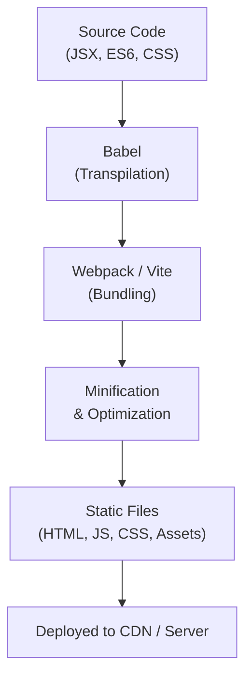
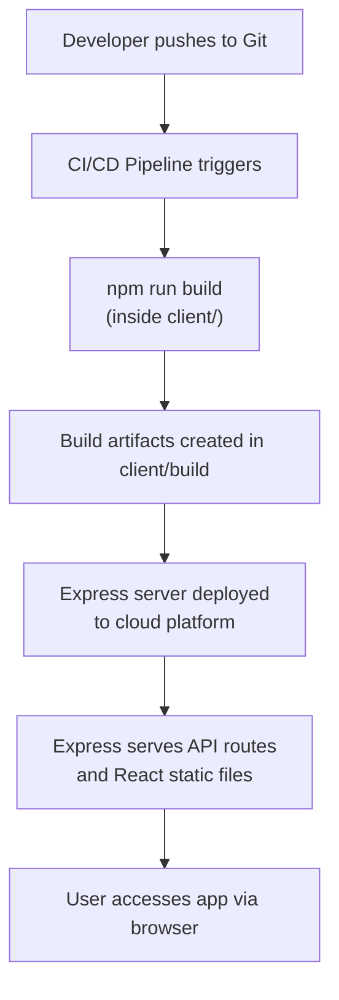

[[Overview]] | [[Syllabus]] | [[Unit-1]] | [[Unit-2]] | [[Unit-3]] | [[Unit-4]] | [[Unit-5]]

---

# Unit 5: Forms, Validation and Deployment *(7 Hours)*

> [!important] Learning Objectives
> After completing this unit, you should be able to:
> - Distinguish between controlled and uncontrolled components in React
> - Implement form handling using `useState` and event handlers
> - Apply client-side validation with custom logic and React Hook Form
> - Handle multi-step forms and dynamic field collections
> - Build and deploy a React application to a production environment
> - Understand the role of environment variables in deployment

---

## Topics at a Glance



---

## 5.1 Forms in React

### 5.1.1 The HTML Form Problem

In plain HTML, form elements such as `<input>`, `<textarea>`, and `<select>` maintain their own internal state. The browser directly manages the values. In React, however, state is the single source of truth. This creates a conflict that React resolves through the concept of ==controlled components==.

> [!note] Key Principle
> In React, form data should be driven by component state, not by the DOM. This gives you complete control over validation, transformation, and submission behaviour.

### 5.1.2 Controlled Components

A ==controlled component== is an input element whose value is bound to React state and whose changes are handled by an `onChange` event handler. The React component is the "single source of truth" for the input value.



**Basic controlled input:**

```jsx
import React, { useState } from 'react';

function ControlledForm() {
  const [name, setName] = useState('');
  const [email, setEmail] = useState('');

  const handleSubmit = (e) => {
    e.preventDefault(); // Prevent default browser form submission
    console.log({ name, email });
  };

  return (
    <form onSubmit={handleSubmit}>
      <label htmlFor="name">Name:</label>
      <input
        id="name"
        type="text"
        value={name}              // Bound to state
        onChange={(e) => setName(e.target.value)}   // Updates state
        placeholder="Enter your name"
      />

      <label htmlFor="email">Email:</label>
      <input
        id="email"
        type="email"
        value={email}
        onChange={(e) => setEmail(e.target.value)}
        placeholder="Enter your email"
      />

      <button type="submit">Submit</button>
    </form>
  );
}
```

> [!tip] `e.preventDefault()`
> Always call `e.preventDefault()` in `onSubmit` to stop the browser from reloading the page, which is the default HTML form behaviour.

### 5.1.3 Managing Multiple Fields with a Single State Object

For forms with many fields, managing separate state variables becomes unwieldy. The recommended pattern is to use a single state object and a generic `handleChange` function.

```jsx
import React, { useState } from 'react';

function RegistrationForm() {
  const [formData, setFormData] = useState({
    firstName: '',
    lastName: '',
    email: '',
    password: '',
    role: 'student',
    agreeToTerms: false,
  });

  // Generic handler uses input's 'name' attribute as the key
  const handleChange = (e) => {
    const { name, value, type, checked } = e.target;
    setFormData((prev) => ({
      ...prev,
      [name]: type === 'checkbox' ? checked : value,
    }));
  };

  const handleSubmit = (e) => {
    e.preventDefault();
    console.log('Submitted:', formData);
  };

  return (
    <form onSubmit={handleSubmit}>
      <input
        name="firstName"
        type="text"
        value={formData.firstName}
        onChange={handleChange}
        placeholder="First Name"
      />
      <input
        name="lastName"
        type="text"
        value={formData.lastName}
        onChange={handleChange}
        placeholder="Last Name"
      />
      <input
        name="email"
        type="email"
        value={formData.email}
        onChange={handleChange}
        placeholder="Email"
      />
      <input
        name="password"
        type="password"
        value={formData.password}
        onChange={handleChange}
        placeholder="Password"
      />

      {/* Select (dropdown) */}
      <select name="role" value={formData.role} onChange={handleChange}>
        <option value="student">Student</option>
        <option value="teacher">Teacher</option>
        <option value="admin">Admin</option>
      </select>

      {/* Checkbox */}
      <label>
        <input
          name="agreeToTerms"
          type="checkbox"
          checked={formData.agreeToTerms}
          onChange={handleChange}
        />
        I agree to the Terms and Conditions
      </label>

      <button type="submit">Register</button>
    </form>
  );
}
```

> [!note] Computed Property Names
> The `[name]` syntax inside `setFormData` is a JavaScript computed property name. It dynamically uses the value of the variable `name` as the key, allowing a single handler to manage all fields.

### 5.1.4 Textarea and Select Elements

React handles `<textarea>` differently from HTML. In HTML, `<textarea>` content goes between opening and closing tags. In React, it uses a `value` prop, just like `<input>`.

| Element | HTML Syntax | React Syntax |
|---------|-------------|--------------|
| Input | `<input value="...">` | `value={state}` + `onChange` |
| Textarea | `<textarea>content</textarea>` | `value={state}` + `onChange` |
| Select | `<option selected>` | `value={state}` on `<select>` |
| Checkbox | `checked="checked"` | `checked={boolState}` |
| Radio | `checked="checked"` | `checked={state === 'value'}` |

### 5.1.5 Uncontrolled Components

An ==uncontrolled component== stores its own state internally in the DOM, and you access the value using a `ref` (reference) instead of state.

```jsx
import React, { useRef } from 'react';

function UncontrolledForm() {
  const nameRef = useRef(null);
  const fileRef = useRef(null);

  const handleSubmit = (e) => {
    e.preventDefault();
    console.log('Name:', nameRef.current.value);
    console.log('File:', fileRef.current.files[0]);
  };

  return (
    <form onSubmit={handleSubmit}>
      <input ref={nameRef} type="text" defaultValue="Alice" />
      <input ref={fileRef} type="file" />
      <button type="submit">Upload</button>
    </form>
  );
}
```

> [!important] Controlled vs Uncontrolled
> Use ==controlled components== for most forms - they enable real-time validation, conditional rendering, and dynamic behaviour. Use ==uncontrolled components== only for file inputs or when integrating with non-React libraries.

---

## 5.2 Form Validation

### 5.2.1 Client-side vs Server-side Validation

> [!warning] Never Trust Client-Side Validation Alone
> Client-side validation improves user experience (fast feedback, no network round-trip) but must never replace server-side validation. A user can bypass or disable JavaScript entirely.

| Aspect | Client-side Validation | Server-side Validation |
|--------|----------------------|----------------------|
| Location | Browser (React component) | Server (Express route) |
| Purpose | User experience, immediate feedback | Security, data integrity |
| Can be bypassed | Yes | No |
| Network round-trip | Not required | Required |
| Examples | Required fields, email format | Unique email, business rules |
| When to use | Always (UX) | Always (security) |

### 5.2.2 Custom Validation with useState

The most straightforward approach is to maintain an `errors` state object, populate it on submission (or on blur), and display error messages conditionally.

```jsx
import React, { useState } from 'react';

function ValidatedForm() {
  const [formData, setFormData] = useState({
    username: '',
    email: '',
    password: '',
    confirmPassword: '',
  });

  const [errors, setErrors] = useState({});
  const [isSubmitting, setIsSubmitting] = useState(false);
  const [submitSuccess, setSubmitSuccess] = useState(false);

  const handleChange = (e) => {
    const { name, value } = e.target;
    setFormData((prev) => ({ ...prev, [name]: value }));
    // Clear error for this field as user types
    if (errors[name]) {
      setErrors((prev) => ({ ...prev, [name]: '' }));
    }
  };

  const validate = (data) => {
    const newErrors = {};

    if (!data.username.trim()) {
      newErrors.username = 'Username is required';
    } else if (data.username.trim().length < 3) {
      newErrors.username = 'Username must be at least 3 characters';
    } else if (!/^[a-zA-Z0-9_]+$/.test(data.username)) {
      newErrors.username = 'Username can only contain letters, numbers, and underscores';
    }

    if (!data.email) {
      newErrors.email = 'Email is required';
    } else if (!/^[^\s@]+@[^\s@]+\.[^\s@]+$/.test(data.email)) {
      newErrors.email = 'Please enter a valid email address';
    }

    if (!data.password) {
      newErrors.password = 'Password is required';
    } else if (data.password.length < 8) {
      newErrors.password = 'Password must be at least 8 characters';
    } else if (!/(?=.*[a-z])(?=.*[A-Z])(?=.*\d)/.test(data.password)) {
      newErrors.password = 'Password must contain uppercase, lowercase, and a number';
    }

    if (data.password !== data.confirmPassword) {
      newErrors.confirmPassword = 'Passwords do not match';
    }

    return newErrors;
  };

  const handleSubmit = async (e) => {
    e.preventDefault();
    const validationErrors = validate(formData);

    if (Object.keys(validationErrors).length > 0) {
      setErrors(validationErrors);
      return; // Stop submission
    }

    setIsSubmitting(true);
    try {
      // Simulate API call
      await new Promise((resolve) => setTimeout(resolve, 1000));
      setSubmitSuccess(true);
    } catch (err) {
      setErrors({ general: 'Registration failed. Please try again.' });
    } finally {
      setIsSubmitting(false);
    }
  };

  if (submitSuccess) {
    return <p>Registration successful! Please check your email.</p>;
  }

  return (
    <form onSubmit={handleSubmit} noValidate>
      {errors.general && (
        <div className="error-banner">{errors.general}</div>
      )}

      <div className="field-group">
        <label htmlFor="username">Username</label>
        <input
          id="username"
          name="username"
          type="text"
          value={formData.username}
          onChange={handleChange}
          className={errors.username ? 'input-error' : ''}
        />
        {errors.username && (
          <span className="error-text">{errors.username}</span>
        )}
      </div>

      <div className="field-group">
        <label htmlFor="email">Email</label>
        <input
          id="email"
          name="email"
          type="email"
          value={formData.email}
          onChange={handleChange}
          className={errors.email ? 'input-error' : ''}
        />
        {errors.email && <span className="error-text">{errors.email}</span>}
      </div>

      <div className="field-group">
        <label htmlFor="password">Password</label>
        <input
          id="password"
          name="password"
          type="password"
          value={formData.password}
          onChange={handleChange}
          className={errors.password ? 'input-error' : ''}
        />
        {errors.password && (
          <span className="error-text">{errors.password}</span>
        )}
      </div>

      <div className="field-group">
        <label htmlFor="confirmPassword">Confirm Password</label>
        <input
          id="confirmPassword"
          name="confirmPassword"
          type="password"
          value={formData.confirmPassword}
          onChange={handleChange}
          className={errors.confirmPassword ? 'input-error' : ''}
        />
        {errors.confirmPassword && (
          <span className="error-text">{errors.confirmPassword}</span>
        )}
      </div>

      <button type="submit" disabled={isSubmitting}>
        {isSubmitting ? 'Registering...' : 'Register'}
      </button>
    </form>
  );
}
```

### 5.2.3 Validation on Blur (Touch-based Validation)

Showing errors only after the user leaves a field (on blur) provides a better user experience than showing errors immediately while the user is still typing.

```jsx
import React, { useState } from 'react';

function BlurValidationForm() {
  const [email, setEmail] = useState('');
  const [emailError, setEmailError] = useState('');
  const [touched, setTouched] = useState(false);

  const validateEmail = (value) => {
    if (!value) return 'Email is required';
    if (!/^[^\s@]+@[^\s@]+\.[^\s@]+$/.test(value)) return 'Invalid email format';
    return '';
  };

  const handleBlur = () => {
    setTouched(true);
    setEmailError(validateEmail(email));
  };

  return (
    <div>
      <input
        type="email"
        value={email}
        onChange={(e) => {
          setEmail(e.target.value);
          if (touched) setEmailError(validateEmail(e.target.value));
        }}
        onBlur={handleBlur}
        placeholder="Enter email"
      />
      {touched && emailError && <span className="error">{emailError}</span>}
    </div>
  );
}
```

### 5.2.4 React Hook Form

==React Hook Form== (RHF) is a popular library for managing forms in React. It uses uncontrolled components internally with refs for performance, while providing a clean API for validation and error handling.

```bash
npm install react-hook-form
```

```jsx
import React from 'react';
import { useForm } from 'react-hook-form';

function RHFLoginForm() {
  const {
    register,       // Registers input with RHF
    handleSubmit,   // Wraps your submit handler
    formState: { errors, isSubmitting },
    reset,
    watch,
  } = useForm();

  const password = watch('password'); // Watch a field's value

  const onSubmit = async (data) => {
    // data contains all validated form values
    console.log(data);
    await new Promise((r) => setTimeout(r, 1000));
    reset(); // Reset form after submission
  };

  return (
    <form onSubmit={handleSubmit(onSubmit)}>
      <div>
        <label>Username</label>
        <input
          {...register('username', {
            required: 'Username is required',
            minLength: { value: 3, message: 'At least 3 characters' },
            pattern: {
              value: /^[a-zA-Z0-9_]+$/,
              message: 'Only letters, numbers, underscores',
            },
          })}
        />
        {errors.username && <span>{errors.username.message}</span>}
      </div>

      <div>
        <label>Email</label>
        <input
          type="email"
          {...register('email', {
            required: 'Email is required',
            pattern: {
              value: /^[^\s@]+@[^\s@]+\.[^\s@]+$/,
              message: 'Enter a valid email',
            },
          })}
        />
        {errors.email && <span>{errors.email.message}</span>}
      </div>

      <div>
        <label>Password</label>
        <input
          type="password"
          {...register('password', {
            required: 'Password is required',
            minLength: { value: 8, message: 'At least 8 characters' },
          })}
        />
        {errors.password && <span>{errors.password.message}</span>}
      </div>

      <div>
        <label>Confirm Password</label>
        <input
          type="password"
          {...register('confirmPassword', {
            required: 'Please confirm password',
            validate: (value) =>
              value === password || 'Passwords do not match',
          })}
        />
        {errors.confirmPassword && (
          <span>{errors.confirmPassword.message}</span>
        )}
      </div>

      <button type="submit" disabled={isSubmitting}>
        {isSubmitting ? 'Submitting...' : 'Submit'}
      </button>
    </form>
  );
}
```

**Advantages of React Hook Form:**

| Feature | Manual useState | React Hook Form |
|---------|----------------|-----------------|
| Re-renders on change | Yes (every keystroke) | No (uncontrolled) |
| Boilerplate code | High | Low |
| Validation rules | Manual | Declarative |
| Integration with UI libs | Manual wiring | Simple `register` spread |
| Error management | Manual state | Automatic via `formState` |

---

## 5.3 Advanced Form Patterns

### 5.3.1 Multi-step Forms (Wizard Forms)

A multi-step form breaks a long form into a sequence of steps. Each step is a separate component that shows a subset of fields.

```jsx
import React, { useState } from 'react';

// Step components
function PersonalInfo({ data, onChange }) {
  return (
    <div>
      <h3>Step 1: Personal Information</h3>
      <input
        name="firstName"
        placeholder="First Name"
        value={data.firstName}
        onChange={onChange}
      />
      <input
        name="lastName"
        placeholder="Last Name"
        value={data.lastName}
        onChange={onChange}
      />
    </div>
  );
}

function AccountInfo({ data, onChange }) {
  return (
    <div>
      <h3>Step 2: Account Information</h3>
      <input
        name="email"
        type="email"
        placeholder="Email"
        value={data.email}
        onChange={onChange}
      />
      <input
        name="password"
        type="password"
        placeholder="Password"
        value={data.password}
        onChange={onChange}
      />
    </div>
  );
}

function ReviewStep({ data }) {
  return (
    <div>
      <h3>Step 3: Review</h3>
      <p>Name: {data.firstName} {data.lastName}</p>
      <p>Email: {data.email}</p>
    </div>
  );
}

// Main wizard component
function MultiStepForm() {
  const [step, setStep] = useState(1);
  const TOTAL_STEPS = 3;

  const [formData, setFormData] = useState({
    firstName: '', lastName: '', email: '', password: '',
  });

  const handleChange = (e) => {
    const { name, value } = e.target;
    setFormData((prev) => ({ ...prev, [name]: value }));
  };

  const handleNext = () => setStep((s) => Math.min(s + 1, TOTAL_STEPS));
  const handleBack = () => setStep((s) => Math.max(s - 1, 1));

  const handleSubmit = (e) => {
    e.preventDefault();
    console.log('Final submission:', formData);
  };

  return (
    <form onSubmit={handleSubmit}>
      {/* Progress indicator */}
      <div>Step {step} of {TOTAL_STEPS}</div>
      <div style={{ width: `${(step / TOTAL_STEPS) * 100}%`, background: 'blue', height: 4 }} />

      {step === 1 && <PersonalInfo data={formData} onChange={handleChange} />}
      {step === 2 && <AccountInfo data={formData} onChange={handleChange} />}
      {step === 3 && <ReviewStep data={formData} />}

      <div>
        {step > 1 && (
          <button type="button" onClick={handleBack}>Back</button>
        )}
        {step < TOTAL_STEPS ? (
          <button type="button" onClick={handleNext}>Next</button>
        ) : (
          <button type="submit">Submit</button>
        )}
      </div>
    </form>
  );
}
```

### 5.3.2 Dynamic Fields

Dynamic field lists allow users to add or remove entries (e.g., adding multiple phone numbers or addresses).

```jsx
import React, { useState } from 'react';

function DynamicSkillsForm() {
  const [skills, setSkills] = useState(['']);

  const handleSkillChange = (index, value) => {
    setSkills((prev) => {
      const updated = [...prev];
      updated[index] = value;
      return updated;
    });
  };

  const addSkill = () => {
    setSkills((prev) => [...prev, '']);
  };

  const removeSkill = (index) => {
    setSkills((prev) => prev.filter((_, i) => i !== index));
  };

  const handleSubmit = (e) => {
    e.preventDefault();
    const validSkills = skills.filter((s) => s.trim() !== '');
    console.log('Skills:', validSkills);
  };

  return (
    <form onSubmit={handleSubmit}>
      <h3>Skills</h3>
      {skills.map((skill, index) => (
        <div key={index}>
          <input
            type="text"
            value={skill}
            onChange={(e) => handleSkillChange(index, e.target.value)}
            placeholder={`Skill ${index + 1}`}
          />
          <button
            type="button"
            onClick={() => removeSkill(index)}
            disabled={skills.length === 1}
          >
            Remove
          </button>
        </div>
      ))}
      <button type="button" onClick={addSkill}>Add Skill</button>
      <button type="submit">Save</button>
    </form>
  );
}
```

### 5.3.3 File Uploads

File inputs must be uncontrolled (you cannot bind a `value` to a file input for security reasons). Use a `ref` or access `e.target.files`.

```jsx
import React, { useState } from 'react';

function FileUploadForm() {
  const [selectedFile, setSelectedFile] = useState(null);
  const [uploadProgress, setUploadProgress] = useState(0);
  const [preview, setPreview] = useState(null);

  const handleFileChange = (e) => {
    const file = e.target.files[0];
    if (!file) return;

    // Validate file type
    if (!file.type.startsWith('image/')) {
      alert('Please select an image file');
      return;
    }

    // Validate file size (max 5MB)
    if (file.size > 5 * 1024 * 1024) {
      alert('File size must be less than 5MB');
      return;
    }

    setSelectedFile(file);

    // Create preview URL
    const reader = new FileReader();
    reader.onloadend = () => setPreview(reader.result);
    reader.readAsDataURL(file);
  };

  const handleUpload = async (e) => {
    e.preventDefault();
    if (!selectedFile) return;

    const formData = new FormData();
    formData.append('avatar', selectedFile);

    try {
      const response = await fetch('/api/upload', {
        method: 'POST',
        body: formData,
        // Do NOT set Content-Type header - browser sets it with boundary
      });
      const result = await response.json();
      console.log('Uploaded:', result);
    } catch (err) {
      console.error('Upload failed:', err);
    }
  };

  return (
    <form onSubmit={handleUpload}>
      <input type="file" accept="image/*" onChange={handleFileChange} />
      {preview && (
        
      )}
      {selectedFile && (
        <p>{selectedFile.name} ({(selectedFile.size / 1024).toFixed(1)} KB)</p>
      )}
      <button type="submit" disabled={!selectedFile}>Upload</button>
    </form>
  );
}
```

---

## 5.4 Deployment of React Applications

### 5.4.1 The Build Process

A React application created with Create React App (CRA) or Vite must be built before deployment. The build process:

1. Transpiles JSX and modern JavaScript (ES6+) to browser-compatible JavaScript using Babel
2. Bundles all modules into optimized files using Webpack (CRA) or Rollup/esbuild (Vite)
3. Minifies JavaScript, CSS, and HTML
4. Generates hashed filenames for cache busting

```bash
# Create React App
npm run build
# Produces: /build directory

# Vite
npm run build
# Produces: /dist directory
```



### 5.4.2 Environment Variables

==Environment variables== store configuration values that differ between environments (development, staging, production). They prevent secrets from being hardcoded in source code.

**In Create React App:**
- Variable names must be prefixed with `REACT_APP_`
- Stored in `.env`, `.env.development`, `.env.production` files
- Accessed via `process.env.REACT_APP_VARIABLE_NAME`

```bash
# .env.development
REACT_APP_API_URL=http://localhost:5000
REACT_APP_APP_NAME=MyApp Dev

# .env.production
REACT_APP_API_URL=https://api.myapp.com
REACT_APP_APP_NAME=MyApp
```

```jsx
// Using environment variables in React code
const API_BASE = process.env.REACT_APP_API_URL;
const APP_NAME = process.env.REACT_APP_APP_NAME;

async function fetchData() {
  const response = await fetch(`${API_BASE}/api/users`);
  return response.json();
}
```

**In Vite:**
- Variable names must be prefixed with `VITE_`
- Accessed via `import.meta.env.VITE_VARIABLE_NAME`

```bash
# .env
VITE_API_URL=http://localhost:5000
```

```javascript
const API_BASE = import.meta.env.VITE_API_URL;
```

> [!warning] Never Expose Secrets in React
> Environment variables in React are embedded in the JavaScript bundle at build time and are visible to anyone who inspects the bundle. Never store API secrets, database passwords, or private keys in React environment variables. They belong on the server only.

### 5.4.3 Deployment to Netlify

==Netlify== is a popular static hosting platform with CI/CD integration. It builds and deploys your React app directly from a Git repository.

**Step-by-step deployment:**

```bash
# 1. Build the application
npm run build

# 2. Install Netlify CLI (optional for manual deployment)
npm install -g netlify-cli

# 3. Deploy manually
netlify deploy --prod --dir=build
```

**Via Netlify Dashboard (recommended):**
1. Push your project to GitHub / GitLab / Bitbucket
2. Log in to netlify.com and click "Add new site"
3. Connect your Git repository
4. Configure build settings:
   - Build command: `npm run build`
   - Publish directory: `build` (CRA) or `dist` (Vite)
5. Add environment variables in Site Settings > Environment Variables
6. Click "Deploy site"

**netlify.toml (configuration file in project root):**

```toml
[build]
  command = "npm run build"
  publish = "build"

[build.environment]
  NODE_VERSION = "18"

# Redirect all routes to index.html for React Router
Netlify _redirects
  from = "/*"
  to = "/index.html"
  status = 200
```

> [!important] React Router and 404 Errors
> When using React Router, all routing is handled client-side by JavaScript. If a user navigates directly to `/about`, the server returns a 404 because that path does not exist as a file. The redirect rule above (or its equivalent on other platforms) fixes this by serving `index.html` for all paths.

### 5.4.4 Deployment to Vercel

==Vercel== is another popular platform, built by the creators of Next.js.

```bash
# Install Vercel CLI
npm install -g vercel

# Deploy from project directory
vercel

# Production deployment
vercel --prod
```

**vercel.json (to handle React Router):**

```json
{
  "rewrites": [
    { "source": "/(.*)", "destination": "/index.html" }
  ]
}
```

### 5.4.5 Deployment to GitHub Pages

GitHub Pages serves static files from a GitHub repository. It requires additional configuration for React Router.

```bash
# 1. Install gh-pages package
npm install --save-dev gh-pages

# 2. Add homepage field to package.json
# "homepage": "https://username.github.io/repository-name"

# 3. Add deploy scripts to package.json
# "predeploy": "npm run build"
# "deploy": "gh-pages -d build"

# 4. Deploy
npm run deploy
```

> [!note] GitHub Pages and React Router
> GitHub Pages does not support server-side redirects like Netlify/Vercel. Use the `HashRouter` from `react-router-dom` instead of `BrowserRouter` for GitHub Pages deployments. Hash-based routing uses the URL fragment (`/#/about`) which is not sent to the server.

### 5.4.6 Serving React with an Express Backend

If your application has both a React frontend and an Express backend, you can serve the built React app from Express.

**Project structure:**

```
my-app/
  client/          (React app)
    build/         (after npm run build)
    src/
    package.json
  server/          (Express app)
    index.js
  package.json
```

**Express server serving React:**

```javascript
const express = require('express');
const path = require('path');
const app = express();

app.use(express.json());

// API routes
app.use('/api', require('./routes/api'));

// Serve React static files in production
if (process.env.NODE_ENV === 'production') {
  // Serve static files from the React build folder
  app.use(express.static(path.join(__dirname, '../client/build')));

  // For any route not matched by API, serve React's index.html
  app.get('*', (req, res) => {
    res.sendFile(path.join(__dirname, '../client/build', 'index.html'));
  });
}

const PORT = process.env.PORT || 5000;
app.listen(PORT, () => console.log(`Server running on port ${PORT}`));
```

**Deployment workflow:**



### 5.4.7 Deployment Platform Comparison

| Feature | Netlify | Vercel | GitHub Pages | Render | Railway |
|---------|---------|--------|-------------|--------|---------|
| Best for | Static / JAMstack | React / Next.js | Open-source projects | Full-stack | Full-stack |
| Free tier | Yes | Yes | Yes | Yes | Yes |
| Custom domain | Yes | Yes | Yes | Yes | Yes |
| CI/CD from Git | Yes | Yes | Via actions | Yes | Yes |
| Server-side code | Functions | Functions | No | Yes | Yes |
| Environment vars | Yes | Yes | Secrets only | Yes | Yes |
| React Router fix | Redirect rules | Rewrites | HashRouter | Redirect | Redirect |

---

## 5.5 Production Checklist

> [!summary] Before Deploying to Production
> 1. Remove all `console.log` statements or configure them to log only in development
> 2. Set `NODE_ENV=production` in environment variables
> 3. Ensure all API URLs point to production endpoints via environment variables
> 4. Test the production build locally with `serve -s build`
> 5. Configure the server/hosting for single-page application routing (redirect all to `index.html`)
> 6. Set appropriate cache headers for static assets
> 7. Enable HTTPS on the deployment platform
> 8. Test on multiple browsers and screen sizes

```bash
# Test production build locally before deploying
npm install -g serve
serve -s build -l 3000
# Access at http://localhost:3000
```

---

## Key Definitions

| Term | Definition |
|------|-----------|
| ==Controlled Component== | React form element whose value is driven by component state via `value` prop and `onChange` handler |
| ==Uncontrolled Component== | Form element that manages its own state internally, accessed via `ref` |
| ==React Hook Form== | Library for performant form management using uncontrolled inputs and a declarative API |
| ==Client-side Validation== | Input validation performed in the browser before sending data to the server |
| ==Server-side Validation== | Input validation performed on the server; cannot be bypassed by the client |
| ==Build Process== | Transpilation, bundling, and minification of source code into deployable static files |
| ==Environment Variable== | Configuration value stored outside source code, prefixed with `REACT_APP_` (CRA) or `VITE_` |
| ==CI/CD== | Continuous Integration / Continuous Deployment - automated build and deploy pipeline |
| ==SPA Routing== | Client-side routing where the server must redirect all paths to `index.html` |
| ==`FormData`== | Browser API for constructing key-value data sets, primarily used for file uploads |

---

## Interview Questions

> [!question] Q1. What is the difference between controlled and uncontrolled components?
> **Answer:** A controlled component binds its value to React state using the `value` prop and updates state via `onChange`. React is the single source of truth. An uncontrolled component manages its own value in the DOM, accessed via a `ref`. Controlled components are preferred because they allow real-time validation, conditional rendering, and easy data access. Uncontrolled components are used for file inputs and when integrating with non-React libraries.

> [!question] Q2. Why do we call `e.preventDefault()` in form submit handlers?
> **Answer:** The default browser behaviour when a form is submitted is to reload the page (HTTP GET/POST to the form's `action` URL). In React single-page applications, this would destroy the application state and reload the page. `e.preventDefault()` stops this browser default, allowing React to handle the submission with JavaScript (AJAX calls, state updates, etc.).

> [!question] Q3. What are the advantages of React Hook Form over managing form state with useState?
> **Answer:** React Hook Form uses uncontrolled inputs internally, so the component does not re-render on every keystroke - this is significantly more performant for large forms. It provides a declarative API for validation rules, automatic error management via `formState.errors`, easy integration with UI libraries, and built-in support for complex scenarios like dependent field validation (`validate` function with `watch`).

> [!question] Q4. What is the `REACT_APP_` prefix for, and why is it required?
> **Answer:** Create React App uses the `REACT_APP_` prefix as a security measure. Without it, any environment variable present in the shell (including system variables like `PATH`, `HOME`, or `SECRET_KEY`) could accidentally be embedded in the JavaScript bundle and exposed to users. Only variables explicitly prefixed with `REACT_APP_` are bundled.

> [!question] Q5. Why does React Router cause 404 errors on a static server, and how do you fix it?
> **Answer:** React Router uses the HTML5 History API to manipulate the browser URL without page reloads. When a user bookmarks or directly visits `/dashboard`, the server receives a request for `/dashboard` and returns a 404 because there is no physical file at that path - only `index.html` exists. The fix is to configure the server to redirect all unmatched paths to `index.html`. On Netlify, this is a `_redirects` file or `netlify.toml` redirect rule. On Vercel, it is a rewrite in `vercel.json`. On Express, it is a wildcard `app.get('*', ...)` route.

> [!question] Q6. Explain the multi-step form pattern in React.
> **Answer:** A multi-step (wizard) form stores all form data in a single state object at the parent level and tracks the current step in another state variable. Each step is a separate component that receives the data and an `onChange` handler as props. Navigation between steps is controlled by Next and Back buttons that increment or decrement the step counter. The final step performs the actual API submission. This pattern improves UX for long forms by reducing cognitive load.

---

## Revision Summary

> [!summary] Unit 5 - Core Concepts
> - ==Controlled component==: `value={state}` + `onChange` handler. React owns the data.
> - ==Uncontrolled component==: `ref` access. DOM owns the data. Use for file inputs.
> - Generic `handleChange` uses `e.target.name` as computed key: `[name]: value`.
> - Validation: run `validate()` on submit, store errors in state object, display conditionally.
> - ==React Hook Form==: `register`, `handleSubmit`, `formState.errors`. Reduces re-renders.
> - `e.preventDefault()` stops browser page reload on form submission.
> - Build: `npm run build` creates `build/` or `dist/` with static files.
> - Environment variables: `REACT_APP_` prefix (CRA), `VITE_` prefix (Vite). Never store secrets.
> - React Router on static hosts: configure server to redirect all paths to `index.html`.
> - Netlify: add `netlify.toml` with redirect rule. Vercel: add `vercel.json` with rewrite.
> - Express: `app.use(express.static('build'))` + `app.get('*', sendFile('index.html'))`.

---

[[Unit-4|Previous: Unit 4 - HTTP Client and API Integration]] | [[Overview]] | [[Revision]] | [[Important-Questions]]
